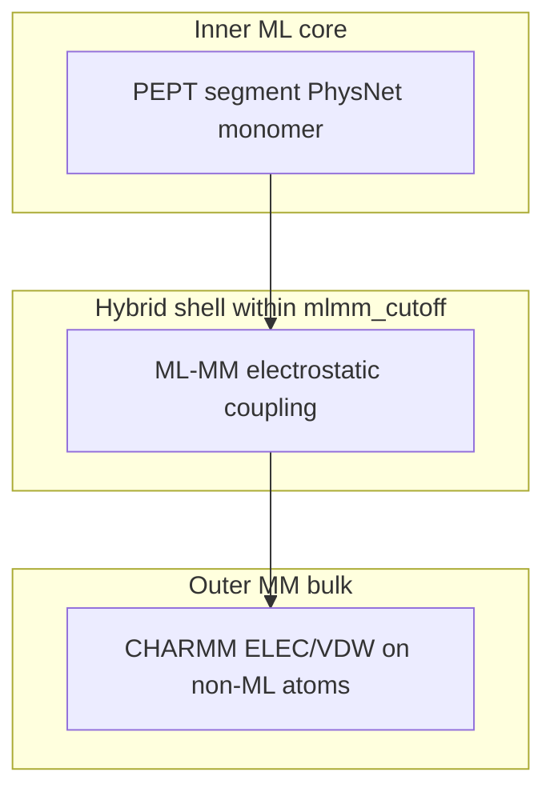

# Solvated peptide MD embedding (`mmml md-embedding`)

Design reference for **QM/MM-style** solvated peptide dynamics: the peptide is treated with
PhysNet; nearby MM atoms participate in an **ML–MM electrostatic shell**; distant solvent
remains **pure CHARMM MM**. This path is intentionally separate from homogeneous cluster
liquids driven by [`mmml md-system`](../cli/commands/md-system.md) (all monomers hybrid).

User-facing workflow: [aaa-ama-workflow.md](aaa-ama-workflow.md).  
Upstream reference: [MMunibas/aaa.ama](https://github.com/MMunibas/aaa.ama) (`dyna.sol.py`).

## Onion model



| Layer | Radius / scope | Physics | Phase |
|-------|------------------|---------|-------|
| **Peptide core** | `ml_graph_cutoff` (~5–6 Å graph) | PhysNet monomer (`n_monomers=1`, `PyCharmm_Calculator`) | **1 — today** |
| **Surround shell** | `mlmm_cuton` … `mlmm_cutoff` (default 10–12 Å) | ML–MM electrostatic embedding (`ml_fq`, fluctuating charges) | **2 — stub** |
| **Far MM** | beyond `mlmm_cutoff` | Pure CHARMM on `SOLV`/TIP3 and other non-ML atoms | **1 — today** |

Waters do **not** receive PhysNet monomer energy. They may receive **ML–MM electrostatic**
coupling to the peptide when Phase 2 wires CHARMM `idxu`/`idxv` pair lists into
`mmml/models/physnetjax/physnetjax/calc/pycharmm_calculator.py`.

## vs `mmml md-system`

| | `md-system` | `md-embedding` |
|--|-------------|----------------|
| Use case | Bulk liquids (DCM, ACO, …) | Solvated peptide / solute embedding |
| ML selection | `select_all_atoms()` | `select_by_seg_id("PEPT")` |
| Calculator | `DecomposedMlpotModel` + COM switching | `get_pyc` / single-monomer path |
| Solvent | Same species as solute (hybrid) | TIP3 **pure MM** (`SOLV` segment) |
| Training | Cluster / dimer NPZ | Peptide-only NPZ (e.g. aaa.ama) |

Do **not** use `md-system` for peptide-in-water embedding; do **not** use `md-embedding`
for homogeneous hybrid liquids.

## CLI phases

```bash
# 1. Train small PhysNet on peptide NPZ (aaa.ama default; fix-and-split + ASE figure)
mmml md-embedding train -o artifacts/md_embedding/aaa

# 1b. Shuffle-only split (no fix-and-split manifest)
mmml md-embedding train -o artifacts/md_embedding/aaa --simple-split

# 2. Build solvated box (CHARMM MM only)
mmml md-embedding build -o artifacts/md_embedding/aaa --n-waters 10

# 3. Register partial MLpot + minimize (CHARMM node)
mmml md-embedding run -o artifacts/md_embedding/aaa \
  --checkpoint artifacts/md_embedding/aaa/aaa_smoke_params.json
```

See `tests/functionality/embedding/README.md`
for pass criteria. Published smoke metrics: [md-embedding-results.md](md-embedding-results.md).

## Topology: 34 vs 42 atoms

| Source | Atoms | Notes |
|--------|-------|-------|
| [aaa.ama `dataset_aaa.npz`](https://github.com/MMunibas/aaa.ama/tree/main/aaa_model) | 34 | Training labels (`Z`, `E`, `F`) |
| MMML `TRIA` CGENFF build | 42 | `mmml/interfaces/pycharmmInterface/trialanine_water_box.py` |

**Phase 1 training** uses NPZ arrays directly (`num_atoms: 34`).  
**Phase 1 MD build** uses the bundled CGENFF `TRIA` box for convenience; `box.json` records
`training_n_atoms: 34` and `build_n_peptide_atoms: 42`. Do not compare energies to NPZ
labels until PSF atom order matches the training topology (import upstream `aaa.psf` or add
a 34-atom export).

## Implementation map

| Component | Path |
|-----------|------|
| Orchestration | `mmml/interfaces/pycharmmInterface/mlpot/embedding_workflow.py` |
| Partial registration | `mmml/interfaces/pycharmmInterface/mlpot/partial_mm.py` |
| Dataset helpers | `mmml/data/external/aaa_ama.py` |
| CLI | `mmml/cli/run/md_embedding.py` |
| Train config | `mmml/cli/run/md_embedding_aaa_train.example.yaml` |
| ASE figures | `mmml/utils/ase_structure_plot.py` (bonds, orthographic) |
| Split tool | [`fix-and-split`](../cli/commands/fix-and-split.md) (default train phase) |

## Phase 2 — ML/MM electrostatic embedding

1. Implement `idxu`/`idxv` consumption in `PyCharmm_Calculator.calculate_charmm`.
2. Enable `PartialMlMmConfig.use_mlmm_pair_lists=True` once pair lists are wired.
3. Forward `mlmm_ctonnb` / `mlmm_ctofnb` from MLpot registration (already in API).

Reference: `mmml/interfaces/pycharmmInterface/mlpot/NONBOND_LISTS.md`.

## Phase 3 — Multi-peptide / extended hybrid zone

Multiple `PEPT` segments or an explicit hybrid-zone selection; optional borrowing of dimer
machinery from `DecomposedMlpotModel` for **peptide–peptide** pairs within cutoff — still not
full-cluster `md-system`.
