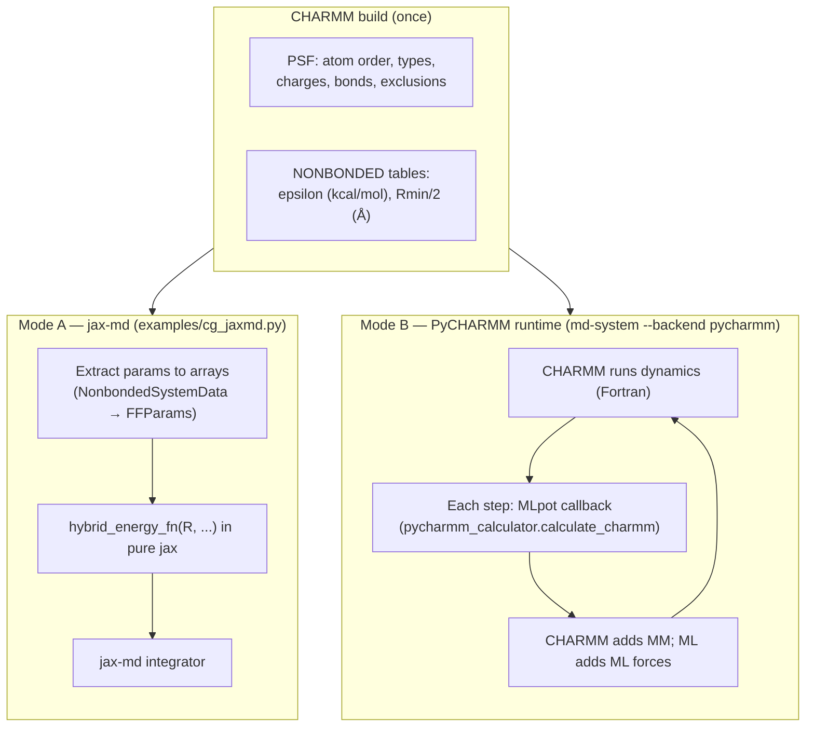
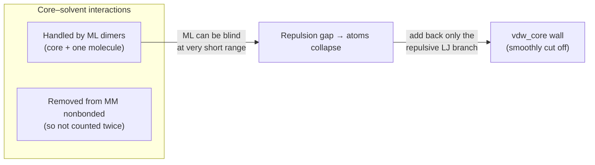
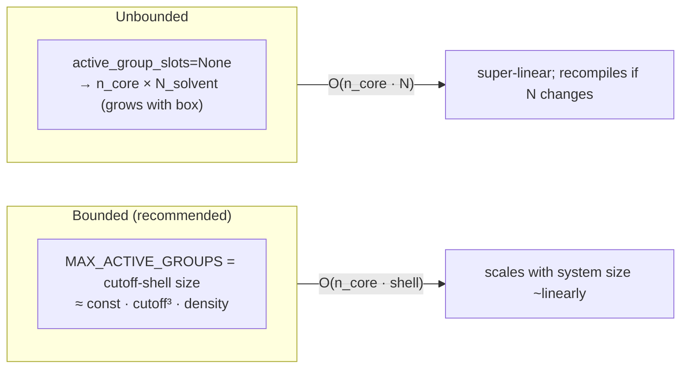

# Hybrid ML/MM energy: how the term arrays line up with PyCHARMM & MLpot

This page explains how the parameters of the extracted energy terms —
`n_core_atoms`, `group_indices`, `active_group_slots` / `active_group_mask`, and
the `lj_epsilon` / `lj_rmin_half` tables — map onto **PyCHARMM** (the PSF and its
nonbonded parameters) and onto the **MLpot** decomposition. It also covers the
JIT-compatibility rules and the performance/scaling behaviour those shapes imply.

Companion to `docs/md-cg-unification-design.md` (the architecture) — this is the
"why do the arrays look like that" tutorial.

---

## 1. Two integration modes (same physics, different driver)

There are two ways the ML potential and CHARMM are combined. Both start from the
**same CHARMM build** (PSF + parameters); they differ in *who runs the time loop*.



- **Mode A** is what `cg_jaxmd` does today, and what the new `JaxmdDriver` will
  do: CHARMM is used **only to build**. Every energy term (ML monomers, MM
  nonbonded, `vdw_core`, restraints, SMD) is evaluated in pure jax inside one
  jitted `energy_fn`. This is the mode the extracted terms target.
- **Mode B** keeps CHARMM's integrator and plugs the ML model in as a
  per-step callback (`Nmlp` ML pairs handed to `calculate_charmm`). Here CHARMM
  owns the MM nonbonded and the ML potential only contributes the ML region.

The key point: **the arrays in the terms are the "Mode A" view** — everything
CHARMM knows, flattened into static jax arrays once at build time.

---

## 2. What PyCHARMM provides → `FFParams`

Everything the terms need about the force field comes out of the PSF and the
live CHARMM NONBONDED tables, via one dataclass:

```python
# mmml/interfaces/pycharmmInterface/mm_system_energy.py
@dataclass(frozen=True, slots=True)
class NonbondedSystemData:
    charges: np.ndarray          # per-atom partial charge   (from PSF)
    at_codes: np.ndarray         # per-atom type code
    epsilon: np.ndarray          # per-atom LJ ε (kcal/mol)   ← param.get_epsilon()
    rmin: np.ndarray             # per-atom Rmin/2 (Å)        ← param.get_vdwr()
    excluded_pairs: frozenset    # 1-2 / 1-3 exclusions       (from PSF)
    e14_pairs: frozenset         # 1-4 pairs (scaled)         (from PSF)
```

This maps **field-for-field** onto `FFParams` in the new schema (decision A):
resolved once by the builder, carried as data, never recomputed per step.
`FFParams.from_nonbonded_system_data(nbdata)` does the conversion, and
`PsfSystemBuilder` calls it. The `vdw_core` term's `lj_epsilon` / `lj_rmin_half`
are exactly `FFParams.epsilon` / `.rmin_half` (= `NonbondedSystemData.epsilon` /
`.rmin`):

```text
CHARMM NONBONDED  ──get_epsilon()/get_vdwr()──►  NonbondedSystemData
                                                       │  .from_nonbonded_system_data()
                                                       ▼
        FFParams(charges, epsilon, rmin_half, at_codes, exclusions, e14_pairs)
                                                       │
                    RepulsiveCoreVdwTerm(lj_epsilon=…, lj_rmin_half=…)
```

CHARMM stores ε and **Rmin/2** (half the pair minimum-energy distance), so the
pair rule is a *sum*, not the usual σ combining:

```text
ε_ij   = sqrt(|ε_i · ε_j|)          # geometric mean  (CHARMM)
Rmin_ij = (Rmin/2)_i + (Rmin/2)_j    # arithmetic SUM of the halves
```

That is why the term takes `lj_rmin_half`, and internally
`sig = rmin_half[i] + rmin_half[j]`.

---

## 3. The atom-index convention: core group first, then molecule groups

The builder lays atoms out in a fixed order in the PSF: the **solute / "core"**
first, then the **solvent molecules**. That ordering is what `n_core_atoms` and
`group_indices` describe.

```text
 atom index:  0   1   2  ...            n_core-1 | n_core ............... N-1
             ┌───────────────────────────────────┬───────────────────────────┐
             │  CORE GROUP (e.g. peptide)         │  MOLECULE GROUPS (waters) │
             │  n_core_atoms atoms                │  n_groups × atoms_per_grp │
             └───────────────────────────────────┴───────────────────────────┘
                                                   \___ water0 ___/\_ water1 _/ ...
                                                    [O  H  H]       [O  H  H]

 n_core_atoms  = n_core                       # first-N boundary (the "core")
 group_indices = [[n_core+0, n_core+1, n_core+2],   # water 0  (O,H,H)
                  [n_core+3, n_core+4, n_core+5],   # water 1
                  ...]                              # shape (n_groups, 3)
```

- `n_core_atoms` is just the boundary index — the core occupies `R[:n_core]`.
- `group_indices[g]` are the atom indices of solvent molecule `g`. Shape is
  `(n_groups, atoms_per_group)` — regular, so it vectorises cleanly.

In `cg_jaxmd` these were the globals `n_trialanine` and `_pw_water_indices_jax`;
the term simply names them generically.

---

## 4. The energy decomposition — where each term lives

`hybrid_energy_fn` in `cg_jaxmd` is the whole picture in one function. Annotated:

```python
E_total =
    e_intra           # (A) ML monomer energies      → ml_intra term
  + e_pw_core         # (A) repulsive LJ core wall    → RepulsiveCoreVdwTerm ("vdw_core")
  + e_inter           # (B) MM nonbonded, padded pairs→ mm_nonbonded term
  + e_restraint       # (C) flat-bottom H–X bonds     → (restraint term)
  + e_pep_bond        # (D) all-bond harmonic          → (restraint term)
  + e_dihedral        #     φ/ψ restraint             → DihedralRestraintTerm
  + e_smd             # (E) steered-MD moving well    → SMDBiasTerm
```

Why does `vdw_core` exist at all? Because of **double-counting avoidance**:



When core–solvent interactions are given to the ML model, those pairs are
**excluded** from the MM nonbonded sum (`get_intermolecular_pairs(...,
peptide_water_ml=True)`). But an ML model trained on reasonable geometries can
under-predict the hard repulsive wall at very short separation, letting atoms
fuse. `vdw_core` re-adds **only the positive (repulsive) part** of the CHARMM LJ
term for those pairs, smoothly switched to zero past a short cutoff — a safety
rail, not a full nonbonded term.

---

## 5. The two padding schemes (the crux of the params)

jax needs **static array shapes** to compile once, but the number of interacting
pairs/molecules changes every step. The fix is *pad to a fixed capacity + carry
a mask*. There are two independent padded lists (decision B — each term owns its
own):

### 5a. MM nonbonded pair list — `(pi, pj, mask)`

```text
 MAX_PAIRS (fixed capacity, e.g. 200_000)
 ┌───────────────────────────────────────────── … ─────────────┐
 pi   = [ 12,  12,  40,  41, …  real i indices …  0,  0,  0,  0 ]
 pj   = [ 88, 141,  90,  91, …  real j indices …  0,  0,  0,  0 ]
 mask = [  1,   1,   1,   1, …       1 …          0,  0,  0,  0 ]
                                                  └─ padding ──┘
```

`mask` (1 for a real pair, 0 for padding) multiplies each pair energy, so
padding contributes exactly zero. Padding pairs point at atom 0 with a clamped
`safe_dist` so `sqrt`/`1/r` never see a true zero (NaN-gradient guard).

### 5b. Active molecule groups — `active_group_slots` / `active_group_mask`

This is the one the term exposes. `group_indices` lists **all** solvent
molecules; only those near the core matter each step. `active_group_slots`
selects rows of `group_indices`; `active_group_mask` zeroes the padded tail.

```text
 group_indices  (all molecules, shape (n_groups, 3))
   row 0: [42,43,44]   row 1: [45,46,47]   row 2: [48,49,50]  row 3: …

 active_group_slots = [  2,   0,  17, …,   0,   0 ]   # indices INTO group_indices
 active_group_mask  = [  1,   1,   1, …,   0,   0 ]   # 1 = real, 0 = padded
                                              └ padding ┘
        capacity = MAX_ACTIVE_GROUPS  (fixed; sized to the cutoff shell)

 inside the term:
     groups = group_indices[active_group_slots]   # (MAX_ACTIVE_GROUPS, 3)
     E      = Σ  mask · switch(dist) · repulsive(dist)
```

So the mapping is: **slots index into `group_indices`, mask cancels the
padding.** When you pass `active_group_slots=None`, the term uses *all* groups
(the dense path) — correct but unbounded; the padded path is what keeps a large
box affordable and jit-stable (§7).

---

## 6. JIT compatibility — the rules these shapes enforce

The whole design exists to make one `jax.jit` graph that is compiled **once** and
reused for the entire trajectory. The rules:

| Rule | Why | In the term |
|---|---|---|
| **Static shapes** | jit specialises on shape; a new shape = recompile | pad to `MAX_*`; never resize per step |
| **Mask, don't index** | boolean/dynamic indexing changes shape | `mask * energy`, not `energy[mask]` |
| **No Python branch on traced values** | `if x > 0` on a tracer fails/leaks | branches only on Python constants (`n_core`, cutoff) |
| **NaN-safe kernels** | `√0`, `1/0` give NaN *gradients* even if masked out | `safe_dist = where(mask, dist, 1.0)` before `sqrt` |
| **Closed-over constants are static** | baked into the graph | ε/Rmin tables, box, cutoff captured at `make()` |
| **Arrays passed as args** | same shape ⇒ no recompile, just new values | `R`, `active_group_slots`, `active_group_mask` |

Recompilation is triggered by: changing `MAX_PAIRS` / `MAX_ACTIVE_GROUPS` /
`n_atoms`, changing dtype (f32↔f64), or a Python-level conditional that depends
on array values. Keep all of those fixed for a run and you compile exactly once.

!!! note "Term-author checklist"
    A new `EnergyTerm` stays jit-friendly if its `jax_energy_fn`: (1) takes `R`
    plus fixed-shape kwargs, (2) closes over everything static in `make()`,
    (3) uses `mask` multiplies instead of dynamic slicing, and (4) guards every
    `sqrt` / division against masked-out zeros.

---

## 7. Performance & scaling

### `vdw_core` is a *dense block*

Its cost is proportional to

```text
 cost(vdw_core)  ∝  n_core_atoms × n_active_groups × atoms_per_group
```

i.e. every core atom against every active solvent atom. This is fine when
`n_active_groups` is the **cutoff shell** (a few hundred waters), and quadratic
trouble if you accidentally pass *all* waters (`active_group_slots=None`) for a
big box.



### Recommendations

These are the accepted decisions; the sizing/overflow/dtype pieces are
implemented in `mmml/md/energy/capacity.py`.

1. **Size `MAX_ACTIVE_GROUPS` to the cutoff shell, not the box** *(accepted)*.
   Pick it from `(4/3)π r_c³ · ρ_solvent` plus headroom, and rebuild the active
   list from the neighbor list each step. This keeps `vdw_core` (and the ML dimer
   term) scaling ~linearly with system size. Use
   `mmml.md.energy.shell_capacity(cutoff_A, number_density_per_A3, headroom=1.5)`.
2. **Set capacities with headroom and check for overflow** *(accepted)*. If real
   pairs exceed `MAX_PAIRS`, or active groups exceed capacity, you silently drop
   interactions. `mmml.md.energy.check_capacity(n_required, capacity, name)`
   raises `CapacityOverflow` (or warns) instead; `pad_indices(indices, capacity)`
   pads *and* guards in one call. Grow capacity (accept one recompile) rather
   than truncate.
3. **Rebuild the neighbor list every N steps, not every step** *(accepted;
   driver-level)*. A Verlet skin lets you reuse `(pi, pj, mask)` and the active
   slots across several steps; rebuild cost (`get_intermolecular_pairs`) is
   host-side and not jitted. This lives in the `JaxmdDriver` (not yet built), not
   in the terms.
4. **Prefer masking over resizing** *(accepted)*. Growing an array forces
   recompilation and a pipeline stall; a mask reuses the cached graph.
5. **Dtype policy: f64 for all float math; low precision only for indices and
   masks** *(decided)*. Keep every distance, energy, force, and PME-like sum in
   **float64** — the repulsive `(σ/r)^12` branch is stiff and f32 risks energy
   drift, so we do **not** trade float precision for speed. The precision we
   *do* drop is on the non-float arrays: **`int32` indices** (addresses ~2.1e9
   atoms — vastly more than any system) and **`int8` 0/1 masks**. The mask is
   stored int8 (small host→device transfer) and cast to `COMPUTE_DTYPE` at the
   multiply site, so it is numerically identical to a float mask (verified in
   `tests/unit/test_md_capacity.py`). These are the `INDEX_DTYPE` / `MASK_DTYPE` /
   `COMPUTE_DTYPE` constants in `capacity.py`.
6. **`vdw_core` provides no ASE face on purpose** *(accepted)*. It is a
   padded-slot jax term; the ASE `Calculator` path would need a different
   (dense, numpy) formulation. For ASE runs, rely on CHARMM's own nonbonded
   instead.

### How the two modes scale differently

- **Mode A (jax-md):** one compiled graph, all terms on device; cost dominated
  by the dense ML dimer + `vdw_core` blocks → keep active-group capacity tight.
- **Mode B (PyCHARMM):** CHARMM's neighbor list and MM are already O(N); the ML
  callback cost is set by `Nmlp` (number of ML pairs handed over each step). The
  same "bound the ML region" advice applies, just enforced by CHARMM's pair list
  instead of your padding.

---

## 8. One-line summary

`n_core_atoms` and `group_indices` are the **PSF atom-ordering** (solute first,
solvent molecules after); `lj_epsilon` / `lj_rmin_half` are **CHARMM's NONBONDED
tables** (`get_epsilon` / `get_vdwr`, ε and Rmin/2); `active_group_slots` /
`active_group_mask` are the **static-shape padding** that lets the dynamic set of
nearby solvent molecules run inside a single compile-once jax graph. `vdw_core`
itself is the repulsive safety rail that replaces the MM nonbonded for
ML-handled core–solvent pairs.
