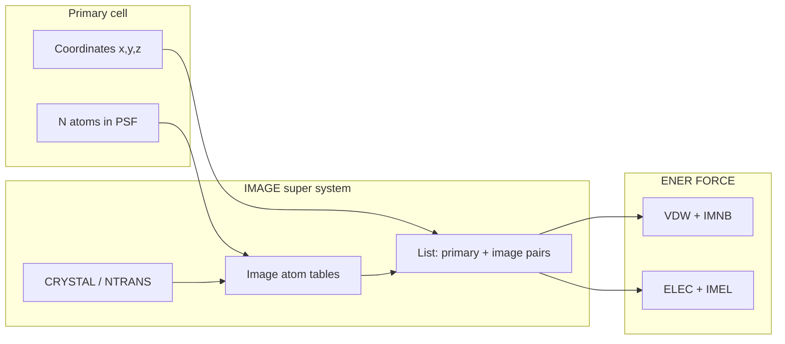
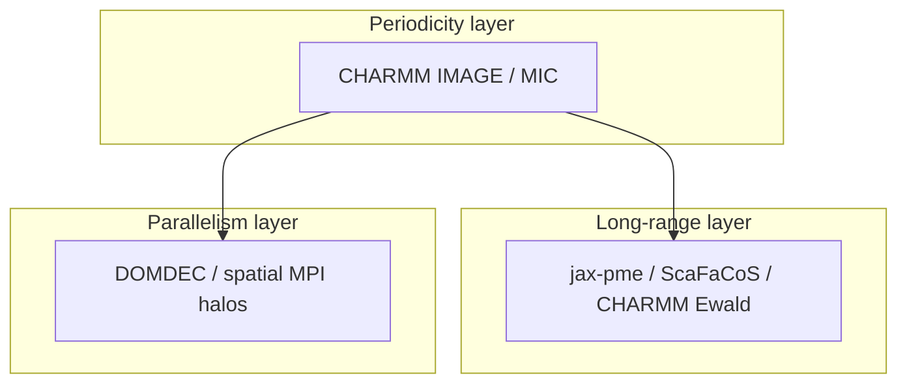

# Periodic boundaries: CHARMM super system vs MIC, FMM, and spatial decomposition

How **PyCHARMM** treats periodicity with explicit **IMAGE** translations (a lattice
“super system”), how the **JAX CGenFF clone** and **jax-md MIC** path differ, and
where **PME / FMM** and **domain decomposition** fit in MMML.

Figures regenerate with:

```bash
uv run python scripts/plot_pbc_super_system.py
```

Related: [Tri-alanine water box](trialanine-water-box.md), [CHARMM CGenFF JAX clone](cgenff-jax-clone.md), [Long-range solver tutorial](long-range-solver-tutorial.md), [Spatial ML MPI](mlpot-spatial-mpi.md), and the source note `mmml/interfaces/pycharmmInterface/mlpot/NONBOND_LISTS.md`.

---

## 1. Primary unit cell

The **simulation box** is a parallelepiped (usually cubic). The PSF stores **N
atoms** in the primary cell only — coordinates you write to DCD, the atoms ASE
shows in a trajectory viewer, and the geometry the JAX clone reads from NumPy.


In MMML box builders (`prepare_charmm_pbc`, tri-alanine water, `make-box`) this is
followed by `image byres` and switched `NBONDS` with `cutnb` / `cutim` sized for
the box (see [trialanine-water-box.md](trialanine-water-box.md)).

---

## 2. CHARMM IMAGE super system

CHARMM does **not** integrate Newton’s equations on a literal 27× replica of the
box. Instead, the **IMAGE** facility builds a **super system** in **data structures**:

1. **Crystal** defines lattice transforms (`NTRANS` translation operations).
2. **IMAGE** maps each residue into image sites (by residue for `image byres`).
3. The **nonbonded list** (`UPINB` / `UPIMNB`) includes pairs between primary atoms
   and **image sites** within `cutnb` (and image cutoff `cutim`).

Conceptually, for each primary atom you can think of **ghost sites** at
**R + n·L** that enter the pair loop the same way real atoms would in an enlarged
cluster:


| Quantity | Primary cell | Image / super-system bookkeeping |
|----------|--------------|----------------------------------|
| Stored coordinates | N atoms | still N atoms |
| Pair list | primary–primary | primary–image within cutoff |
| ENER terms | `BOND`, `VDW`, `ELEC`, … | image contributions `IMNB`, `IMEL`, … |
| Integrator | moves primary atoms | images follow lattice transforms |

That last row is why trajectory cross-checks must map **`VDW + IMNB`** and
**`ELEC + IMEL`** when comparing to JAX MIC totals (see
[cgenff-jax-clone.md](cgenff-jax-clone.md) and `cgenff_bonded_reference.py`).



**MMML PyCHARMM path:** `pbc_env.prepare_charmm_pbc` → `crystal build` →
`image byres` → `apply_pbc_nbonds`. After `READ PARAM APPEND` (CGENFF reload),
call `restore_charmm_cubic_crystal_lattice` before the next `UPINB` — IMAGE tables
are cleared by parameter I/O.

---

## 3. Minimum-image (MIC) — JAX CGenFF clone & `jax_mic` MLpot

The **JAX CGenFF clone** (`mm_system_energy.py`) and the default **`jax_mic`**
MLpot MM path keep **only N atoms** in memory. For each candidate pair within
`cutnb`, the displacement uses the **minimum-image convention** (shortest vector
across periodic boundaries). No separate image atom array is allocated in Python/JAX.


| | CHARMM IMAGE super system | MIC (JAX / many MD codes) |
|--|---------------------------|---------------------------|
| Coordinates | N primary | N primary |
| Periodic partners | explicit image sites in list | implicit via `find_mic` / lattice shift |
| Energy bookkeeping | split primary vs image ENER keys | single `vdw` / `elec` pair sum |
| Typical use in MMML | live PyCHARMM `ENER FORCE` | `mm_system_energy_and_forces`, switched MLpot MM |

For **truncated** Coulomb (`lr_solver=mic`, default), JAX and CHARMM should agree
on **total** nonbonded energy when cutoffs and exclusion lists match; per-term
`VDW` vs `IMNB` splits are not 1:1 across engines.

---

## 4. Long range: PME, Ewald, FMM — different layer than IMAGE

**IMAGE / MIC** answer: “which periodic copy of j is closest to i for a **short-range**
pair within `cutnb`?”

**PME / Ewald / fast multipole (FMM)** answer: “how do we sum **Coulomb** (and
sometimes dispersion) beyond the pair cutoff without a naive O(N²) sum?”


| Method | Near field | Far field | MMML entry points |
|--------|------------|-----------|-------------------|
| **MIC** (truncated) | all pairs &lt; `cutnb`, switched | none (cutoff) | `lr_solver=mic`, CGenFF JAX clone |
| **PME / Ewald** | short-range pair sum | reciprocal grid | `lr_solver=jax_pme`, CHARMM `ewald`, ScaFaCoS |
| **FMM** (concept) | direct multipole locally | hierarchical tree | not native in CHARMM production path; same *role* as k-space Ewald |

In hybrid MLpot, **short-range** switched LJ + Coulomb stay in the JAX pair loop;
**long-range** Coulomb (and optional r⁻⁶ dispersion) can be delegated to
**jax-pme**, **nvalchemiops PME**, or **ScaFaCoS** — see
[long-range-solver-tutorial.md](long-range-solver-tutorial.md).

!!! note "Not the same as spatial MPI"
    PME/FMM address **electrostatics at long distance**. **Domain decomposition**
    (next section) addresses **parallel work partitioning** across CPU/GPU ranks.

---

## 5. Spatial decomposition (DOMDEC, ML spatial MPI)

**Spatial decomposition** splits the **primary** simulation volume across MPI ranks.
Each rank owns atoms whose centers fall in its domain; **halo / ghost** regions
duplicate monomer data needed for ML dimer pairs or CHARMM pair lists at boundaries.


| Approach | What is replicated | Why |
|----------|-------------------|-----|
| **CHARMM IMAGE** | lattice image **sites** for PBC | periodic pair list within one rank |
| **DOMDEC / spatial MPI** | **ghost atoms/monomers** in neighbor domains | parallel force evaluation |
| **MIC (single rank)** | nothing | single-process JAX/MM |

MMML **spatial MPI** (`mlpot-spatial-mpi.md`) uses a Python grid today; CHARMM
**DOMDEC** metadata is not yet wired into MLpot (Phase 3). That is orthogonal to
whether Coulomb uses MIC or PME on each rank.



---

## 6. Practical map in MMML

| Task | Periodic model | Doc / code |
|------|----------------|------------|
| Build solvated CGENFF box | CHARMM crystal + IMAGE | `trialanine_water_box.py`, [trialanine-water-box.md](trialanine-water-box.md) |
| Live vs JAX energy check | CHARMM IMAGE ENER; JAX MIC | [cgenff-jax-clone.md](cgenff-jax-clone.md), `demo_charmm_jax_trajectory_energy.py` |
| Hybrid MD (`md-system`) | CHARMM IMAGE + MLpot MIC sync | [mlpot-settings.md](mlpot-settings.md), `pbc_env.py` |
| LR Coulomb beyond 13 Å switch | PME / ScaFaCoS | [long-range-solver-tutorial.md](long-range-solver-tutorial.md) |
| Multi-rank ML | spatial domains + halos | [mlpot-spatial-mpi.md](mlpot-spatial-mpi.md) |

---

## 7. Regenerating figures (ASE)

The teaching cell uses four gas-phase waters in a 14 Å cube (not a production
solvent box). Script: `scripts/plot_pbc_super_system.py`; library:
`mmml/utils/pbc_super_system_plot.py`.

Orthographic projection matches other MkDocs structure figures
(`mmml/utils/ase_structure_plot.py`): fixed rotation, Jmol-style colors, dashed
unit-cell outlines.

```python
from pathlib import Path
from mmml.utils.pbc_super_system_plot import generate_pbc_doc_figures

generate_pbc_doc_figures(Path("docs/images/pbc"))
```

To overlay **your** trajectory: read an extxyz/DCD frame with ASE, set `atoms.set_pbc(True)`,
and reuse `plot_charmm_super_system` / `plot_mic_convention` patterns with the same
`draw_orthographic_structure` helper.
