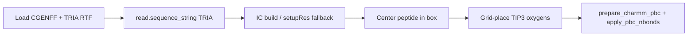

# Tri-alanine water box (CGENFF TRIA)

A minimal **periodic peptide + water** system for PyCHARMM and JAX MM cross-checks — no Packmol, no protein `toppar`, no MLpot.

For **peptide ML + solvent MM** (partial MLpot), use [`mmml md-embedding`](examples/md-embedding-design.md) `build` — it reuses this box builder and registers PhysNet on segment `PEPT`.

The peptide is a single CGENFF residue **`TRIA`** (documented as **TRIALANINE**: ACE–ALA×3–CT3) in `mmml/data/charmm/top_trialanine_cgenff.rtf`. Waters are TIP3 on a simple cubic grid inside a cubic cell.


---

## Why a bundled residue?

CHARMM sequence names are at most **four characters**, so the sequence token is `TRIA`, not `TRIALANINE`. The supplemental RTF is appended after the main CGENFF topology so bonded parameters come from `par_all36_cgenff.prm` with CGENFF atom types (`CG311`, `NG2S1`, …).

Regenerate the RTF after topology changes (requires protein toppar **only for export**):

```bash
./scripts/mmml-charmm-mpirun.sh python scripts/export_trialanine_cgenff_rtf.py
```

---

## Build pipeline




Python entry point: `mmml.interfaces.pycharmmInterface.trialanine_water_box.build_trialanine_water_box_in_charmm`.

Default smoke parameters: **10 waters**, **28 Å** cube → **72 atoms** (42 peptide + 30 water).

---

## Smoke build (PyCHARMM)

```bash
./scripts/mmml-charmm-mpirun.sh python -c "
from pathlib import Path
from mmml.interfaces.pycharmmInterface.import_pycharmm import ensure_pycharmm_loaded
ensure_pycharmm_loaded()
from mmml.interfaces.pycharmmInterface.trialanine_water_box import build_trialanine_water_box_in_charmm
box = build_trialanine_water_box_in_charmm(n_waters=10, box_side_A=28.0, seed=11, workdir=Path('/tmp/tria_box'))
print(len(box.positions), box.psf_path)
"
```

Pass criteria: finite coordinates, PSF written, position std ≫ 0 (not collapsed IC).

---

## JAX vs PyCHARMM total-MM cross-check

The functionality test ``test_trialanine_water_total_mm_matches_pycharmm`` compares
``mm_system_energy.py`` (MIC pair loop) to CHARMM ``ENER FORCE`` term components
(bonded + ``VDW``/``IMNB`` + ``ELEC``/``IMEL``). After the PSF ``INB``/``IBLO`` fix,
total-MM Δ is typically **≲0.5 kcal/mol** on the 72-atom smoke box (same order as
DCM liquid parity). Do **not** compare against ``energy.get_total()`` under PBC — it
can differ from the MIC-mapped component sum by several kcal/mol.

Run the parity report (metrics tables, JSON, and PNG plots)::

    ./scripts/mmml-charmm-mpirun.sh python scripts/diagnose_trialanine_nb_mismatch.py \\
      -o artifacts/trialanine_nb_parity

Outputs under ``artifacts/trialanine_nb_parity/``:

| File | Contents |
|------|----------|
| ``report.md`` | Per-term CHARMM vs JAX table, pair-list stats, top offending pairs |
| ``report.json`` | Machine-readable metrics (CI / regression tracking) |
| ``term_comparison.png`` | Grouped bar: bonded, VDW, elec, total |
| ``delta_breakdown.png`` | JAX−CHARMM ΔVDW, ΔElec, ΔMM |
| ``jax_nb_by_category.png`` | JAX VDW+elec stacked by pep–pep / pep–water / water–water |
| ``pair_distance_hist.png`` | MIC distance histograms per category (ctonnb/ctofnb marked) |
| ``top_pep_pep_vdw.png`` | Largest peptide–peptide VDW pair contributors (JAX) |
| ``category_vdw_comparison.png`` | CHARMM segment BLOCK vs JAX VDW per category |
| ``force_by_category.png`` | Force RMS Δ (JAX masked pairs − CHARMM BLOCK) per category |
| ``switch_derivative_audit.png`` | JAX autodiff vs finite-difference dE/dr (fswitch/vfswitch) |

CHARMM per-category terms use selective ``BLOCK`` (``SEGID PEPT`` / ``SOLV``). Pass
``--category-block`` to the diagnostic script. Under ``mpirun`` this can hang unless
``MMML_ALLOW_SELECTIVE_BONDED_BLOCK=1`` — default run skips it and still reports
JAX category breakdown + switch audit.

The functionality test uses ``energy_atol=0.7`` kcal/mol on the 72-atom TRIA box
(residual single-residue pep–pep VDW). Use the report above for per-term breakdown.

### What we ruled out

- **Toggling ``vfswitch`` alone** does not explain the gap (CHARMM VDW changes by ≲1 kcal
  on a 2× acetone dimer; tri-alanine is similar).
- **Bonded terms match** (bond/angle/torsion/improper/CMAP/Urey–Bradley).

### Main contributors (historical — pre INB/IBLO fix)

| Term | PyCHARMM | JAX (MIC) | Notes |
|------|----------|-----------|--------|
| VDW | ≈ −2 kcal/mol | ≈ +12–32 kcal/mol | **Fixed**: wrong PSF exclusion parse inflated pep–pep VDW |
| Elec | ≈ −12 kcal/mol | ≈ −15 kcal/mol | Smaller gap when ``MMML_LR_SOLVER=mic`` |

After the fix, typical deltas (seed 31 perturb): total MM **≈0.2–0.5 kcal/mol**;
bonded exact; VDW **≈0.3–0.6 kcal/mol** on the all-in-one ``TRIA`` residue.

### Root causes (implementation gaps)

1. **Switching models** — JAX ``mm_system_energy`` now implements CHARMM **``fswitch``** (cdie)
   and **``vfswitch``** (VDW) by default, matching ``apply_pbc_nbonds``. Legacy **``pswitch``**
   (Brooks-style ``charmm_switch_factor``) remains available via ``CharmmNbondSettings``. PRM
   declares ``fshift`` for elec, but PyCHARMM runtime uses ``fswitch``; residual energy gaps
   are dominated by pair-list / IMAGE differences, not the switch functional form. See
   [CHARMM CGenFF JAX clone](cgenff-jax-clone.md#nonbonded-switching-mm_system_energypy).
2. **Pair list / IMAGE** — JAX builds an O(N²) MIC list using PSF ``INB``/``IBLO``
   exclusions (written after ``upinb`` at box build).  Prior to 2026-07, ``parse_psf_ext``
   mis-read the flat ``INB`` array as a packed per-atom list and ignored ``IBLO``; that
   under-excluded peptide pairs and inflated JAX VDW.  Small residual IMAGE differences may
   remain even when exclusions match.
3. **Single ``RESI TRIA`` (42 atoms)** — All peptide atoms share one residue; CHARMM and JAX
   agree on graph-distance ≥3 pairs, but CHARMM net intra-peptide VDW is much smaller than JAX.
4. **Long-range backend** — default ``lr_solver`` is **MIC** (truncated pair loop). For CHARMM
   comparison tests that require explicit MIC, pass ``lr_solver='mic'`` or ``MMML_LR_SOLVER=mic``.
   Opt into jax-pme with ``lr_solver: jax_pme`` when you need k-space Coulomb.

### Practical guidance

- Treat the tri-alanine box as validated for **CHARMM build + bonded JAX** and as a
  **MIC regression target** for ``mm_system_energy`` (≲0.5 kcal/mol total on gpu09
  with ``JAX_ENABLE_X64=1``). For production MLpot paths, prefer ``mm_nonbond_mode=periodic_external`` or documented LR solvers
  (see [long-range-solver-tutorial.md](long-range-solver-tutorial.md)), not raw ``mm_system_energy`` MIC.

---

## Tests

```bash
# Bonded + total-MM (total-MM may fail; see above)
./scripts/mmml-charmm-mpirun.sh python -m pytest \
  tests/functionality/charmm/test_trialanine_water_box_mm.py -m pycharmm -v

# Unit tests (no CHARMM)
uv run pytest tests/unit/test_mm_system_energy.py -q
```

See also: `tests/functionality/charmm/README_trialanine_water_box.md`.

---

## Doc figures

Bundled CHARMM-built coordinates (`mmml/data/charmm/trialanine-water-smoke.extxyz`) feed MkDocs figures.

```bash
# Once per release (PyCHARMM + CHARMM_HOME):
export CHARMM_HOME=... CHARMM_LIB_DIR=... LD_LIBRARY_PATH=...
uv run python scripts/export_docs_structure_assets.py

# Render PNGs (CI-safe, no PyCHARMM):
uv run python scripts/generate_docs_figures.py
```

Writes `docs/images/structures/trialanine-water-box.png`, peptide zoom, and pipeline plot.
