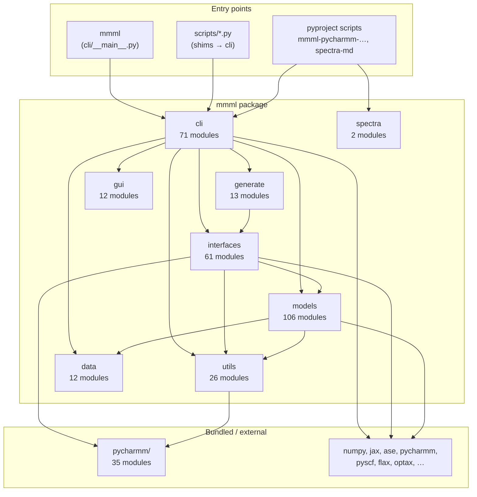
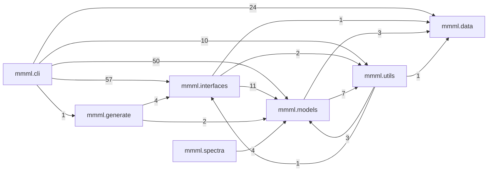
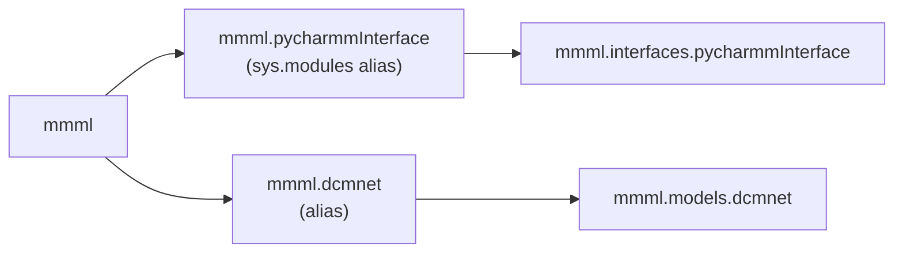
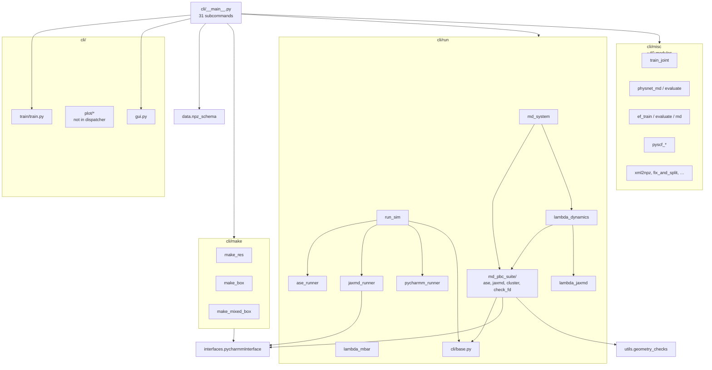
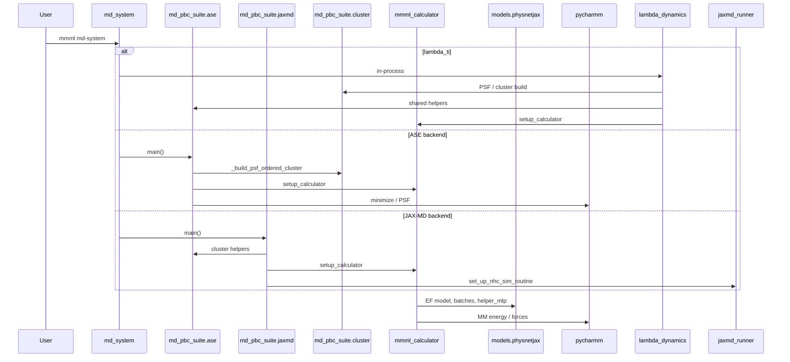
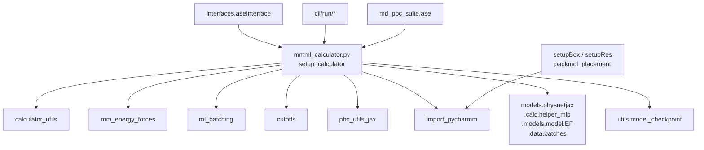
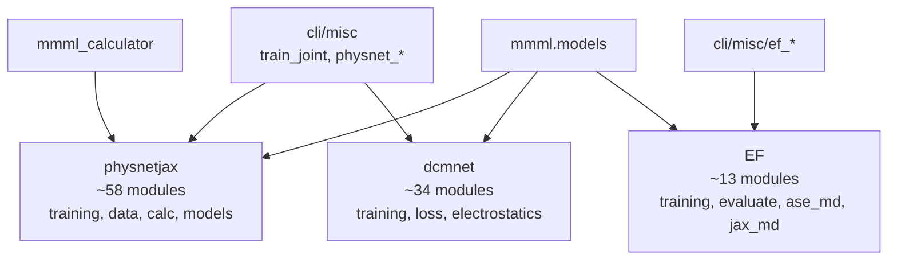
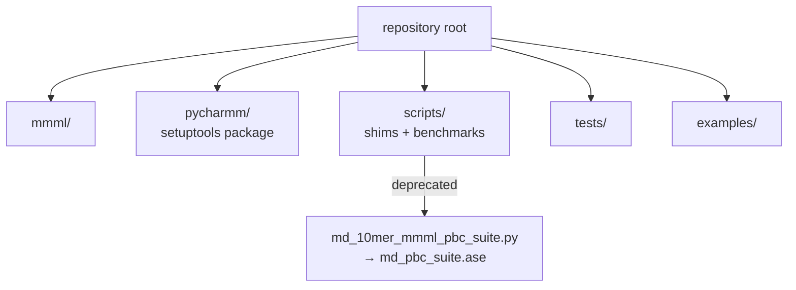

# MMML package architecture

Overview of the **mmml** Python package: layout, import dependencies, CLI wiring, and MD runtime paths.  
Generated from static analysis (AST import scan) of `mmml/` (~291 Python modules), plus vendored `pycharmm/` and deprecated `scripts/` shims.

---

## Top-level layout



| Subpackage | `.py` files (approx.) | Role |
|------------|----------------------:|------|
| `mmml.cli` | 71 | `mmml` dispatcher, MD runners, training/eval/misc CLIs |
| `mmml.models` | 106 | PhysNetJAX, DCMNet, EF models |
| `mmml.interfaces` | 61 | CHARMM, PySCF, ASE, OpenMM, … bridges |
| `mmml.utils` | 26 | I/O, checkpoints, geometry, plotting, hybrid optimization |
| `mmml.data` | 12 | NPZ schema, units, loaders, adapters |
| `mmml.generate` | 13 | Dimers, DMC, sampling utilities |
| `mmml.gui` | 12 | FastAPI viewer + frontend assets |
| `mmml.spectra` | 2 | Spectra MD (`mmml-spectra-md` console script) |

---

## Inter-package imports

Arrow labels are approximate import-statement counts between subpackages (`mmml.cli` → `mmml.interfaces`, etc.).



**CLI is the hub** — most user-facing flows go through `mmml.cli` into `interfaces` (CHARMM/MM) and `models` (ML).

---

## Legacy import aliases

`mmml/__init__.py` registers compatibility names in `sys.modules`:



Prefer canonical paths:

- `mmml.interfaces.pycharmmInterface.*`
- `mmml.models.dcmnet.*`
- `mmml.models.physnetjax.*`

Some CLI code still imports `mmml.physnetjax.*` (legacy) alongside `mmml.models.physnetjax.*`.

---

## `mmml.cli` structure



### CLI modules not reached from `mmml` dispatcher

Examples (runnable only via `python -m …` or legacy paths):

- `cli/plot/plot_training.py`, `plot_checkpoint_history.py`
- `cli/misc/opt_mmml.py`, `dynamics.py`, `evaluate_model.py`, `compare_*`, …
- `cli/make/make_training.py`, `make_mixed_box.py` (mixed box: examples / direct `-m`)

---

## MD runtime path

Production MD flows after moving suites from `scripts/` to `mmml.cli.run.md_pbc_suite`:



### `md_pbc_suite` internal imports

| Module | Main `mmml` dependencies |
|--------|---------------------------|
| `cluster.py` | `interfaces.pycharmmInterface.import_pycharmm`, `utils.get_Z_from_psf` |
| `ase.py` | `cli.base`, `mmml_calculator`, `geometry_checks`, `cluster` |
| `jaxmd.py` | `cli.base`, `jaxmd_runner`, `mmml_calculator`, re-exports from `ase` |
| `check_fd.py` | `cli.base`, `ase` helpers, `cluster` |

---

## `interfaces.pycharmmInterface` hub

Central integration for hybrid ML/MM:



### Other interface subpackages

| Subpackage | Files (approx.) | Typical CLI use |
|------------|----------------:|-------------------|
| `pycharmmInterface` | 17 | Core CHARMM + hybrid calculator |
| `pyscf4gpuInterface` | 11 | `mmml pyscf-dft`, `pyscf-evaluate`, … |
| `dcmInterface` | 12 | `mmml kernel-fit` |
| `aseInterface` | 4 | Legacy ASE calculators |
| `chemcoordInterface` | 1 | `mmml interpolate-xyz` |
| `openmmInterface`, `jaxmdInterface`, … | few | Specialized / optional |

---

## `mmml.models` tree



---

## Third-party dependencies

Counts are approximate import sites under `mmml/` (stdlib excluded).

| Library | ~sites | Used by |
|---------|-------:|---------|
| **ase** | 243 | MD, CLI, interfaces, models |
| **jax** | 191 | Models, calculators, MD |
| **numpy** | 180 | Widespread |
| **pycharmm** | 75 | CHARMM interface, MD suites |
| **matplotlib** | 57 | Plotting, analysis |
| **e3x** | 43 | Equivariant models |
| **rich** | 35 | CLI output |
| **scipy** | 31 | Data, analysis |
| **pandas** | 28 | Data, MD suite |
| **flax** / **optax** | 19 / 17 | Training |
| **pyscf** / **gpu4pyscf** | 21 / 16 | QC interfaces |
| **orbax** | 14 | Checkpoints |
| **h5py** | 15 | Trajectories, QC |

---

## Repo siblings (outside `mmml/`)



### Scripts → CLI migration

| Former `scripts/` | Current location |
|-------------------|------------------|
| `md_10mer_mmml_pbc_suite.py` | `mmml.cli.run.md_pbc_suite.ase` (shim in `scripts/`) |
| `md_10mer_mmml_pbc_suite_jaxmd.py` | `mmml.cli.run.md_pbc_suite.jaxmd` |
| `test_orbax_checkpoint_cluster.py` | `mmml.cli.run.md_pbc_suite.cluster` |
| `meoh_dimer_lambda_ti.py` | `mmml md-system --setup lambda_ti` / `lambda_dynamics` |
| `meoh_dimer_lambda_mbar.py` | `mmml lambda-mbar` |
| `pycharmm_two_residue_sample.py` | `mmml pycharmm-two-residue-sample` |

Research / dev scripts that may stay under `scripts/`: `scan_meoh_dimer_*`, `benchmark_mmml_scaling.py`, shell helpers, data README.

---

## Regenerating import statistics

```bash
cd /path/to/mmml
python3 <<'PY'
import ast
from pathlib import Path
from collections import defaultdict

ROOT = Path("mmml")

def top_pkg(mod: str) -> str:
    parts = mod.split(".")
    return ".".join(parts[:2]) if len(parts) > 2 else mod

def file_to_mod(path: Path) -> str:
    rel = path.relative_to(ROOT.parent)
    parts = list(rel.parts)
    if parts[-1] == "__init__.py":
        return ".".join(parts[:-1])
    return ".".join(parts)[:-3]

def parse_imports(path: Path) -> list[str]:
    try:
        tree = ast.parse(path.read_text(encoding="utf-8", errors="replace"))
    except SyntaxError:
        return []
    out = []
    for node in ast.walk(tree):
        if isinstance(node, ast.Import):
            for a in node.names:
                out.append(a.name)
        elif isinstance(node, ast.ImportFrom) and node.module:
            out.append(node.module)
    return out

pkg_edges: dict[tuple[str, str], int] = defaultdict(int)
for path in ROOT.rglob("*.py"):
    if "viewer" in path.parts or "__pycache__" in path.parts:
        continue
    src = top_pkg(file_to_mod(path))
    if not src.startswith("mmml"):
        continue
    for imp in parse_imports(path):
        if imp.startswith("mmml"):
            tgt = top_pkg(imp)
            if src != tgt:
                pkg_edges[(src, tgt)] += 1

for (a, b), c in sorted(pkg_edges.items(), key=lambda x: -x[2]):
    print(f"{c:4d}  {a}  ->  {b}")
PY
```

---

## See also

- [Development](development.md) — tests, MkDocs workflow
- [Getting started](getting-started.md) — install and first runs
- [API reference](api.md) — generated API docs
