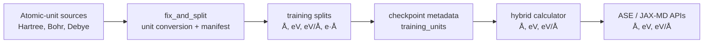
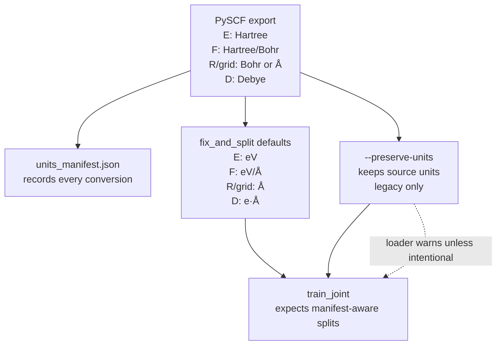
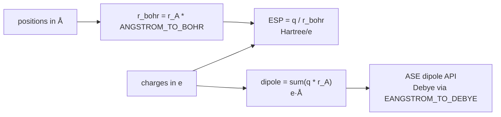
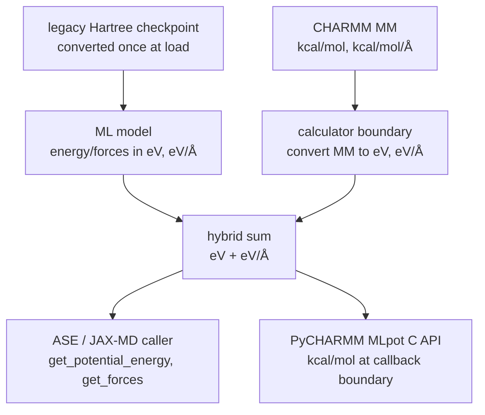

# MMML Units Summary

This document summarizes the units used across MMML components (train_joint, fix_and_split, DCMNet, PhysNet, EF model, calculators) and the conversion factors applied.

## Central constants (`mmml.data.units`)

MMML keeps user-facing MD and ASE-style calculator quantities in Å, eV, and eV/Å. Atomic-unit inputs are converted at dataset preparation or model-boundary time, not repeatedly inside production dynamics.

### Conversion Quick Reference

| Quantity | Atomic / external unit | MMML unit | Factor |
|----------|-------------------------|-----------|-------:|
| Length | Bohr | Å | `BOHR_TO_ANGSTROM = 0.529177` |
| Length | Å | Bohr | `ANGSTROM_TO_BOHR = 1.88973` |
| Energy | Hartree | eV | `HARTREE_TO_EV = 27.211386` |
| Force | Hartree/Bohr | eV/Å | `HARTREE_BOHR_TO_EV_ANGSTROM = 51.422` |
| Dipole | Debye | e·Å | `DEBYE_TO_EANGSTROM = 0.208194` |
| Dipole | e·Å | Debye | `EANGSTROM_TO_DEBYE = 4.803204` |

### Mental Model

| When you see... | Treat it as... | Common place |
|-----------------|----------------|--------------|
| `R`, `positions`, `vdw_surface` | Å | training splits, ASE/JAX-MD, calculators |
| `E`, `energy`, `E_eV` | eV | training, evaluation, hybrid sums |
| `F`, `forces` | eV/Å | training, ASE/JAX-MD, hybrid sums |
| `esp` | Hartree/e | electrostatic potential targets |
| `Dxyz`, `dipole` | e·Å internally; Debye at ASE API boundary | DCMNet/PhysNet targets and outputs |

## Data Pipeline Units

### PySCF (pyscf-evaluate) output
- **R**: Angstrom (or Bohr; fix_and_split auto-detects)
- **E**: Hartree
- **F**: Hartree/Bohr
- **Dxyz**: Debye
- **esp**: Hartree/e (atomic units)
- **esp_grid**: Bohr (PySCF uses atomic units for grids)

### fix_and_split output
Default: convert PySCF/atomic input → ASE-style training units. **Always read `units_manifest.json`** in the output directory.

CLI flags (`mmml fix-and-split --help`, group “Unit conversion”):
- `--coords-in` / `--coords-out` (`auto`, `bohr`, `angstrom`, `same`)
- `--energy-in` / `--energy-out` (`hartree`, `ev`, `same`)
- `--force-in` / `--force-out` (`hartree-bohr`, `ev-angstrom`, `same`)
- `--dipole-in` / `--dipole-out` (`debye`, `e-angstrom`, `same`)
- `--grid-coords-in` / `--grid-coords-out` (`auto`, `bohr`, `angstrom`, `index`, `same`)
- `--preserve-units`: no conversion on R, E, F, Dxyz, or grid coordinates

Typical defaults (when not using `--preserve-units`):
- **R**: Angstrom
- **E**: eV
- **F**: eV/Å
- **Dxyz**: e·Å (from Debye if input is PySCF)
- **esp**: Hartree/e (unchanged)
- **vdw_surface**: Angstrom (from Bohr/index if from PySCF)

### train_joint (model I/O)
- **R**: Angstrom
- **E**: eV
- **F**: eV/Å
- **D**: e·Å (dipole target)
- **esp**: Hartree/e
- **vdw_surface**: Angstrom

## Coulomb / ESP Formulas

### ESP (electrostatic potential)
- **V = q/r** in Hartree/e when r is in Bohr
- Positions in Angstrom: `r_bohr = r_angstrom * ANGSTROM_TO_BOHR`
- **V [Ha/e] = q / (r_angstrom * ANGSTROM_TO_BOHR)**

### Coulomb energy (point charges)
- **E_coul = (1/2) Σᵢⱼ qᵢqⱼ/rᵢⱼ** in Hartree when r is in Bohr
- Positions in Angstrom: `r_bohr = r_angstrom * ANGSTROM_TO_BOHR`
- **E_coul [Ha] = (1/2) Σ qᵢqⱼ / (r_ij_angstrom * ANGSTROM_TO_BOHR)**
- **E_coul [eV] = E_coul [Ha] * HARTREE_TO_EV**

### Dipole moment
- **μ = Σ qᵢ rᵢ** (relative to COM) in e·Å when r is in Angstrom
- PhysNet and DCMNet output dipole in e·Å
- ASE expects dipole in Debye for `get_dipole_moment()` → multiply by `EANGSTROM_TO_DEBYE`

## Component-Specific Notes

### DCMNet `calc_esp` (electrostatics.py)
- Input: `charge_positions`, `charge_values`, `grid_positions` — all in Angstrom
- `r = norm(grid - charge)` → r in Angstrom
- `V = q / (r * ANGSTROM_TO_BOHR)` → V in Hartree/e ✓

### PhysNet ESP (train_joint `_compute_esp_single`)
- `distances = norm(vdw - atom_pos)` → Angstrom
- `r_bohr = distances * ANGSTROM_TO_BOHR`
- `esp_pred_phys = sum(charges / r_bohr)` → Hartree/e ✓

### EF model (models/EF)
- Uses `HARTREE_TO_EV` for energy
- Coulomb term: `pair_coulomb = (q_src * q_dst) / (r_ij + 1e-10)` — **r_ij units**: displacements from e3x gather; if positions are in Angstrom, r_ij is in Angstrom. The factor `7.199822675975274` may need verification (1/(4πε₀) in atomic units = 1).

### MMML Calculator
- Hybrid Python/JAX sums use **eV / eV/Å / Å** throughout.
- ML model outputs are assumed eV/eV/Å (legacy Hartree checkpoints auto-convert at load).
- CHARMM MM terms are converted from kcal/mol to eV inside the calculator before summing.
- PyCHARMM MLpot callback still uses kcal/mol at the C API boundary only (`helper_mlp.py`).
- ASE `get_potential_energy()` / `get_forces()` return eV and eV/Å; `results` include `energy_unit` metadata.

## Pipeline stage table

| Stage | Coordinates | Energy | Forces | Unit record |
|-------|-------------|--------|--------|-------------|
| PySCF export | Å or Bohr | Hartree | Hartree/Bohr | `_mmml_units` in NPZ |
| `fix_and_split` default | Å | eV | eV/Å | `units_manifest.json` v2 + split metadata |
| PhysNet / DCMNet training | Å | eV | eV/Å | `training_units` in checkpoint |
| Hybrid inference | Å | eV | eV/Å | `evaluate.json` `"units"` block |
| PyCHARMM MLpot C API only | Å | kcal/mol | kcal/mol/Å | converted at FFI boundary |

## Verification checklist

1. Read `units_manifest.json` (schema v2) or NPZ `_mmml_units` before training or evaluate.
2. Bond lengths in `R` should be ~0.8–2.5 Å (not ~1.5–4.7 if mis-read as Bohr).
3. Total energies: small organics ~−10³ eV, or ~−40 Ha — not the reverse.
4. After `mmml md-system --evaluate-npz`, check `|delta_energy_eV|` vs reference is O(0.01–1) eV, not O(10³) eV.
5. `evaluate.npz`: `E_eV` is true eV; `E` is Hartree (`E_eV * EV_TO_HARTREE`).

## Migration: legacy `--preserve-units` Hartree splits

If your splits were built with `--preserve-units` (Hartree/Ha/Bohr in `E`/`F`):

1. **Recommended:** Re-run `mmml fix-and-split` without `--preserve-units` so `E`/`F` are eV/eV/Å.
2. **Legacy loaders:** Manifest v1/v2 still records `energy_out: hartree`; training loaders warn unless data is re-split.
3. **Legacy checkpoints:** If `training_units.energy` is Hartree (or missing for pre-harmonization runs), the hybrid calculator applies `HARTREE_TO_EV` once at the ML boundary with a warning.
4. **Evaluate artifacts:** Use reference NPZ with manifest or `_mmml_units`; compare scripts auto-detect units when `--reference-energy-unit` is omitted.

## Potential Sign/Unit Issues to Check

1. **EF model Coulomb**: The factor 7.1998... in `energy = energy + coulomb_energy * 7.199822675975274` — verify r_ij units and whether this factor is correct.

2. **Bohr→Angstrom for grid**: If grid comes from PySCF (Bohr), fix_and_split must convert before saving. The train_joint loads vdw_surface and assumes Angstrom.

3. **Dipole**: PySCF outputs Debye; fix_and_split converts to e·Å. train_joint uses e·Å throughout. No sign flip expected.

4. **ESP sign**: V = q/r; positive charge gives positive V at grid point. PySCF ESP = V_nuclear - V_electronic. The sign convention should match.
