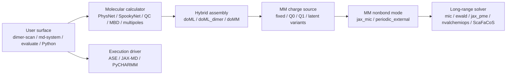

# Calculator and electrostatics capability matrix

This page inventories calculator implementations and states where they are
actually supported. It also separates calculator choice from hybrid energy
assembly, MM charge mode, MM nonbond mode, long-range solver, and MD driver.

**Scope:** repository state on 2026-07-20. “Implemented” does not automatically
mean “supported by every CLI.” The narrowest public interface wins: for
example, `mmml dimer-scan --calculator` currently accepts only `physnet` and
`xtb`, even though other ASE calculators exist elsewhere in MMML.

## The independent axes

Changing the MD driver does not select a different charge mode. Enabling a
PhysNet charge head does not automatically replace the charges used by MM.
Selecting JAX-PME does not select the ML model. These choices must be recorded
independently in scientific provenance.

## Canonical 1D dimer scan calculators

These are the only calculator names accepted by `mmml dimer-scan`.

| `--calculator` | Implementation | Checkpoint | Properties used | Charge inputs | Where supported |
|---|---|---|---|---|---|
| `physnet` | `mmml.interfaces.calculators.checkpoint_loading.create_calculator_from_checkpoint` | Required: portable JSON, joint pickle, or Orbax/directory formats understood by the centralized loader | Energy and forces; interaction energy/forces are dimer minus isolated monomers | Optional total `--charge` and `--spin`; these are molecular model inputs, not `mm_charge_mode` | Canonical Python `run_dimer_scan` and `mmml dimer-scan` |
| `xtb` | `mmml.analysis.dimer_scans.make_xtb_calculator` | None; uses `xtb-python`, falling back to `tblite` | Energy and forces through ASE | Method-native electronic state; the current dimer CLI does not expose xTB-specific charge/UHF options | Canonical Python `run_dimer_scan` and `mmml dimer-scan` |

The `physnet` loader supports standalone PhysNet energy/force checkpoints and
joint PhysNet + DCMNet/non-equilibrium checkpoints. For joint checkpoints the
ASE adapter still supplies the energy/force path; optional dipole, charge, and
multipole results depend on the checkpoint architecture.

The following calculators are **not yet valid** values for
`mmml dimer-scan`: `spookynet`, `mbd`, `multipoles`, `pyscf`, `dftb3-d4`, and
hybrid ML/MM. Adding one requires a factory adapter, provenance fields, and an
energy/force contract test. Energy-only calculators cannot satisfy the current
scan requirement without an explicit policy for missing forces.

## Calculator implementations elsewhere in MMML

| Calculator family | ASE properties | Primary implementation | Supported surfaces | Important limitations |
|---|---|---|---|---|
| PhysNet / joint PhysNet+DCMNet inference | Energy, forces; adapter may also expose dipole, charges, multipoles | `mmml.interfaces.calculators.simple_inference` and `checkpoint_loading` | Python ASE use; evaluation commands; hybrid MLpot model loading; canonical dimer scan | Checkpoint atom-padding capacity and architecture must match the system. |
| SpookyNet / SpookyPhysNet | Energy, forces | `mmml.models.spookynet_calc.SpookyNetCalculator` | Python ASE use; Spooky evaluation/training scripts; hybrid MLpot when checkpoint architecture resolves as Spooky | Standalone adapter does not provide the dynamic CGenFF arrays used by every hybrid architecture. Optional frozen MBD is loaded when recorded/configured. |
| SpookyNet + frozen MBD correction | Energy, forces | `SpookyNetCalculator` with `mbd_checkpoint` and `mbd_weight` | Python ASE evaluation; checkpoint-matched evaluation paths; PyCHARMM hybrid setup also accepts an MBD correction | Recorded cluster-local checkpoint paths may need explicit remapping. Weight must match training. |
| Learned QCML MBD surrogate | Energy, forces | `mmml.models.mbd.QCMLMBDCalculator` | Python ASE use; standalone evaluation; optional correction in hybrid paths | Requires MBD checkpoint; molecular charge and multiplicity are explicit inputs. |
| Learned molecular multipole electrostatics | Energy only | `mmml.models.multipoles.LearnedMolecularMultipoleElectrostatics` | Python ASE use; multipole analysis; JAX-MD unified force-field build can freeze learned fragment multipoles | Current ASE energy uses the implemented low-order multipole terms and has no ASE force property. Not eligible for force-required dimer scan as-is. |
| E-field PhysNet | Energy, forces, dipole, polarizability | `mmml.models.efield.ase_calc_EF.EFieldCalculator` | `efield-evaluate`, `efield-md`, and Python use | Requires the external-field model/input contract; not wired to hybrid MLpot or canonical dimer scan. |
| DCMNet property calculator | Charges, dipole, multipoles | `mmml.models.dcmnet.dcmnet_ase.DCMNetCalculator` | Python/property evaluation and joint-model workflows | Property-only: no standalone energy/forces. The joint PhysNet+DCMNet loader supplies E/F through PhysNet. |
| PySCF CPU ASE calculator | Energy, forces, dipole | `mmml.interfaces.pyscf4gpuInterface.cpu.PYSCF` | Python ASE use and QC scripts | Requires a configured PySCF mean-field/post-HF object; method-dependent runtime and gradients. |
| GPU4PySCF ASE calculator | Public declaration currently energy-only; calculation code has method-specific gradient paths | `mmml.interfaces.pyscf4gpuInterface.aseInterface.PYSCF` | GPU PySCF CLI/campaign paths and Python use | Do not assume generic ASE force support from `implemented_properties`; use the dedicated PySCF evaluation commands for supported E/F workflows. |
| xTB / tblite | Energy and forces through upstream ASE adapter | `make_xtb_calculator` | Canonical dimer scan, cross-check workflow, Python use | Optional dependency/runtime; method defaults to GFN2-xTB. |
| DFTB3-D4 | Energy/forces through ASE DFTB+ adapter | `mmml.analysis.dimer_scans.make_dftb3_d4_calculator` | Dimer/reference campaigns and Python use | Requires external DFTB+ executable, complete 3ob-3-1 Slater–Koster files, and explicit scratch directory. Not canonical dimer CLI yet. |
| Molecular/monomer-sum PhysNet composition | Energy, forces | `MolecularPhysNetCalculator`, `MonomerSumCalculator` | Python ASE composition workflows | Intramolecular sum only; intermolecular terms require another calculator/assembly layer. |
| JAX intermolecular CGenFF nonbonded | Energy, forces | `JAXIntermolecularCalculator` | Python ASE hybrid composition and internal hybrid paths | Needs prepared nonbond parameters, cell, molecule IDs, and explicit units. |
| Full hybrid ML/MM MLpot | Energy, forces, decomposition/diagnostics | `mmml.interfaces.pycharmmInterface.mmml_calculator.setup_calculator` and `DecomposedMlpotCalculator` | `mmml md-system` with ASE, JAX-MD, or PyCHARMM routes; lambda TI; specialized dimer/PBC campaigns | Compatibility depends on energy assembly, MM charge mode, nonbond mode, LR solver, PBC, checkpoint charge head, and system size. See matrices below. |
| JAX CGenFF “ML spoof” | Energy, forces | hybrid setup with `--jax-mm-spoof` / `ml_potential_mode="jax_mm_clone"` | `md-system` infrastructure and parity testing | Validation/infrastructure mode, not a learned potential or scientific replacement for PhysNet. |
| Pure CHARMM/CGenFF | CHARMM energy/forces | PyCHARMM runtime and MLpot setup with ML disabled or separate pure-MM routes | `md-system --backend pycharmm`, liquid-box preparation, validation workflows | Requires compiled CHARMM/PyCHARMM and topology/parameter assets. |

Legacy `mmml.interfaces.aseInterface.dimers` is excluded from supported
calculator surfaces: it mutates environment/device state and contains
machine-specific execution at import time.

## Hybrid energy assembly modes

These booleans control energy terms, independently of `mm_charge_mode`.

| Assembly | `doML` | `doML_dimer` | `doMM` | Meaning | Typical surface |
|---|:---:|:---:|:---:|---|---|
| Full hybrid | yes | yes | yes | Isolated ML monomers + switched ML dimer correction + MM intermolecular terms | Default hybrid `md-system`, lambda TI, MLpot campaigns |
| ML-only hybrid decomposition | yes | yes | no | ML monomers and ML dimer interaction; no MM pair term | `--no-include-mm`, force/energy diagnosis |
| Monomer ML + MM | yes | no | yes | ML intramolecular monomers plus MM intermolecular interaction; skips ML dimer correction | Legacy `--skip-ml-dimers` paths and diagnostics |
| Monomer ML only | yes | no | no | Sum of isolated molecular ML energies only | Decomposition/testing, not a complete condensed-phase potential |
| MM-only | no | no | yes | CGenFF/JAX/PyCHARMM MM terms without model evaluation | Pure-MM preparation/validation paths; not the default hybrid CLI assembly |
| JAX MM spoof | clone | clone | configurable | JAX CGenFF bonded clone occupies the ML slots for infrastructure parity | `--jax-mm-spoof` validation |

`--include-mm/--no-include-mm` is the main public switch for `doMM`.
`doML_dimer` is exposed by older/specialized runners as
`--skip-ml-dimers`; the unified `md-system` paths normally keep it enabled.

## Charge concepts: four different things

| Charge concept | Controls | Where |
|---|---|---|
| Molecular total charge and spin/multiplicity | Electronic/model state for a complete structure | Dimer scan `--charge`, `--spin`; Spooky, MBD, PySCF, and related calculator constructors |
| PhysNet charge head | Predicted atomic charges used for dipoles and made available as `q_ML` | Checkpoint architecture (`charges=True`) |
| PhysNet internal electrostatics | Whether predicted charges contribute Coulomb energy inside `E_ML` | Model/checkpoint `include_electrostatics`; independent of MM charge mode |
| Hybrid MM charge mode | Charges used in intermolecular `E_MM` Coulomb | `--mm-charge-mode`; table below |

Enabling a charge head does not by itself put `q_ML` into `E_MM`. Conversely,
`fixed` MM charges can be used while the ML model still has internal learned
electrostatics.

## Hybrid MM charge modes

| CLI mode | MM Coulomb charges | Charge head required | System size | Training parity | LR compatibility enforced by current setup |
|---|---|:---:|---|---|---|
| `fixed` (Mode A, default) | `q_CGenFF` from PSF/RTF | no | Any | Train + MD | All implemented LR solvers, subject to nonbond-mode requirements |
| `q0` (Q⁰) | Neutralized charges from isolated monomer forwards | yes | Any number of monomers | Same Q⁰ operator in train + MD | MIC and pure-JAX `ewald`; live ML charges are refused with `jax_pme`. External-solver combinations require dedicated parity validation before production use. |
| `latent` / `q1` (Mode B/Q¹) | Neutralized partner-perturbed charges from the AB forward | yes | Exactly two monomers | Train + dimer MD | Dimer-only; MIC or pure-JAX `ewald`; JAX-PME and chunked multi-GPU apply are refused |
| `fixed_plus_latent` (Mode C) | `q_CGenFF + neutralized Q¹` | yes | Exactly two monomers | Train + dimer MD | Same restrictions as `latent`; `--mm-charge-correction` is an alias |
| `latent_mean` (Mode D) | Frozen offline mean latent-charge template tiled over monomers | no live head | Homogeneous systems matching the template | MD-only approximation | Static charges can be used by the implemented LR solvers; requires `--mm-latent-charge-template` |
| `latent_dynamic` (Mode E) | Live weighted mean of Q¹ over active ML dimers | yes | Any number of monomers | MD-only heuristic | Requires `doML` and `doML_dimer`; JAX-PME and chunked ML apply are refused; validate other external-solvers explicitly |

The conservative production rule is stricter than “the parser accepts it”:
live position-dependent charges (`q0`, `latent`, `fixed_plus_latent`,
`latent_dynamic`) need force/energy and train/MD parity checks for the exact LR
path. The NVE finite-difference preflight freezes these charges where required
because the implemented MM force is a Hellmann–Feynman derivative at fixed
charge, not the total derivative of `E(R, q(R))`.

## MM nonbond modes

| `--mm-nonbond-mode` | Short-range/MM implementation | VDW | Coulomb | Supported drivers |
|---|---|---|---|---|
| `jax_mic` (default) | Switched JAX pair loop using molecular minimum-image geometry | JAX CGenFF LJ, normally switched through the handoff region | `mic`, `ewald`, or JAX-PME k-space plus switched pair short range | ASE and JAX-MD hybrid calculators; used inside PyCHARMM MLpot callback as well |
| `periodic_external` | Full-box external Coulomb with PyCHARMM periodic nonbond infrastructure | CHARMM IMAGE VDW by default; may be disabled | JAX-PME, nvalchemiops PME, ScaFaCoS, or pure-JAX Ewald | PyCHARMM-backed periodic MLpot paths; requires a periodic cell/runtime |

`periodic_external` is not simply “a more accurate `jax_mic`.” It changes
ownership of VDW and Coulomb terms, so switching between them is a scientific
method change that belongs in the manifest.

## Long-range solver compatibility

| `--lr-solver` | Active method | `jax_mic` | `periodic_external` | Runtime notes |
|---|---|:---:|:---:|---|
| `auto` | Legacy alias resolving to `mic` | yes | Not a meaningful external choice | Record the resolved active solver, not only `auto` |
| `mic` | Truncated/switched minimum-image Coulomb | yes, default | No supported full-box external MIC mode | No external PME library |
| `ewald` | MMML pure-JAX full-box Ewald operator, train-matched | yes | yes | Requires PBC; no external PME package or CUDA requirement |
| `jax_pme` | jax-pme Ewald, PME, or P3M; optional reciprocal r⁻⁶ dispersion in `jax_mic` | yes | yes | Optional `--jax-pme-method ewald|pme|p3m`; package availability checked at runtime |
| `nvalchemiops_pme` | nvalchemiops full-box PME | Not wired; resolves/notes MIC behavior in `jax_mic` | yes | Optional GPU-oriented dependency; use `periodic_external` |
| `scafacos` | ScaFaCoS full-box Coulomb | Not wired; resolves/notes MIC behavior in `jax_mic` | yes | Requires `libfcs`; method defaults to Ewald |

The resolver can fall back when an optional LR implementation is unavailable
(for example, requested JAX-PME to another available solver or MIC). Always
record both `lr_solver_requested` and `lr_solver_active` and treat a fallback as
a method change, not an invisible implementation detail.

## MD execution drivers

| `mmml md-system --backend` | Role | Calculator support |
|---|---|---|
| `ase` | ASE optimizers/integrators around the hybrid ASE calculator | Hybrid PhysNet/Spooky model paths and lambda TI modes supported by the selected setup |
| `jaxmd` | JAX-MD integrators and unified JAX execution | Hybrid calculator lowering; NVE/NHC-NVT and supported PBC setups; optional unified `zbl-mbd-multipoles` force field |
| `pycharmm` | CHARMM minimization/dynamics with MLpot callback | Full hybrid calculator, `jax_mic` or `periodic_external`, CHARMM IMAGE/VDW, external LR solvers |
| `auto` | Chooses a driver from setup | Record the resolved driver in provenance |

Driver support also depends on the selected `--setup`; not every ensemble is
implemented by every driver. For example, JAX-MD provides the supported NPT
route, while PyCHARMM has its own staged minimization/heat/equilibration paths.

## Review rule for new calculators

A calculator is not “supported everywhere” merely because it subclasses ASE
`Calculator`. When adding one, update this matrix and state:

1. Public factory or CLI name.
2. Required checkpoint/executable/data assets and their content identity.
3. Implemented ASE properties and canonical units.
4. Supported surfaces and drivers.
5. Charge/spin semantics.
6. Compatibility with hybrid assembly, MM charge modes, and LR solvers.
7. Force/energy, serialization, and failure-record tests.

For the canonical scan, also update the CLI choices, calculator factory,
provenance manifest, round-trip tests, and failure behavior together.
