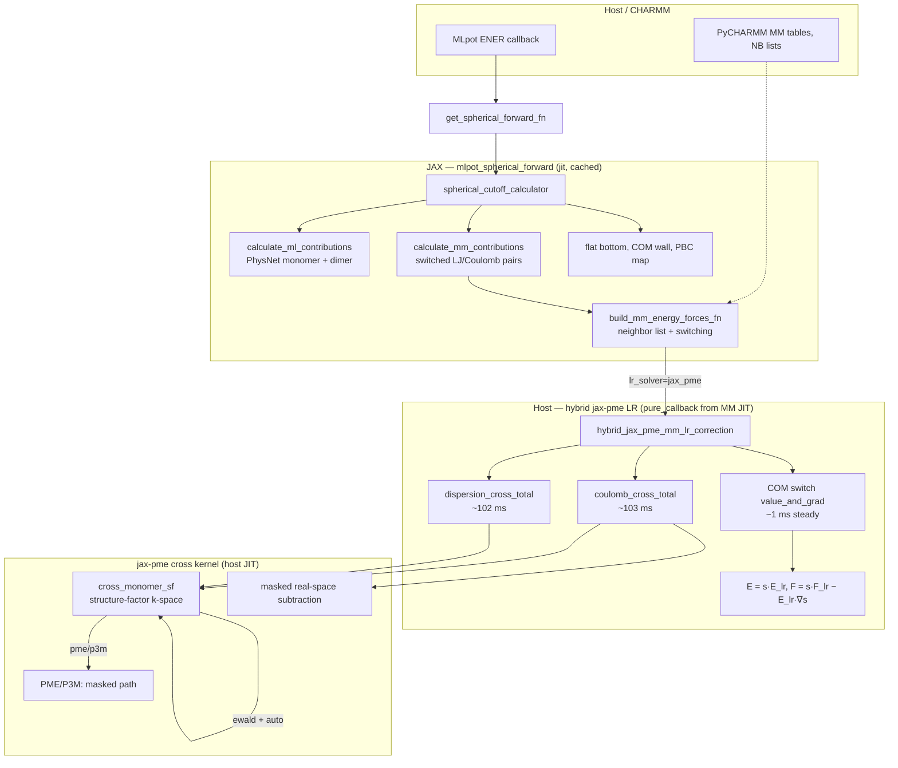
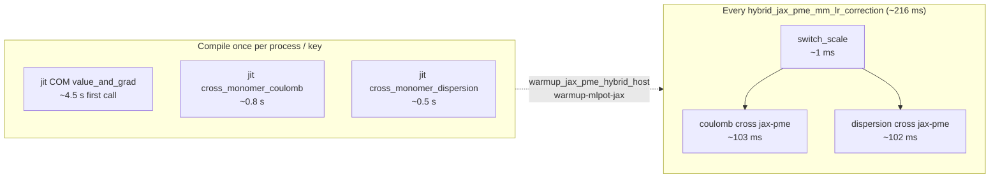
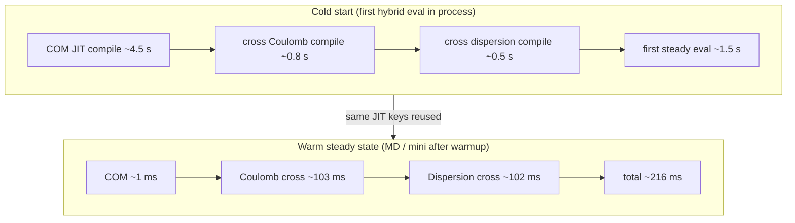
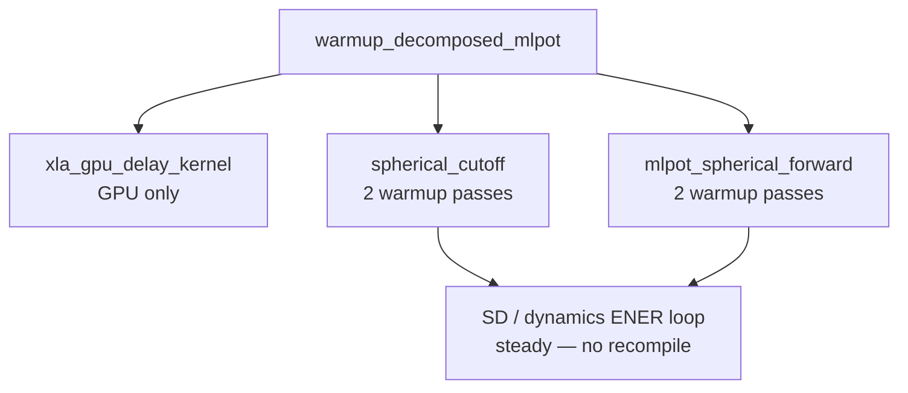

# Hybrid calculator profiling

Guide to measuring **JAX compile time** vs **steady-state run time** for the MMML hybrid calculator stack: MLpot PhysNet, switched MM pairs, jax-pme long-range corrections, and the CHARMM callback forward path.

No PyCHARMM is required for the jax-pme benchmarks. Full `md-system` mini/SD profiling needs a CHARMM-ready machine.

## Current state (2026-07)

Three layers of work landed; profiling numbers below are from
`tests/functionality/long_range/11_calculator_primitive_benchmark.py` on **CPU**,
**18 monomers × 3 atoms**, **Ewald**, `MMML_JAX_PME_INTRA_MODE=cross`, after COM-switch JIT fix.

### What is fast now (steady-state, per hybrid LR eval)

| Component | steady (ms) | Notes |
|-----------|-------------|-------|
| `cross_monomer_coulomb` | ~110 | Fused jax-pme cross kernel (Ewald SF path) |
| `cross_monomer_dispersion` | ~110 | Same kernel, exponent 6 |
| `switch_scale` (COM `value_and_grad`) | **~1** | JIT-cached; one call shared by Coulomb + dispersion |
| `hybrid_mm_lr_total_cross` | **~216** | ≈ 103 + 102 + 1 ms profile components |
| `cross_monomer_sf` (inner host slice) | ~0.5 | Sub-step of cross kernel; not a separate cost |

### What is slow once (first-call compile)

| Component | first compile (s) | Notes |
|-----------|-------------------|-------|
| COM switch `value_and_grad` | ~4.5 | `@lru_cache` + `jax.jit`; amortize via `warmup_jax_pme_hybrid_host` |
| `cross_monomer_*` kernels | ~0.5–0.8 each | Per exponent / JIT key |
| `hybrid_mm_lr_total_cross` (cold) | ~4.5 | Dominated by COM switch compile on first hybrid call |
| `spherical_cutoff` (full MLpot) | minutes on CPU | Pre-warm with `mmml warmup-mlpot-jax` on GPU box |

### Regressions fixed

| Issue | Before | After |
|-------|--------|-------|
| Uncached `jax.grad(mean_switch)` per LR eval | ~1.2 s × 2 ≈ **2.4 s** switch overhead | **~1 ms** |
| `float('nan')` in COM-switch `@lru_cache` key | Recompiled every call (~4.5 s each) | Cache hit after first call |
| Legacy `full_minus_intra` hybrid path | ~1.5–2× slower than fused `cross` at 18 mers | Use `cross` (default) |
| Duplicate `warmup_decomposed_mlpot` | Extra `spherical_cutoff` compile | `_jax_warmup_done` guard |

### Full primitive table (latest CPU benchmark)

Columns: `compile_s` and `run_s` from two-pass `run_jax_warmup_passes`; `steady_ms` mean of extra reps.

| name | category | compile_s | run_s | steady_ms |
|------|----------|-----------|-------|-----------|
| `jax_pme_coulomb_full` | jax_pme_host | 3.58 | 0.27 | 265 |
| `jax_pme_dispersion_full` | jax_pme_host | 1.11 | 0.26 | 304 |
| `jax_pme_coulomb_intra_m0` | jax_pme_host | 1.48 | 0.03 | 33 |
| `cross_monomer_coulomb` | jax_pme_cross | 0.83 | 0.11 | 111 |
| `cross_monomer_dispersion` | jax_pme_cross | 0.53 | 0.10 | 114 |
| `hybrid_mm_lr_total_cross` | hybrid_lr | 4.55 | 0.22 | **216** |
| `switch_scale` | hybrid_component | — | — | **0.8** |
| `coulomb_cross_total` | hybrid_component | — | — | 103 |
| `dispersion_cross_total` | hybrid_component | — | — | 102 |
| `hybrid_coulomb_total` | hybrid_component | — | — | 103 |
| `hybrid_dispersion_total` | hybrid_component | — | — | 102 |

Profile rows are **nested** (e.g. `hybrid_coulomb_total` ⊃ `coulomb_cross_total` ⊃ `cross_monomer_sf`). Do not sum hybrid component rows to get the total.

Reproduce:

```bash
JAX_PLATFORMS=cpu MMML_JAX_COMPILE_TIMERS=1 \
  uv run python tests/functionality/long_range/11_calculator_primitive_benchmark.py --steady-reps 3
```

---

## Computational graph

### End-to-end MLpot energy (production path)

Each MLpot `ENER` invokes a cached JAX forward that evaluates the full hybrid potential inside `spherical_cutoff_calculator`.



### Hybrid LR correction detail (cross mode, steady timings)



### Compile vs steady: what runs when



### Spherical cutoff (separate compile island)

`spherical_cutoff` wraps ML + MM + LR callback in one large `@jax.jit`. It is **not** recompiled each MD step if shapes, `CutoffParameters`, and device stay fixed.



Guards: `_jax_warmup_done`, `_forward_cache_key`, deferred GPU promote (`defer_jax_until_after_sd`).

---

## Primitive map (reference)

### JAX warmup labels (`MMML_JAX_COMPILE_TIMERS`)

These are recorded by `run_jax_warmup_passes` during `warmup_decomposed_mlpot` and related warmup:

| Label | What it compiles |
|-------|------------------|
| `xla_gpu_delay_kernel` | First GPU timing calibration (GPU only) |
| `spherical_cutoff` | Full hybrid `spherical_cutoff_calculator` (ML + MM + LR) |
| `mlpot_spherical_forward` | CHARMM-callback forward (`calc._get_spherical_forward_fn`) |
| `jax_pme_coulomb_full` | Full-box jax-pme Coulomb host evaluator |
| `jax_pme_dispersion_full` | Full-box r⁻⁶ dispersion |
| `jax_pme_coulomb_intra_m0` | Single-monomer Coulomb slice (legacy intra path) |
| `cross_monomer_coulomb` | Fused cross-monomer Coulomb kernel |
| `cross_monomer_dispersion` | Fused cross-monomer dispersion kernel |
| `hybrid_mm_lr_total_cross` | Combined hybrid LR correction (cross mode) |

**Compile vs run:** the first warmup pass is compile+run; the second pass is mostly run. MMML estimates `compile ≈ pass1 − pass2`, `run ≈ pass2`.

### Hybrid component labels (`MMML_JAX_PME_PROFILE`)

Steady-state host timings inside `hybrid_jax_pme_mm_lr_correction` (no per-component compile split):

| Label | Meaning |
|-------|---------|
| `hybrid_coulomb_total` | Coulomb correction block |
| `hybrid_dispersion_total` | r⁻⁶ dispersion correction block |
| `coulomb_cross_total` | Cross-monomer Coulomb (fused path) |
| `coulomb_full` | Full-box Coulomb (legacy) |
| `coulomb_intra` | Sum of monomer slices (legacy) |
| `dispersion_cross_total` | Cross-monomer dispersion (fused) |
| `dispersion_full` / `dispersion_intra` | Legacy dispersion pieces |
| `switch_scale` | COM switching scale + chain-rule setup |
| `cross_monomer_sf` | Structure-factor k-space kernel |
| `cross_monomer_masked` | Masked mesh kernel (PME/P3M cross path) |

### MLpot callback split (`MMML_MLPOT_PROFILE`)

On full `md-system` runs, logs time between MLpot Python callback entry and CHARMM `ENER` return — useful for spotting CHARMM vs JAX overhead outside the kernels above.

## Environment variables

| Variable | Purpose |
|----------|---------|
| `MMML_JAX_COMPILE_TIMERS=1` | Per-label compile/run warmup table |
| `MMML_JAX_PME_PROFILE=1` | jax-pme component means at exit; `per_call` logs each call |
| `MMML_MLPOT_PROFILE=1` | MLpot callback timing |
| `JAX_COMPILATION_CACHE_DIR` | Persistent XLA cache across processes |
| `MMML_JAX_PME_INTRA_MODE` | `cross` (default) or `full_minus_intra` |
| `MMML_JAX_PME_CROSS_KERNEL` | `auto`, `structure_factor`, `masked` |
| `JAX_PLATFORMS=cpu` | CPU-only benchmarks (agent / CI friendly) |

`MMML_MLPOT_PROFILE=1` also enables JAX compile timers.

## Benchmark script (recommended first step)

[`tests/functionality/long_range/11_calculator_primitive_benchmark.py`](https://github.com/EricBoittier/mmml/blob/main/tests/functionality/long_range/11_calculator_primitive_benchmark.py) times all jax-pme host primitives and hybrid sub-components on a synthetic cluster, and optionally runs full MLpot warmup when a checkpoint is provided.

```bash
# jax-pme + hybrid primitives (CPU)
JAX_PLATFORMS=cpu MMML_JAX_COMPILE_TIMERS=1 \
  uv run python tests/functionality/long_range/11_calculator_primitive_benchmark.py

# Include legacy full_minus_intra comparison
JAX_PLATFORMS=cpu uv run python tests/functionality/long_range/11_calculator_primitive_benchmark.py \
  --legacy-intra

# Add MLpot spherical_cutoff + mlpot_spherical_forward (needs checkpoint; slow on CPU)
JAX_PLATFORMS=cpu uv run python tests/functionality/long_range/11_calculator_primitive_benchmark.py \
  --checkpoint examples/ckpts_json/DESdimers_params.json \
  --n-monomers 12 --json artifacts/calculator_primitive_benchmark.json
```

Do not pipe through `tail` — output is buffered and long CPU compiles look hung. For MLpot warmup only, use `mmml warmup-mlpot-jax` instead.

Output columns: `compile_s`, `run_s` (from two-pass warmup), `steady_ms` (mean of extra reps).

See [Current state](#current-state-2026-07) for the latest benchmark table and graphs.

### COM switch compile footgun (fixed)

`_scale_lr_with_com_switch` used uncached `jax.grad(mean_switch)` on every hybrid LR eval. Fix:

1. **`jax.jit(jax.value_and_grad(mean_switch))`** cached by monomer offsets + switch parameters (`_cached_com_switch_value_and_grad_fn`).
2. **One** COM `value_and_grad` per `hybrid_jax_pme_mm_lr_correction` (shared by Coulomb + dispersion).
3. Cache key uses `mm_r_min=None`, **not** `float('nan')` — `NaN != NaN` broke `@lru_cache` and recompiled every call.

Warmup: `warmup_jax_pme_hybrid_host` JIT-warms COM switch (`counts["com_switch_jit"]`).

### Spherical cutoff compile footguns

| Issue | Mitigation |
|-------|------------|
| Duplicate `warmup_decomposed_mlpot` | `_jax_warmup_done` on `DecomposedMlpotModel` |
| CPU `_finalize_jax_factory` then GPU promote | `defer_jax_until_after_sd` + skip CPU finalize when deferring |
| New `_get_spherical_forward_fn` every eval | `_forward_cache_key` caches `jit` wrapper on model |
| `CutoffParameters` / dtype / box changes | Keep static args stable across mini legs; see [md-system-configs](md-system-configs.md#jax--setup_calculator-compile-churn) |
| First `spherical_cutoff` compile | `mmml warmup-mlpot-jax` or `warmup_decomposed_mlpot` once before timed MD |

`spherical_cutoff_calculator` itself is `@jax.jit(static_argnames=[...])` — cost is **one** large XLA compile per distinct shape/cutoff key, not per MD step.

## Profiling scripts

| Script | Scope |
|--------|-------|
| `11_calculator_primitive_benchmark.py` | All jax-pme primitives + hybrid components (+ optional MLpot) |
| `10_hybrid_jax_profile.py` | cProfile / JAX trace on hybrid LR only |
| `09_jax_pme_cross_validate.py` | Correctness + cross vs legacy speedup |
| `08_benchmark_jax_pme_hybrid.py` | Method sweep (ewald/pme/p3m) |
| `tests/functionality/mlpot/10_spatial_mpi_cpu_profile.py` | Full `md-system` cProfile MPI sweep |

## cProfile (Python hot path)

```bash
python -m cProfile -o md.prof -m mmml.cli md-system --config your.yaml
python -c "import pstats; p=pstats.Stats('md.prof'); p.sort_stats('cumulative'); p.print_stats(40)"
```

Or use `10_hybrid_jax_profile.py --cprofile` for jax-pme-only runs without CHARMM.

## JAX device trace (TensorBoard)

```bash
JAX_PLATFORMS=cpu uv run python tests/functionality/long_range/10_hybrid_jax_profile.py \
  --jax-trace /tmp/jax_trace_hybrid --intra-mode cross --reps 8
tensorboard --logdir /tmp/jax_trace_hybrid
```

On GPU production runs, wrap steady-state dynamics steps the same way (`jax.profiler.start_trace` / `stop_trace`). See also [`mlpot/README.md`](https://github.com/EricBoittier/mmml/blob/main/mmml/interfaces/pycharmmInterface/mlpot/README.md).

## Pre-warm without CHARMM

```bash
mmml warmup-mlpot-jax --checkpoint /path/to/params.json \
  --composition DCM:60 --box-side 32
```

Logs the same `spherical_cutoff` and `mlpot_spherical_forward` compile timer lines as production warmup.

## Full mini / SD pipeline

On a CHARMM-ready host:

```bash
export MMML_MLPOT_PROFILE=1 MMML_JAX_COMPILE_TIMERS=1 MMML_JAX_PME_PROFILE=1
./scripts/mmml-charmm-mpirun.sh python -m cProfile -o md_system.prof -m mmml.cli \
  md-system --config md_system.yaml --mlpot-profile
```

**Compile churn tips** (see [md-system-configs](md-system-configs.md#jax--setup_calculator-compile-churn)):

- Do not change `MMML_JAX_PME_INTRA_MODE`, `ml_compute_dtype`, or cutoffs between mini legs.
- `calculator_pre_minimize` + deferred JAX avoids duplicate CPU→GPU recompiles.
- Set `JAX_COMPILATION_CACHE_DIR` for repeatable cold-start measurements.

## API helpers

```python
from mmml.utils.jax_gpu_warmup import summarize_jax_compile_timers, reset_jax_compile_timers
from mmml.interfaces.pycharmmInterface.jax_pme_hybrid_coulomb import consume_hybrid_jax_pme_profile
from mmml.interfaces.pycharmmInterface.jax_pme_cross_monomer import consume_cross_monomer_profile
```

Reset timers before a benchmark block, run warmup passes, then read summaries.
