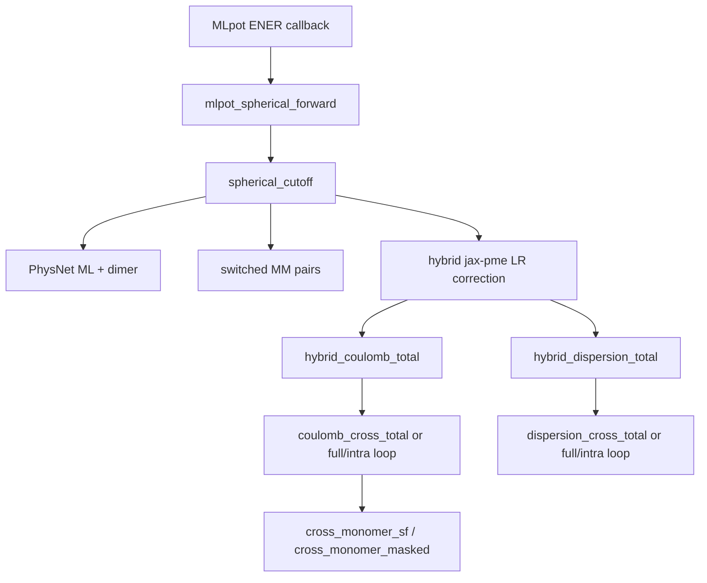

# Hybrid calculator profiling

Guide to measuring **JAX compile time** vs **steady-state run time** for the MMML hybrid calculator stack: MLpot PhysNet, switched MM pairs, jax-pme long-range corrections, and the CHARMM callback forward path.

No PyCHARMM is required for the jax-pme benchmarks. Full `md-system` mini/SD profiling needs a CHARMM-ready machine.

## Primitive map

The hybrid energy evaluated on each MLpot `ENER` callback decomposes roughly as:



### JAX warmup labels (`MMML_JAX_COMPILE_TIMERS`)

These are recorded by `run_jax_warmup_passes` during `warmup_decomposed_mlpot` and related warmup:

| Label | What it compiles |
|-------|------------------|
| `xla_gpu_delay_kernel` | First GPU timing calibration (GPU only) |
| `spherical_cutoff` | Full hybrid `spherical_cutoff_calculator` (ML + MM + LR) |
| `mlpot_spherical_forward` | CHARMM-callback forward (`calc._get_spherical_forward_fn`) |
| `jax_pme_coulomb_full` | Full-box jax-pme Coulomb host evaluator |
| `jax_pme_dispersion_full` | Full-box r⁻⁶ dispersion |
| `jax_pme_coulomb_intra_m0` | Single-monomer Coulomb slice (legacy intra path) |
| `cross_monomer_coulomb` | Fused cross-monomer Coulomb kernel |
| `cross_monomer_dispersion` | Fused cross-monomer dispersion kernel |
| `hybrid_mm_lr_total_cross` | Combined hybrid LR correction (cross mode) |

**Compile vs run:** the first warmup pass is compile+run; the second pass is mostly run. MMML estimates `compile ≈ pass1 − pass2`, `run ≈ pass2`.

### Hybrid component labels (`MMML_JAX_PME_PROFILE`)

Steady-state host timings inside `hybrid_jax_pme_mm_lr_correction` (no per-component compile split):

| Label | Meaning |
|-------|---------|
| `hybrid_coulomb_total` | Coulomb correction block |
| `hybrid_dispersion_total` | r⁻⁶ dispersion correction block |
| `coulomb_cross_total` | Cross-monomer Coulomb (fused path) |
| `coulomb_full` | Full-box Coulomb (legacy) |
| `coulomb_intra` | Sum of monomer slices (legacy) |
| `dispersion_cross_total` | Cross-monomer dispersion (fused) |
| `dispersion_full` / `dispersion_intra` | Legacy dispersion pieces |
| `switch_scale` | COM switching scale + chain-rule setup |
| `cross_monomer_sf` | Structure-factor k-space kernel |
| `cross_monomer_masked` | Masked mesh kernel (PME/P3M cross path) |

### MLpot callback split (`MMML_MLPOT_PROFILE`)

On full `md-system` runs, logs time between MLpot Python callback entry and CHARMM `ENER` return — useful for spotting CHARMM vs JAX overhead outside the kernels above.

## Environment variables

| Variable | Purpose |
|----------|---------|
| `MMML_JAX_COMPILE_TIMERS=1` | Per-label compile/run warmup table |
| `MMML_JAX_PME_PROFILE=1` | jax-pme component means at exit; `per_call` logs each call |
| `MMML_MLPOT_PROFILE=1` | MLpot callback timing |
| `JAX_COMPILATION_CACHE_DIR` | Persistent XLA cache across processes |
| `MMML_JAX_PME_INTRA_MODE` | `cross` (default) or `full_minus_intra` |
| `MMML_JAX_PME_CROSS_KERNEL` | `auto`, `structure_factor`, `masked` |
| `JAX_PLATFORMS=cpu` | CPU-only benchmarks (agent / CI friendly) |

`MMML_MLPOT_PROFILE=1` also enables JAX compile timers.

## Benchmark script (recommended first step)

[`tests/functionality/long_range/11_calculator_primitive_benchmark.py`](https://github.com/EricBoittier/mmml/blob/main/tests/functionality/long_range/11_calculator_primitive_benchmark.py) times all jax-pme host primitives and hybrid sub-components on a synthetic cluster, and optionally runs full MLpot warmup when a checkpoint is provided.

```bash
# jax-pme + hybrid primitives (CPU)
JAX_PLATFORMS=cpu MMML_JAX_COMPILE_TIMERS=1 \
  uv run python tests/functionality/long_range/11_calculator_primitive_benchmark.py

# Include legacy full_minus_intra comparison
JAX_PLATFORMS=cpu uv run python tests/functionality/long_range/11_calculator_primitive_benchmark.py \
  --legacy-intra

# Add MLpot spherical_cutoff + mlpot_spherical_forward (needs checkpoint; slow on CPU)
JAX_PLATFORMS=cpu uv run python tests/functionality/long_range/11_calculator_primitive_benchmark.py \
  --checkpoint examples/ckpts_json/DESdimers_params.json \
  --n-monomers 12 --json artifacts/calculator_primitive_benchmark.json
```

Do not pipe through `tail` — output is buffered and long CPU compiles look hung. For MLpot warmup only, use `mmml warmup-mlpot-jax` instead.

Output columns: `compile_s`, `run_s` (from two-pass warmup), `steady_ms` (mean of extra reps).

### Example snapshot (CPU, 18×3 cluster, Ewald, cross mode)

Run locally; numbers vary by CPU/GPU and jax-pme version. Representative order of magnitude from validation runs:

| Primitive | compile (s) | run (s) | steady (ms) |
|-----------|-------------|---------|-------------|
| `jax_pme_coulomb_full` | ~2–5 | ~0.05 | ~50 |
| `cross_monomer_coulomb` | ~2–4 | ~0.05 | ~52 |
| `hybrid_mm_lr_total_cross` | ~5–10 | ~0.1 | ~270 |
| `hybrid_coulomb_total` | — | — | ~120 |
| `coulomb_cross_total` | — | — | ~55 |

Legacy `full_minus_intra` hybrid totals are typically **~1.5–2×** slower steady-state than fused `cross` at 18 monomers.

## Profiling scripts

| Script | Scope |
|--------|-------|
| `11_calculator_primitive_benchmark.py` | All jax-pme primitives + hybrid components (+ optional MLpot) |
| `10_hybrid_jax_profile.py` | cProfile / JAX trace on hybrid LR only |
| `09_jax_pme_cross_validate.py` | Correctness + cross vs legacy speedup |
| `08_benchmark_jax_pme_hybrid.py` | Method sweep (ewald/pme/p3m) |
| `tests/functionality/mlpot/10_spatial_mpi_cpu_profile.py` | Full `md-system` cProfile MPI sweep |

## cProfile (Python hot path)

```bash
python -m cProfile -o md.prof -m mmml.cli md-system --config your.yaml
python -c "import pstats; p=pstats.Stats('md.prof'); p.sort_stats('cumulative'); p.print_stats(40)"
```

Or use `10_hybrid_jax_profile.py --cprofile` for jax-pme-only runs without CHARMM.

## JAX device trace (TensorBoard)

```bash
JAX_PLATFORMS=cpu uv run python tests/functionality/long_range/10_hybrid_jax_profile.py \
  --jax-trace /tmp/jax_trace_hybrid --intra-mode cross --reps 8
tensorboard --logdir /tmp/jax_trace_hybrid
```

On GPU production runs, wrap steady-state dynamics steps the same way (`jax.profiler.start_trace` / `stop_trace`). See also [`mlpot/README.md`](../mmml/interfaces/pycharmmInterface/mlpot/README.md).

## Pre-warm without CHARMM

```bash
mmml warmup-mlpot-jax --checkpoint /path/to/params.json \
  --composition DCM:60 --box-side 32
```

Logs the same `spherical_cutoff` and `mlpot_spherical_forward` compile timer lines as production warmup.

## Full mini / SD pipeline

On a CHARMM-ready host:

```bash
export MMML_MLPOT_PROFILE=1 MMML_JAX_COMPILE_TIMERS=1 MMML_JAX_PME_PROFILE=1
./scripts/mmml-charmm-mpirun.sh python -m cProfile -o md_system.prof -m mmml.cli \
  md-system --config md_system.yaml --mlpot-profile
```

**Compile churn tips** (see [md-system-configs](md-system-configs.md#jax--setup_calculator-compile-churn)):

- Do not change `MMML_JAX_PME_INTRA_MODE`, `ml_compute_dtype`, or cutoffs between mini legs.
- `calculator_pre_minimize` + deferred JAX avoids duplicate CPU→GPU recompiles.
- Set `JAX_COMPILATION_CACHE_DIR` for repeatable cold-start measurements.

## API helpers

```python
from mmml.utils.jax_gpu_warmup import summarize_jax_compile_timers, reset_jax_compile_timers
from mmml.interfaces.pycharmmInterface.jax_pme_hybrid_coulomb import consume_hybrid_jax_pme_profile
from mmml.interfaces.pycharmmInterface.jax_pme_cross_monomer import consume_cross_monomer_profile
```

Reset timers before a benchmark block, run warmup passes, then read summaries.
