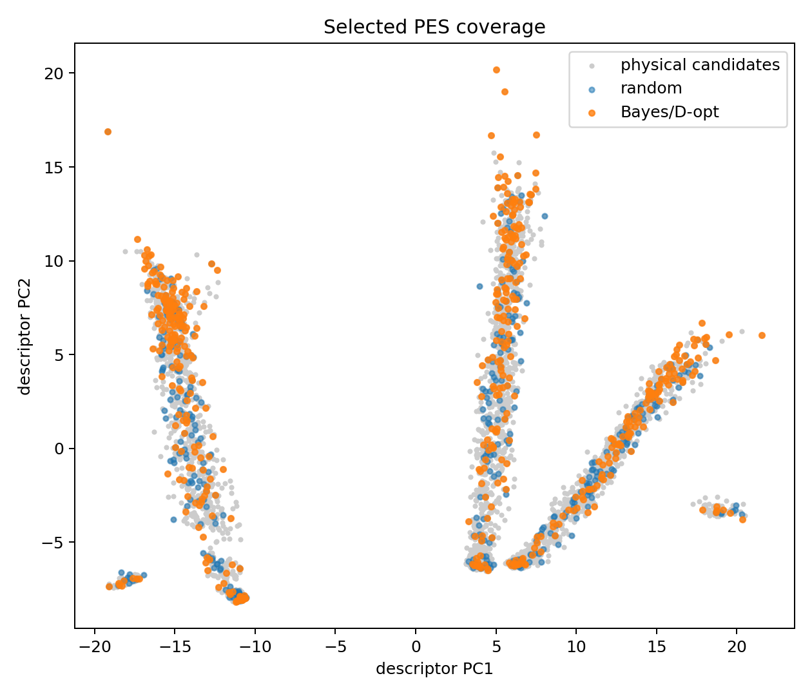

# `mmml active-learning`

Sample structures for re-labeling.


## Usage

```bash
mmml active-learning --help
```

## Options

```text
usage: mmml active-learning [-h] -i TRAJ [TRAJ ...] [-o OUTPUT] [--max-temp K]
                            [--stride STRIDE] [--max-frames N]
                            [--no-temp-filter]

Extract frames from MD trajectories for active learning (pyscf-evaluate input).

Input & configuration:
  -i, --input TRAJ [TRAJ ...]
                        Trajectory file(s) (.traj, .xyz). Globs supported, e.g.
                        'out/*.traj'

Output & artifacts:
  -o, --output OUTPUT   Output NPZ path (default: md_sampled.npz)

Diagnostics & safety:
  -h, --help            show this help message and exit

Other options:
  --max-temp K          Keep only frames with T < max-temp K (default: 300).
                        Ignored if trajectories have no velocities.
  --stride STRIDE       Use every Nth frame (default: 1)
  --max-frames N        Maximum frames to extract (default: no limit)
  --no-temp-filter      Do not filter by temperature (keep all frames)

CLI to extract frames from MD trajectories for active learning. Filters frames
by temperature (e.g. T < 300 K) and saves to NPZ format compatible with mmml
pyscf-evaluate for extending the training set. Usage: mmml active-learning -i
out/physnet_md/physnet_ase.traj -o md_sampled.npz mmml active-learning -i
traj1.traj traj2.traj -o md_sampled.npz --max-temp 300 mmml active-learning -i
"out/*.traj" -o md_sampled.npz --stride 5
```

## Visual examples




---

[← CLI overview](../index.md) · [All commands](../index.md#command-index)
