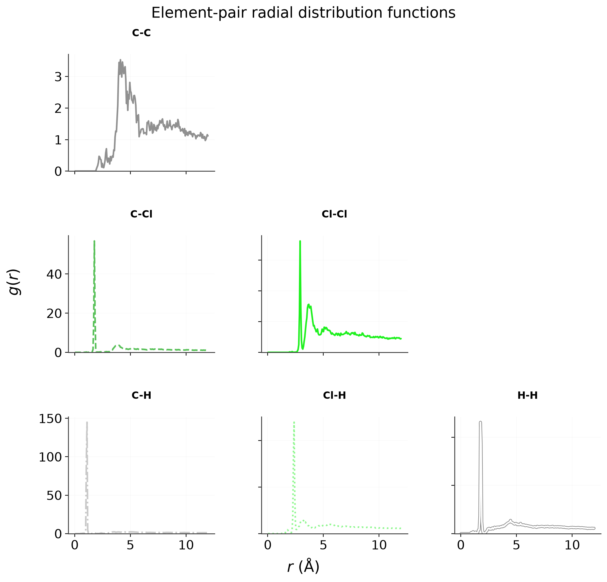

# `mmml analyze-liquid`

Neat-liquid MD analysis (density, RDF, MSD, plots).


## Usage

```bash
mmml analyze-liquid --help
```

## Options

```text
usage: mmml analyze-liquid [-h] (--campaign-dir CAMPAIGN_DIR | --h5 H5)
                           -o OUTPUT_DIR [--box-size BOX_SIZE]
                           [--solvent SOLVENT] [--prefer-run PREFER_RUN]
                           [--stride STRIDE] [--max-frames MAX_FRAMES]
                           [--r-max R_MAX] [--no-plots]

Analyze neat-liquid jaxmd / campaign trajectories (density, RDF, MSD, plots).
Examples: mmml analyze-liquid --campaign-dir artifacts/lj_scales/liquid_dcm -o
analysis/ mmml analyze-liquid --h5 path/to/pbc_nvt_jaxmd_nvt.h5 --box-size 30
--solvent DCM -o out/

Output & artifacts:
  -o, --output-dir OUTPUT_DIR
                        Directory for metrics.json and PNG plots
  --no-plots            Write metrics.json only (skip matplotlib PNGs)

Diagnostics & safety:
  -h, --help            show this help message and exit

Other options:
  --campaign-dir CAMPAIGN_DIR
                        Campaign output root (searches for jaxmd *.h5, prefers
                        jaxmd_nvt)
  --h5 H5               Single jaxmd HDF5 trajectory
  --box-size BOX_SIZE   Cubic box side (Å)
  --solvent SOLVENT     Neat solvent residue (DCM, ACO, …) for MW / atoms-per-
                        monomer
  --prefer-run PREFER_RUN
                        Campaign run id substring preferred when choosing an
                        HDF5
  --stride STRIDE       Frame stride
  --max-frames MAX_FRAMES
                        Analyze at most this many frames (tail of trajectory)
  --r-max R_MAX         RDF cutoff (Å)
```

## Visual examples




## Related docs

- [Liquid box workflow](../../liquid-box-workflow.md)
- [Plotting style guide](../../plotting-style-guide.md)

---

[← CLI overview](../index.md) · [All commands](../index.md#command-index)
