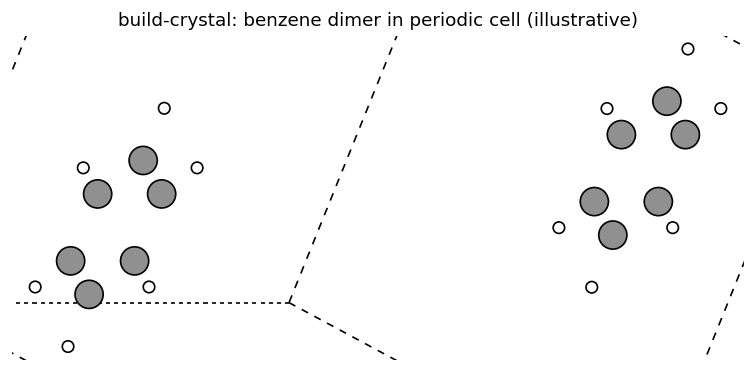

# `mmml build-crystal`

Symmetry-aware crystals (PyXtal).


## Usage

```bash
mmml build-crystal --help
```

## Options

```text
usage: mmml build-crystal [-h] -m SPEC [--stoichiometry Z [Z ...]]
                          [--z Z_VALUES [Z_VALUES ...]] [--dim {0,1,2,3}]
                          [--spg SPACE_GROUP] [--factor FACTOR] [--seed SEED]
                          [--attempts ATTEMPTS] [--no-resort]
                          [--supercell NX,NY,NZ] -o OUTPUT
                          [--format OUT_FORMAT] [--optimize]
                          [--optimizer {bfgs,fire,lbfgs}] [--fmax FMAX]
                          [--max-opt-steps MAX_OPT_STEPS] [--fix-cell] [--emt]
                          [--quiet-opt]

Build molecular crystals with PyXtal (space-group symmetry) and export ASE-
compatible structures for optimization or MMML handoff.

options:
  -h, --help            show this help message and exit
  -m, --molecule SPEC   Molecule specification (repeat for multi-component
                        crystals): XYZ/CIF path, SMILES, or chemical formula
                        understood by PyXtal (default: None)
  --stoichiometry Z [Z ...]
                        Formula units per molecule species (same order as
                        --molecule) (default: None)
  --z Z_VALUES [Z_VALUES ...]
                        Alias for stoichiometry; one value repeats for all
                        molecules (default: None)
  --dim {0,1,2,3}       Crystal dimensionality (0=cluster, 3=3D periodic)
                        (default: 3)
  --spg, --space-group SPACE_GROUP
                        International space-group number (default: 14)
  --factor FACTOR       PyXtal volume factor passed to from_random (default:
                        1.0)
  --seed SEED           RNG seed for reproducible PyXtal trials (default:
                        None)
  --attempts ATTEMPTS   Maximum PyXtal from_random retries (default: 20)
  --no-resort           Keep PyXtal atom order in ASE export (to_ase
                        resort=False) (default: False)
  --supercell NX,NY,NZ  Build supercell after generation (e.g. 2,2,2)
                        (default: None)
  -o, --output OUTPUT   Output path (.xyz, .extxyz, .cif, or .npz) (default:
                        None)
  --format OUT_FORMAT   ASE output format override (default: inferred from
                        --output suffix) (default: None)

ASE optimization (optional):
  --optimize            Relax structure with ASE after PyXtal generation
                        (default: False)
  --optimizer {bfgs,fire,lbfgs}
                        ASE optimizer when --optimize is set (default: bfgs)
  --fmax FMAX           ASE force convergence (eV/Å) (default: 0.05)
  --max-opt-steps MAX_OPT_STEPS
                        Maximum ASE optimizer steps (default: 200)
  --fix-cell            Document intent to keep the unit cell fixed
                        (positions-only relaxation) (default: False)
  --emt                 Use ASE EMT calculator for --optimize (smoke tests
                        only) (default: False)
  --quiet-opt           Suppress ASE optimizer log output (default: False)
```

## Example structures



More detail: [Structure building guide](../structure-building.md).

## Related docs

- [Structure building guide](../structure-building.md)

---

[← CLI overview](../index.md) · [All commands](../index.md#command-index)
