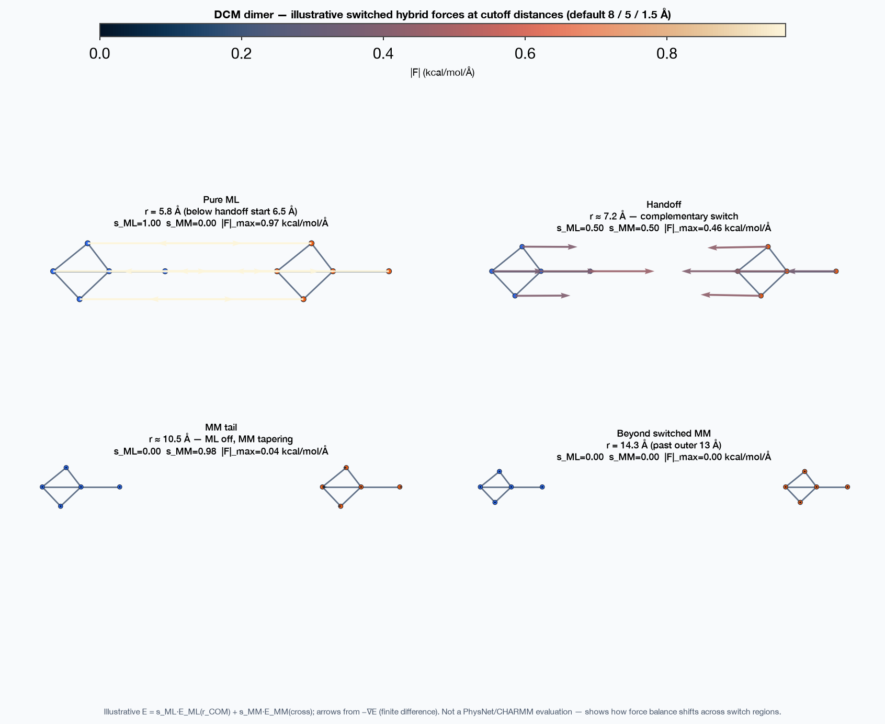

# `mmml dimer-scan`

Reproducible rigid 1D dimer energy/force scan.


## Usage

```bash
mmml dimer-scan --help
```

## Options

```text
usage: mmml dimer-scan [-h] [--config CONFIG]
                       [--calculator {physnet,spookynet,mbd,multipoles,efield,kernnn,xtb,dftb3-d4,pyscf}]
                       [--checkpoint CHECKPOINT]
                       [--calculator-config CALCULATOR_CONFIG] [--method METHOD]
                       [--basis BASIS] [--xc XC] [--electric-field EX EY EZ]
                       [--slako-dir SLAKO_DIR]
                       [--calculator-workdir CALCULATOR_WORKDIR]
                       [--calculator-executable CALCULATOR_EXECUTABLE]
                       [--multipole-force-step ANGSTROM]
                       [--distance START:STOP:STEP]
                       [--energy-definition {interaction,total}]
                       [--charge CHARGE] [--spin SPIN] [--seed SEED]
                       [--allow-partial] [--overwrite] --output OUTPUT
                       [RESIDUE ...]

Run a reproducible rigid 1D dimer energy/force scan.

positional arguments:
  RESIDUE               One residue for a homodimer or two for a heterodimer.
                        Accepts campaign labels (DCM, ACE, BENZ, TIP3, MEOH) or
                        any CGenFF RESI name (e.g. ACO, CYBZ); non-campaign
                        pairs use a generic centroid–centroid orientation.

Input & configuration:
  --config CONFIG       YAML/JSON DimerScanConfig; command-line output/failure
                        flags remain available
  --checkpoint CHECKPOINT
                        Model checkpoint/parameter path
  --calculator-config CALCULATOR_CONFIG
                        Calculator model config JSON
  --slako-dir SLAKO_DIR
                        DFTB+ 3ob-3-1 directory
  --calculator-executable CALCULATOR_EXECUTABLE
                        External calculator executable

Scientific model:
  --calculator {physnet,spookynet,mbd,multipoles,efield,kernnn,xtb,dftb3-d4,pyscf}
                        Explicit ASE calculator type
  --method METHOD       Calculator method (for example pyscf: dft or hf)
  --basis BASIS         PySCF basis (default: def2-svp)
  --xc XC               PySCF DFT functional (default: pbe0)
  --electric-field EX EY EZ
                        EField vector in atomic units
  --multipole-force-step ANGSTROM
                        Central finite-difference step for learned-multipole
                        forces
  --distance START:STOP:STEP
                        Inclusive distance grid in angstrom (default:
                        2.5:6.0:0.1)
  --energy-definition {interaction,total}
  --charge CHARGE
  --spin SPIN           Spin multiplicity for calculators that require it

Execution:
  --seed SEED

Output & artifacts:
  --calculator-workdir CALCULATOR_WORKDIR
                        External calculator scratch directory
  --overwrite
  --output OUTPUT

Diagnostics & safety:
  -h, --help            show this help message and exit
  --allow-partial
```

## Visual examples



## Related docs

- [1D dimer scan design](../../dimer-scan-design.md)
- [Scientific code policy](../../scientific-code.md)

---

[← CLI overview](../index.md) · [All commands](../index.md#command-index)
