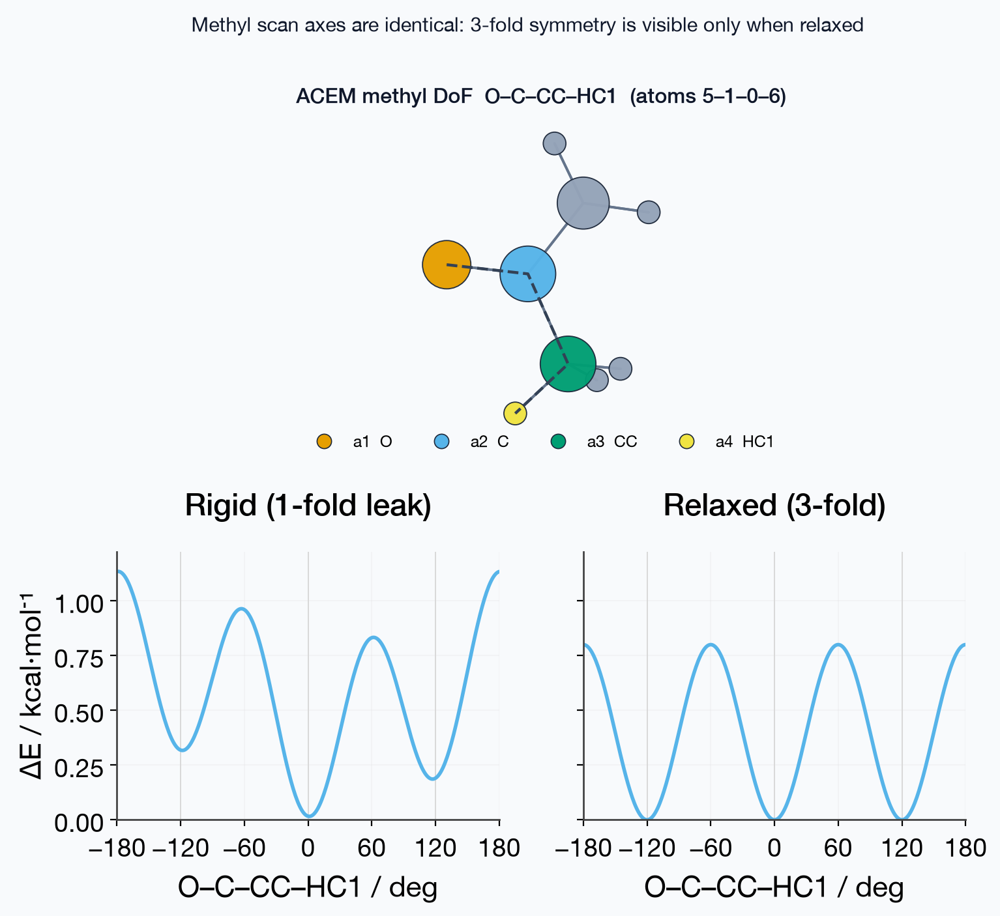

# `mmml ic-scan`

Bond/angle/dihedral scans (1D or N-D) for QM/ML.


Set `geometry_mode: constrained-relax` in the YAML for a relaxed scan (active
torsions held with ASE `FixInternals`, other coordinates FIRE- or
BFGS-minimized). That mode needs `evaluate: energy` and cannot be combined with
`--prepare-only`.

```bash
mmml ic-scan \
  --config examples/ic_scan/acem_dihedrals_relaxed.yaml \
  --output artifacts/ic_scan/acem_xtb_relaxed \
  --overwrite
```

## Usage

```bash
mmml ic-scan --help
```

## Options

```text
usage: mmml ic-scan [-h] --config CONFIG [--prepare-only] [--allow-partial]
                    [--overwrite] --output OUTPUT

Prepare and optionally evaluate bond/angle/dihedral scans from a config that
defines DoFs, grids, and 1D or N-D scan combinations.

Input & configuration:
  --config CONFIG  YAML/JSON IcScanConfig (structure, dofs, scan_mode/scans,
                   calculator)

Output & artifacts:
  --overwrite
  --output OUTPUT

Diagnostics & safety:
  -h, --help       show this help message and exit
  --allow-partial  Exit 0 even if some energy evaluations fail

Other options:
  --prepare-only   Write geometries without energy evaluation (overrides
                   evaluate)
```

## Visual examples




## Related docs

- [Internal-coordinate scan design](../../ic-scan-design.md)
- [Scientific code policy](../../scientific-code.md)

---

[← CLI overview](../index.md) · [All commands](../index.md#command-index)
