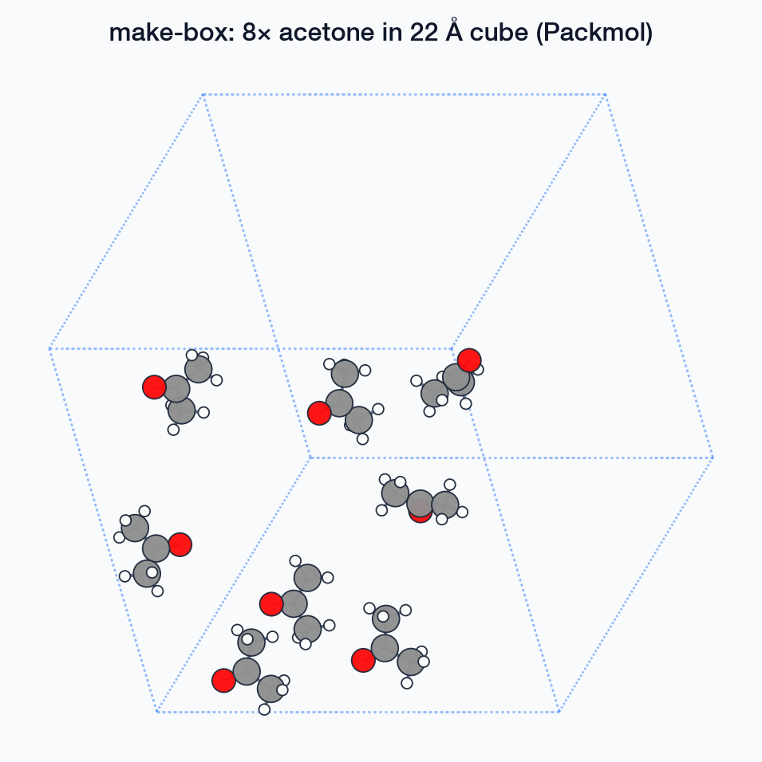

# `mmml make-box`

Pack molecules into a periodic box with **Packmol** + PyCHARMM.

## Usage

```bash
mmml make-box --help
```

## Options

```text
usage: mmml make-box [-h] [--n N] [--res RES] [--side_length SIDE_LENGTH]
                     [--pdb PDB] [--solvent SOLVENT] [--density DENSITY]

options:
  -h, --help            show this help message and exit
  --n N                 Number of solute molecules
  --res RES             CGENFF residue name (run make-res first)
  --side_length SIDE_LENGTH
                        Cubic cell edge length (Å)
  --pdb PDB             Input monomer PDB (default: pdb/<res>.pdb)
  --solvent SOLVENT     Optional solvent residue (e.g. TIP3)
  --density DENSITY     Target density hint (g/cm³) for sizing
```

## Examples

### Acetone liquid box

```bash
mmml make-res --res ACO --skip-energy-show
mmml make-box --res ACO --n 50 --side_length 25.0
```

Packmol writes `pdb/init-packmol.pdb`; PyCHARMM builds PSF, applies PBC, and minimizes contacts.

### DCM periodic box

```bash
mmml make-res --res DCM --skip-energy-show
mmml make-box --res DCM --n 80 --side_length 30.0
```

### With explicit water

```bash
mmml make-box --res ACO --n 40 --side_length 28.0 --solvent TIP3 --density 0.79
```

## Multi-residue / campaign builds

`make-box` packs one residue type. For `DCM:60,ACO:20` or density-targeted liquids, use:

```bash
mmml liquid-box --composition DCM:206 --target-density-g-cm3 1.326 --output-dir boxes/dcm206
# or
mmml md-system --composition "DCM:40,ACO:20" --box-size 32.0 ...
```

See [Packmol placement](../../packmol-placement.md).

## Example structures



More detail: [Structure building guide](../structure-building.md).

## Related docs

- [Packmol placement](../../packmol-placement.md)
- [Structure building guide](../structure-building.md)
- [Liquid box workflow](../../liquid-box-workflow.md)

---

[← CLI overview](../index.md) · [All commands](../index.md#command-index)
