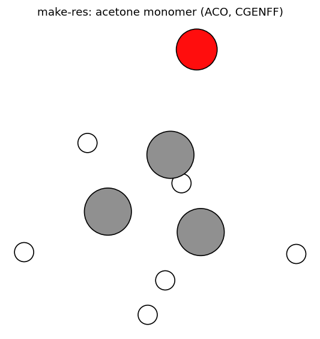

# `mmml make-res`

CGENFF residue → PDB/PSF/topology.


## Usage

```bash
mmml make-res --help
```

## Options

```text
usage: mmml make-res [-h] [--res RES] [--list-residues] [--no-pager]
                     [--skip-energy-show]

Generate a CGENFF residue (PDB, PSF, topology) via PyCHARMM.

options:
  -h, --help          show this help message and exit
  --res RES           CGENFF residue name (RESI in top_all36_cgenff.rtf), e.g.
                      ACO, CYBZ, TIP3.
  --list-residues     List valid CGENFF residue names and descriptions (opens
                      less on a TTY).
  --no-pager          With --list-residues, print the table to stdout instead
                      of piping to less.
  --skip-energy-show  Skip the final CHARMM energy.show() (avoids segfault on
                      some clusters/SLURM).

Examples:
  mmml make-res --list-residues
  mmml make-res --list-residues --no-pager | grep -i acetone
  mmml make-res --res ACO
```

## Example structures



More detail: [Structure building guide](../structure-building.md).

## Related docs

- [Structure building guide](../structure-building.md)

---

[← CLI overview](../index.md) · [All commands](../index.md#command-index)
