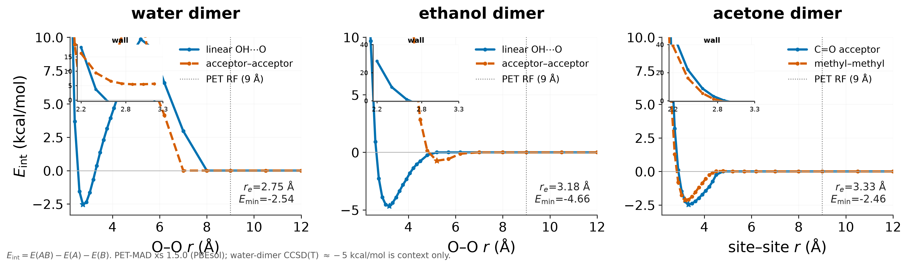
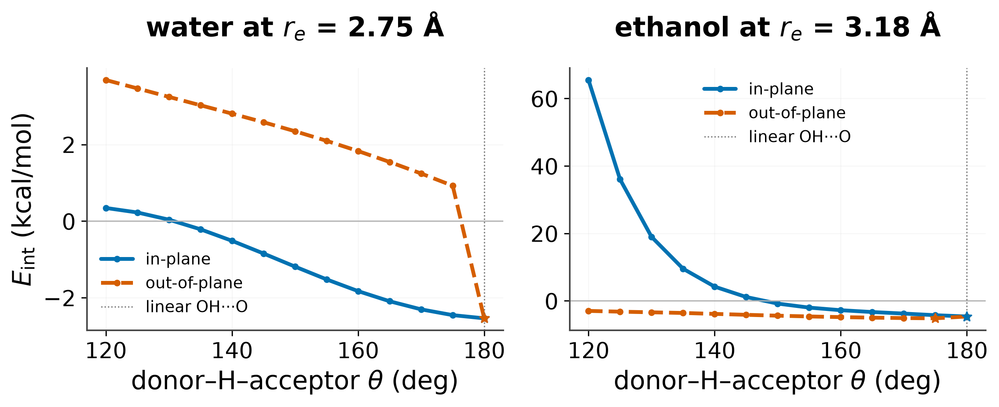
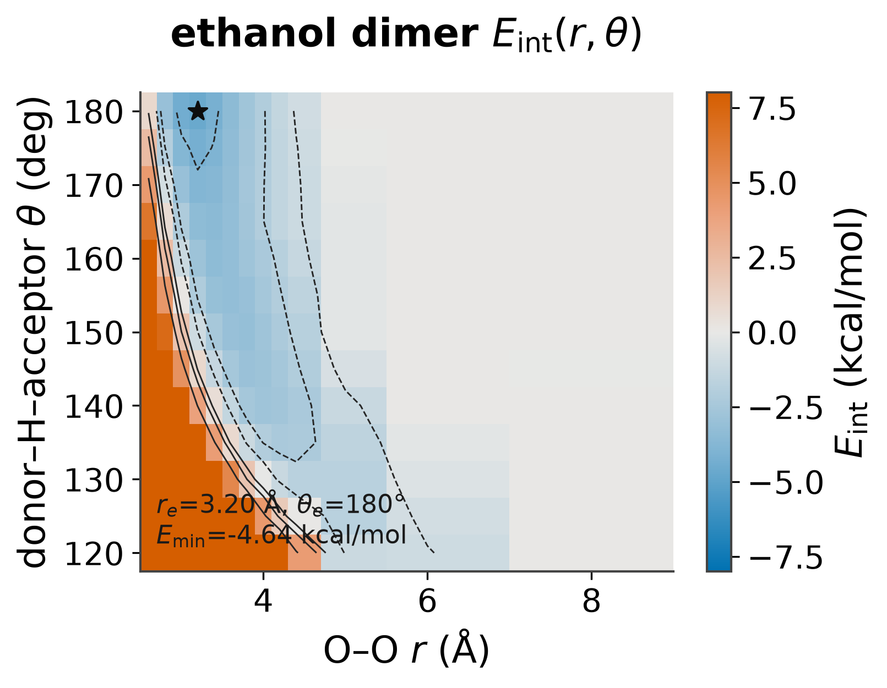
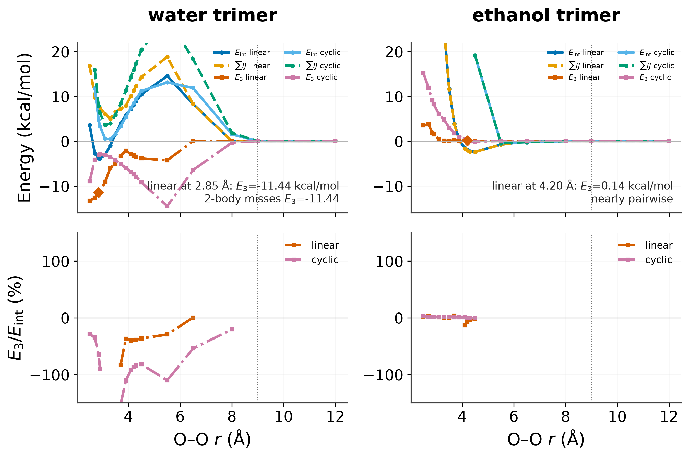

# `mmml pet-interaction-pes`

PET-MAD interaction slices, surfaces, and trimer many-body leftover.


CHARMM-free PET-MAD interaction PES: linear OH···O vs acceptor–acceptor 1D
slices (O–O, not COM copies), an angular cut at ``r_e``, one 2D
``E_int(r, theta)`` surface (``theta`` = donor–H–acceptor), and a trimer
many-body leftover ``E3 = E_int(ABC) - sum E_int(IJ)``. Energies are
single-point ASE evaluations (no CHARMM, Packmol, or MD). Plots use the shared
ICML style and are reproducible from the written JSON.

```bash
export PET_MAD_CKPT=/path/to/pet-mad-xs-v1.5.0.pt
JAX_PLATFORMS=cpu MMML_METATOMIC_DEVICE=cpu \
  mmml pet-interaction-pes --checkpoint "$PET_MAD_CKPT"
```

Worked example: [PET-MAD ethanol PBC](../../examples/pet-mad-etoh-pbc.md).

## Usage

```bash
mmml pet-interaction-pes --help
```

## Options

```text
usage: mmml pet-interaction-pes [-h] [--checkpoint CHECKPOINT]
                                [--from-json FROM_JSON] [--water-xyz WATER_XYZ]
                                [--ethanol-xyz ETHANOL_XYZ]
                                [--include-acetone | --no-include-acetone]
                                [--r-min ANGSTROM] [--r-max ANGSTROM]
                                [--n-r N_R] [--r-2d-min ANGSTROM]
                                [--r-2d-max ANGSTROM] [--n-r-2d N_R_2D]
                                [--n-theta N_THETA] [--theta-min DEG]
                                [--theta-max DEG] [--n-r-trimer N_R_TRIMER]
                                [--surface-system SURFACE_SYSTEM]
                                [--output-dir OUTPUT_DIR] [--json-out JSON_OUT]
                                [--prefix PREFIX]

Rigid OH···O interaction slices/surfaces and trimer many-body leftover for a
metatomic PET checkpoint (CHARMM-free single points).

options:
  -h, --help            show this help message and exit

input:
  --checkpoint CHECKPOINT
                        TorchScript AtomisticModel (.pt). Default:
                        $PET_MAD_CKPT.
  --from-json FROM_JSON
                        Replot a saved campaign JSON (no calculator).
  --water-xyz WATER_XYZ
                        Water monomer xyz (default:
                        examples/orca/water_opt/water.xyz).
  --ethanol-xyz ETHANOL_XYZ
                        Ethanol monomer xyz (default:
                        examples/pet_mad_etoh_pbc/etoh.xyz).
  --include-acetone, --no-include-acetone
                        Add acetone 1D slices (C=O acceptor vs methyl–methyl).

scan grid:
  --r-min ANGSTROM
  --r-max ANGSTROM
  --n-r N_R             Uniform 1D count; 0 uses a piecewise well/far grid.
  --r-2d-min ANGSTROM
  --r-2d-max ANGSTROM
  --n-r-2d N_R_2D       Uniform 2D r count; 0 uses the default well window.
  --n-theta N_THETA
  --theta-min DEG
  --theta-max DEG
  --n-r-trimer N_R_TRIMER
                        Uniform trimer count; 0 uses the default O–O grid.
  --surface-system SURFACE_SYSTEM

output:
  --output-dir OUTPUT_DIR
  --json-out JSON_OUT
  --prefix PREFIX
```

## Visual examples









## Related docs

- [Metatomic in MMML](../../metatomic.md)
- [PET-MAD ethanol PBC example](../../examples/pet-mad-etoh-pbc.md)
- [Plotting style guide](../../plotting-style-guide.md)

---

[← CLI overview](../index.md) · [All commands](../index.md#command-index)
