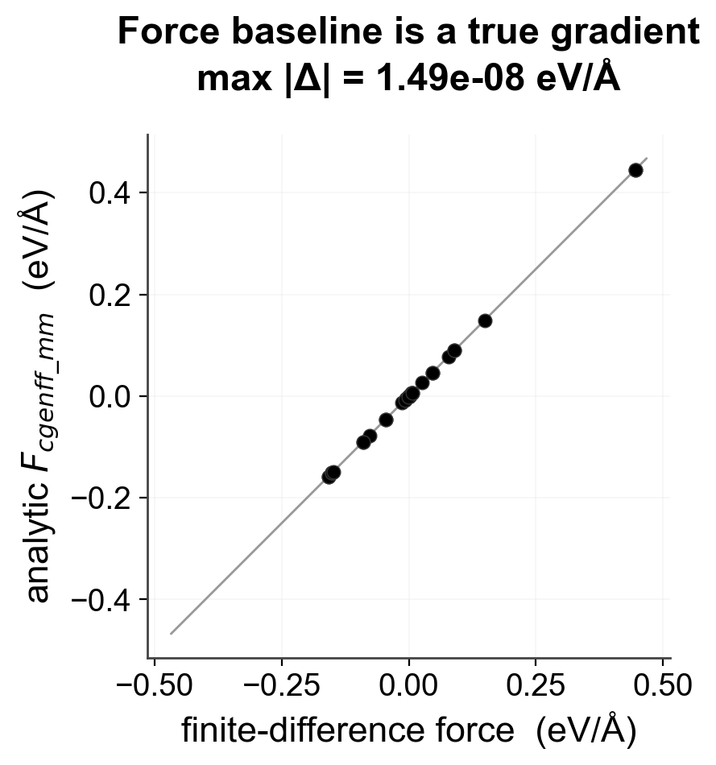

# `karml validate`

Validate NPZ against schema.


## Usage

```bash
karml validate --help
```

## Options

```text
usage: karml validate [-h] [--quiet] npz_files [npz_files ...]

Validate NPZ files against the KARML schema.

positional arguments:
  npz_files   One or more NPZ files to validate

options:
  -h, --help  show this help message and exit
  --quiet     Only print pass/fail summary
```

## Visual examples




---

[← CLI overview](../index.md) · [All commands](../index.md#command-index)
