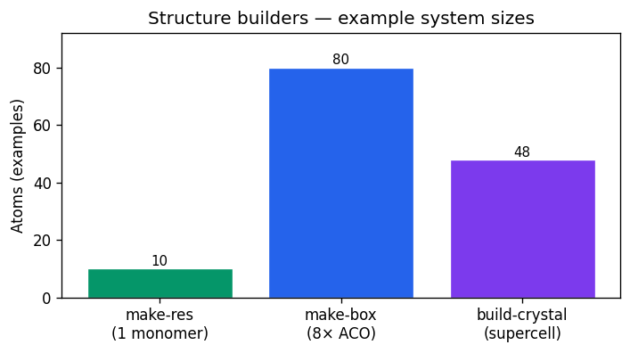
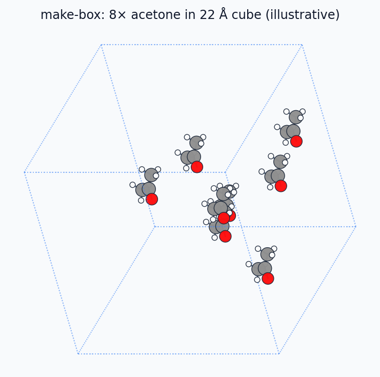

# Structure building (`make-res`, `make-box`, `build-crystal`)

MMML builds molecular geometry in three layers: **single residues** (CGENFF + PyCHARMM),
**dense periodic boxes** (Packmol + CHARMM), and **symmetry-aware crystals** (PyXtal).

Figures below are generated by `scripts/generate_docs_figures.py` using ASE
**orthographic** projection (`plot_atoms` / `Matplotlib` writer), **covalent bonds**
(`natural_cutoffs` neighbor list), Jmol colors, and matplotlib (static PNGs for
MkDocs — regenerate locally after changing the script).

```bash
uv run python scripts/generate_docs_figures.py
```

## Overview



| Command | Input | Output | Backend |
|---------|-------|--------|---------|
| [`make-res`](commands/make-res.md) | CGENFF residue name | `pdb/`, `psf/`, `xyz/` | PyCHARMM |
| [`make-box`](commands/make-box.md) | Residue + count + box length | Packed periodic box | Packmol + PyCHARMM |
| [`build-crystal`](commands/build-crystal.md) | Literature CIF + make-res or SMILES/XYZ | `.pdb`, `.xyz`, `.cif`, `.npz` | CIF mapper / PyXtal |

---

## `mmml make-res`

Generates one CGENFF residue with internal coordinates, minimization, and CHARMM
topology files.

```bash
mmml make-res --list-residues
mmml make-res --res ACO --skip-energy-show
```


The plot uses the same bundled geometry as cluster builders (`aco_monomer.pdb`).
After `make-res`, coordinates land in `xyz/<resi>.xyz` and `pdb/<resi>.pdb`.

### Regenerating the figure (ASE)

Orthographic view with bonds (same approach as the doc generator):

```python
import matplotlib
matplotlib.use("Agg")
import numpy as np
import ase.io
import matplotlib.pyplot as plt
from ase.neighborlist import natural_cutoffs, neighbor_list
from ase.visualize.plot import Matplotlib
from matplotlib.collections import LineCollection
from mmml.paths import default_aco_template_pdb

atoms = ase.io.read(default_aco_template_pdb())
fig, ax = plt.subplots(figsize=(6.5, 5), dpi=150, facecolor="#f8fafc")
writer = Matplotlib(atoms, ax, rotation="25x,15y,0z", radii=0.88, scale=42)
i, j = neighbor_list("ij", atoms, natural_cutoffs(atoms, mult=1.08))
pos_i = atoms.positions[i]
pos_j = atoms.positions[j]
seg = np.stack([
    writer.to_image_plane_positions(pos_i)[:, :2],
    writer.to_image_plane_positions(pos_j)[:, :2],
], axis=1)
ax.add_collection(LineCollection(seg, colors="#64748b", linewidths=1.3, zorder=1))
# ... add atom circles via make_patch_list(writer), then savefig
```

---

## `mmml make-box`

Packs copies of a residue into a cubic periodic cell (optionally with explicit solvent).

```bash
mmml make-res --res ACO
mmml make-box --res ACO --n 50 --side_length 25.0
```



Packmol writes `pdb/init-packmol.pdb`; PyCHARMM then builds PSF, applies PBC, and
minimizes contacts. For production liquid workflows see
[liquid-box workflow](../liquid-box-workflow.md).

### Regenerating the figure (ASE)

```python
import numpy as np
import matplotlib
matplotlib.use("Agg")
from ase import Atoms
from ase.build import molecule
from ase.visualize.plot import plot_atoms
import matplotlib.pyplot as plt

side = 22.0
monomer = molecule("CH3COCH3")
offsets = [(4, 4, 4), (12, 4, 6), (6, 11, 5), (14, 12, 8)]
# ... place monomers, set cell=[side, side, side], pbc=True
```

---

## `mmml build-crystal`

Build molecular crystals for MD: **literature CIF + make-res** (CHARMM atom
names, simulation supercell) or PyXtal random placement with space-group symmetry.

### DCM (CH₂Cl₂) — experimental crystal

The deposited structure at
[CCDC doi:10.5517/cc9lyjb](https://www.ccdc.cam.ac.uk/structures/search?id=doi:10.5517/cc9lyjb&sid=DataCite)
(Podsiadło *et al.*, *Acta Cryst.* B **2005**, 61, 595; COD
[2100015](https://www.crystallography.net/2100015.html)) is orthorhombic **Pbcn**
(SG 60), Z=4, measured at **1.63 GPa / 293 K**:

| Quantity | Value |
|----------|-------|
| *a*, *b*, *c* | 3.924, 7.793, 9.335 Å |
| ρ (experimental) | **1.972 g/cm³** |
| Low-*T* phase (153 K, 0.1 MPa) | same SG; *a*≈4.25, *b*≈8.14, *c*≈9.49 Å ([Kawaguchi *et al.* 1973](https://doi.org/10.1246/bcsj.46.62)) |

MMML ships the CIF as `default_dcm_crystal_cif()`. For MD, build a **simulation
supercell** with CHARMM atom names from `make-res` and literature geometry from
the bundled CIF (no PyXtal required). Supercell repeats default to ≥28 Å per
edge (≈2× CHARMM `cutnb`), preserving experimental density.

| Phase | Typical ρ (g/cm³) | MMML source |
|-------|-------------------|-------------|
| Liquid DCM | 1.326 | `liquid-box`, `md-system` |
| Crystal (this CIF) | 1.972 | `--literature dcm` / bundled CIF |

```bash
# 1) CHARMM residue with correct atom names (once per force field)
mmml make-res --res DCM --skip-energy-show

# 2) Literature unit cell → simulation supercell (auto repeats for box size)
mmml build-crystal --literature dcm \\
  --monomer-pdb pdb/dcm.pdb \\
  -o pdb/dcm_crystal.pdb

# Explicit supercell and ASE handoff
mmml build-crystal --literature dcm --supercell 4,4,3 \\
  -o dcm_super.extxyz
```

PyXtal random placement (`-m` + `--spg 60`) is optional when you want an
alternate trial cell with the same space group and target density:

```bash
# Experimental unit cell only (ASE)
python -c "
from ase.io import read, write
from mmml.paths import default_dcm_crystal_cif
write('dcm_expt.extxyz', read(default_dcm_crystal_cif()))
"

# PyXtal placement in Pbcn, scaled to experimental density
uv sync --extra chem
mmml build-crystal \\
  -m "$(python -c 'from mmml.paths import default_dcm_molecule_xyz; print(default_dcm_molecule_xyz())')" \\
  --spg 60 --z 4 \\
  --target-density-g-cm3 1.972 \\
  --seed 42 \\
  -o dcm_pyxtal.extxyz
```

PyXtal does not resolve `C(Cl)Cl` SMILES — use the bundled monomer XYZ or
`mmml make-res --res DCM` export.

### Benzene (C₆H₆) — experimental crystal

High-pressure benzene I is monoclinic **P2₁/c** (SG 14), Z=2
([COD 4501704](https://www.crystallography.net/cod/4501704.html);
Katrusiak *et al.*, *Cryst. Growth Des.* **2010**, 10, 3461).
MMML ships `default_benzene_crystal_cif()`.

```bash
mmml make-res --res BENZ --skip-energy-show
mmml build-crystal --literature benz --monomer-pdb pdb/benz.pdb \\
  -o pdb/benz_crystal.pdb
```

PyXtal accepts the molecule name **`benzene`** (not SMILES `c1ccccc1`) for
random placement:

```bash
# Experimental unit cell
python -c "
from ase.io import read, write
from mmml.paths import default_benzene_crystal_cif
write('benzene_expt.extxyz', read(default_benzene_crystal_cif()))
"

# PyXtal placement in P2₁/c, density matched to literature
mmml build-crystal -m benzene --spg 14 --z 2 \\
  --target-density-g-cm3 1.202 --seed 7 -o benzene_pyxtal.extxyz
```

<!-- CRYSTAL_LIT_COMPARE_START -->
### Literature cross-check (auto-generated)

Bundled experimental CIFs vs **make-res+CIF** (exact literature unit cell, CHARMM atom names) and a single PyXtal `from_random` trial (fixed seeds) with ρ scaled to literature. PyXtal unit-cell axes can differ in setting/orientation even when space group and density agree.

Regenerate: `uv run python scripts/generate_crystal_lit_compare.py`

#### DCM (CH₂Cl₂) — [COD 2100015](https://www.crystallography.net/2100015.html)

Podsiadło *et al.*, *Acta Cryst.* B **2005**, 61, 595 ([CCDC doi:10.5517/cc9lyjb](https://www.ccdc.cam.ac.uk/structures/search?id=doi:10.5517/cc9lyjb&sid=DataCite)); Pbcn, Z=4, 1.63 GPa / 293 K.

| Quantity | Literature | make-res+CIF | Δ (CIF−lit) | PyXtal build | Δ (PyXtal−lit) |
|----------|------------|--------------|-------------|--------------|----------------|
| Space group | 60 | 60 | — | 60 | — |
| N atoms | 20 | 20 | +0.0% | 20 | +0.0% |
| *a* (Å) | 3.924 | 3.924 | +0.0% | 7.773 | +98.1% |
| *b* (Å) | 7.793 | 7.793 | +0.0% | 6.651 | -14.7% |
| *c* (Å) | 9.335 | 9.335 | +0.0% | 5.521 | -40.9% |
| α (°) | 90.0 | 90.0 | +0.0% | 90.0 | +0.0% |
| β (°) | 90.0 | 90.0 | +0.0% | 90.0 | +0.0% |
| γ (°) | 90.0 | 90.0 | +0.0% | 90.0 | +0.0% |
| Volume (ų) | 285.5 | 285.5 | +0.0% | 285.5 | +0.0% |
| ρ (g/cm³) | 1.976 | 1.976 | +0.0% | 1.976 | -0.0% |

_make-res+CIF: `mmml build-crystal --literature dcm` (unit cell)._
_PyXtal: `-m default_dcm_molecule_xyz()`, `--spg 60 --z 4 --seed 42`, ρ scaled to literature._

#### Benzene (C₆H₆) — [COD 4501704](https://www.crystallography.net/cod/4501704.html)

Katrusiak *et al.*, *Cryst. Growth Des.* **2010**, 10, 3461 ([doi:10.1021/cg1002594](https://doi.org/10.1021/cg1002594)); P2₁/c, Z=2, ~0.97 GPa / 295 K.

| Quantity | Literature | make-res+CIF | Δ (CIF−lit) | PyXtal build | Δ (PyXtal−lit) |
|----------|------------|--------------|-------------|--------------|----------------|
| Space group | 14 | 14 | — | 14 | — |
| N atoms | 24 | 24 | +0.0% | 24 | +0.0% |
| *a* (Å) | 5.522 | 5.522 | +0.0% | 5.175 | -6.3% |
| *b* (Å) | 5.440 | 5.440 | +0.0% | 11.337 | +108.4% |
| *c* (Å) | 7.673 | 7.673 | +0.0% | 3.813 | -50.3% |
| α (°) | 90.0 | 90.0 | +0.0% | 90.0 | +0.0% |
| β (°) | 110.6 | 110.6 | +0.0% | 74.7 | -32.4% |
| γ (°) | 90.0 | 90.0 | +0.0% | 90.0 | +0.0% |
| Volume (ų) | 215.8 | 215.8 | +0.0% | 215.8 | -0.0% |
| ρ (g/cm³) | 1.202 | 1.202 | +0.0% | 1.202 | -0.0% |

_make-res+CIF: `mmml build-crystal --literature benz` (unit cell)._
_PyXtal: `-m benzene` (not `c1ccccc1`), `--spg 14 --z 2 --seed 7`, ρ scaled to literature._
<!-- CRYSTAL_LIT_COMPARE_END -->

### Other examples

```bash
mmml build-crystal -m benzene --spg 14 --z 2 -o benzene.extxyz
mmml build-crystal -m monomer.xyz --spg 4 --supercell 2,2,2 -o super.cif
```


The doc figure uses the bundled COD 2100015 coordinates when ASE is available.
Without the CIF, the generator falls back to PyXtal (Pbcn) or an illustrative
benzene dimer cell.

See also: [PyXtal tests on GitHub](https://github.com/EricBoittier/mmml/blob/main/tests/functionality/pyxtal/README.md).

---

## Related: `liquid-box` density prep

Phase-A liquid certification uses MM-only prep before MLpot. The ladder below is a
**schematic** matplotlib plot (not from a live run):


```python
import matplotlib.pyplot as plt

stages = ["Packmol", "MC staged", "MC target", "Lattice", "Certified"]
density = [0.55, 0.78, 0.95, 0.99, 1.00]
fig, ax = plt.subplots()
ax.plot(stages, density, "o-")
ax.axhline(1.0, linestyle="--", color="gray")
ax.set_ylabel("ρ / ρ_target")
fig.savefig("liquid-box-density-ladder.png")
```

Full workflow: [liquid-box-workflow.md](../liquid-box-workflow.md).

---

## See also

- [CLI overview](index.md)
- [md-system YAML configs](../md-system-configs.md) — campaigns that consume certified boxes
- [Regenerate figures](https://github.com/EricBoittier/mmml/blob/main/scripts/generate_docs_figures.py) (`uv run python scripts/generate_docs_figures.py`)
