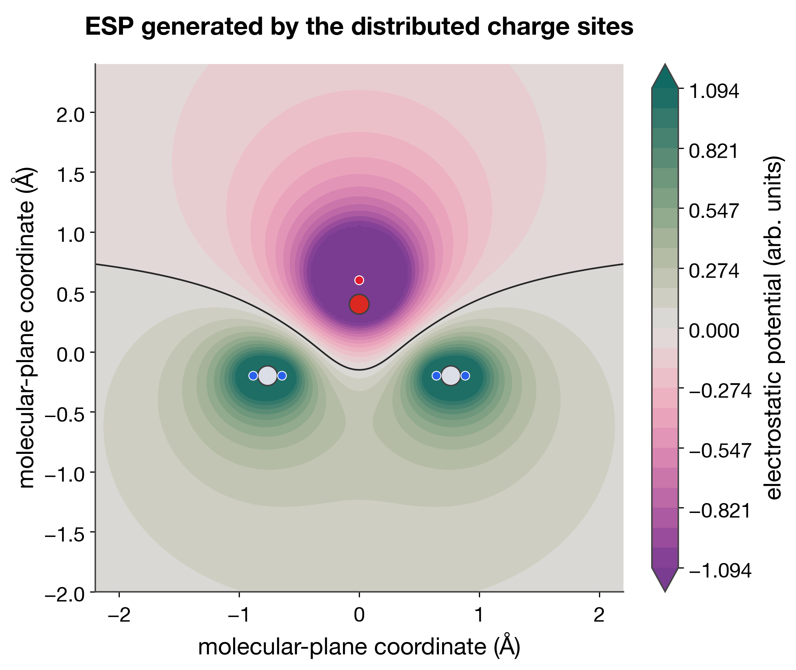
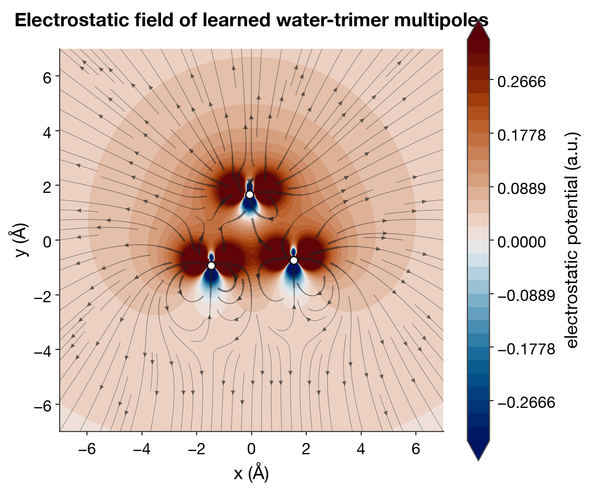

# DCMNet and Joint PhysNet+DCMNet Calculators

This note explains the two ASE calculator paths used for DCM-style inference in MMML:

- `DCMNetCalculator` in `mmml/models/dcmnet/dcmnet_ase.py`
- `SimpleInferenceCalculator` in `mmml/interfaces/calculators/simple_inference.py` (for joint PhysNet+DCMNet checkpoints)

## 1) `DCMNetCalculator` (standalone DCMNet)

### What it computes

`DCMNetCalculator` is focused on electrostatics-style outputs from a trained DCMNet model:

- distributed monopoles per atom (`monopoles`, shape `(natoms, n_dcm)`)
- distributed charge positions (`dipole_positions`, shape `(natoms, n_dcm, 3)`)
- per-atom charges (`sum(monopoles, axis=-1)`)
- molecular dipole (from distributed charges)
- ESP on arbitrary grid points via `get_electrostatic_potential(...)`

Implemented ASE properties are:

- `charges`
- `dipole`
- `multipoles`

### Visualizing distributed sites and their ESP

A DCM should be drawn as explicit off-atom monopoles, not as one charge or
multipole glyph placed on each nucleus. The left-hand view below shows two
distributed sites per parent atom and thin site-to-parent guides. The right-hand
view shows the molecular dipole and quadrupole that summarize the same charge
distribution at low order. Keep both views at the same molecular scale.


The companion molecular-plane slice evaluates

\[
V(\mathbf r)=\sum_s \frac{q_s}{|\mathbf r-\mathbf r_s|}
\]

from those exact displayed sites. The black contour is `V = 0`; colored small
circles are the off-atom monopoles and larger circles are the parent atoms.



These two figures use **schematic** neutral water-like values to establish the
visual language; they are not presented as a trained DCMNet prediction. For a
real inference result, pass `get_distributed_multipoles()["monopoles"]` and
`["dipole_positions"]` to the same renderer and compute the grid with
`get_electrostatic_potential(...)`. Always label schematic and learned results
explicitly.

For comparison, the repository also contains a field slice from a committed
learned *molecular multipole* model. It is a real learned electrostatic field,
but it is not a DCMNet distributed-site prediction:



Regenerate the DCM teaching pair with:

```bash
python scripts/render_povray_distributed_charge_model.py
```

### Input/output flow

1. Read atom positions and atomic numbers from `ase.Atoms`.
2. Build message-passing pair indices (`dst_idx`, `src_idx`).
3. Run `model.apply(...)` to obtain distributed outputs:
   - `mono_pred`
   - `dipo_pred`
4. Store derived quantities in `self.results`.
5. Optionally compute ESP later from cached multipoles.

### Important limitations

- Not a full MD calculator: no `energy` or `forces` in `implemented_properties`.
- Works as a single-structure inference wrapper; no batching API at this layer.
- Uses cached multipoles for ESP calls, so a calculation must run before calling `get_electrostatic_potential(...)`.

### Best use cases

- Analyze distributed charges and dipoles from a DCMNet-only model.
- Evaluate ESP on custom grids/surfaces from inferred multipoles.
- Electrostatics post-processing, not force-based dynamics.

## 2) `SimpleInferenceCalculator` (joint PhysNet+DCMNet)

### What it computes

`SimpleInferenceCalculator` wraps joint checkpoints and exposes a standard ASE property set:

- `energy`
- `forces`
- `dipole`
- `charges`

It is designed for inference from models trained with padded atom arrays (`natoms`).

### Input/output flow

1. Read the real structure (`n_atoms`) from `ase.Atoms`.
2. Pad to model `natoms` from `model.physnet_config["natoms"]`.
3. Build atom mask and edge list (within cutoff).
4. Call joint model `apply(...)` with:
   - padded coordinates/numbers
   - `atom_mask`
   - `batch_segments`, `batch_mask`, edge indices
5. Slice outputs back to real atoms.
6. Return energy/forces/charges and dipole (PhysNet dipole by default, optional DCM-style dipole).

### Practical constraints

- `n_atoms` must be `<= natoms` from the checkpoint config.
- If the structure exceeds model `natoms`, inference fails by design.
- Edge construction is local to this wrapper, so cutoff choice affects runtime and interactions included.

### Best use cases

- Single-structure inference with joint models (energy + forces + charges + dipole).
- ASE optimizations and MD-like workflows where forces are needed.
- Drop-in use from a joint checkpoint with model-consistent padding.

## Which one should you use?

- Use `DCMNetCalculator` when you primarily need distributed multipoles and ESP.
- Use `SimpleInferenceCalculator` when you need energy/forces from joint PhysNet+DCMNet models.

In short:

- **Electrostatics artifact analysis** -> `DCMNetCalculator`
- **General ASE simulation/inference with forces** -> `SimpleInferenceCalculator`
