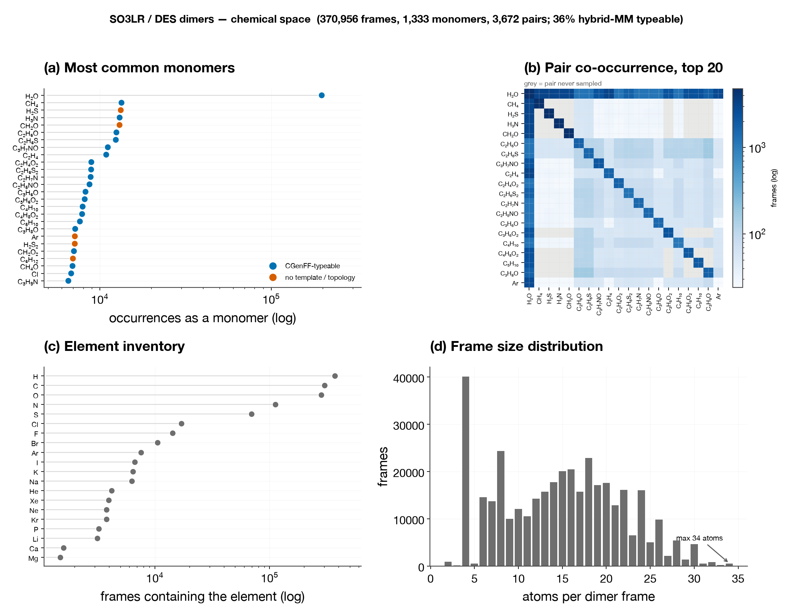
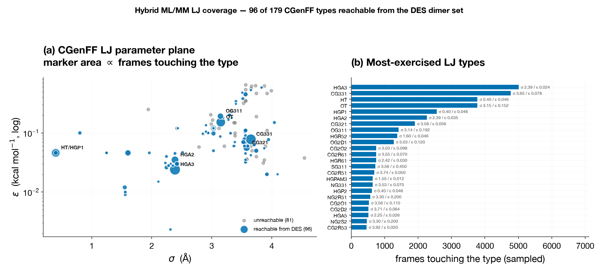

# The SO3LR / DES dimer set and hybrid ML/MM

Where the DES dimer data lives, what chemistry is in it, and exactly which
**CGenFF Lennard-Jones parameters** the hybrid ML/MM machinery
([`prepare-mm-dataset`](hybrid-mm-dataset-preparation.md) →
[trainable LJ scales](hybrid-mm-lj-scales.md)) can reach with it.

Everything on this page is measured, not estimated: a streaming pass over the
full 370,956-frame file
([`scripts/scan_des_chemical_space.py`](https://github.com/EricBoittier/mmml/blob/main/scripts/scan_des_chemical_space.py))
ran the production assignment
([`mmml/data/cgenff_dataset.py`](https://github.com/EricBoittier/mmml/blob/main/mmml/data/cgenff_dataset.py))
on a 1-in-20 sample, and the figures and tables are generated from that scan by
[`scripts/gen_docs_des_chemspace_figures.py`](https://github.com/EricBoittier/mmml/blob/main/scripts/gen_docs_des_chemspace_figures.py).

!!! note "Related"
    [Preparing hybrid ML/MM datasets](hybrid-mm-dataset-preparation.md) ·
    [Trainable hybrid MM LJ scales](hybrid-mm-lj-scales.md) ·
    [Hybrid MM charges](hybrid-mm-charges.md) ·
    [DES dimer pair scans workflow](https://github.com/EricBoittier/mmml/tree/main/workflows/des_dimer_pair_scans)

---

## Where the data is

Everything is on **scicore** (`/scicore/home/meuwly/boitti0000`). None of it is
on `pcstudix`, and none of it is in the repo.

| Path | Size | What it is |
|---|---:|---|
| `~/qcell/qcell_dimers.h5` | 5.5 GB | **The DES dimer set.** Per-structure groups `mol_000001…`, plus a `metadata` group |
| `~/qcell/qcell_xyz/qcell_dimers.xyz` | 748 MB | Same frames as extxyz — the convenient form for streaming/surveying |
| `~/qcell/.h5_cache/qcell_dimers_66998dd44fdb879b` | — | Orbax cache written by `prepare_h5_datasets` |
| `~/trainDES/train.py` | — | The PhysNet run that consumed it (`train_size=270_000`, `natoms=34`, `charge_filter=0.0`) |
| [`examples/ckpts_json/DESdimers_params.json`](https://github.com/EricBoittier/mmml/blob/main/examples/ckpts_json/DESdimers_params.json) | 696 KB | The resulting checkpoint — **in the repo**, and the reference model for [`workflows/des_dimer_pair_scans`](https://github.com/EricBoittier/mmml/tree/main/workflows/des_dimer_pair_scans) |

Sibling sets in the same directory (`qcell_ions_water.h5`, `qcell_sugars.h5`,
`qcell_nucleic_acids.h5`, `qcell_lipids.h5.swp`) are *not* dimers and are out of
scope here.

**Level of theory** is recorded in the file itself
(`metadata/fhi_aims_settings`): FHI-aims, **PBE0** with `many_body_dispersion_nl`,
`atomic_zora scalar` relativistic, tight SCF — i.e. **PBE0+MBD**, the SO3LR
reference level. `metadata/free_atom_energy` carries free-atom energies for
Z = 1…86, so `formation_energy` is already referenced.

Per-structure datasets go well beyond `R/Z/E/F`: `total_forces`,
`formation_energy`, `dipole`, `quadrupole`, `hirshfeld`-style `c6_ratios` /
`a0_ratios`, `homo_energy` / `lumo_energy` / `homo_lumo_gap`, `ks_eigenvalues`,
and a full energy decomposition (`electrostatic_energy`, `hf_energy`,
`vdw_energy`, `total_xc_energy`, …).

!!! warning "The `~/data/so3lr*` files are a different thing"
    On **pcstudix**, `~/data/so3lr_train.extxyz` (9.5 GB) and `~/data/so3lr_test/`
    (gems, md22, qm7x, TorsionNet500) are the SO3LR *training and benchmark* sets.
    They are not the DES dimers and contain no subset labels — you cannot slice
    the dimers back out of them.

---

## What is in it

<figure markdown>

<figcaption>370,956 frames · 1,333 distinct monomers · 3,672 distinct unordered pairs · 20 elements · 2–34 atoms per frame.</figcaption>
</figure>

Reading the panels:

- **(a)** Water is the hub: it is 27% of all monomer occurrences and outruns the
  next most common monomer (CH₄) roughly 15-fold. Colour marks whether the
  hybrid ML/MM path can type the monomer — several very common ones (H₂S, CH₂O,
  Ar) cannot.
- **(b)** The sampling is deliberately water-centred plus a homodimer diagonal;
  grey cells are pairs that were never generated. This is DES370K-style
  coverage, not a dense all-pairs grid.
- **(c)** 20 elements, including noble gases (He, Ne, Ar, Kr, Xe) and bare ions
  (Na, K, Li, Ca, Mg, F, Cl, Br, I) — chemistry that has no CGenFF residue.
- **(d)** **34 atoms is the hard maximum**, which is where `natoms=34` in
  `~/trainDES/train.py` comes from. The spike at 4 atoms is the
  noble-gas/diatomic and small-ion population.

5.2% of frames (19,172) resolve to a **single** covalent component rather than
two — contact ion pairs and close-contact frames where the covalent-radius graph
merges the monomers. `prepare-mm-dataset` drops these.

---

## The overlap with CGenFF

Running the real assignment on a 1-in-20 sample (18,548 frames):

| | frames | share |
|---|---:|---:|
| **Typeable — usable for hybrid ML/MM** | **6,635** | **35.8%** |
| Dropped: composition matched, topology did not | 5,204 | 28.1% |
| Dropped: no CGenFF template for the composition | 5,180 | 27.9% |
| Dropped: not two covalent components | 946 | 5.1% |
| Dropped: not graph-isomorphic to the chosen template | 583 | 3.1% |

**89 of 1,333 monomer species** are typeable, and they form **1,038 distinct
CGenFF `RESI` pairs**. Because the lookup is composition-keyed, each typeable
formula resolves to exactly one residue.

!!! note "CGenFF alone gets 32.9%; the ion residues take it to 35.8%"
    CGenFF has no template for a bare ion, so every ion–water dimer used to
    drop. `load_reference` now merges
    [`toppar_water_ions.str`](https://github.com/EricBoittier/mmml/blob/main/mmml/data/charmm/toppar_water_ions.str)
    on top of CGenFF (`DEF_EXTRA_TOPPAR`), adding **`CLA`, `SOD`, `POT`,
    `LIT`, `CAL`, `MG`** — +6 residues, +6 LJ types, +119 RESI pairs,
    32.9% → 35.8% on the identical frame set. The merge is strictly additive:
    an atom type or `RESI` CGenFF already defines is left alone and new
    compositions are appended behind the existing candidates, so assignments
    that already worked are byte-identical (verified over 3,000 DCM frames).

The two large failure modes are different problems:

- **No template (27.9%)** — the composition has no `RESI` at all. After the ion
  merge this is the noble gases (He, Ne, Ar, Kr, Xe), the halides CHARMM has no
  ion residue for (F⁻, Br⁻, I⁻), and small molecules CGenFF does not cover
  (H₂S, CH₂O, H₂S₂ are the three biggest single contributors).
- **Topology mismatch (28.1%)** — a residue with the *same formula* exists, but
  the frame is a different isomer. `_template_to_geometry_permutation` catches
  this by graph isomorphism and the frame is dropped rather than silently
  mistyped. This is the failure mode working correctly, but it means the
  composition-first lookup is leaving usable frames on the table.

Largest untypeable monomers by occurrence (Cl⁻ has moved off this list — it is
now `CLA`):

| Monomer | occurrences | Monomer | occurrences |
|---|---:|---|---:|
| H₂S | 13,256 | Ne | 3,793 |
| CH₂O | 13,040 | C₂H₄O | 3,682 |
| Ar | 7,154 | Kr | 3,533 |
| H₂S₂ | 7,147 | F⁻ | 3,533 |
| C₆H₁₂ | 6,971 | Xe | 3,452 |
| C₃H₈S₂ | 6,135 | Br⁻ | 3,353 |
| C₄H₄N₂ | 4,868 | I⁻ | 3,333 |
| He | 4,199 | C₃H₆S₂ | 4,613 |

The remaining ions are a bounded, tractable gap: F⁻, Br⁻ and I⁻ (10,219
occurrences between them) have no residue in `toppar_water_ions.str` either, and
the five noble gases (22,131) have none anywhere in CHARMM. Both would need
hand-written residues rather than another stream file.

---

## LJ parameters covered

<figure markdown>

<figcaption>96 of 179 nonbonded types are reachable from the DES dimer set, via 89 residues.</figcaption>
</figure>

This is the figure that matters for [trainable LJ
scales](hybrid-mm-lj-scales.md): a per-type σ/ε scale only receives a gradient
if some training frame contains an atom of that type. **96 of 179** types
qualify; the other 83 are inert no matter how long you train.

The distribution is steep. `HGA3` (aliphatic H) appears in 76% of typeable
frames and `CG331` (methyl C) in 72%, while 25 of the 96 types appear in fewer
than 50 sampled frames — **`NG2S1` appears in 7**, all from a single residue.
Those thin types will move under gradient descent without being meaningfully
constrained by data, which is exactly the regime where the
[σ/ε degeneracy](hybrid-mm-lj-scales.md) bites. Freeze them, exclude them, or
cut the residue list (below) rather than trusting a fitted value.

The six ion types are the newest and among the thinnest: `CLA` 231 sampled
frames, `POT` 103, `SOD` 93, `LIT` 83, `MG` 13, **`CAL` 9**. Treat `CAL` and
`MG` as unfittable at this sample size.

### Most-exercised types

| CGenFF type | σ (Å) | ε (kcal/mol) | sampled frames | residues |
|---|---:|---:|---:|---|
| `HGA3` | 2.3876 | 0.02400 | 5,011 | 54 |
| `CG331` | 3.6527 | 0.07800 | 4,770 | 51 |
| `HT` | 0.4000 | 0.04600 | 3,776 | TIP3 only |
| `OT` | 3.1506 | 0.15210 | 3,776 | TIP3 only |
| `HGP1` | 0.4000 | 0.04600 | 2,558 | 21 |
| `HGA2` | 2.3876 | 0.03500 | 2,262 | 32 |
| `CG321` | 3.5814 | 0.05600 | 1,906 | 28 |
| `OG311` | 3.1449 | 0.19210 | 1,417 | 9 |
| `HGR52` | 1.6036 | 0.04600 | 1,374 | 12 |
| `OG2D1` | 3.0291 | 0.12000 | 1,272 | 10 |

Note that `HT` and `HGP1` share σ = 0.4000 / ε = 0.04600 exactly — distinct
types, one point in the LJ plane. Scaling them independently is only
identifiable because they sit on different molecules.

**Full tables** (generated, 96 types and 89 residues):

- [`docs/images/des-so3lr-dimers/lj_types.md`](images/des-so3lr-dimers/lj_types.md)
  — every reachable type with σ, ε, frame count, and the residues that use it
- [`docs/images/des-so3lr-dimers/resi_coverage.md`](images/des-so3lr-dimers/resi_coverage.md)
  — every covered residue with its atom count and LJ types

### Residues covered, by sample count

All 89, ranked. Sampled frames are 1-in-20; multiply by 20 for the full set.
The **top 40** (above the rule) is the default training cut — see below.

| # | RESI | smp | # | RESI | smp | # | RESI | smp | # | RESI | smp |
|---:|---|---:|---:|---|---:|---:|---|---:|---:|---|---:|
| 1 | `TIP3` | 3,776 | 11 | `ACO` | 197 | 21 | `DMDS` | 166 | 31 | `TMAM` | 111 |
| 2 | `METH` | 661 | 12 | `ACEM` | 196 | 22 | `NH4` | 160 | 32 | `DETE` | 108 |
| 3 | `AMM1` | 643 | 13 | `MAM1` | 190 | 23 | `FORA` | 157 | 33 | `MIMI` | 107 |
| 4 | `ETHE` | 428 | 14 | `FORM` | 188 | 24 | `PRPA` | 132 | 34 | `CPEN` | 105 |
| 5 | `FORH` | 338 | 15 | `MESH` | 188 | 25 | `DMAM` | 128 | 35 | `ACET` | 105 |
| 6 | `MEOH` | 336 | 16 | `BENZ` | 181 | 26 | `PYRL` | 121 | 36 | **`POT`** | 103 |
| 7 | **`CLA`** | 231 | 17 | `ETHA` | 177 | 27 | `PYR1` | 115 | 37 | `PRLD` | 103 |
| 8 | `ETOH` | 202 | 18 | `BUTA` | 170 | 28 | `PRO2` | 115 | 38 | `THF` | 102 |
| 9 | `ETSH` | 198 | 19 | `PHEN` | 169 | 29 | `MAS` | 114 | 39 | `MGUA` | 100 |
| 10 | `ACEH` | 197 | 20 | `IMIA` | 197 | 30 | `EMS` | 114 | 40 | `MAMM` | 99 |

*— top-40 cut —*

```
IMIM BTE1 SOD  PRAM LIT  ETAC PENT SM073 DMA  HEXA THPS DITH DEDS INDO
TOLU NC4  TRIT EAMM GUAN FETH FLUB NC3  ACN  CLET DCM  PRPY DCLE DFET
BRET DBRE EIMI MIND EBEN EIND PROA EIMM EPHE DMEP TFET SM158 MP_0 GLYN
SM129 TCLE MG   AANM DME  CAL  DFB
```

Bold entries are the merged ion residues. `SOD` (93) and `LIT` (83) sit just
below the cut; `MG` (13) and `CAL` (9) are deep in the tail.

The 12-species panel in
[`workflows/des_dimer_pair_scans/config.yaml`](https://github.com/EricBoittier/mmml/blob/main/workflows/des_dimer_pair_scans/config.yaml)
(TIP3, DCM, ACO, ETOH, MEOH, ETHA, BENZ, BUTA, IBUT, PENT, NEOP, HEXA) is a
hand-picked subset of this list — every one of those except `IBUT` and `NEOP` is
confirmed present in the data above. That workflow's 78 pairs are a small corner
of the 919 RESI pairs the dataset actually supports.

---

## Preparing a training run

`LJ_DES=1` runs the ladder on this dataset. Step 12 builds the training NPZ:

```
qcell_dimers.h5
   │  scripts/des_h5_to_npz.py --pad 34        (12a)  units already eV / eV·Å
   ▼
des_dimers_raw.npz
   │  mmml prepare-mm-dataset                  (12b)  types, charges, res_name
   ▼
des_dimers_cgenff_all.npz
   │  scripts/filter_mm_dataset_by_residue.py  (12c)  --top 40
   ▼
des_dimers_cgenff_top40.npz  ──▶  05_train.sh  learn_mm_lj_scales
```

```bash
export LJ_DES=1
bash examples/lj_scales/12_des_dataset.sh
LJ_DES=1 LJ_DEVICE=gpu bash examples/lj_scales/05_train.sh
```

| Variable | Default | Meaning |
|---|---|---|
| `LJ_DES_H5` | `~/qcell/qcell_dimers.h5` | source HDF5 |
| `LJ_DES_PAD` | `34` | the measured DES maximum, **not** the ladder's usual 20 |
| `LJ_DES_TOP_RESIDUES` | `40` | residue cut (below) |
| `LJ_DES_ALL_CHARGES` | `0` | `1` admits net-charged (ion) dimers |

**Units need no conversion.** FHI-aims writes eV and eV/Å, which is what the
hybrid MM baseline and the existing lj_scales NPZs already use, and
`formation_energy` is referenced against `metadata/free_atom_energy`. It is the
direct analogue of `E` in `examples/dcm_mp2_psf_order.npz` (which ranges
−43…−21 eV for a 10-atom dimer).

### Why the residue cut

Yield against the cut, from the scan (sampled frames ×20 ≈ full):

| top-N residues | frames | ≈ full | % of typeable | LJ types | thinnest type |
|---:|---:|---:|---:|---:|---:|
| 20 | 3,049 | 61,000 | 46.0% | 32 | 2,600 |
| 25 | 3,616 | 72,300 | 54.5% | 41 | 2,240 |
| 30 | 4,009 | 80,200 | 60.4% | 47 | 2,120 |
| **40** | **4,750** | **95,000** | **71.6%** | **58** | **1,440** |
| 50 | 5,384 | 107,700 | 81.1% | 65 | 1,160 |
| 60 | 5,894 | 117,900 | 88.8% | 74 | 920 |
| 89 (all) | 6,635 | 132,700 | 100% | 96 | **140** |

**40 is the recommended default.** It keeps 72% of the usable frames and 58 LJ
types while holding every one of them above ~1,400 frames. Taking all 89
residues buys 38 more types but drops the sampling floor by an order of
magnitude — those types are exactly the ones that will drift.

A frame is kept only if **both** monomers are in the allowlist, which is why the
frame yield falls faster than the residue count.

### What to watch

1. **Water dominance.** `TIP3` is in 57% of typeable frames — more than five
   times the next residue. Every aggregate error metric on this set is
   substantially a water metric. Step 12 prints the TIP3 share so it cannot
   surprise you at eval time; consider subsampling or a per-pair breakdown.
2. **Ion frames are off by default.** The merged ion residues only occur in
   net-charged dimers, and step 12a filters to neutral (matching
   `~/trainDES/train.py`). `LJ_DES_ALL_CHARGES=1` admits them — a separate
   decision from having the templates, and one that changes what the Coulomb
   baseline has to represent.
3. **`lr_solver: mic`.** Training LJ requires it; under `ewald` the LJ term is
   removed from the hybrid energy and there is nothing to differentiate.

!!! warning "Dormant landmine in the SMILES fallback"
    `DES_SMILES_TO_RESI` in `mmml/data/cgenff_dataset.py` maps `[Ne]`, `[Ar]`,
    `[Kr]`, `[Xe]`, `[Ca+2]`, `[Li+]` and `[F-]` onto **`TIP3`**, and `C#N` onto
    `DMAM`. Those are placeholders, not chemistry. They are currently **inert** —
    `assign_frame_cgenff` calls `match_cgenff_template` without
    `canonical_smiles`, so only the composition path runs, and noble gases and
    ions correctly fail as "no template". Anything that starts passing SMILES
    would silently give argon water's σ/ε. Fix the map before enabling that
    path on this dataset, where noble gases and bare ions are ~5% of frames.

---

## Reproducing

The scan must run where the data is (scicore); the figures render anywhere.

```bash
python scripts/scan_des_chemical_space.py ~/qcell/qcell_xyz/qcell_dimers.xyz \
    --out artifacts/des_chemspace/qcell_dimers_scan.json \
    --stride 1 --cgenff-stride 20
```

```bash
python scripts/gen_docs_des_chemspace_figures.py \
    artifacts/des_chemspace/qcell_dimers_scan.json
```

The scan takes ~10 min single-threaded and writes a ~350 KB JSON; the CGenFF
assignment is ~100× the cost of the composition tally, hence the separate
`--cgenff-stride`. Lower it for a tighter coverage estimate, raise it for a
quick look.
