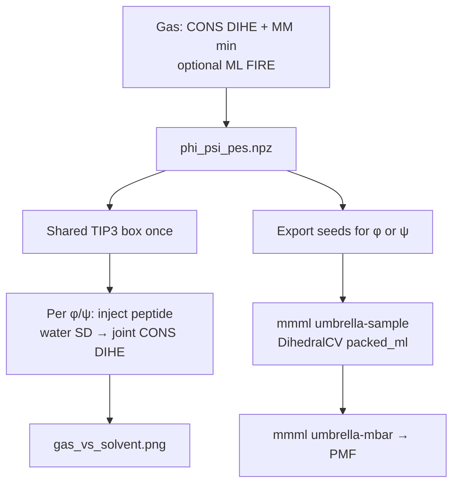

# Teaching exercise: peptide φ/ψ landscape → umbrella PMF

A complete classroom / workshop path on **trialanine (TRIA)**: constrained
Ramachandran energy maps (gas then solvent), then **gas-phase dihedral umbrella**
sampling for a 1D φ (or ψ) PMF. Example files live under
[`examples/tria_phi_psi_scan/`](https://github.com/EricBoittier/mmml/blob/main/examples/tria_phi_psi_scan/).

Related background:

- [Tri-alanine water box](../trialanine-water-box.md) — how the CGenFF `TRIA` + TIP3 box is built
- [Batched umbrella sampling](../umbrella.md) — distance and dihedral CVs, MBAR
- [Protein force fields](../protein-force-fields.md) — CHARMM36 ACE–ALA–CT3 and longer sequences
- [Trajectory FES](../trajectory-free-energy-surfaces.md) — histogram FES from an MD traj (complementary)

---

## Learning goals

1. Build / load a capped peptide and identify backbone φ/ψ atoms.
2. Map a 2D constrained MM (+ optional ML) PES in the gas phase.
3. Re-relax each gas geometry in a shared TIP3 box (`CONS DIHE`).
4. Compare gas vs solvent ΔE Ramachandran maps.
5. Turn a 1D slice into an umbrella PMF (`DihedralCV` + MBAR).
6. Adapt the same workflow to a **different peptide** (indices, FF, checkpoint).

---

## System: CGenFF `TRIA`

Central ALA of ACE–ALA₃–CT3 (bundled residue `TRIA`, segment `PEPT`):

| Angle | Atoms (0-based) | Backbone |
|-------|-----------------|----------|
| φ | `14, 16, 18, 24` | C1–N2–CA2–C2 |
| ψ | `16, 18, 24, 26` | N2–CA2–C2–N3 |

!!! warning "Negative CLI ranges"
    Pass grids as `--phi=-180:180:60` (equals form). A bare `-180:…` is parsed as a
    flag by argparse.

---

## Pipeline overview



Solvent stage builds Packmol **once**, then swaps peptide coordinates. Rebuilding
CHARMM + Packmol every grid point often aborts silently in `libcharmm` after a
handful of cycles.

---

## 0. Environment (scicore / PyCHARMM node)

```bash
cd ~/mmml
# CHARMM + CGenFF paths as usual (CHARMM_LIB_DIR / CHARMM_HOME)
export MMML_CKPT="${MMML_CKPT:-examples/sppoky-epoch-0010_params.json}"
OUT=artifacts/tria_phi_psi_scan
```

One-shot smoke (gas → solvent → figure):

```bash
bash examples/tria_phi_psi_scan/run_smoke.sh
# reuse an existing gas NPZ:
SKIP_GAS=1 bash examples/tria_phi_psi_scan/run_smoke.sh
```

Demo figure without CHARMM:

```bash
uv run python scripts/plot_tria_phi_psi_gas_solvent.py --demo \
  -o artifacts/tria_phi_psi_scan/figures/gas_vs_solvent.DEMO.png
```

---

## 1. Gas-phase φ/ψ scan

```bash
uv run python scripts/scan_trialanine_phi_psi_pes.py \
  --checkpoint "$MMML_CKPT" \
  --phi=-180:180:60 --psi=-180:180:60 \
  --out "$OUT/gas" \
  --mm-sd-steps 50 --mm-abnr-steps 50 \
  --relax-steps 80
```

| Output | Role |
|--------|------|
| `phi_psi_pes.npz` | Energies, `positions_A[i,j]`, grids |
| `phi_psi_pes.csv` | Table for plotting |
| `phi_psi_pes.traj` | ASE traj (provides `Z` for umbrella seeds) |

Production-ish: `--phi=-180:180:30 --psi=-180:180:30`.

**Pass criteria:** finite `positions_A` on most of the grid; CSV energies vary
smoothly near the α/β basins (clash rejects may keep MM-min frames).

---

## 2. Solvent-relaxed scan

```bash
uv run python scripts/scan_trialanine_phi_psi_solvent.py \
  --gas-npz "$OUT/gas/phi_psi_pes.npz" \
  --out "$OUT/solvent" \
  --n-waters 40 --box-side-A 28 \
  --mm-sd-steps 50 --mm-abnr-steps 50 \
  --water-only-sd-steps 30
```

Expect `Building shared solvent box once …`, then one line per grid point
(no Packmol spam). CSV is written incrementally.

Production-ish: `--n-waters 200 --box-side-A 30`.

Absolute `E_sol` can look huge under some CHARMM/PBC setups; the figure uses
**relative** ΔE (`E − min E`). Check the spread:

```bash
python -c "import pandas as pd; d=pd.read_csv('$OUT/solvent/phi_psi_solvent.csv'); print(d['solvent_mm_min_energy_kcal_mol'].describe())"
```

---

## 3. Gas vs solvent figure

```bash
uv run python scripts/plot_tria_phi_psi_gas_solvent.py \
  --gas-csv "$OUT/gas/phi_psi_pes.csv" \
  --solvent-csv "$OUT/solvent/phi_psi_solvent.csv" \
  -o "$OUT/figures/gas_vs_solvent.png"
```

---

## 4. Gas dihedral umbrella (φ or ψ)

Seeds come from the gas scan (`seed_mode: frames`). Stretch seeding is
**distance-only** and rejects dihedral CVs.

```bash
# One seed frame per φ window (ψ held near -60°); Z from sibling .traj
uv run python scripts/export_tria_phi_umbrella_seeds.py \
  --gas-npz "$OUT/gas/phi_psi_pes.npz" \
  --cv phi --n-windows 7 \
  -o "$OUT/gas/umbrella_phi_seeds.npz"

uv run mmml umbrella-sample \
  --config examples/tria_phi_psi_scan/yaml/umbrella_phi_gas_smoke.yaml

uv run mmml umbrella-mbar --run-dir "$OUT/umbrella_phi_gas_smoke"

uv run python scripts/plot_tria_dihedral_umbrella_pmf.py \
  --run-dir "$OUT/umbrella_phi_gas_smoke" \
  --xlabel 'φ (deg)' \
  -o "$OUT/figures/umbrella_phi_pmf.png"
```

YAML CV (degrees / eV·deg⁻², periodic shortest-arc bias):

```yaml
cv_x:
  kind: dihedral
  atoms: [14, 16, 18, 24]   # φ; ψ → [16, 18, 24, 26]
seed_mode: frames
k_ev_A2: 0.05
```

ψ: `--cv psi` → `umbrella_psi_seeds.npz` + `yaml/umbrella_psi_gas.yaml`.
Longer production: 13 windows + `yaml/umbrella_phi_gas.yaml` (match `--n-windows`
in the seed export).

!!! note "Solvent umbrella"
    Hybrid `hybrid_jaxmd` dihedral windows are not wired yet. Use the constrained
    solvent relax (step 2) for solvent landscapes; gas `packed_ml` is ready.

---

## 5. Simulate a different peptide

The teaching scripts hard-code TRIA atom indices and the CGenFF `TRIA` builder.
To change peptide you must (a) build the new system, (b) resolve new φ/ψ
indices, (c) point scripts / YAML at those indices, and (d) pick an energy model
that matches the chemistry.

### 5.1 Choose a force-field path

| Goal | Stack | How to build |
|------|-------|--------------|
| Stay on bundled trialanine | CGenFF `TRIA` | Current scripts (default) |
| Short capped peptide (e.g. ACE–ALA–CT3) | CHARMM36 protein | [`protein-force-fields.md`](../protein-force-fields.md) → `build_alad_dipeptide` / `write_alad_artifacts` |
| Custom sequence ACE–(AA)ₙ–CT3 | CHARMM36 protein | `read.sequence_string` + `generate.new_segment(..., first_patch="ACE", last_patch="CT3")` |
| Small-molecule / nonstandard residue | CGenFF + `make-res` | [`make-res`](../cli/commands/make-res.md) then Packmol / `liquid-box` |

Example: alanine dipeptide artifacts:

```bash
./scripts/mmml-charmm-mpirun.sh python scripts/examples/charmm_build_protein_alad.py \
  -o artifacts/alad_charmm
# → alad.pdb, alad.psf
```

Longer protein-toppar sequence (sketch):

```python
from pycharmm import generate, ic, read, settings
from mmml.interfaces.pycharmmInterface.protein_charmm_build import protein_toppar_paths

toppar = protein_toppar_paths()
settings.set_verbosity(0)
read.rtf(str(toppar.rtf))
read.prm(str(toppar.prm))
read.sequence_string("ALA ALA ALA")
generate.new_segment(
    seg_name="PEPT",
    first_patch="ACE",
    last_patch="CT3",
    setup_ic=True,
)
ic.prm_fill(replace_all=True)
ic.build()
```

Solvate with [Packmol placement](../packmol-placement.md) or reuse the idea in
`build_trialanine_water_box_in_charmm` (peptide PDB + TIP3 inside a cube).

### 5.2 Find φ/ψ atom indices from a PSF

Do **not** reuse TRIA’s `14,16,18,24` on another topology. Map by **atom name +
residue id** (CHARMM PSF order = 0-based ASE / umbrella indices):

```python
from pathlib import Path

def backbone_phi_psi_indices(psf_path: str, *, residue_id: int = 2):
    """Return 0-based (phi, psi) index tuples for one ALA-like residue.

    φ = C(i-1)–N(i)–CA(i)–C(i)
    ψ = N(i)–CA(i)–C(i)–N(i+1)
    """
    atoms = []  # (idx0, resid, name)
    lines = Path(psf_path).read_text().splitlines()
    # Minimal PSF !NATOM parser (CHARMM EXT / standard)
    i = 0
    while i < len(lines) and "!NATOM" not in lines[i].upper():
        i += 1
    n = int(lines[i].split()[0])
    for k in range(n):
        parts = lines[i + 1 + k].split()
        # … resid segid resname atomname …
        # CHARMM PSF: ID SEGID RESID RESNAME TYPE …
        resid = int(parts[2])
        name = parts[4]
        atoms.append((k, resid, name))

    by = {(resid, name): idx for idx, resid, name in atoms}

    def req(resid, name):
        key = (resid, name)
        if key not in by:
            raise KeyError(f"missing {name} in residue {resid}")
        return by[key]

    phi = (req(residue_id - 1, "C"), req(residue_id, "N"),
           req(residue_id, "CA"), req(residue_id, "C"))
    psi = (req(residue_id, "N"), req(residue_id, "CA"),
           req(residue_id, "C"), req(residue_id + 1, "N"))
    return phi, psi

# Example after building ALAD or a protein-toppar peptide:
# phi, psi = backbone_phi_psi_indices("artifacts/alad_charmm/alad.psf", residue_id=2)
# print("phi", phi, "psi", psi)
```

For **TRIA** the central ALA is not a standard multi-residue PSF (one `RESI
TRIA`), so the teaching scripts keep the hard-coded central indices above.
When you switch to ACE–(AA)ₙ–CT3 with one residue per amino acid, the helper
applies directly (`residue_id` = central ALA).

Sanity-check on a geometry:

```python
from ase.io import read
atoms = read("your.pdb")
print(atoms.get_dihedral(*phi))  # wrap to ±180 for Ramachandran plots
```

### 5.3 What to edit in the teaching stack

| Piece | Change |
|-------|--------|
| Gas scan | `PHI_CENTRAL` / `PSI_CENTRAL` in `scripts/scan_trialanine_phi_psi_pes.py`, or fork the script to load PSF indices |
| Solvent scan | Same tuples in `scripts/scan_trialanine_phi_psi_solvent.py`; replace `build_trialanine_water_box_in_charmm` with your box builder if not using `TRIA` |
| Seed export | Atom indices are only needed indirectly (geometries); window count / `--fixed-other` stay the same |
| Umbrella YAML | `cv_x.atoms: […]`, `structure:`, `checkpoint:`, `n_windows` |
| Plot labels | `--xlabel` / figure titles |

Umbrella YAML sketch for a new peptide:

```yaml
engine: packed_ml
checkpoint: path/to/matching_checkpoint.json   # or MM-only path — see below
structure: artifacts/my_pep/gas/umbrella_phi_seeds.npz
seed_mode: frames
cv_x:
  kind: dihedral
  atoms: [C_im1, N_i, CA_i, C_i]   # your 0-based indices
xi_min: -180
xi_max: 180
n_windows: 13
k_ev_A2: 0.05
output_dir: artifacts/my_pep/umbrella_phi_gas
```

### 5.4 Energy model / ML checkpoint

| Stage | Needs ML? | Notes |
|-------|-----------|--------|
| Gas MM minimize + solvent CONS DIHE | No | Pure CHARMM; works for any toppar you loaded |
| Gas ML FIRE / ML energies in NPZ | Yes | Checkpoint must be trained on **that** chemistry (TRIA / aaa.ama ≠ ALAD) |
| `umbrella-sample` `packed_ml` | Yes | Same: wrong checkpoint → nonsense PMF |
| Solvent hybrid umbrella | Not ready for dihedrals | Distance hybrid path exists; dihedral hybrid TBD |

Practical workshop split:

1. **MM-only landscape** for any peptide (steps 1–3 with `--skip-ml` on the gas
   scan if you only want CHARMM).
2. **ML umbrella** only when you have a matching PhysNet/Spooky checkpoint (e.g.
   keep TRIA + `sppoky-epoch-0010_params.json`, or train on your peptide first —
   see [aaa.ama workflow](aaa-ama-workflow.md) / [NMA workflow](nma-workflow.md)).

### 5.5 Dense MD instead of a grid (optional)

After you have a solvated peptide + checkpoint, run mechanical-embedding MD
([md-embedding](md-embedding-design.md) / `md-system`) and estimate a φ/ψ FES from
the trajectory with
[trajectory free-energy surfaces](../trajectory-free-energy-surfaces.md) — useful
when the constrained grid is too expensive or you want finite-T sampling.

---

## Troubleshooting

| Symptom | Likely cause | Fix |
|---------|--------------|-----|
| `--phi: expected one argument` | Leading `-` parsed as flag | Use `--phi=-180:180:60` |
| Solvent dies after ~8 points, no traceback | Rebuild-per-point CHARMM abort | Use current solvent script (shared box); sync repo |
| `φ → 240` in old logs | ASE dihedral in `[0,360)` | Scripts now wrap to ±180 |
| `E_sol ~ −10⁷ kcal/mol` | Absolute PBC energy scale | Use relative ΔE; inspect CSV `describe()` |
| Umbrella seed force blow-up | Bad seeds / wrong atoms | Seed from scan frames; verify dihedral indices |
| Umbrella `stretch` + dihedral | Not supported | `seed_mode: frames` only |

---

## File map

| Path | Role |
|------|------|
| `examples/tria_phi_psi_scan/README.md` | Short copy-paste |
| `examples/tria_phi_psi_scan/run_smoke.sh` | Gas → solvent → figure |
| `examples/tria_phi_psi_scan/yaml/umbrella_phi_gas*.yaml` | Dihedral umbrella configs |
| `scripts/scan_trialanine_phi_psi_pes.py` | Gas scan |
| `scripts/scan_trialanine_phi_psi_solvent.py` | Shared-box solvent scan |
| `scripts/plot_tria_phi_psi_gas_solvent.py` | Ramachandran figure |
| `scripts/export_tria_phi_umbrella_seeds.py` | Frames NPZ for umbrella |
| `scripts/plot_tria_dihedral_umbrella_pmf.py` | 1D PMF plot |
