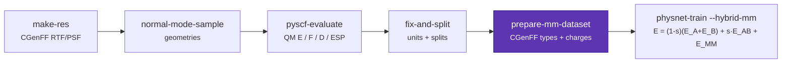
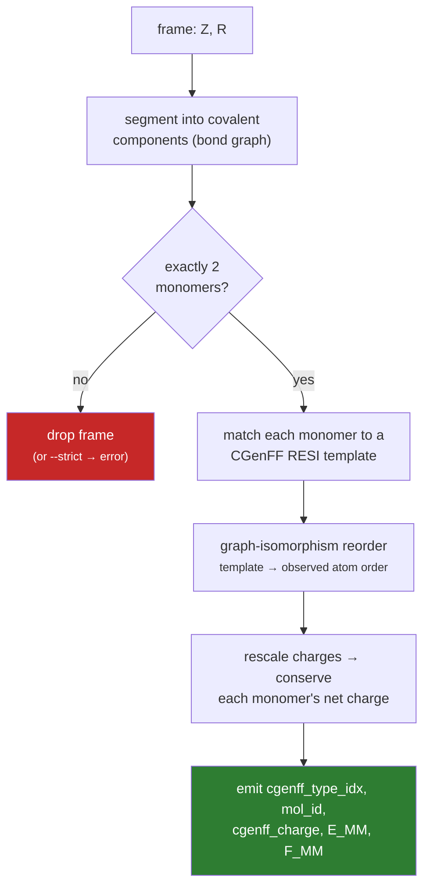
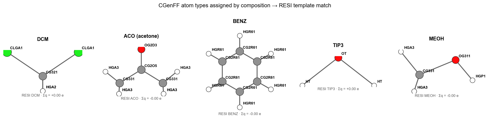
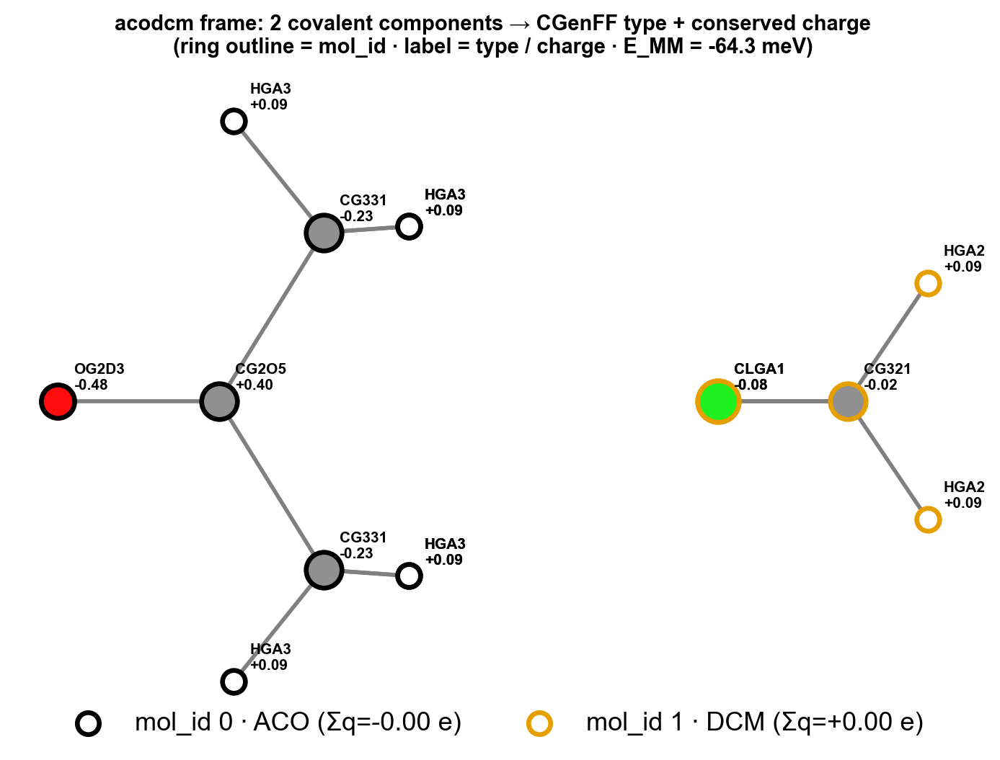
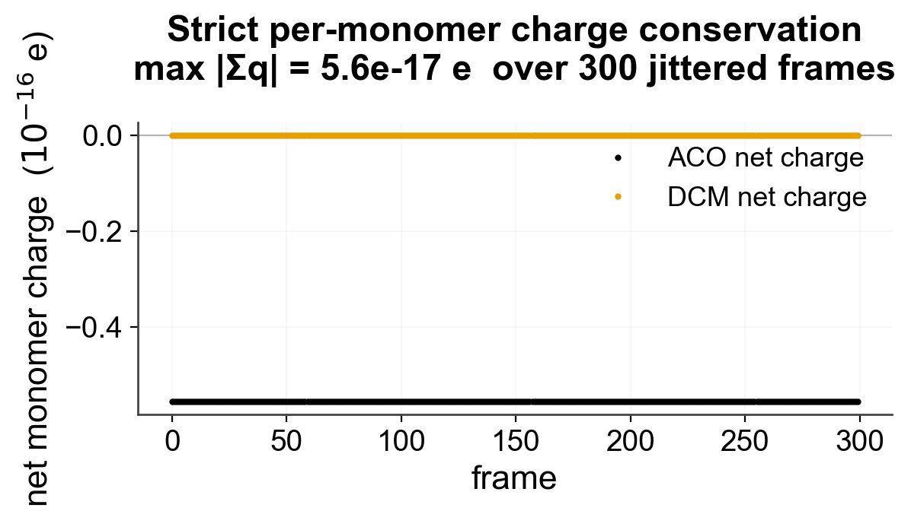
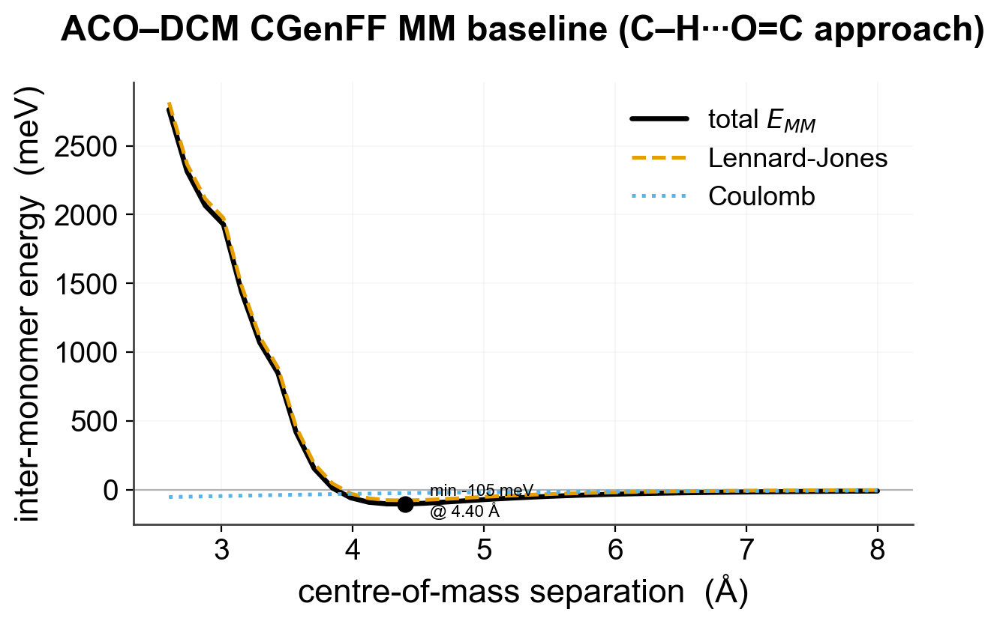
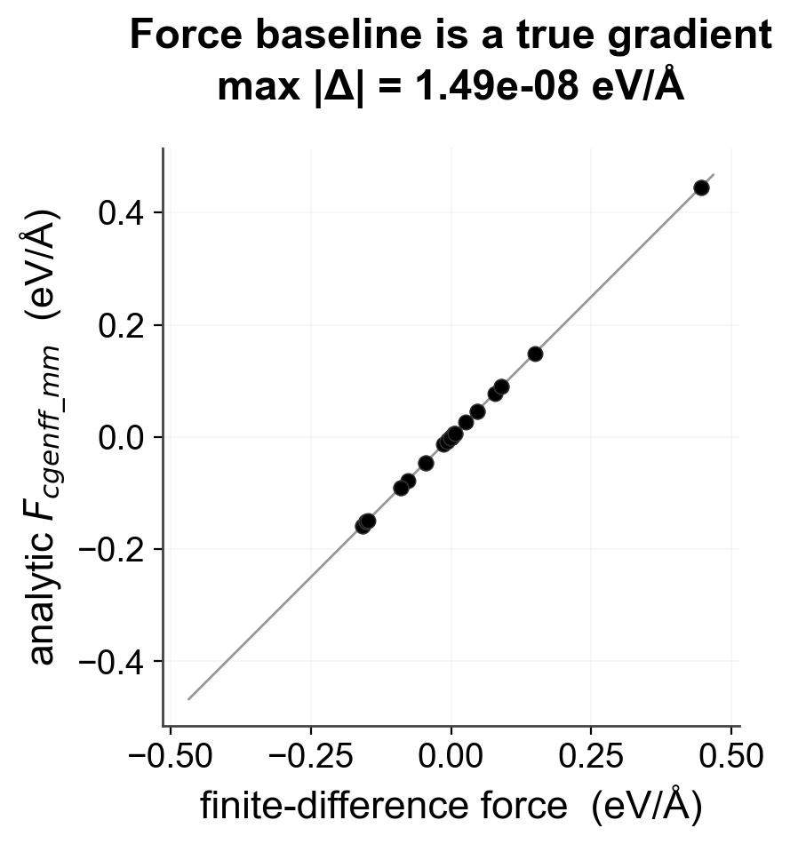

# Preparing hybrid ML/MM datasets: CGenFF atom-type assignment

Hybrid ML/MM training ([`--hybrid-mm`](cli/commands/physnet-train.md)) evaluates

$$E = (1-s)\,(E_A + E_B) + s\,E_{AB} + E_{MM}$$

where the **`E_MM`** term is a CGenFF Lennard-Jones + Coulomb baseline
between the two monomers (LJ σ/ε may later be scaled in training; see
[trainable hybrid MM LJ scales](hybrid-mm-lj-scales.md)). To compute it, every atom in every training frame needs
a **CGenFF atom type** (→ LJ σ/ε), a **CGenFF charge**, and a **monomer id**.

Raw QM datasets (`R`, `Z`, `E`, `F`, `D`, …) carry none of this — a `.npz` from
`pyscf-evaluate` is just geometries and labels. This page describes the step that
adds it: [`mmml prepare-mm-dataset`](cli/commands/prepare-mm-dataset.md), backed
by [`mmml/data/cgenff_dataset.py`](https://github.com/EricBoittier/mmml/blob/main/mmml/data/cgenff_dataset.py).

Everything below is generated from the real pipeline
([`scripts/gen_docs_prepare_mm_figures.py`](https://github.com/EricBoittier/mmml/blob/main/scripts/gen_docs_prepare_mm_figures.py)),
on the tutorial's **acodcm** (acetone–dichloromethane) system.

!!! note "Related"
    [Hybrid MM charges (fixed / q0 / q1)](hybrid-mm-charges.md) ·
    [Trainable hybrid MM LJ scales](hybrid-mm-lj-scales.md) ·
    [Hybrid ML/MM decomposition](hybrid-mlmm-decomposition.md) ·
    [Hybrid potential regions & LR solvers](hybrid-potential-regions.md) ·
    [CHARMM CGenFF JAX clone](cgenff-jax-clone.md)

---

## Where it fits in the workflow



The QM steps produce a **dense, padded** training NPZ (`R (n,atoms,3)`,
`Z (n,atoms)`, `N`, …). `prepare-mm-dataset` reads that and writes the same NPZ
**enriched** with the fields the hybrid trainer requires — it does not touch the
QM labels, only appends the MM scaffolding.

---

## The assignment algorithm

For each frame, working only on the real (unpadded) atoms:



1. **Segment** — atoms are partitioned into connected components using a
   covalent-radius distance cutoff (`1.3·(r_cov,i + r_cov,j)`).
2. **Match template** — each monomer's elemental composition selects a CGenFF
   `RESI` block (explicit fast-paths for the common DES monomers, then a
   composition index, then canonical SMILES for constitutional isomers).
3. **Reorder** — the template's atom order rarely matches the geometry's, so a
   graph-isomorphism solve maps the RTF covalent graph onto the observed one.
   This is what stops a TIP3 `O,H,H` template being applied to an `H,H,O` frame.
4. **Conserve charge** — CGenFF template charges are rescaled by an equal
   per-atom shift so each monomer is exactly net-neutral (or its target ion
   charge).
5. **Emit** — per-atom `cgenff_type_idx` (index into master σ/ε tables),
   `mol_id`, `cgenff_charge`, plus the inter-monomer MM energy/force baseline.

Padding atoms are marked `cgenff_type_idx = -1` and `mol_id = -1`, matching the
mask convention in
[`mmml/models/cgenff_mm.py`](https://github.com/EricBoittier/mmml/blob/main/mmml/models/cgenff_mm.py).

---

## What the assignment looks like

Each monomer's composition selects a CGenFF residue template; every atom gets a
type and a charge:



| Monomer | Composition | RESI | Atom types (in geometry order) | Σq |
|---|---|---|---|---|
| Dichloromethane | CCl₂H₂ | `DCM`  | `CG321`, `CLGA1`×2, `HGA2`×2 | 0.00 |
| Acetone | C₃H₆O | `ACO`  | `OG2D3`, `CG2O5`, `CG331`×2, `HGA3`×6 | 0.00 |
| Benzene | C₆H₆ | `BENZ` | `CG2R61`×6, `HGR61`×6 | 0.00 |
| Water | H₂O | `TIP3` | `OT`, `HT`×2 | 0.00 |
| Methanol | CH₄O | `MEOH` | `CG331`, `OG311`, `HGP1`, `HGA3`×3 | 0.00 |

On the tutorial's **acodcm** dimer, the two covalent components are separated,
matched independently, and labelled — the ring outline colour is `mol_id`, the
text is the CGenFF type and charge:



---

## Output NPZ schema

`prepare-mm-dataset` carries every original per-sample array through (filtering
out dropped frames consistently) and appends:

| Field | Shape | Dtype | Meaning |
|---|---|---|---|
| `cgenff_type_idx` | `(n, atoms)` | int32 | index into master σ/ε tables; **`-1` = padding** |
| `mol_id` | `(n, atoms)` | int32 | monomer id 0/1; **`-1` = padding** |
| `cgenff_charge` | `(n, atoms)` | float64 | per-monomer-conserved CGenFF charge (0 on padding) |
| `cgenff_master_sigmas` | `(n_types,)` | float64 | conventional σ (Å), shared across all frames |
| `cgenff_master_epsilons` | `(n_types,)` | float64 | \|ε\| (kcal/mol), shared across all frames |
| `E_cgenff_mm` | `(n, 1)` | float64 | inter-monomer MM energy (eV) |
| `F_cgenff_mm` | `(n, atoms, 3)` | float64 | inter-monomer MM force (eV/Å) |

The master tables are `(n_types,)` — **not** per-sample — so the batching loader
skips them; the trainer loads them once as closure state
([`make_training.py`](https://github.com/EricBoittier/mmml/blob/main/mmml/cli/make/make_training.py)).
`cgenff_type_idx`, `mol_id` and `cgenff_charge` are the
`HYBRID_MM_BATCH_KEYS` its preflight check requires.

σ follows the conventional `4ε[(σ/r)¹² − (σ/r)⁶]` form; CHARMM's `Rmin/2` is
converted on parse via `σ = 2·(Rmin/2)/2^(1/6)`.

---

## Validation

The point of a fixed MM baseline is that it must be **physically correct and
differentiable**. Three checks, all run on the acodcm system:

### 1. Charge is conserved to machine precision

The per-atom charge rescale keeps every monomer exactly neutral — a non-neutral
monomer would turn the long-range `E_MM` into a spurious monopole (~1/r) term.
Across 300 jittered frames:



### 2. The MM baseline is a sensible interaction curve

Sweeping the acetone–DCM centre-of-mass separation along the C–H···O=C approach
gives a proper LJ-dominated well (minimum ≈ −105 meV at 4.4 Å), with a weakly
attractive Coulomb tail — exactly what a CGenFF non-bonded baseline should look
like:



### 3. The force baseline is a true gradient

`F_cgenff_mm` matches the central finite-difference of `E_cgenff_mm` to
**~10⁻⁸ eV/Å** — so it can be used directly as a force target / residual:



### 4. Parity with CHARMM

The LJ *parameters* and the LJ *formula* used here are independently pinned to
the MD calculator by the unit tests
[`test_cgenff_lj_parity.py`](https://github.com/EricBoittier/mmml/blob/main/tests/unit/test_cgenff_lj_parity.py)
and
[`test_cgenff_mm_energy.py`](https://github.com/EricBoittier/mmml/blob/main/tests/unit/test_cgenff_mm_energy.py),
and the enrichment path itself by
[`test_prepare_mm_dataset.py`](https://github.com/EricBoittier/mmml/blob/main/tests/unit/test_prepare_mm_dataset.py).

---

## Usage

Minimal:

```bash
mmml prepare-mm-dataset -i mp2_nms15_clean_train.npz -o mp2_nms15_clean_train_mm.npz
mmml prepare-mm-dataset -i mp2_nms15_clean_valid.npz -o mp2_nms15_clean_valid_mm.npz
```

Config-driven (flags may still override the file):

```yaml
# prepare_mm.yaml
data: mp2_nms15_clean_train.npz
output: mp2_nms15_clean_train_mm.npz
num_workers: 8          # multiprocessing pool
no_mm_baseline: false   # keep E_cgenff_mm / F_cgenff_mm
```

```bash
mmml prepare-mm-dataset --config prepare_mm.yaml
```

Then point the hybrid trainer at the enriched NPZ:

```bash
mmml physnet-train --config gfn2_nms_hybrid.yaml --hybrid-mm \
    --data mp2_nms15_clean_train_mm.npz \
    --valid-data mp2_nms15_clean_valid_mm.npz
```

Key options ([`--help`](cli/commands/prepare-mm-dataset.md) for the full list):

| Flag | Purpose |
|---|---|
| `-i/--data`, `-o/--output` | input / output NPZ |
| `--config` | YAML seeding the flags below |
| `--num-workers` | multiprocessing pool size (1 = serial) |
| `--no-mm-baseline` | skip `E_cgenff_mm` / `F_cgenff_mm` |
| `--strict` | error on the first unassignable frame instead of dropping it |
| `--max-structures` | process only the first N frames (quick check) |
| `--prm-path` / `--rtf-path` | override the bundled CGenFF `par`/`top` files |
| `--save-config` | write the resolved config back out |

---

## Supported chemistry & how to extend

The bundled CGenFF force field provides **939 `RESI` templates** and **163 atom
types** (plus a `DEFAULT` sentinel). Monomers are resolved by, in order:

1. an explicit composition fast-path (DCM, ACO, BENZ, TIP3, MEOH);
2. a composition → `RESI` index built from the RTF (ambiguous only for
   constitutional isomers);
3. a canonical-SMILES map (`DES_SMILES_TO_RESI`, 100 entries) that disambiguates
   the DES-S66 isomers.

A monomer that matches no template — or whose atoms fall back to the zero-LJ
`DEFAULT` sentinel — is **dropped** (reported in the run summary) rather than
silently mis-parametrised. To add coverage, extend `DES_SMILES_TO_RESI` or the
composition fast-path in
[`cgenff_dataset.py`](https://github.com/EricBoittier/mmml/blob/main/mmml/data/cgenff_dataset.py).

---

## Two entry points, one core

The assignment logic is shared, so both paths produce identical semantics:

| Input | Command | Output | Use for |
|---|---|---|---|
| Dense padded **NPZ** | `mmml prepare-mm-dataset` | enriched NPZ | tutorial-style dimer training splits |
| Ragged **Orbax cache** | [`scripts/prepare_ml_mm_dataset.py`](https://github.com/EricBoittier/mmml/blob/main/scripts/prepare_ml_mm_dataset.py) | Orbax cache | DES-S66 bulk workflow (millions of frames) |

Both import [`mmml.data.cgenff_dataset`](https://github.com/EricBoittier/mmml/blob/main/mmml/data/cgenff_dataset.py)
(`assign_frame_cgenff`, `match_cgenff_template`, `load_reference`).
