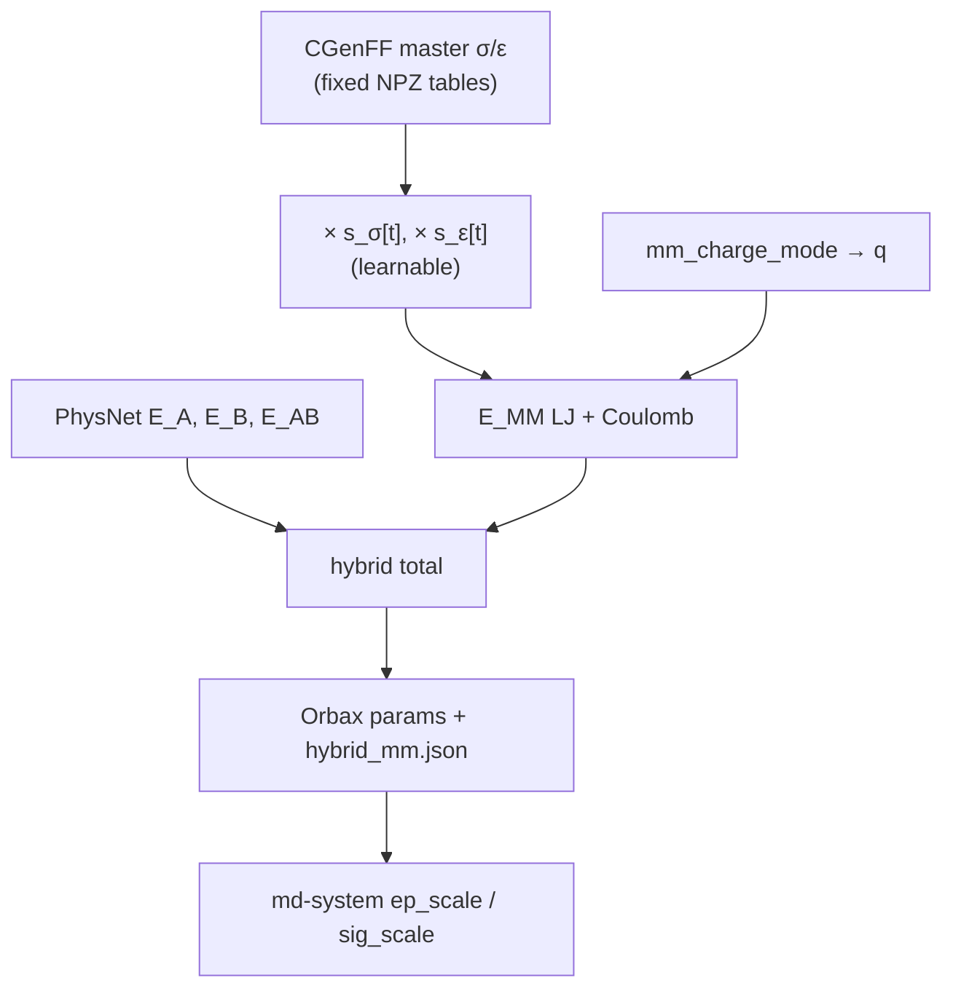

# Trainable hybrid MM LJ scales (per-type σ / ε)

How to train **multiplicative Lennard-Jones scales** on the CGenFF master tables
inside hybrid ML/MM, then deploy them in `md-system`. Aimed at someone who already
has a QM dimer dataset and wants intermolecular MM LJ to adjust during hybrid
training — without replacing CGenFF types or inventing a new force field from
scratch.

Implementation: [`mmml/models/mm_lj_scales.py`](https://github.com/EricBoittier/mmml/blob/main/mmml/models/mm_lj_scales.py).
Energy assembly: [`mmml/models/hybrid_energy.py`](https://github.com/EricBoittier/mmml/blob/main/mmml/models/hybrid_energy.py).

!!! note "Related pages"
    [Hybrid MM charges (q in E_MM Coulomb)](hybrid-mm-charges.md) ·
    [Preparing hybrid ML/MM datasets](hybrid-mm-dataset-preparation.md) ·
    [Hybrid potential regions & cutoffs](hybrid-potential-regions.md) ·
    [Long-range solver tutorial](long-range-solver-tutorial.md) ·
    [Hybrid ML/MM decomposition](hybrid-mlmm-decomposition.md) ·
    [Species-aware interaction policies](md-interaction-policies.md) ·
    [md-system YAML configs](md-system-configs.md) ·
    CLI: [`physnet-train`](cli/commands/physnet-train.md) ·
    [`prepare-mm-dataset`](cli/commands/prepare-mm-dataset.md) ·
    [`md-system`](cli/commands/md-system.md)

---

## What you are training

Hybrid training already evaluates the same total the MD calculator uses:

\[
E = (1-s)\,(E_A + E_B) + s\,E_{AB} + E_{MM}
\]

`E_MM` is switched intermolecular CGenFF **LJ + Coulomb** (MIC path). By default
σ and ε come from fixed master tables baked into the NPZ
(`cgenff_master_sigmas`, `cgenff_master_epsilons`).

With `--learn-mm-lj-scales` / `learn_mm_lj_scales: true`, those tables stay the
**baseline**. Training also optimizes two vectors of length `n_types`:

\[
\sigma^{\mathrm{eff}}_t = \sigma^{\mathrm{CGenFF}}_t \cdot s^\sigma_t,\qquad
\varepsilon^{\mathrm{eff}}_t = \varepsilon^{\mathrm{CGenFF}}_t \cdot s^\varepsilon_t
\]

Both scales initialize at **1.0**. Combining rules are unchanged
(arithmetic Rmin/2, geometric ε) — only the per-type inputs are scaled.

### Bounds (why the scales are projected after every step)

| Scale | Bounds | Why |
|-------|--------|-----|
| \(s^\sigma\) | `0.95 – 1.05` | Rmin is pinned tightly by packing and the repulsive wall. A correction beyond a few percent is compensation for something else, and a scale drifting up drags \(r^{-12}\) into separations the data samples |
| \(s^\varepsilon\) | `0.25 – 4.0` | Well depths are genuinely uncertain to a factor of a few. The hard requirement is the lower end: ε enters as \(\sqrt{\varepsilon_i \varepsilon_j}\), so one type crossing zero NaNs every pair that mixes it with a positive type |

These are enforced by projecting the leaves back into range after every
optimizer update (`clip_mm_lj_scale_params`), not by a penalty term. Two weaker
layers sit underneath for callers that never ran the optimizer: `apply_mm_lj_scales`
floors any scale at `MM_LJ_MIN_SCALE` so it cannot change sign, and the geometric
mean itself is written so a zero or negative ε product contributes nothing
instead of NaN-ing the system.

Unbounded, drift is the *default* outcome rather than an edge case. Adam moves a
parameter by roughly the learning rate per step regardless of gradient
magnitude, so at `lr=1e-3` with `n_train=8000` and `batch_size=16` (500 steps per
epoch) a scale accumulates tens of units of possible travel over a few hundred
epochs — against a distance of 1.0 from the init to the singularity. The
observed failure was a run that trained cleanly for 88 epochs and then went NaN.

A scale that ends *sitting on* a bound is a diagnostic, not a result: the fit
wanted LJ the bounds do not allow, which usually means the LJ is standing in for
missing long-range electrostatics or an unconverged ML term. Step 06 flags them.



### Orthogonal to charge modes

| Knob | Controls |
|------|----------|
| `mm_charge_mode` | Per-atom **q** in intermolecular Coulomb |
| `learn_mm_lj_scales` | Per-type **σ / ε** scales in intermolecular LJ |
| `--charges` / `include_electrostatics` | Charge head **inside** `E_ML` (not `E_MM`) |

You can combine Mode A (`fixed` charges) with LJ scales, or Mode B/C charges with
LJ scales, as long as `mm_include_lj: true` (any of `mic`, `ewald`,
`nvalchemiops_pme`). See
[hybrid-mm-charges.md](hybrid-mm-charges.md).

### What this is *not*

- Not SpookyNet’s in-model CGenFF VdW (`learn_cgenff_vdw_scale`). Hybrid
  deliberately **does not** pass CGenFF tables into `model_apply`, so MM is not
  double-counted.
- Not a free σ/ε head that invents types. Types still come from CGenFF assignment
  ([prepare-mm-dataset](hybrid-mm-dataset-preparation.md)).
- Not applied by CHARMM IMAGE VDW. Under `mm_nonbond_mode: periodic_external` the
  JAX MM term is off, so nothing consumes `hybrid_mm.json` ([#139](https://github.com/EricBoittier/mmml/issues/139)
  step 2). Scales affect hybrid `E_MM` under `mic`, `ewald` and
  `nvalchemiops_pme` (with `mm_include_lj: true`), and MD `jax_mic` /
  native-`ewald` switched MM.

---

## Why you can train LJ *without* Ewald (read this first)

Learning σ/ε under `lr_solver: ewald` is supported. It is still usually not what
you want first: training LJ under truncated MIC and keeping Ewald for Coulomb is
the **recommended** workflow, because the two terms genuinely do not need the
same long-range treatment.

| Term | Falls off as | Lattice sum | Consequence |
|------|--------------|-------------|-------------|
| LJ repulsion / dispersion | \(r^{-12}\), \(r^{-6}\) | Converges absolutely and fast | A switch at 8–13 Å is standard practice; the residual is a small, nearly uniform energy/pressure offset (what an analytic tail correction handles) |
| Coulomb | \(r^{-1}\) | Only *conditionally* convergent | Truncation is qualitatively wrong — it distorts structure and dielectric response, so Ewald/PME is mandatory |

So the split is principled: **σ/ε are short-ranged parameters, and you fit them
with the same short-ranged switched operator you will deploy.** Nothing is lost
by the MIC Coulomb during Stage 1 that Ewald would have told you about the LJ
well depth or radius.

### The catch a student must understand

Because Stage 1 fits σ/ε while Coulomb is truncated, **any Coulomb error can be
absorbed into the LJ parameters**. That is real parameter compensation, and it is
the main way this workflow goes wrong: you get σ/ε that look great in the fit and
then behave badly with Ewald, because part of what they learned was standing in
for missing long-range electrostatics.

Three things keep it bounded — do all three:

1. **Use `mm_charge_mode: fixed`** for the LJ-fitting stage. Fixed CGenFF charges
   have no freedom to co-adapt, so the compensation has one fewer place to hide.
   (This is why `train_fixed_lj_scales.yaml` pins it, even though charge modes
   are otherwise orthogonal.)
2. **Keep the cutoffs identical between training and MD.** `mm_switch_on`,
   `mm_switch_width` and `ml_switch_width` define the operator your σ/ε were
   fitted against; changing them at MD time silently uses the parameters with a
   different energy function. See [Handoff cutoffs](#handoff-cutoffs).
3. **Validate on a property that was not in the loss** — density, or an
   RDF first-peak position. A fit that only reports its own training loss has
   not been validated.

### Which solver for which job

| You want to… | Use | Why |
|---|---|---|
| Learn σ/ε (MIC Stage 1) | `lr_solver: mic`, `mm_include_lj: true`, `learn_mm_lj_scales: true` | Differentiable LJ under MIC |
| Learn σ/ε under Ewald | `lr_solver: ewald`, `mm_include_lj: true`, `learn_mm_lj_scales: true`, `pme_box_length: …` | Same split operator; Coulomb is untapered full-box ([#139](https://github.com/EricBoittier/mmml/issues/139)) |
| Train / TL with Ewald + frozen LJ scales | `lr_solver: ewald`, `mm_include_lj: true`, `learn_mm_lj_scales: false` | Untapered Coulomb + COM-switched LJ |
| Refine ML with Coulomb-only Ewald | `lr_solver: ewald`, `mm_include_lj: false` | Classic Stage 2 TL |
| Deploy scales + LR Coulomb (large box) | `include_mm: true`, `jax_mic` + `lr_solver: jax_pme` | Pair LJ reads scales; jax-pme k-space Coulomb |
| Deploy train-matched Ewald+LJ (small/medium) | `include_mm: true`, `lr_solver: ewald`, `--mm-include-lj` (auto-on if scales loaded) | Untapered Ewald + COM-switched LJ |
| Full-box Ewald via `periodic_external` | `mm_nonbond_mode: periodic_external` | **Scales do not apply** — MLpot refuses `--mm-lj-scales-file` |

Parity check (no CHARMM)::

```bash
python scripts/check_ewald_train_md_pme_parity.py \
  --data path/to.npz --pme-box-length 30 --include-lj
```

---

## Staged MIC LJ then Ewald transfer learning

People often want: train ML + learnable LJ on MIC first, then warm-start a final
Ewald (Coulomb-only) TL step, then run production MD with Ewald **and** the
adjusted LJs. Here is what is supported today.

### What works

**Stage 1 — MIC + LJ scales + ML** (required for learning \(s^\sigma, s^\varepsilon\)):

```yaml
# examples/hybrid_mm_charges/train_fixed_lj_scales.yaml
hybrid_mm: true
lr_solver: mic
mm_include_lj: true
learn_mm_lj_scales: true
mm_charge_mode: fixed
```

```bash
mmml physnet-train --config examples/hybrid_mm_charges/train_fixed_lj_scales.yaml
```

Keep the run’s `hybrid_mm.json` (scale vectors) next to the Orbax/JSON checkpoint.

**Stage 2 — warm-start / TL of ML under Ewald:**

```yaml
# like train_fixed_ewald.yaml, plus restart from Stage 1
hybrid_mm: true
lr_solver: ewald
pme_box_length: 30.0
mm_include_lj: true           # Ewald + switched LJ (false = Coulomb-only TL)
learn_mm_lj_scales: false     # or true to continue learning under Ewald
# restart: /path/to/stage1/orbax_or_params   # or --restart / transfer-learning flags
```

```bash
mmml physnet-train --config path/to/train_ewald_tl.yaml \
  --restart /path/to/stage1/checkpoint
```

```text
E_MM = E_Coulomb_LR (untapered Ewald/PME) + λ_MM(R) * E_LJ(σ_eff, ε_eff)
```

Coulomb stays untapered; LJ uses the COM handoff taper. Large-box deploy can
use `jax_mic` + `jax_pme` (COM-scales LR Coulomb too — different operator).
Train-matched MD: `lr_solver=ewald` + `--mm-include-lj`.

**Deploy MIC MD with adjusted LJs** (supported):

```yaml
# md_fixed_lj_scales.yaml
include_mm: true              # doMM; jax_mic switched MM
# mm_lj_scales_file: .../hybrid_mm.json   # optional if auto-found next to checkpoint
```

Scales load into `ep_scale` / `sig_scale` only when JAX `doMM` is on
(`include_mm: true` and not `periodic_external`).

### What is still unsupported

| Goal | Status |
|------|--------|
| Production **`periodic_external` + Ewald** MD that still applies `hybrid_mm.json` scales | Unsupported — JAX `doMM` is off; CHARMM IMAGE VDW ignores the sidecar |
| Train ewald+LJ ↔ MD `jax_pme` Coulomb COM-taper identity | Different operators — use native `lr_solver=ewald --mm-include-lj` for train-matched MD, or accept jax_pme taper |

Prefer `jax_mic` (+ optional `jax_pme`) for large liquids; use native ewald+LJ
for train-matched dimer/small-box checks. Avoid `periodic_external` when you
need the sidecar.

---

## Prerequisites

1. **Environment** — working `mmml` install with JAX; for MD later, PyCHARMM as usual.
2. **Hybrid-ready NPZ** — train/valid splits with:
   - `R`, `Z`, `E`, `F`, (optional `D`)
   - `cgenff_type_idx`, `mol_id`, `cgenff_charge`
   - `cgenff_master_sigmas`, `cgenff_master_epsilons`
3. How to build that NPZ: [Preparing hybrid ML/MM datasets](hybrid-mm-dataset-preparation.md)
   (`mmml prepare-mm-dataset` or the combined-dataset recipe).

Quick check:

```bash
python - <<'PY'
import numpy as np
p = "path/to/energies_forces_dipoles_train.npz"
with np.load(p) as d:
    need = ["cgenff_type_idx", "mol_id", "cgenff_charge",
            "cgenff_master_sigmas", "cgenff_master_epsilons"]
    missing = [k for k in need if k not in d.files]
    print("missing:", missing or "none")
    print("n_types:", len(d["cgenff_master_sigmas"]))
PY
```

---

## End-to-end recipe

### 1. Train (MIC + learnable LJ scales)

Copy the example YAML and point `data` / `valid_data` at your NPZs:

- Train: [`examples/hybrid_mm_charges/train_fixed_lj_scales.yaml`](https://github.com/EricBoittier/mmml/blob/main/examples/hybrid_mm_charges/train_fixed_lj_scales.yaml)
- Companion MD: [`examples/hybrid_mm_charges/md_fixed_lj_scales.yaml`](https://github.com/EricBoittier/mmml/blob/main/examples/hybrid_mm_charges/md_fixed_lj_scales.yaml)

Essential keys:

```yaml
hybrid_mm: true
mm_charge_mode: fixed          # or q0 / latent / … — orthogonal
learn_mm_lj_scales: true
mm_include_lj: true
lr_solver: mic                 # required for LJ (+ scales)
```

CLI equivalent:

```bash
mmml physnet-train \
  --config examples/hybrid_mm_charges/train_fixed_lj_scales.yaml
# or flags:
#   --hybrid-mm --learn-mm-lj-scales --lr-solver mic --mm-include-lj \
#   --mm-charge-mode fixed --charges ...
```

During the run you should see something like:

```text
Hybrid ML/MM training: ... learn_mm_lj_scales=True
Learnable MM LJ scales enabled (N CGenFF types)
Wrote hybrid MM metadata to .../hybrid_mm.json
```

At the end of training the same `hybrid_mm.json` is updated with the final EMA
scale vectors.

### 2. Inspect `hybrid_mm.json`

Next to the Orbax run directory (and alongside exported `params.json` if you
convert):

```json
{
  "hybrid_mm": true,
  "mm_charge_mode": "fixed",
  "learn_mm_lj_scales": true,
  "include_lj": true,
  "lr_solver": "mic",
  "cgenff_type_names": ["CG2O1", "HGR52", "...", "DEFAULT"],
  "mm_lj_sigma_scale": [1.02, 0.97, ...],
  "mm_lj_epsilon_scale": [1.15, 0.88, ...]
}
```

- `cgenff_type_names` are in **master-table order** (same as the NPZ
  `cgenff_master_*` indices).
- MD remaps these by **type name** onto CHARMM’s ATC list
  (`param.get_atc()`), then multiplies `ep_scale` / `sig_scale`.

Sanity: scales near 1.0 mean “stay close to CGenFF.” Large excursions on rare
types can be underdetermined — check which types actually appear in your
dimers.

### 3. Export checkpoint for MD (if needed)

Follow your usual Orbax → JSON path for PhysNet/Spooky deployment (same as other
hybrid runs). Keep `hybrid_mm.json` next to the run root so MLpot can find it.

### 4. Deploy with `md-system`

```yaml
# defaults in md_fixed_lj_scales.yaml
checkpoint: /path/to/ckpts/.../params.json
# optional explicit path:
# mm_lj_scales_file: /path/to/ckpts/.../hybrid_mm.json
include_mm: true
mm_charge_mode: fixed
```

```bash
# Prefer the Packmol liquid campaign (jaxmd settle before PyCHARMM heat):
mmml md-system \
  --config examples/hybrid_mm_charges/md_fixed_lj_scales_liquid_campaign.yaml \
  --run-all --checkpoint CKPT --mm-lj-scales-file SIDECAR

# Or the numbered ladder:
#   LJ_DEVICE=gpu bash examples/lj_scales/07_deploy_md.sh
#
# Vacuum dimer smoke only:
#   mmml md-system --config examples/hybrid_mm_charges/md_fixed_lj_scales.yaml \
#     --job-id dimer_nve --checkpoint CKPT
```

Resolution order for scales:

1. `--mm-lj-scales-file` / `mm_lj_scales_file` if set
2. `<checkpoint_dir>/hybrid_mm.json` when checkpoint is a directory
3. `<checkpoint.parent>/hybrid_mm.json` (and one level up for Orbax epoch dirs)

With `verbose`, MLpot prints that ATC-length scales were loaded. Under the hood
this is the same `ep_scale` / `sig_scale` path
[`mm_energy_forces`](https://github.com/EricBoittier/mmml/blob/main/mmml/interfaces/pycharmmInterface/mm_energy_forces.py)
already used.

Start with a **vacuum dimer smoke** (`composition: "DCM:2"`, short NVE) before
liquids — same advice as for charge modes.

---

## Handoff cutoffs

Use the **same** `ml_switch_width` / `mm_switch_on` / `mm_switch_width` (and
complementary handoff) in train and MD. Defaults and shared CLI helpers are
documented in [hybrid-potential-regions.md](hybrid-potential-regions.md).
Mismatching cutoffs is a common source of “train looked good, MD is wrong.”

---

## Interaction policies (optional, orthogonal)

Ownership of monomers/pairs (`interaction_policy: ./policy.yaml`) is a separate
document from LJ/charge knobs. See
[md-interaction-policies.md](md-interaction-policies.md).

- Relative paths resolve against the **md-system config directory**.
- Multi-provider / near–far policies **fail closed** until generalized lowering
  exists.
- Single-provider policies are accepted and hashed into the run manifesto.

LJ scales still live on hybrid / md-system flags, not inside the policy file.

---

## Pass / fail checks for a student run

| Check | Pass criterion |
|-------|----------------|
| NPZ has CGenFF fields | No missing keys; `n_types` matches master table length |
| Train starts with scales | Log shows `learn_mm_lj_scales=True` and “Learnable MM LJ scales enabled” |
| Sidecar written | `hybrid_mm.json` has both scale arrays + `cgenff_type_names` |
| Unit scales ≡ baseline | With all `s=1`, hybrid energy matches fixed-LJ hybrid (unit tests) |
| Non-unit scales move LJ | Changing `s^ε` or `s^σ` changes `e_mm` (unit tests) |
| Gradients exist | ∂E/∂s^σ and ∂E/∂s^ε finite and nonzero on a close dimer |
| Scales actually *converge* | Adam recovers a planted σ/ε scale to a few % |
| Scales stay physical | Every trained scale inside `0.95–1.05` (σ) and `0.25–4.0` (ε); none pinned at a bound |
| Absent types untouched | A type not present in the data keeps `s = 1.0` exactly |
| Train → MD continuity | Deployed `at_ep`/`at_rm` equal master × trained scale for the right ATC rows |
| MD loads scales | Verbose MLpot line, or explicit `--mm-lj-scales-file` |
| Ewald/PME + `mm_include_lj: true` | Fixed scales move switched LJ; `learn_mm_lj_scales` is honored and recovers a planted ε |
| `periodic_external` + `--mm-lj-scales-file` | **Errors out** — it cannot apply them (see Troubleshooting) |

Local unit tests (no CHARMM / no GPU required for these):

```bash
uv run pytest tests/unit/test_mm_lj_scales.py \
              tests/unit/test_mm_lj_scales_learning.py \
              tests/unit/test_hybrid_energy.py -q
```

`test_mm_lj_scales.py` covers the mechanics (attach/split/apply, JSON I/O, ATC
remap, nonzero gradients). `test_mm_lj_scales_learning.py` covers planted-scale
recovery, train→MD continuity, and Ewald+LJ isolation (scales move LJ when
`include_lj=True`; inert when `False`).

### An out-of-sample check: crystal sublimation enthalpy

Every check above is internal — it asks whether the scales trained and deployed
correctly, not whether they improved the physics. For an observable that training
never sees, point the learned sidecar at a crystal:

```bash
ACO_SCALES=path/to/hybrid_mm.json \
  uv run python examples/acetone_crystal/05_sublimation.py
```

That evaluates ΔH_sub for solid acetone at three experimental geometries against
a value assembled from calorimetry. Stock CGenFF overbinds by 13% at 150 K, so
there is room for scales to help or hurt visibly. See
[Solid acetone & sublimation enthalpy](acetone-crystal-sublimation.md).

Dichloromethane gives a second, harder check, because it also tests the shape of
the repulsive wall rather than only the depth of the well:

```bash
DCM_SCALES=path/to/hybrid_mm.json \
  bash examples/dcm_crystal/run_all.sh
```

The DCM ladder relaxes the crystal under applied pressure, so scales that fix
ΔH_sub by distorting σ will show up as a wrong cell volume at the two pressures
where the volume was actually measured. See
[Solid dichloromethane & halogen contacts](dcm-crystal-cohesion.md).

---

## Troubleshooting

| Symptom | Likely cause |
|---------|----------------|
| `learn_mm_lj_scales` silently false | `mm_include_lj: false` — there is no LJ term to differentiate, under any solver |
| MD ignores scales | Missing `hybrid_mm.json`, wrong path, or `learn_mm_lj_scales: false` in sidecar |
| `--mm-lj-scales-file … but JAX MM is off` error | You asked to deploy trained LJ under `periodic_external` or with `include_mm: false`, where nothing can consume it. Switch to `--mm-nonbond-mode jax_mic --include-mm`, or drop the flag to run stock CGenFF LJ on purpose |
| `WARNING: … carries trained MM LJ scales but JAX MM is off` | A `hybrid_mm.json` was auto-discovered next to the checkpoint but the run cannot apply it — this run is using **stock** CGenFF LJ. Harmless if intended; otherwise switch to `jax_mic` |
| Loss goes `nan` mid-run after training cleanly for many epochs | An LJ scale drifted out of physical range — ε crossing zero NaNs `sqrt(eps_i eps_j)`, σ drifting up drags the \(r^{-12}\) wall into sampled separations. Fixed by the projection above; if you see it again, the scales are saturating and the LJ is compensating for something else |
| Several types pinned exactly at a bound | The fit wants LJ the bounds forbid. Check the handoff cutoffs and whether `--electrostatics-off-end` is beyond `--cutoff` before widening anything |
| `carries LJ scales outside the trainable bounds` warning on load | Sidecar from a run predating the bounds (or hand-edited). It still deploys, but the LJ it applies is not something training could produce today |
| Fit looks great, density/RDF is wrong under Ewald | Coulomb error absorbed into σ/ε during MIC fitting — see [Why you can train LJ *without* Ewald](#why-you-can-train-lj-without-ewald-read-this-first) |
| Cutoffs differ between train and MD | The σ/ε were fitted against a different operator; match `mm_switch_on` / `mm_switch_width` / `ml_switch_width` |
| ATC length mismatch / wrong types | Sidecar type names don’t match CHARMM ATC; regenerate from the same CGenFF PRM |
| Energies look like double LJ | Spooky in-model VdW + hybrid `E_MM` — hybrid must not pass CGenFF tables into the model (guarded in tests) |
| Charge head errors | Mode B/C need `--charges`; Mode A does not need the head for `E_MM` |

---

## Code map

| Piece | Path |
|-------|------|
| Scale helpers | `mmml/models/mm_lj_scales.py` |
| Hybrid assembly | `mmml/models/hybrid_energy.py` (`learn_mm_lj_scales`) |
| Train CLI | `mmml/cli/make/make_training.py` (`--learn-mm-lj-scales`) |
| Train loop attach / write sidecar | `mmml/models/physnetjax/.../training/training.py` |
| MD load → calculator | `mmml/interfaces/pycharmmInterface/mlpot/hybrid_mlpot.py` |
| MM multiply | `mmml/interfaces/pycharmmInterface/mm_energy_forces.py` (`ep_scale`, `sig_scale`) |
| Example YAMLs | `examples/hybrid_mm_charges/train_fixed_lj_scales.yaml`, `md_fixed_lj_scales.yaml`, `md_fixed_lj_scales_liquid_campaign.yaml` |
| Mechanics tests | `tests/unit/test_mm_lj_scales.py` |
| Convergence + deploy-continuity tests | `tests/unit/test_mm_lj_scales_learning.py` |
