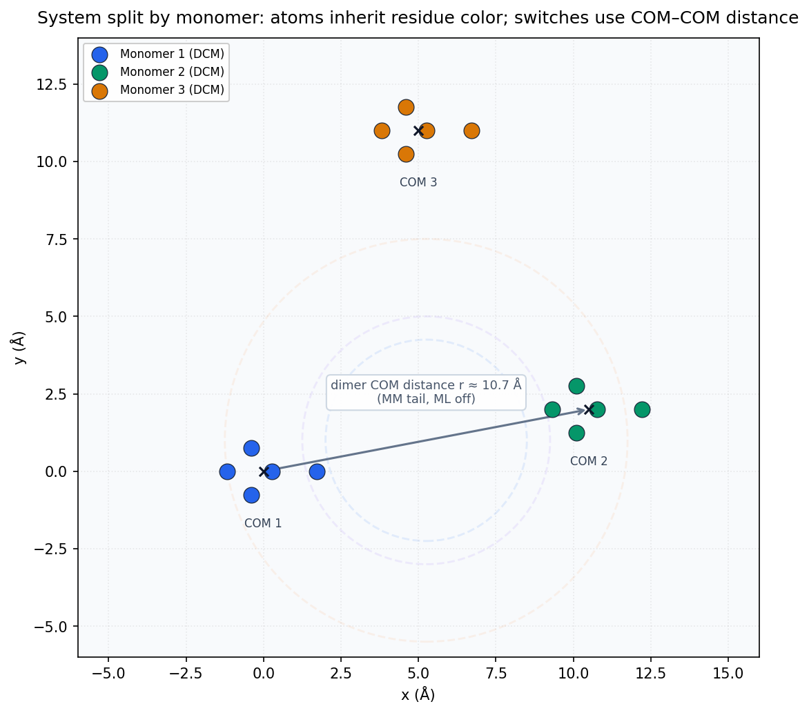
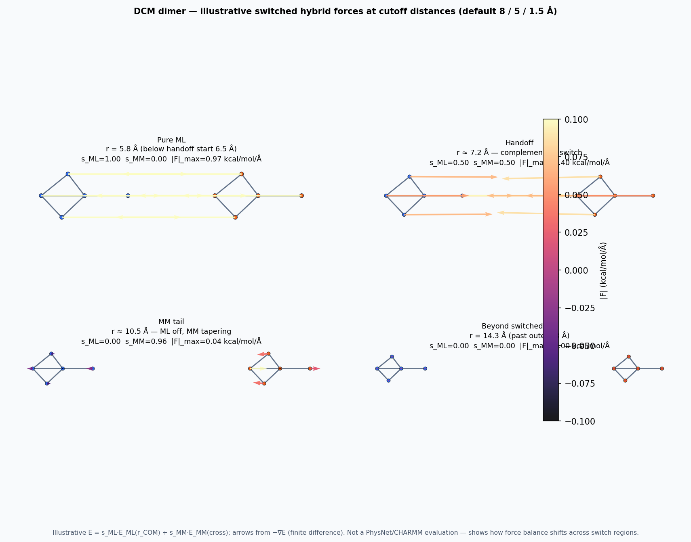
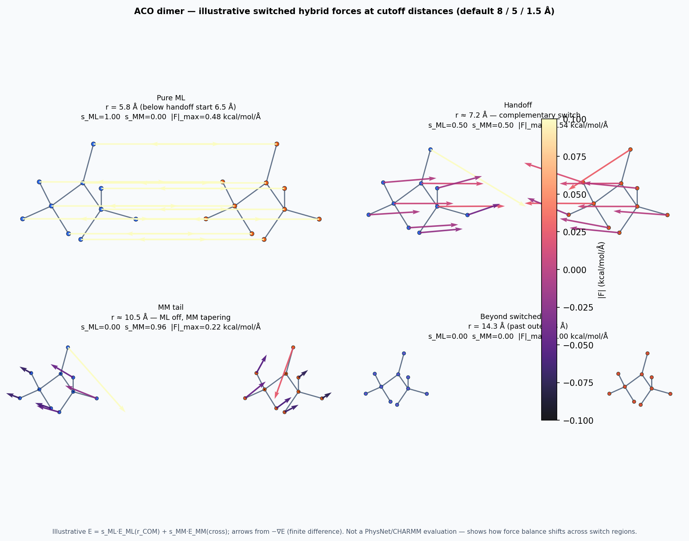
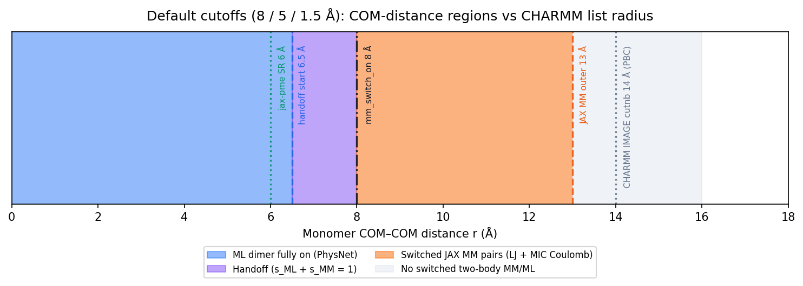
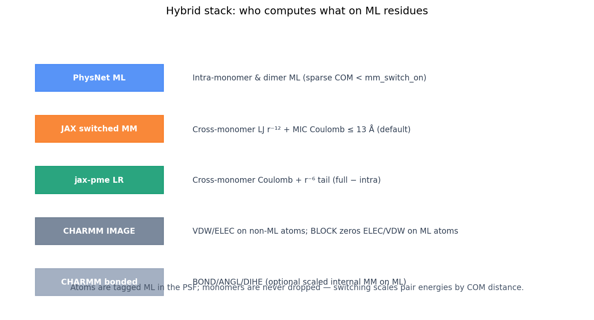
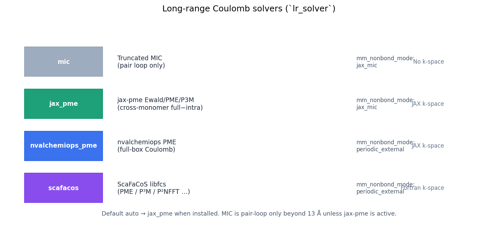
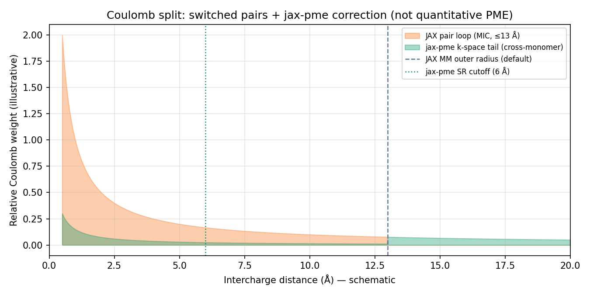

# Hybrid potential: cutoffs, regions, and long-range solvers

Visual guide to how MMML splits a periodic liquid or cluster into **monomers**,
which **physics layer** acts on each interaction, and how **long-range Coulomb**
backends extend beyond the switched pair loop.

Figures regenerate with:

```bash
uv run python scripts/plot_mlpot_settings.py
```

Related: [MLpot switching reference](mlpot-settings.md), [Long-range solver tutorial](long-range-solver-tutorial.md), [md-system YAML cutoffs](md-system-configs.md#cutoffs-mm-toggles-and-long-range-electrostatics).

---

## 1. Monomers are the unit of switching

Every ML residue (e.g. `DCM`, `BENZ`) is one **monomer**. The hybrid calculator:

- Never drops atoms or whole monomers when they approach each other.
- Scales **pair** interaction energies by **monomer center-of-mass (COM) distance** `r`, not atom–atom distance.
- Colors in the figure below are **per monomer** (same CHARMM residue, same PhysNet batch index).



For the highlighted dimer (monomers 1 and 2), `r ≈ 10.5 Å` falls in the **MM tail**: ML two-body is off (`s_ML = 0`), switched JAX MM is partially on and tapering toward zero at 13 Å.

### Dimer force vectors at cutoff distances

Illustrative **switched hybrid** forces (finite difference on  
`E = s_ML(r)·E_ML + s_MM(r)·E_MM`) for **DCM** and **ACO** dimers at COM separations
inside, on, and beyond the default switch regions. Arrow color = |**F**| (kcal/mol/Å);
blue / orange = monomer 1 / 2.





| Panel | Typical COM `r` | Switch region |
|-------|-----------------|---------------|
| Pure ML | ~5.8 Å | `s_ML ≈ 1`, MM off |
| Handoff | ~7.25 Å | `s_ML + s_MM = 1` |
| MM tail | ~10.5 Å | ML off, MM tapering |
| Beyond switched MM | ~14.3 Å | both two-body switches ≈ 0 |

These are **schematic** (LJ+Coulomb cross + r⁻⁶ ML well), not checkpoint energies.
For quantitative curves from PyCHARMM, run the [dimer LR scans](../tests/functionality/dimer_scans/README.md).

---

## 2. COM-distance cutoffs (default 8 / 5 / 1.5 Å)

Three YAML/CLI knobs control the handoff (see `mm_switch_on`, `mm_switch_width`, `ml_switch_width`):

| Symbol | Default | Meaning |
|--------|---------|---------|
| `mm_switch_on` | 8.0 Å | End of ML→MM handoff; MM scale reaches 1 |
| `ml_switch_width` | 1.5 Å | Width of ML taper below `mm_switch_on` |
| `mm_switch_width` | 5.0 Å | MM outer tail; pairs off at `mm_switch_on + width` = **13 Å** |


### Radius ladder (one glance)

The same defaults on a single COM axis, compared with CHARMM IMAGE `cutnb` (PBC liquid, 14 Å) and jax-pme real-space cutoff (6 Å):



| Region (default) | COM range `r` | What runs |
|------------------|---------------|-----------|
| Pure ML | `r ≤ 6.5 Å` | PhysNet monomer + dimer batches; switched MM off |
| Handoff | `6.5 < r < 8 Å` | `s_ML + s_MM = 1` (complementary) |
| MM tail | `8 ≤ r < 13 Å` | Switched LJ + MIC Coulomb in JAX pair loop |
| Beyond 13 Å | `r ≥ 13 Å` | No switched two-body MM/ML; long-range Coulomb from `lr_solver` if enabled |

Preset overlays and complementary vs legacy MM windows: [mlpot-settings.md](mlpot-settings.md).

---

## 3. Dual stack: who computes what

ML-tagged atoms live in the PSF. CHARMM **BLOCK** zeros classical ELEC/VDW on those atoms so the Python callback owns nonbonded ML/MM physics.



| Layer | Pair scope | Typical cutoff |
|-------|------------|----------------|
| **PhysNet** | Intra-monomer + sparse dimers with `r < mm_switch_on` | Model cutoff + COM gate |
| **JAX switched MM** | Cross-monomer atom pairs | `mm_switch_on + mm_switch_width` ≈ 13 Å |
| **jax-pme** (`lr_solver: jax_pme`) | Cross-monomer Coulomb + optional r⁻⁶ tail | SR 6 Å + k-space |
| **CHARMM IMAGE** | Non-ML atoms; VDW on ML path when `periodic_external` | `cutnb` ≈ 14 Å (PBC, scaled to box) |

Intra-monomer electrostatics stay in **ML**; jax-pme uses `E_full − E_intra` on cross-monomer terms so ML is not double-counted.

---

## 4. Long-range Coulomb solvers

With `mm_nonbond_mode: jax_mic` (default), short-range LJ r⁻¹² stays on the switched pair list. Coulomb beyond the pair loop is optional:



| `lr_solver` | Best for | Notes |
|-------------|----------|-------|
| `mic` | Smoke tests, small clusters | Truncated MIC only; no k-space |
| `jax_pme` | **Production hybrid liquids** (default `auto`) | Ewald / PME / P3M; cross-monomer full−intra |
| `nvalchemiops_pme` | `periodic_external` benchmarks | Full-box PME via nvalchemiops |
| `scafacos` | `periodic_external` + Fortran PME | Requires `libfcs.so` |

Schematic split (illustrative, not a quantitative PME decomposition):



CLI / YAML examples and solver sweeps: [long-range-solver-tutorial.md](long-range-solver-tutorial.md).

---

## 5. CHARMM vs JAX list radii (do not conflate)

Two independent neighbor systems run each step ([NONBOND_LISTS.md](https://github.com/EricBoittier/mmml/blob/main/mmml/interfaces/pycharmmInterface/mlpot/NONBOND_LISTS.md)):

| List | Owner | Outer radius (typical) |
|------|-------|------------------------|
| CHARMM `JNB` / IMAGE | Fortran | `cutnb` 14–18 Å (PBC scaled to `L/2`) |
| JAX MM pairs | Python callback | `mm_switch_on + mm_switch_width` = 13 Å |
| ML dimers | PhysNet batches | COM &lt; `mm_switch_on` (8 Å default) |

Campaign YAML should set the same `mm_switch_on` / `mm_switch_width` / `ml_switch_width` on **PyCHARMM** and **JAX-MD** legs so handoffs stay aligned.

---

## 6. Quick YAML block

```yaml
defaults:
  mm_switch_on: 8.0
  mm_switch_width: 5.0
  ml_switch_width: 1.5
  mm_nonbond_mode: jax_mic
  lr_solver: jax_pme
  jax_pme_method: ewald
  jax_pme_sr_cutoff: 6.0
  jax_pme_dispersion: true
```

Liquid DCM boxes also need `L/2` safely above CHARMM `cutnb` — see [liquid-box workflow](liquid-box-workflow.md).

## Example dimer scans (DCM / ACO + all LR backends)

Rigid COM-distance scans for **DCM:2** and **ACO:2** compare `mic`, **jax-pme** (ewald/pme/p3m), and `periodic_external` backends (jax-pme, nvalchemiops, ScaFaCoS):

```bash
export MMML_CKPT=/path/to/checkpoint
./scripts/run_dcm_aco_dimer_lr_scans.sh
uv run python scripts/plot_dimer_lr_scan_compare.py --root artifacts/dimer_lr_scans
```

Full tables and single-scan examples: [tests/functionality/dimer_scans/README.md](https://github.com/EricBoittier/mmml/blob/main/tests/functionality/dimer_scans/README.md).
