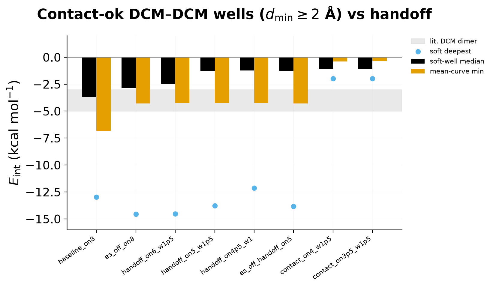

# DCM–DCM overbinding ablations

Epoch222 hybrid checkpoint. Ablation grid: 64 rays × 36 COM distances
(`scripts/slurm/dense_dt_campaign/ablate_overbind.py`).

Literature DCM dimer wells are about **−3 to −5 kcal/mol**.

## Contact-ok results (authoritative)

COM–COM `r` alone is not steric for DCM. Metrics below keep only points with
intermolecular atom–atom $d_\mathrm{min} \geq 2$ Å
(`DEFAULT_ORIENT_MIN_CONTACT_A`). Soft well = per-ray min at $r \geq 3.4$ Å
among contact-ok points.

| Setting | Soft median | Soft deepest | Mean-curve min | Verdict |
|---|---:|---:|---:|---|
| baseline train handoff (`on=8`) | **−3.7** | −13.0 | −6.8 | soft median ≈ lit; mean curve & deep tails still overbind |
| ES-off `on=8` | −2.9 | −14.6 | −4.3 | ES not the driver |
| lever-2 soft `on=6` | −2.5 | −14.5 | −4.3 | milder overbind / near underbind |
| **lever-2 soft `on=5` (campaign default)** | **−1.3** | −13.8 | −4.3 | soft median **underbinds**; deep rays remain |
| lever-2 `on=4.5` | −1.2 | −12.1 | −4.3 | same pattern |
| contact deploy `on=3.5` | −1.1 | −2.0 | −0.4 | kills deep wells, soft underbinds |
| short CPU FT @ `on=5` | ~−1 | ~−1.5 | ~−0.3 | collapsed — not usable |



So yes — **it still overbinds in the sense that matters for density**: the
orientation-mean curve for train handoff bottoms near **−7 kcal/mol**, and a
fat tail of soft rays reaches **−13**. The soft *median* (−3.7) looks fine;
averages and MD sample the deep tail too.

## What helps MD (not cosmetic)

| Change | MD effect | Status |
|---|---|---|
| Contact filter on *reported* scan metrics | Cosmetic for analysis only — MD still sees clashes | docs only |
| **Deploy `DDC_HANDOFF=soft` (`on=5`)** | Soft median → ~−1.3 (underbinds); deep contact rays still −10…−30 until ML unlearns | **shipped in campaign** |
| Deploy `DDC_HANDOFF=contact` (`on=3.5`) | Kills contact wells; soft underbinds | diagnostic |
| **Retrain at `on=5`** matching deploy | Needed so soft wells stay ~−4 and contact rays unlearn | **recommended** |
| POV / overlays / bounding boxes | Visualization only | cosmetic |

Deploy-time earlier handoff is a real force-field change (ML interaction
switches off sooner), so dense NVT should feel less medium-range attraction —
but it is a train/deploy mismatch until you retrain. Clash-filtered figures do
**not** change the Hamiltonian.

## Raw (unfiltered) table — legacy

These include steric overlaps and look much worse (soft medians −8…−9). Kept
for comparison with older notes.

| Run | Soft well mean (raw) | Contact ray-min median | ML full below |
|---|---:|---:|---:|
| baseline / ES-off `on=8` | ~−8.4 | ~−30 | 6.5 Å |
| `handoff_on5_w1p5` | ~−5.4 | ~−30 | 3.5 Å |
| `contact_on3p5_w1p5` | ~−1.2 | ~−1.1 | 2.0 Å |

## How to fix contact rays (r ≲ 3.4 Å)

Contact minima sit where `ml_scale=1` even under soft lever-2 (ML full below 3.5 Å).

| Approach | Soft well | Contact wells | Status |
|---|---|---|---|
| Deploy `DDC_HANDOFF=contact` (on=3.5) | underbinds (~−1) | fixed | diagnostic only |
| **Retrain at on=5** with dimer soft targets | keep ~−4 | should unlearn | **recommended** |

```bash
# Preferred: GPU sbatch (records job id)
mkdir -p artifacts/lj_scales/dense_dt_campaign/logs
bash scripts/slurm/dense_dt_campaign/submit_train_lever2_on5.sh

# Equivalent one-shot (same defaults as train_fixed_lj_scales_on5.yaml)
uv run mmml physnet-train \
  --config examples/hybrid_mm_charges/train_fixed_lj_scales_on5.yaml \
  --data artifacts/lj_scales/dataset_cgenff.npz \
  --valid-data "" \
  --physnet-checkpoint artifacts/lj_scales/ckpts/params_hybrid_mm_fixed_lj_scales_epoch222.json \
  --match-checkpoint-architecture \
  --hybrid-mm --learn-mm-lj-scales --lr-solver mic \
  --mm-switch-on 5.0 --ml-switch-width 1.5 --mm-switch-width 5.0 \
  --tag hybrid_mm_lever2_on5_ft --num-epochs 50 \
  --n-train 32000 --n-valid 5950
```

## Assets

- `contact_ok_settings_compare.png` — contact-ok soft median / mean-curve / deepest
- `overbind_ablation_compare.png` — older unfiltered mean curves
- Regenerated contact-ok table: `contact_ok_settings.json`
- Overlay profiles: `../dimer_scans/dcm_dimer_Eint_*_povray.png`
