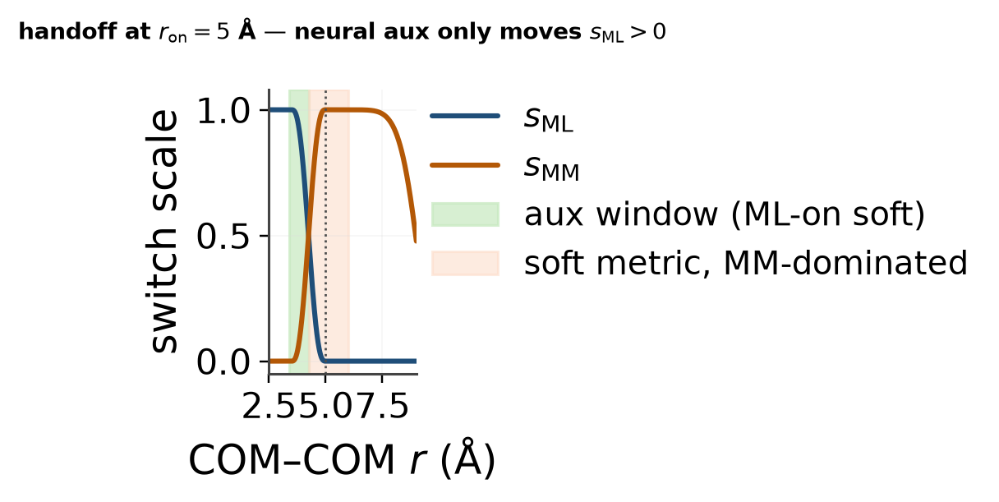

# Softwell `on=5` deploy-ready — why it should work

Contact-ok soft wells (intermolecular $d_\mathrm{min}\ge 2$ Å,
per-ray min at $r\ge 3.4$ Å).

## Verdict

| | Soft median | Soft deepest | Mean-curve min | deploy_ready |
|---|---:|---:|---:|:---:|
| deploy-only ep222 @ on=5 | -1.26 | -13.79 | -4.27 | no |
| **softwell FT ep20** | **-3.05** | **-13.43** | **-4.41** | **True** |

Gates: soft median ∈ lit −5…−3 (±0.5), deepest ≳ −15, mean-curve ≳ −8.

Best ckpt: `/mmhome/boittier/home/mmml/artifacts/lj_scales/ckpts/hybrid_mm_lever2_on5_softwell-657cb7db-74a1-4623-84a5-f772b8fe7928/epoch-20`.

## Why the lever works (and why earlier FT failed)

At `mm_switch_on=5`, ML interaction is **fully off for $r\ge 5$ Å**
($s_\mathrm{ML}\to 0$). Soft-metric geometries with $r\gtrsim 4.5$ Å are
dominated by **frozen MM LJ** — a neural loss there cannot deepen wells
(component diag: underbinders had $s_\mathrm{ML}\approx 0$,
$E_\mathrm{int}\approx E_\mathrm{MM}\approx -0.7$ kcal/mol).

Softwell aux therefore trains only in the **ML-on soft window**
$r\in[3.4,4.25]$ Å ($s_\mathrm{ML}\gtrsim 0.5$), pulling hybrid
$E_\mathrm{int}=s\,\Delta E_\mathrm{ML}+E_\mathrm{MM}$ into lit
−5…−3 kcal/mol while capping deep tails. Soft wells that used to sit in the
MM-only zone as shallow minima (~−1.3) are replaced by deeper ML minima near
~4 Å, so the contact-ok soft median moves into lit without −20 kcal clash
wells.

## Figures

| File | What it shows |
|---|---|
| [`xy_Eint_vs_r_contact_ok.png`](xy_Eint_vs_r_contact_ok.png) | XY scatter $E_\mathrm{int}(r)$ before/after |
| [`xy_mean_curve_compare.png`](xy_mean_curve_compare.png) | Orientation-mean curves ±σ |
| [`xy_soft_well_hist_compare.png`](xy_soft_well_hist_compare.png) | Soft-well histogram vs lit / deepest floor |
| [`xy_soft_well_depth_vs_r_at_min.png`](xy_soft_well_depth_vs_r_at_min.png) | Soft-well depth vs $r$ at min — wells move into ML-on $r$ |
| [`xy_EML_vs_EMM_ml_on_window.png`](xy_EML_vs_EMM_ml_on_window.png) | $E_\mathrm{ML}$ vs $E_\mathrm{MM}$ colored by $s_\mathrm{ML}$ |
| [`xy_switch_schematic_on5.png`](xy_switch_schematic_on5.png) | Handoff scales + aux window |
| `povray/` | POV stills of contact-ok soft geometries |
| `pbc_translation.json` | PBC image/translation invariance on DCM:120 L=24 |

## PBC confirmation

See `pbc_translation.json` (lattice shift / wrap cases). Pass criterion:
$|\Delta E|\lesssim 10^{-4}$ eV and force max-abs delta $\lesssim 10^{-3}$ eV/Å
on lattice and molecule-wrapped images (repeat-only isolates nondeterminism).
