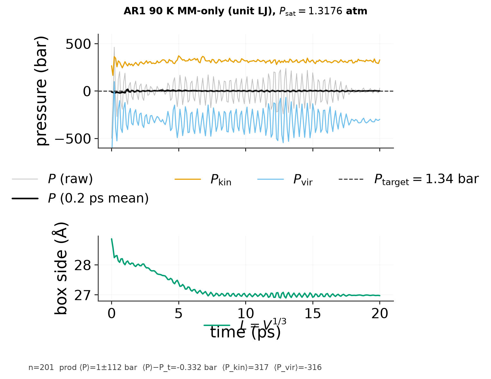

# Argon MM-only NpT pressure

Pure Lennard-Jones (`AR1:500`, literature noble-gas parameters, **unit** LJ
scales, **no ML**). Certified box at 90 K / saturation pressure
(1.3176 atm ≈ 1.335 bar).

| | value |
|---|---:|
| run | `artifacts/npt_argon_water/runs/ar1_90k_mmonly_unit/` |
| length | 20 ps, dt = 1 fs, jaxmd-unified |
| ⟨P⟩ (all) | −0.48 bar (σ = 118 bar) |
| ⟨P⟩ (last 70%) | **1.00 bar** vs target **1.335 bar** |
| ⟨P_kin⟩ / ⟨P_vir⟩ (prod) | ~317 / ~−316 bar |
| ρ (prod) | ~1.68 g/cm³ vs NIST sat. liquid 1.379 g/cm³ |

**Pressure takeaway:** virial is live. Kinetic-only pressure would sit near
~300 bar; here P_kin and P_vir cancel and ⟨P⟩ tracks the 1.3 bar target within
noise on this short window.

Density is high vs NIST on 20 ps (box still settling from the certified start
near ρ_ref; literature Ar LJ + short prod). Longer EQ/PROD would be needed for
a density claim — this arm is the pressure/virial smoke.
