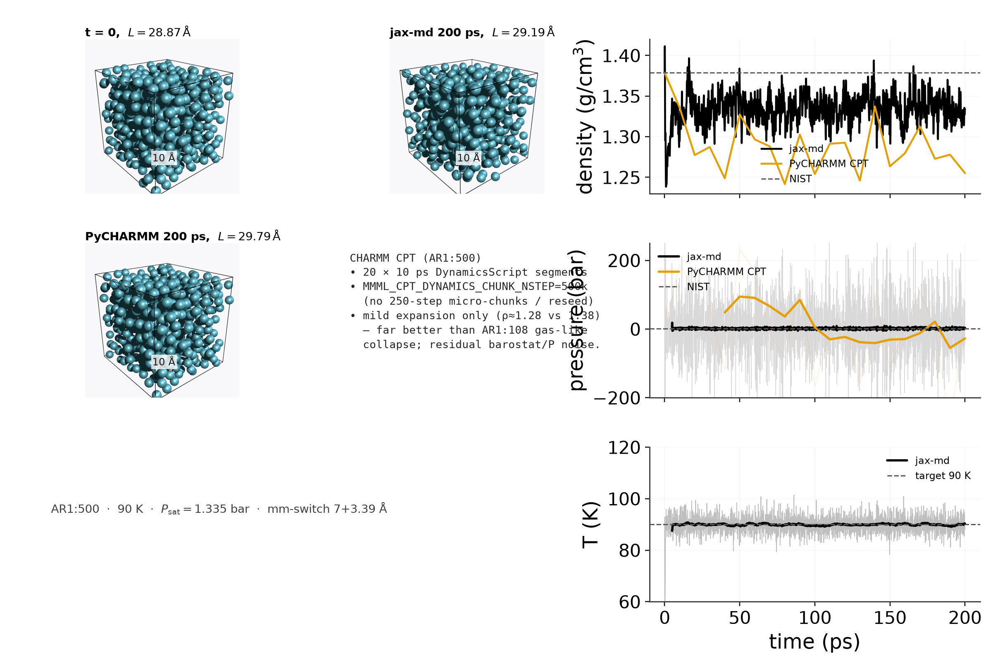
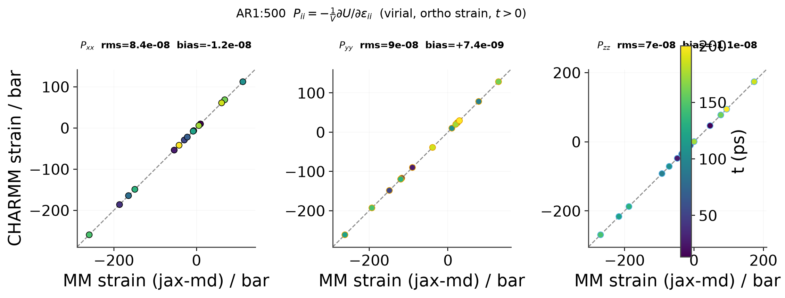

# Argon MM-only NpT pressure

Pure Lennard-Jones (`AR1`, literature noble-gas parameters, **unit** LJ
scales, **no ML**). Certified boxes at 90 K / saturation pressure
(1.3176 atm ≈ 1.335 bar).

## Backend comparison (AR1:500, 200 ps) — primary



POV-Ray: [`before`](ar1_90k_n500_before.png) → [`jax-md after`](ar1_90k_n500_after_jaxmd.png) /
[`PyCHARMM after`](ar1_90k_n500_after_pycharmm.png) (10 Å ruler).
CHARMM “after” uses affine-scaled initial packing into the final cell (no
coord dump was saved); cell length is from the live CPT trajectory.

| Backend | ⟨ρ⟩ last 70% (g/cm³) | ⟨P⟩ last 70% (bar) | wall | Notes |
|---------|---------------------:|-------------------:|-----:|-------|
| **jax-md** (unified) | 1.335 | 1.66 | ~11 min (GPU) | continuous Nose–Hoover; ⟨T⟩ ≈ 90 K |
| **PyCHARMM** CPT (10 ps segments, no reseed) | 1.281 | −17.7 (noisy) | ~2.5 min (CPU) | mild expansion only (L 28.87→29.79) |
| **ASE** | — | — | — | `pbc_npt` not supported |
| NIST sat. (90 K) | **1.379** | **1.335** | — | reference |

Matched `mm-switch` 7+3.39 Å (fits under L/2 ≈ 14.4 Å). Larger box removes
the AR1:108 gas-like CHARMM collapse; residual density offset and PRSI noise
remain.

## Pressure-tensor parity (shared frames)



On 16 frames from the jax-md trajectory, both engines’ **strain** pressure
(virial only; `PI**` is 0 outside DYNA on this build). **Diagonal** components
use orthorhombic uniaxial strain and agree to numerical noise after \(t>0\).
Off-diagonal / shear is **not** shown: this KEY_LIBRARY CHARMM still reports a
cubic cell after `define_tri` (even γ=85° → get_unit_cell γ=90°), so shear FD
was cubic MIC with remapped coords and produced fake systematic slopes.

| | \(P_{xx,yy,zz}\) |
|--|--:|
| CHARMM vs MM (jax-md) | rms \(\sim 10^{-7}\) bar |

```bash
uv run python scripts/plot_argon_pressure_tensor_parity.py
uv run python scripts/plot_argon_npt_backend_comparison.py
```

Runs under `artifacts/npt_argon_water/runs/ar1_90k_n500_{jaxmd,pycharmm_pure}_200ps/`.
See also [NpT jax-md ↔ PyCHARMM CPT](../../npt-jaxmd-charmm-comparison.md).

## Smaller-box smoke (AR1:108, 200 ps)

On `AR1:108` (L₀≈17.3 Å, forced `mm-switch` 4+2 Å) continuous CHARMM CPT still
drives ρ → ~0.7 g/cm³. POV stills: [`before`](ar1_90k_n108_before.png) /
[`jax-md`](ar1_90k_n108_after_jaxmd.png) /
[`PyCHARMM`](ar1_90k_n108_after_pycharmm.png).

| Backend | ⟨ρ⟩ last 70% | ⟨P⟩ last 70% | Notes |
|---------|-------------:|-------------:|-------|
| jax-md | 1.315 | 1.15 | OK |
| PyCHARMM long CPT | 0.693 | 57.5 | expands to gas-like |
| NIST | 1.379 | 1.335 | |

## Longer jaxmd-unified smoke (AR1:500, 20 ps)


| | value |
|---|---:|
| run | `artifacts/npt_argon_water/runs/ar1_90k_mmonly_unit/` |
| length | 20 ps, dt = 1 fs, jaxmd-unified |
| ⟨P⟩ (last 70%) | **1.00 bar** vs target **1.335 bar** |
| ⟨P_kin⟩ / ⟨P_vir⟩ (prod) | ~317 / ~−316 bar |
| ρ (prod) | 1.685 ± 0.002 g/cm³ vs NIST 1.379 (**not equilibrated**) |

**Pressure takeaway:** virial is live. Kinetic-only pressure would sit near
~300 bar; here P_kin and P_vir cancel and production ⟨P⟩ ≈ 1.0 bar tracks the
1.3 bar target within noise.
