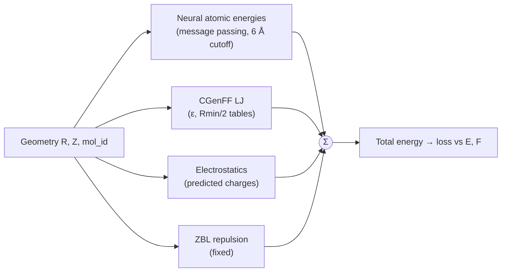
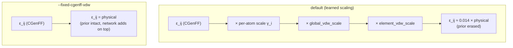
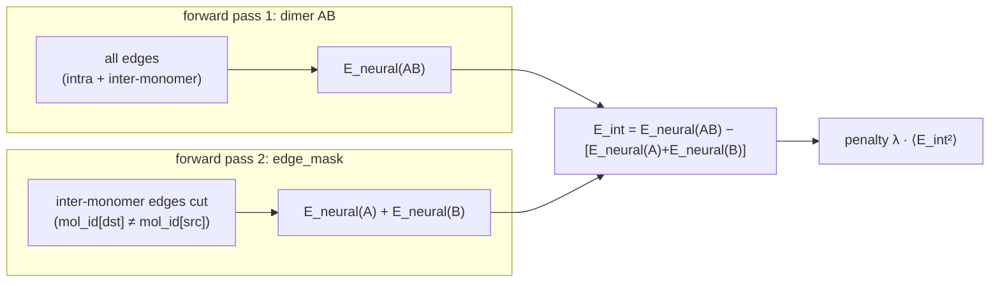
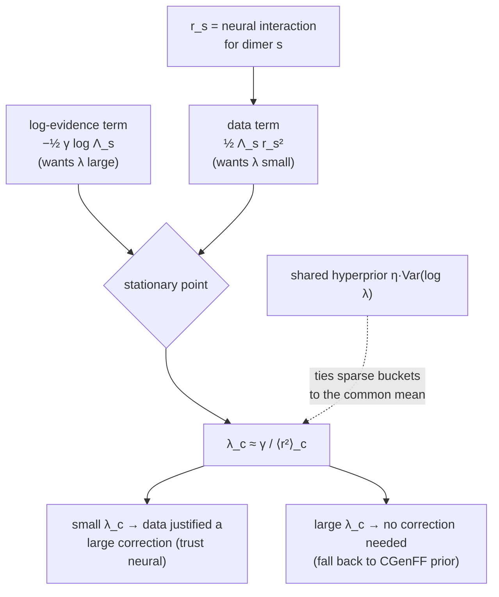

# Constraining the neural interaction to a physical prior

The SpookyNet hybrid potential predicts a **total energy** that is the sum of a
learned neural part and a set of physical priors (CGenFF Lennard-Jones,
point-charge electrostatics, ZBL repulsion):



Nothing in the default model constrains how large the **neural interaction
energy** may be relative to those priors. Measured on the 15-pair dimer scans,
it is loudest exactly where it should be quietest:

!!! danger "The neural interaction is 4.1× *larger* where there is no data"
    | training structures for the pair | mean \|neural interaction\| |
    |---|---|
    | ≥ 300 | 0.93 kcal/mol |
    | < 15 | 3.85 kcal/mol |

    On `ACE–BENZ` (2 training structures) the neural interaction is **7.76
    kcal/mol** sitting on an LJ prior of **0.007** — so the network *invents* a
    surface that is +11.9 kcal/mol from PBE0-D3BJ where plain CGenFF is within
    0.5. Separately, the learned LJ scaling had collapsed the prior itself to
    ~1% of its physical value (`global_vdw_scale = 0.14`).

Three training flags constrain this, in increasing sophistication. All are
opt-in; the default behaviour is unchanged.

---

## 1. `--fixed-cgenff-vdw` — pin the LJ prior

By default the CGenFF ε is multiplied by three *learned* factors (a per-atom
predicted scale, a global scale, and a per-element scale), so the network can
scale the force-field prior toward zero and take over. This flag removes all
three, so the LJ term is a fixed physical baseline the network can only add to.



```bash
--fixed-cgenff-vdw
```

!!! warning "Freezing the prior alone is not enough — it can make things worse"
    A control that only froze the prior (no other change) scored **6.66**
    kcal/mol mean dimer RMSE vs 3.63 for the unconstrained model. Restoring the
    prior to full strength while the neural term still compensates for a *scaled*
    prior **double-counts**. `--fixed-cgenff-vdw` is only useful together with a
    constraint on the neural term (§2/§3).

---

## 2. `--neural-interaction-l2 <λ>` — shrink the neural interaction

A ridge penalty on the neural **interaction** energy, i.e. the part of the neural
prediction that couples the two monomers:

$$
\mathcal{L} \mathrel{+}= \lambda \,\Big\langle \big(E^{\text{int}}_{\text{neural}}\big)^2 \Big\rangle,
\qquad
E^{\text{int}}_{\text{neural}} = E_{\text{neural}}(AB) - E_{\text{neural}}(A) - E_{\text{neural}}(B)
$$

The **target stays the total energy** — this only regularises how loudly the
neural term speaks on top of the prior, so the zero-evidence limit becomes CGenFF
instead of an invented surface.

The monomer reference $E_{\text{neural}}(A)+E_{\text{neural}}(B)$ is obtained
*exactly* by one extra forward pass with the inter-monomer edges removed from the
message-passing graph:



!!! note "`edge_mask`, not `batch_mask`"
    The prior terms (LJ / electrostatics / ZBL) are gated by `batch_mask`, but the
    **neural** message-passing graph runs over `dst_idx`/`src_idx` independently.
    Masking `batch_mask` alone leaves the interface fully connected and the
    penalty is identically zero. `SpookyPhysNet` therefore takes an optional
    `edge_mask` that zeroes the message-passing **basis** for masked edges. The
    masked interaction is verified nonzero at contact and exactly zero beyond the
    6 Å cutoff.

```bash
--fixed-cgenff-vdw --neural-interaction-l2 1.0
```

A single scalar λ works but is blunt: it fixes sparse dispersion pairs
(`BENZ–BENZ` 3.62 → 0.74) while over-taxing well-covered hydrogen bonds that
genuinely need a large neural correction (`ACE–TIP3`, 1632 structures,
0.70 → 2.84). One knob cannot say *"shrink C–C hard, leave O–H alone."*

---

## 3. `--interaction-trust-map` — a learned per-element-pair λ

Generalises the scalar λ to a **learned** $6\times6$ log-shrinkage matrix over
(H, C, N, O, S, Cl), fit by an evidence-balanced negative log-likelihood:

$$
\mathcal{L}_{\text{tm}} =
\tfrac12\,\Lambda_s\,r_s^2
\;-\;\tfrac12\,\gamma\,\log \Lambda_s
\;+\;\eta\,\text{Var}(\log\lambda)
$$

where $r_s$ is a dimer's neural interaction energy and $\Lambda_s$ is the
interface-contact-weighted average of $\lambda_{Z_iZ_j}$ over its inter-monomer
element pairs. The two terms pull in opposite directions:



The stationary point $\lambda_c \approx \gamma/\langle r^2\rangle_c$ (unit-tested)
is what makes the matrix meaningful: shrinkage is **small where the data
supported a large neural correction, large where it did not**. The shared
hyperprior lets data-poor element pairs borrow strength from the rest.

```bash
--fixed-cgenff-vdw --interaction-trust-map \
    --neural-interaction-l2 1.0 \
    --trust-map-evidence 1.0 --trust-map-hyperprior 0.1
```

### The trust map as a data-provenance fingerprint

The learned matrix is a genuine model parameter (checkpointed and restarted like
any other). Dump and rank it with:

```bash
python scripts/dump_trust_map.py path/to/step-000XXXXX_params.json
```

```text
             H      C      N      O      S     Cl
  H     0.759  0.759  0.746  0.740  0.724  0.735
  C     0.759  0.748  0.744  0.744  0.726  0.735
  ...
```

Least-shrunk (most trusted) pairs are O-containing — hydrogen-bonded chemistry
where the network correction is real; most-shrunk are H–C / C–C — alkyl/aromatic
carbon where CGenFF already suffices.

!!! warning "It is a *trust map*, not a membership oracle"
    $\lambda_c$ reads *"where does the model rely on a learned correction"*, which
    conflates two independent things: how much data the pair had, **and** whether
    CGenFF was already adequate. Measured across pairs,
    `Spearman(coverage, prior-deviation) = -0.01` — so a chemistry the prior
    already handles reads as "unseen" regardless of coverage (e.g. `ACE–ACE`, 125
    training structures, but CGenFF is nearly exact). Use it to know *when to
    trust the ML term vs. the force field*, not to reconstruct the training set.

---

## What the constraints actually buy

Two evaluation axes disagree, and the disagreement is the point.

=== "Dimer PES (15 wells, vs PBE0-D3BJ)"

    | model | mean RMSE | n≥300 |
    |---|---|---|
    | CGenFF (force field) | 1.07 | 0.96 |
    | ML best (unconstrained) | **3.63** | **0.54** |
    | scalar L2 λ=0.1 | 4.46 | 2.06 |
    | learned trust map | 4.41 | 2.05 |

    The unconstrained model wins — it **overfits** the specific wells, several of
    which have 2–13 training structures.

=== "Held-out test set (75k structures, E/F/D MAE)"

    | model | energy MAE (kcal/mol) | force MAE (eV/Å) |
    |---|---|---|
    | L2 λ=1.0 | **0.807** | 0.071 |
    | L2 λ=0.1 | 0.829 | 0.071 |
    | trust map | 0.844 | 0.071 |
    | ML best (unconstrained) | **1.548** | **0.092** |

    The ranking **reverses**: the constrained models generalise ~2× better on
    energy and clearly better on forces. Cross-check on the other split: the
    trust map (0.737) beats the unconstrained model (1.315) even on the latter's
    own training split.

!!! success "Takeaway"
    The dimer wells reward overfitting; broad held-out generalisation rewards the
    physical prior. Constraining the neural interaction toward CGenFF trades a
    little dimer-well sharpness for substantially better generalisation — the
    regularisation the penalties were designed to provide.

    **Confound (honest):** the two model families trained on different caches, so
    no single test set is perfectly fair to both. The constrained models win on
    *both* test sets, which is robust to that.

---

## Reference

| flag | effect |
|---|---|
| `--fixed-cgenff-vdw` | pin CGenFF LJ at published ε/Rmin (no learned scaling) |
| `--neural-interaction-l2 <λ>` | ridge-shrink the neural interaction toward the prior |
| `--interaction-trust-map` | learn per-element-pair λ (empirical Bayes) instead of a scalar |
| `--trust-map-evidence <γ>` | sets the λ scale via λ ≈ γ/⟨r²⟩ (default 1.0) |
| `--trust-map-hyperprior <η>` | ties per-element-pair λ toward their common mean (default 0.1) |

Tools:

- `scripts/dump_trust_map.py` — print and rank the learned trust map.
- `scripts/eval_spooky_on_cache.py` — held-out E/F/D/Q MAE on a prepared Orbax cache.
