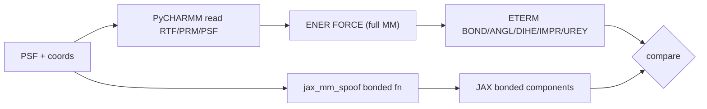

# jax-mm-spoof vs native CHARMM (DCM / ACO)

Report: energy parity of the **jax-mm-spoof** CGenFF bonded clone against
native PyCHARMM `ENER` term energies for dichloromethane (DCM) and acetone
(ACO).

Related: [CHARMM CGenFF JAX clone](cgenff-jax-clone.md), workflow
`workflows/jaxmd_cgenff_spoof_smoke/`.

---

## Summary

**Pass (4 / 4).** Bonded BOND / ANGL / DIHE / IMPR / UREY component sums from
the JAX spoof path match PyCHARMM `ETERM` values to machine precision
(\(|\Delta E| \lesssim 10^{-14}\) kcal/mol) on:

- fixture monomer geometries (slightly perturbed)
- first monomer sliced from jaxmd spoof vacuum NVE minimized PDBs

| Case | \(N\) | \(E_\mathrm{jax}\) | \(E_\mathrm{CHARMM}\) | \(\Delta E\) (kcal/mol) |
|------|------:|-------------------:|----------------------:|------------------------:|
| DCM fixture | 5 | 311.3070436736117 | 311.30704367361164 | \(+5.7\times10^{-14}\) |
| DCM smoke min monomer | 5 | 1.6671786898619212 | 1.667178689861924 | \(-2.9\times10^{-15}\) |
| ACO fixture | 10 | 7.779347176527917 | 7.779347176527915 | \(+1.8\times10^{-15}\) |
| ACO smoke min monomer | 10 | 1.9927947535063575 | 1.9927947535063568 | \(+6.7\times10^{-16}\) |

Per-term deltas for the same runs are at the same noise floor (bond exact 0 on
these geometries; angle / dihedral / improper / urey \(\lesssim 10^{-14}\)
kcal/mol).

---

## What jax-mm-spoof is

`--jax-mm-spoof` (or `jax_mm_spoof: true` in md-system YAML) replaces the PhysNet
monomer/dimer ML slots with a **JAX CGenFF bonded** evaluator built from the
monomer PSF. That lets the hybrid **jaxmd** path exercise MD without a trained
checkpoint.

The quantity that must match native CHARMM is therefore the **CGenFF bonded**
energy (and ideally forces) that the spoof injects as “internal ML”.

Smoke jobs that motivated this check:

| Job | Composition | Setup |
|-----|-------------|-------|
| `dcm_vac_nve` | `DCM:4` | `free_nve` |
| `dcm_pbc_nve` | `DCM:4` | `pbc_nve` |
| `aco_vac_nve` | `ACO:4` | `free_nve` |
| `aco_pbc_nve` | `ACO:4` | `pbc_nve` |

Config: `workflows/jaxmd_cgenff_spoof_smoke/config.yaml`.

---

## Method



1. Load monomer PSF (`examples/psf/dcm-1.psf`, `examples/psf/aco-1.psf`) and
   CGenFF RTF/PRM into PyCHARMM.
2. Set coordinates from either the fixture PDB or the first \(N_\mathrm{atoms}\)
   of `vac_nve_jaxmd_minimized.pdb` from the spoof smoke.
3. Run `ENER FORCE` **without** a bonded-only selective `BLOCK` (see caveats).
4. Evaluate `load_monomer_bonded_components_from_psf` (same stack as
   `jax_mm_spoof`).
5. Map JAX names (`angle` / `torsion` / `improper`) onto CHARMM ETERM keys
   (`angl` / `dihe` / `impr`) and assert
   \(\lvert E_\mathrm{jax}-E_\mathrm{CHARMM}\rvert \le 5\times10^{-3}\)
   (atol) with rtol \(5\times10^{-3}\) — all observed residuals are far tighter.

Driver:

```bash
# GPU node (OpenCL for PyCHARMM); JAX forced to CPU for this script
sbatch workflows/jaxmd_cgenff_spoof_smoke/scripts/submit_compare_slurm.sh compare
# or interactively:
python workflows/jaxmd_cgenff_spoof_smoke/scripts/compare_to_charmm.py --no-mm
python workflows/jaxmd_cgenff_spoof_smoke/scripts/report_charmm_compare.py
```

JSON sink: `artifacts/jaxmd_cgenff_spoof_smoke/charmm_compare/compare_report.json`.

---

## Per-term snapshot (ACO fixture)

| Term | JAX (kcal/mol) | CHARMM (kcal/mol) | \(\Delta\) |
|------|---------------:|------------------:|-----------:|
| bond | 5.883952689217539 | 5.883952689217539 | 0 |
| angl | 1.3139746094588793 | 1.3139746094588782 | \(+1.1\times10^{-15}\) |
| dihe | 0.488016612315349 | 0.488016612315349 | 0 |
| impr | 0.0019203009740602062 | 0.0019203009740601906 | \(+1.6\times10^{-17}\) |
| urey | 0.09148296456208968 | 0.09148296456208968 | 0 |
| **total** | **7.779347176527917** | **7.779347176527915** | \(+1.8\times10^{-15}\) |

DCM has no dihedrals/impropers in the monomer PSF; bond / angle / urey match
likewise (fixture total \(\approx 311.3\) kcal/mol on a strongly perturbed
geometry; smoke-minimized monomer \(\approx 1.67\) kcal/mol).

---

## Caveats

**Selective bonded-only `BLOCK`.** Isolating bonded forces via
`setup_bonded_only_charmm()` hangs on the MPI-linked `libcharmm` build used on
this cluster (same class of issue as
`bonded_block_hangs_under_mpi_mpirun` in the test suite). The compare therefore
reads bonded **energy** terms from a full `ENER` and does **not** assert force
parity. Unit/functionality tests that do force compare remain the reference when
a safe BLOCK environment is available
(`tests/functionality/charmm/test_jax_mm_spoof_bonded_pycharmm.py`).

**Scope.** This report covers **bonded** spoof vs CHARMM. Intermolecular
nonbonded (JAX MIC / Ewald) and full hybrid MD side-by-side vs a PhysNet+CHARMM
run are separate checks.

**Units.** Energies above are kcal/mol (CHARMM / CGenFF convention). Spoof MD
summaries often print eV for the hybrid calculator total.

---

## Reproduce / extend

| Piece | Path |
|-------|------|
| Spoof smoke config | `workflows/jaxmd_cgenff_spoof_smoke/config.yaml` |
| Compare script | `workflows/jaxmd_cgenff_spoof_smoke/scripts/compare_to_charmm.py` |
| Report printer | `workflows/jaxmd_cgenff_spoof_smoke/scripts/report_charmm_compare.py` |
| Slurm wrapper | `workflows/jaxmd_cgenff_spoof_smoke/scripts/submit_compare_slurm.sh` |
| JSON results | `artifacts/jaxmd_cgenff_spoof_smoke/charmm_compare/` |
| ACO bonded pytest | `tests/functionality/charmm/test_jax_mm_spoof_bonded_pycharmm.py` |
| Generic bonded pytest | `tests/functionality/charmm/test_cgenff_bonded_pycharmm.py` |

Optional full vacuum MM (bonded + switched nonbonded) compare is available with
`COMPARE_INCLUDE_MM=1` / omitting `--no-mm`; that path JITs a larger nonbonded
kernel and is not part of the numbers above.
