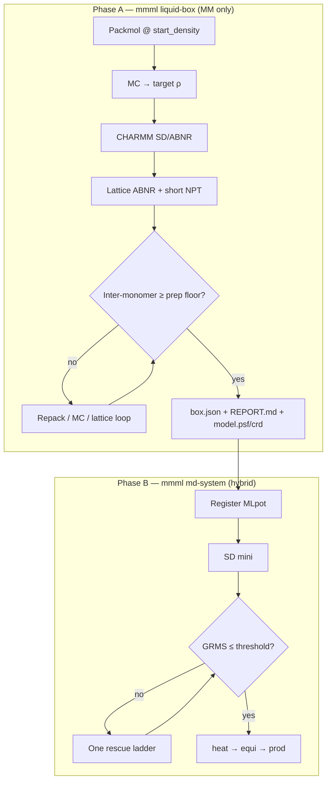
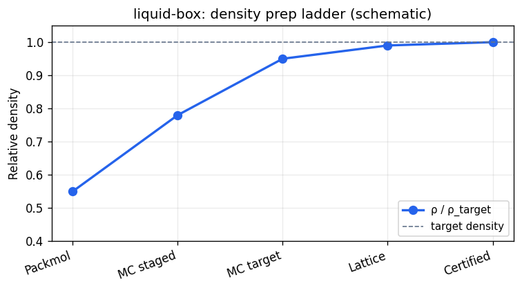

# Liquid box workflow — design

Dense periodic liquid boxes are a solved problem in classical MD. In MMML the difficulty is not Packmol or box sizing — it is getting from a plausible initial geometry to a **hybrid ML+MM minimization basin** at target liquid density without drowning in recovery flags.

This document defines a **two-phase workflow** that separates box certification (MM-only) from hybrid MD, and describes the `mmml liquid-box` spike that implements Phase A.

See also: [md-system-configs.md § Resilient density prep](md-system-configs.md#resilient-density-prep-liquid_prep-true).

---

## Problem statement

Today, `mmml md-system` runs Packmol, MC density equalization, CHARMM MM relaxation, pre-MLpot geometry recovery, MLpot registration, minimization, GRMS waterfalls, density prep ladders, and dynamics overlap rescue in one long `staged_workflow`. Each failure mode gained its own hook; the same recovery steps (monomer repack, MC volume moves, lattice ABNR) appear in four different places.

**Symptoms:**

- Too many flags (`liquid_prep`, `cleanup`, `density_prep_ladder`, MC knobs, lattice steps, …)
- Unclear pass/fail — a 1.56 Å worst contact passes the prep gate (floor 1.0 Å) but looks alarming
- Expensive iteration — tuning ρ or N reruns MLpot when only MM box build should rerun
- Production runs inherit recovery machinery they do not need

**Root cause:** three distinct jobs are interleaved:

| Job | Potential | Typical backend |
|-----|-----------|-----------------|
| **Geometry** | No overlaps, sensible density | Packmol + MC + CHARMM MM |
| **Hybrid equilibration** | Low GRMS basin for ML potential | MLpot SD + optional rescue |
| **Production MD** | Uncorrelated trajectories | heat → equi → prod |

---

## North star

> **Certify the box under MM, then touch MLpot once, then run MD quietly.**





---

## Artifact layout

After `mmml liquid-box` completes successfully:

```
output-dir/
  model.psf              # certified topology
  model.crd              # certified coordinates
  model.pdb              # same geometry, for VMD
  box.json               # machine-readable certification
  REPORT.md              # human-readable summary
  prep_ladder/           # numbered MM prep checkpoints
    001_initial.pdb
    journal.json
    summary.json
    latest.crd
  pretreat/              # optional lattice / mini-NPT legs
```

`box.json` schema (spike):

```json
{
  "status": "pass",
  "profile": "dense",
  "composition": "DCM:206",
  "n_molecules": 206,
  "n_atoms": 1030,
  "box_side_A": 35.12,
  "density_g_cm3": 1.324,
  "worst_intermonomer_A": 1.08,
  "prep_overlap_floor_A": 1.0,
  "dynamics_overlap_reference_A": 1.5,
  "mm_grms_kcalmol_A": 12.4,
  "mc_density": { "...": "..." },
  "geometry_gate": { "...": "..." }
}
```

---

## Profiles

One profile replaces scattered flags for the common cases.

| Profile | When | Behaviour |
|---------|------|-----------|
| `standard` | Known-good compositions, loose start | `box_auto density`, MC equalize, CHARMM pre-minimize; certification only (no full geometry gate loop) |
| `dense` | Default for target-ρ liquids (DCM:200+, etc.) | Same as `--liquid-prep` preventive stack: looser Packmol start, lattice ABNR, mini NPT, pre-MLpot geometry gate |
| `conservative` | Repeated overlap / GRMS failures | `dense` + `bulk_density_fraction: 0.55` when not explicitly set |

Explicit flags still override profile defaults.

---

## CLI (spike)

```bash
# Build + certify (MM only; no checkpoint required)
mmml liquid-box \
  --composition DCM:206 \
  --target-density-g-cm3 1.326 \
  --profile dense \
  --output-dir boxes/dcm206

# Inspect
cat boxes/dcm206/REPORT.md
ls boxes/dcm206/prep_ladder/

# Hybrid MD from certified box
mmml md-system \
  --from-psf boxes/dcm206/model.psf \
  --from-crd boxes/dcm206/model.crd \
  --checkpoint /path/to/DESdimers_params.json \
  --md-stages mini,heat,equi \
  --output-dir runs/dcm206_equil
```

### Flags (spike)

| Flag | Default | Notes |
|------|---------|-------|
| `--composition` | required | `RES:N,...` |
| `--output-dir` | required | |
| `--profile` | `dense` | `standard` \| `dense` \| `conservative` |
| `--box-auto` | `density` | inherited from box-sizing group |
| `--target-density-g-cm3` | — | or `bulk_density_fraction` |
| `--pre-mlpot-overlap-min-distance` | 1.0 Å | prep certification floor |
| `--prep-ladder-dir` | `prep_ladder` | progress checkpoints |

All [box-sizing](md-system-configs.md) and Packmol composition flags from `md-system` apply.

---

## Relationship to existing flags

| Existing | Phase | Future |
|----------|-------|--------|
| `--liquid-prep` | A + B (today) | Phase A only via `liquid-box --profile dense`; md-system drops preventive stack when `--from-crd` |
| `--cleanup` | B recovery | `md-system --profile liquid-recover` (one-shot) |
| `--density-prep-ladder` | B post-mini | Unchanged; not run in Phase A |
| `prep_ladder/` artifacts | A | Written by `liquid-box` and pre-MLpot gate |
| `cleanup/` artifacts | B | Dynamics / overlap rescue only |

---

## Implementation status

### Spike (this PR)

- [x] Design doc (this file)
- [x] `mmml liquid-box` CLI entry point
- [x] `liquid_box_build.run_liquid_box_build()` — extracts MM-only legs from `staged_workflow`
- [x] `box.json` + `REPORT.md` certification output
- [x] Unit tests for profiles, report writing, argv wiring (mocked CHARMM)

### Not in spike (follow-up)

- [ ] `md-system --from-box` shorthand (alias for `--from-psf` + `--from-crd` + read `box.json`)
- [ ] `md-system --profile liquid-dense|liquid-recover|liquid-production`
- [ ] Unify recovery into one `run_box_recovery_loop()` shared by gate, ladder, cleanup
- [ ] Skip preventive prep in `staged_workflow` when certified `box.json` is present
- [ ] CHARMM tier preflight in `liquid-box` (today: same as staged workflow when MLpot follows)
- [ ] YAML example `mmml/cli/run/liquid_box.example.yaml`

---

## Pass / fail criteria

**Phase A (`liquid-box`) — MM certification**

| Check | Default threshold | On fail |
|-------|-------------------|---------|
| Worst inter-monomer distance | ≥ `--pre-mlpot-overlap-min-distance` (1.0 Å) | `status: fail` in `box.json`; non-zero exit |
| Box side vs ML cutoff | MIC-safe minimum | Abort during MC / sizing |
| CHARMM pre-minimize | completes without error | Abort with CHARMM traceback |

MM GRMS is recorded in `box.json` but does **not** gate certification in Phase A (hybrid GRMS is Phase B).

**Phase B (`md-system`) — hybrid ready**

| Check | Default | On fail |
|-------|---------|---------|
| Hybrid GRMS after mini | ≤ `max_grms_before_dyn` | Rescue ladder / `--cleanup` |
| Dynamics overlap | ≥ 1.5 Å | Overlap rescue during MD |

---

## Recommended workflows

### Happy path — new dense liquid

```bash
mmml liquid-box --composition DCM:206 --profile dense \
  --target-density-g-cm3 1.326 -o boxes/dcm206

mmml md-system --from-psf boxes/dcm206/model.psf \
  --from-crd boxes/dcm206/model.crd \
  --checkpoint DESdimers_params.json \
  --md-stages mini,heat,equi -o runs/dcm206_equil
```

### Fast iteration — tune density without MLpot

```bash
mmml liquid-box --composition DCM:206 --profile conservative \
  --bulk-density-fraction 0.55 -o boxes/dcm206_try2
# inspect prep_ladder/ and REPORT.md; repeat until PASS
```

### Recovery — run broke mid-equil

```bash
mmml md-system --restart-from runs/dcm206_equil/heat.res \
  --cleanup --md-stages heat,equi -o runs/dcm206_fix
# inspect cleanup/; re-run production without --cleanup
```

---

## Architecture notes

### Code map

| Module | Role |
|--------|------|
| `mmml/cli/run/liquid_box.py` | CLI parser + dispatch |
| `mmml/interfaces/pycharmmInterface/mlpot/liquid_box_build.py` | Phase A orchestration |
| `mmml/interfaces/pycharmmInterface/mlpot/density_prep_ladder.py` | Pre-MLpot geometry gate (reused) |
| `mmml/interfaces/pycharmmInterface/mlpot/recovery_progress.py` | `prep_ladder/` checkpoints |
| `mmml/interfaces/pycharmmInterface/mlpot/staged_workflow.py` | Phase B (today includes Phase A) |

### Consolidation target

Replace four copies of `repack → MC → lattice → bonded → mini` with:

```python
def run_box_recovery_loop(
    ctx, args, *,
    phase: Literal["prep_gate", "post_mini", "dynamics"],
    max_rounds: int,
    progress: RecoveryProgressStore | None,
) -> RecoveryResult: ...
```

Called from exactly three places with different triggers and `max_rounds`.

---

## Open questions

1. **Should `standard` profile run the full geometry gate?** Spike: no — measure-only certification. Dense/conservative: full gate.
2. **Certify MM GRMS?** Deferred — hybrid GRMS is the meaningful metric for Phase B.
3. **Handoff format** — is `box.json` enough or should we emit `md_handoff` NPZ? Prefer `box.json` + psf/crd for simplicity in spike.
4. **Single-residue liquids** — `composition` only for spike; `--residue` + `--n-molecules` can be added when `build_cluster_from_args` path is unified.
