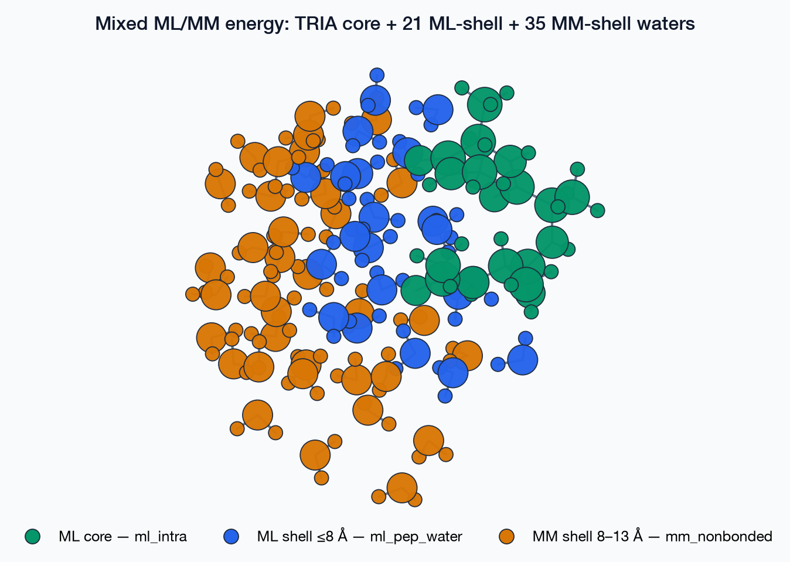
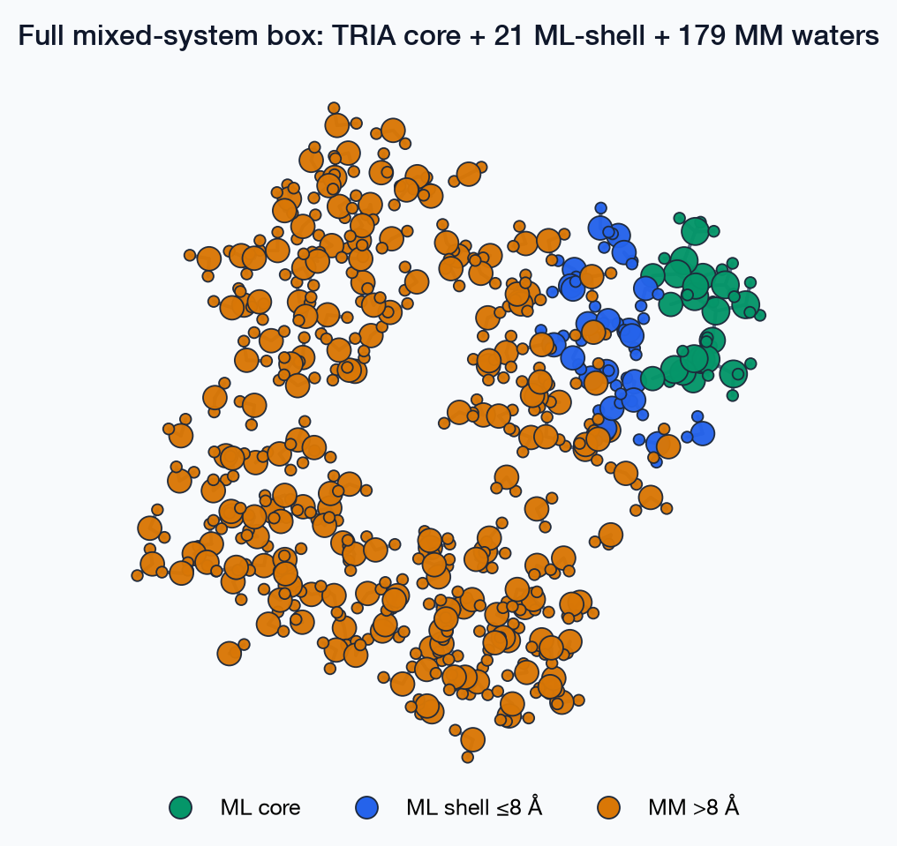
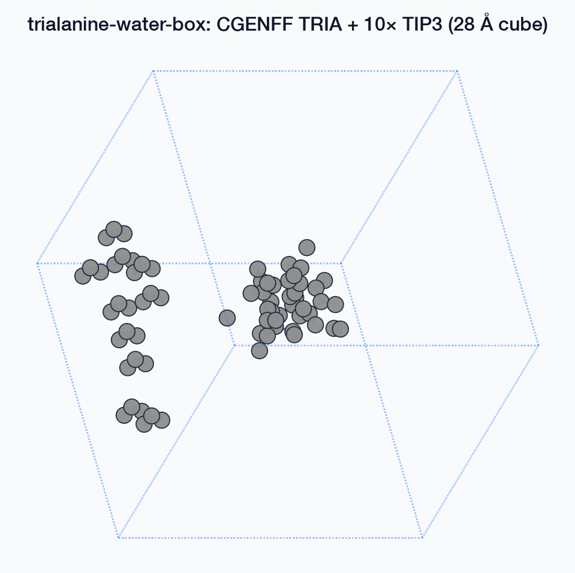
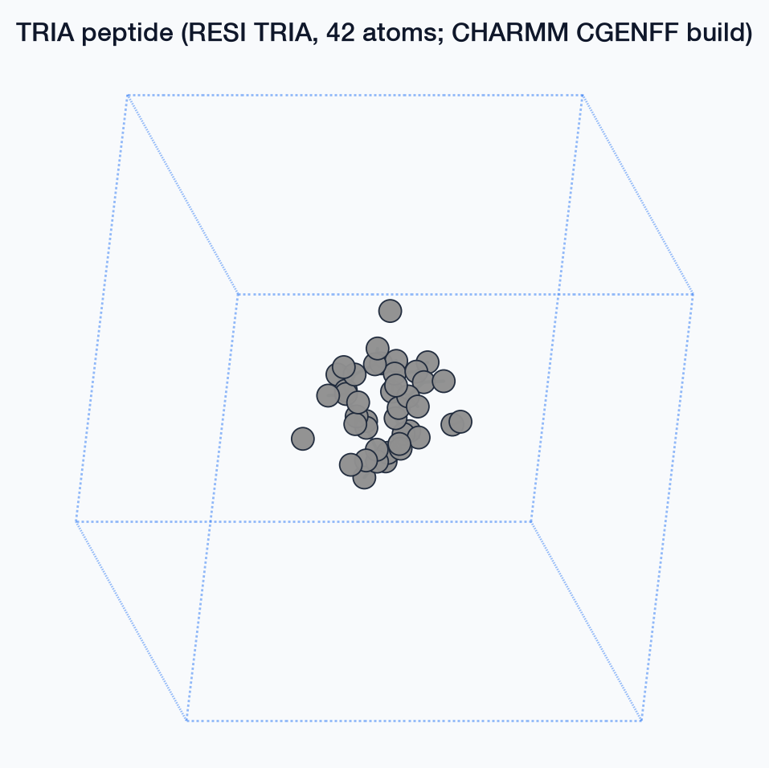

# PyCHARMM + MM/ML: capabilities checklist

A stakeholder-facing summary of what the unified `mmml/md/` stack (built to
merge `md-system` and `cg_jaxmd` — see the
[full design doc](md-cg-unification-design.md) and
[handoff notes](md-cg-unification-handoff.md)) can do **today**, with runnable
examples and real-structure diagrams. Status marks: ✅ done & tested, 🚧 partially
done, ⬜ planned / not started.

---

## 1. Capability checklist

### Shared calculator & builder architecture

The historical split — `md-system` speaking ASE `Calculator` objects,
`cg_jaxmd` hand-composing a jax-md `energy_fn` — is now one shared stack both
front-ends call into.

- ✅ One config object (`RunConfig`) for both the `md-system` CLI and the
  `cg_jaxmd` Snakemake JSON — no more drifting configs.
- ✅ One immutable system representation (`MolecularSystem` + `FFParams`) that
  every builder produces and every energy term reads — charges, LJ tables,
  exclusions resolved once by CHARMM, never recomputed at runtime.
- ✅ Four system builders share one interface: **PSF** (from an existing
  CHARMM PSF), **Packmol** (liquid boxes), **PyXtal** (molecular crystals),
  **peptide + water** (CGENFF peptide solvated in TIP3).
- ✅ All six physics terms extracted into standalone, independently
  parity-tested modules: ML intramolecular, ML peptide–water dimer, classical
  MM nonbonded, repulsive core wall, steered-MD bias, backbone dihedral
  restraint.
- ✅ One `HybridEnergy` that composes any selection of those terms and exposes
  **both** faces from the same definition — an ASE `Calculator` for
  CHARMM/ASE-style workflows, and a jittable `energy_fn(R)` for jax-md.
- ✅ One driver (`JaxmdDriver`) covering minimization (FIRE), NVE, NVT
  (Nosé–Hoover), and **NPT** (Nosé–Hoover barostat) — replacing two
  independently-drifting integrator implementations.
- ✅ Both front-ends now run through this shared pipeline:
  `mmml md-system --backend jaxmd --jaxmd-unified` (opt-in flag) and
  `examples/cg_jaxmd_unified.py`.
- ✅ 333 unit tests green across the package (`tests/unit/test_md_*.py`),
  including CHARMM-integration tests and real-checkpoint end-to-end runs.

### Mixed systems: one ML-scored core + explicit MM/ML solvent

The headline physics capability — a peptide scored by a neural-network
potential, embedded in explicit water that is ML-scored nearby and classically
scored further out, all evaluated through the same code path as a pure-ML or
pure-MM run.

- ✅ Build a real system (CHARMM CGENFF): one ML "core" molecule + N TIP3
  waters, lowered into one `MolecularSystem`.
- ✅ Split the energy into four terms computed together in one `HybridEnergy`:
  **ML intramolecular** (core, `ml_intra`) + **ML dimer** (core↔near-water,
  `ml_pep_water`) + **repulsive wall** (core↔far-water, `vdw_core`, keeps
  waters outside the ML shell from collapsing into the core unscored) +
  **classical MM** (water↔water, `mm_nonbonded`).
- ✅ Swappable ML checkpoints, electrostatics damping, and point-charge
  Coulomb toggles — validated via a 10,000-step NVE sweep
  (`workflows/mixed_calculator_sweep/`) with a real ML checkpoint.
- 🚧 Long-range electrostatics solvers (PME, ScaFaCoS) work for one-off ASE
  evaluation but are not yet wireable into the jitted MD loop.
- ⬜ A general "any small-molecule ML core" builder — today the peptide+water
  builder is specifically trialanine-shaped.
- ⬜ Dynamic hand-off of an individual water between "ML-scored" and
  "MM-scored" as it crosses the cutoff mid-trajectory — today the ML shell is
  fixed at build time, not re-evaluated every step.

### Sampling & ensembles

- ✅ Standard MD: NVE / NVT / NPT, free space or periodic boundaries.
- ✅ Rigid-body Monte Carlo sampler — moves whole monomers as rigid bodies
  (translation + quaternion rotation) using the *same* energy and system, no
  code fork. Selected by one config field (`sampler="rigid"`).
- ⬜ Structural validation (RDF) that rigid sampling reproduces the real
  liquid structure of flexible MD — needs a production force-field run.

### Cluster deployment & validation

- ✅ Runs on SLURM, both GPU and CPU partitions (auto-detected CUDA jaxlib
  availability).
- ✅ Automated cross-backend regression sweep
  (`workflows/unified_backend_sweep/`) exercises every driver × ensemble
  combination (FIRE/NVE/NVT/NPT, rigid MC) against the same real system on
  every run.
- ✅ Three real deployment bugs (Packmol binary not vendored in git, a
  transient XLA compile race under concurrent CPU jobs, silent CPU fallback
  when no CUDA jaxlib is present) found and fixed by actually submitting to
  the cluster, not just unit tests.

### GPU-native CHARMM (apocharmm) — next major piece, design-complete

- ⬜ Not started. Design is settled (device-side ML forces via a custom
  `ForceManager`, DLPack buffer transport, host-barrier sync first) — see
  design doc §4/§10 for the committed interface. Needs a CUDA build to begin.

---

## 2. What this looks like

Real trialanine + TIP3 water snapshot (`examples/atoms.pdb`), colored by which
energy term scores each atom — not a schematic, this is an actual structure
run through the builder:



The same coloring over the full solvated box (200 waters), showing how small
the ML-scored shell is relative to the classically-scored bulk — this is why
the hybrid decomposition matters for cost:



For scale, the underlying CGENFF-built peptide + water box and the isolated
peptide look like this (existing `trialanine_water_box` builder output):




Diagrams are generated with `scripts/generate_docs_figures.py`
(`uv run python scripts/generate_docs_figures.py`), which uses ASE's
`plot_atoms`/`Matplotlib` writer under a shared style
(`mmml/utils/ase_structure_plot.py`) — orthographic projection, covalent
bonds, Jmol or role-based coloring, consistent typography. Regenerate after
any structure/builder change; CI checks staleness with `--check`.

---

## 3. Code examples

### 3.1 Build a mixed system and run dynamics — the one-call path

This is what both `md-system --backend jaxmd --jaxmd-unified` and
`cg_jaxmd_unified.py` do under the hood.

```python
from mmml.interfaces.calculators.simple_inference import create_calculator_from_checkpoint
from mmml.md.assemble import assemble_and_run
from mmml.md.config import EnsembleSpec, RunConfig
from mmml.md.energy import EnergyContext
from mmml.md.system import SystemSpec

config = RunConfig(
    system=SystemSpec(
        builder="peptide_water",   # CGENFF peptide + TIP3 waters, live CHARMM
        n_molecules=30,            # water count
        box_size=28.0,             # Angstrom cube
        seed=42,
    ),
    terms=("ml_intra", "ml_pep_water", "vdw_core", "mm_nonbonded"),
    ensemble=EnsembleSpec(ensemble="nve", dt_fs=0.5, n_steps=10_000),
    backend="jaxmd",
    output_dir="runs/mixed_demo",
)

# The ML model/params come from a trained checkpoint, wrapped in an EnergyContext.
calc = create_calculator_from_checkpoint("examples/sppoky-epoch-0010_params.json")
ctx = EnergyContext(model=calc.model, params=calc.params)

trajectory = assemble_and_run(
    config,
    ctx=ctx,
    term_kwargs={
        "ml_pep_water": {"interaction_cutoff_A": 8.0},
        "vdw_core": {},
    },
)
print(trajectory.n_frames, "frames written to runs/mixed_demo/trajectory.npz")
```

`assemble_and_run` resolves the builder, composes the four terms into one
`HybridEnergy`, auto-wires the padded neighbor list `mm_nonbonded` needs, and
drives it with `JaxmdDriver` — all from one declarative config.

### 3.2 Same energy, exposed as a plain ASE `Calculator`

Useful for dropping straight into existing PyCHARMM/ASE scripts without
touching the jax-md driver at all.

```python
from mmml.md.assemble import build_system, build_hybrid_energy
from mmml.md.energy import EnergyContext
from mmml.md.system import SystemSpec

system = build_system(SystemSpec(builder="peptide_water", n_molecules=30, box_size=28.0))
ctx = EnergyContext(model=my_model, params=my_params)  # ML model/params, e.g. from a checkpoint
energy = build_hybrid_energy(
    system,
    term_names=("ml_intra", "ml_pep_water", "vdw_core", "mm_nonbonded"),
    ctx=ctx,
)

calc = energy.as_ase_calculator()          # -> ase.calculators.calculator.Calculator
atoms.calc = calc                          # drop-in for any ASE workflow
energy_eV = atoms.get_potential_energy()
```

### 3.3 Swap MD for rigid-body Monte Carlo — one field

```python
config = RunConfig(
    # Packmol builder resolves FFParams via the live CHARMM PSF it builds behind it.
    system=SystemSpec(builder="packmol", composition="tip3", n_molecules=64, box_size=20.0),
    terms=("mm_nonbonded",),
    ensemble=EnsembleSpec(ensemble="nvt", temperature_K=300.0, n_steps=5_000),
    backend="jaxmd",
    sampler="rigid",   # <- the only change from a normal MD run
)
trajectory = assemble_and_run(config)
```

`RigidBodySampler` reuses the exact same `MolecularSystem` and `HybridEnergy`
as the MD driver; only the propagator (Metropolis MC translation + quaternion
rotation vs. integrator) differs.

### 3.4 CLI equivalent (no Python required)

`mmml md-system --backend jaxmd --jaxmd-unified` routes through this same
shared pipeline (`runconfig_from_md_system_args` → `assemble_and_run`). Its
CLI surface today wires the **Packmol composition** builder only (default
terms `ml_intra` + `mm_nonbonded`); `--builder pyxtal`, `--template-pdb`, and
`--continue-from` raise `NotImplementedError` rather than silently falling
back to the legacy path:

```bash
uv run mmml md-system --setup pbc_nve --backend jaxmd --jaxmd-unified \
  --composition "TIP3:64" --box-size 20.0 \
  --checkpoint examples/sppoky-epoch-0010_params.json \
  --dt-fs 1.0 --ps 5.0 --seed 42
```

The full mixed ML-core (peptide) + MM-shell system from §3.1 is reachable
today via the `assemble_and_run` Python API and `examples/cg_jaxmd_unified.py`
(a thin JSON-config front-end); wiring the peptide-water builder into
`md-system`'s own CLI flags is tracked as open work in the
[roadmap checklist](md-cg-unification-design.md#11-roadmap-checklist).

See [`md-system` YAML configs](md-system-configs.md) for the full flag/YAML
reference and [`run`](cli/commands/run.md) for the general CLI entry point.

---

## 4. Where to look for more detail

- [Design & decisions](md-cg-unification-design.md) — the full architecture,
  every decided/open question, and the complete roadmap checklist (§11) this
  page summarizes.
- [Handoff notes](md-cg-unification-handoff.md) — implementation-level detail
  for picking the work back up.
- [Hybrid ML/MM decomposition](hybrid-mlmm-decomposition.md) — the physics of
  the term split in more depth.
- `workflows/unified_backend_sweep/README.md` and
  `workflows/mixed_calculator_sweep/` — the validation sweeps referenced above.
