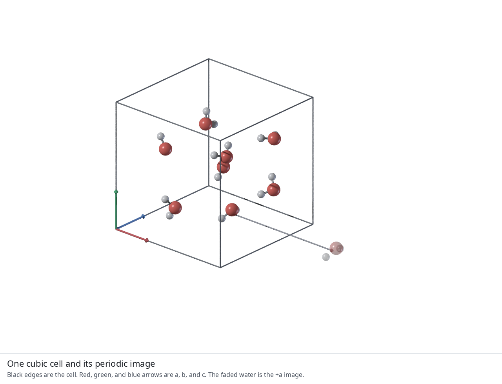
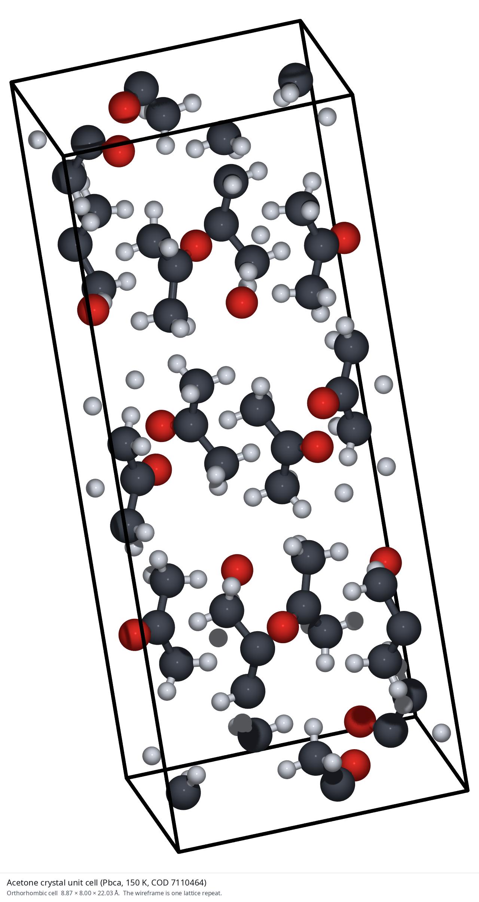
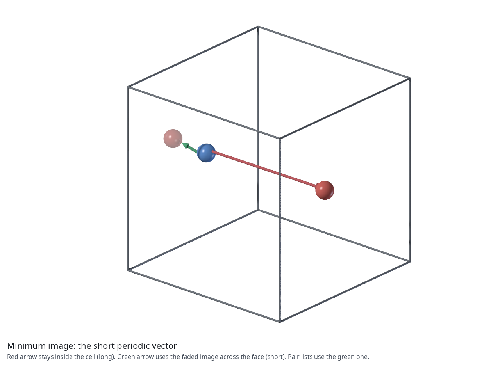
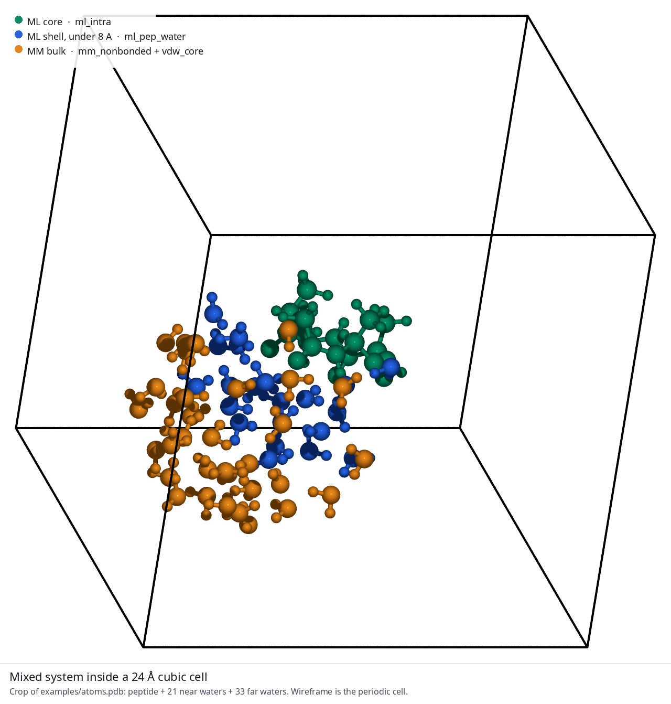
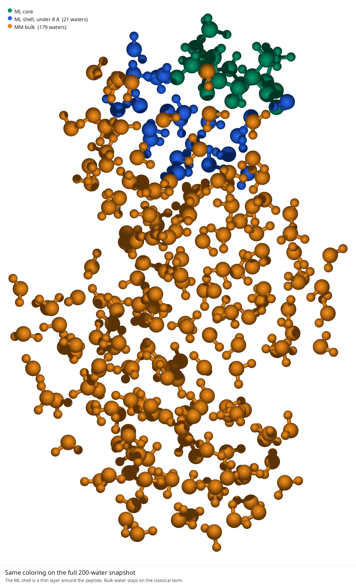
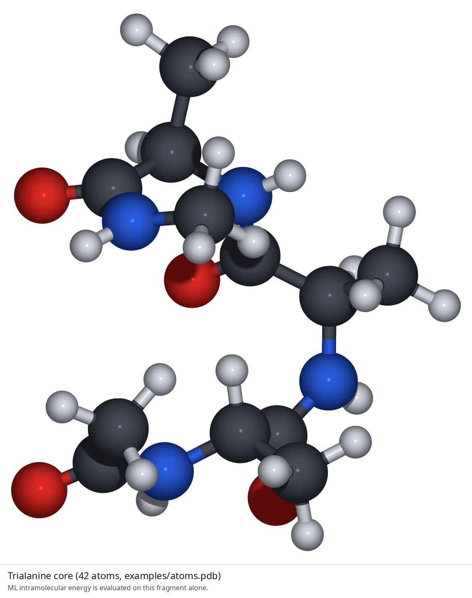
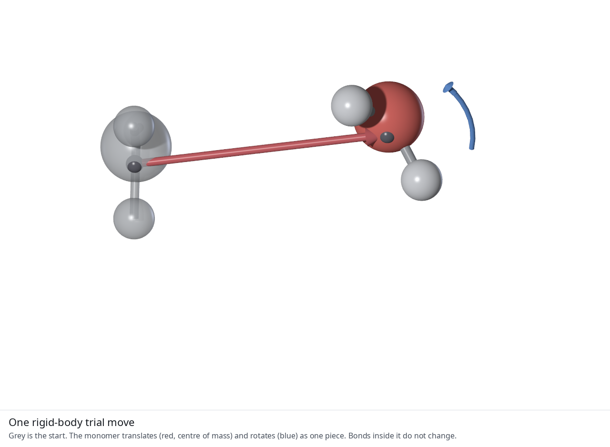

# `md-system` / `cg_jaxmd`: capabilities checklist

What the shared `mmml/md/` stack can do today, with POV-Ray figures of the
cells and the energy split, and runnable examples for each path. Status
marks: ✅ done and tested, 🚧 partial, ⬜ open.

The historical design notes live in
[md-cg-unification-design.md](md-cg-unification-design.md) and
[md-cg-unification-handoff.md](md-cg-unification-handoff.md). This page is the
current surface.

```text
cg_jaxmd JSON ─┐
               ├─ lowering → RunConfig → MolecularSystem → HybridEnergy
md-system CLI ─┘                                      ↓
                              JaxmdDriver | RigidBodySampler
```

`mmml.md` owns the system, the terms, the neighbor policy, the driver, and
the sampler. `mmml md-system` is the supported CLI. A cg-style JSON file is
lowered into the same `RunConfig`. `examples/cg_jaxmd.py` stays the frozen
scientific reference; `examples/cg_jaxmd_unified.py` is the thin front end
on the shared pipeline.

---

## 1. Capability checklist

| Capability | Legacy `cg_jaxmd.py` | Shared `mmml.md` | `md-system --jaxmd-unified` |
|---|:---:|:---:|:---:|
| FIRE, NVE, NVT (Langevin or Nosé–Hoover) | ✅ | ✅ | ✅ |
| NPT (Nosé–Hoover piston; `pressure` is bar) | — | ✅ | ✅ |
| Temperature schedule (`200->300:0.25,300:0.75`) | ✅ | ✅ | ✅ |
| Geometry handoff (`--continue-from`, campaign `depends_on`) | ✅ | 🚧 positions + box | 🚧 velocities are rethermalized |
| Rigid-body Monte Carlo | — | ✅ | ✅ |
| `ml_intra` + `mm_nonbonded` | ✅ | ✅ | ✅ |
| Mechanical embedding (`--ml-resnames` + `mm_bonded`) | ✅ | ✅ | ✅ |
| Interaction policy, mechanical embedding only | — | ✅ | ✅ |
| `ml_pep_water` + `vdw_core` shell | ✅ | ✅ | ⬜ use `cg_jaxmd_unified.py` |
| `smd` end-to-end bias | ✅ | ✅ | ⬜ Python / cg JSON |
| `dihedral` φ/ψ restraint | ✅ | ✅ | ⬜ cg front end still refuses `constrain_phi_psi` |
| `rxncoor` linear-distance umbrella | — | ✅ | ⬜ Python term |
| `ml_mm_elec` fluctuating-charge embedding | ✅ | ✅ | ⬜ legacy ASE / JAX-MD / PyCHARMM YAML |
| `ml_mm_pol` classical induction | — | ✅ | ⬜ |
| Rigid FF `zbl` + `mbd` + `multipole` | — | ✅ | ✅ `--ff zbl-mbd-multipoles` |
| Packmol composition | ✅ | ✅ | ✅ |
| `--from-pdb` full-system PDB | — | ✅ | ✅ |
| Peptide + water builder | ✅ | ✅ | ⬜ `PeptideWaterSystemBuilder` via the cg front end |
| PyXtal / `--template-pdb` | legacy CLI | builders exist | ⬜ `NotImplementedError` |
| Separate peptide and water checkpoints | ✅ | one model | ⬜ |
| PME / ScaFaCoS inside the jitted loop | some ASE paths | ASE face only | ⬜ the jax face refuses a non-`mic` solver |
| DCD + full restart (velocities, thermostat, RNG) | ✅ | 🚧 | 🚧 |

Near/far interaction policies still fail closed on the unified CLI. A
mechanical policy (one ML provider on the solute, CGenFF on every pair)
lowers to `ml_resnames`.

### Acceptance gates before the shared path becomes the default

1. Every registered builder runs through `RunConfig → assemble_and_run`.
2. Cg energy modes lower to the same named terms and match on frozen frames.
3. A phase change keeps positions, velocities, box, RNG, step, and integrator state.
4. Embedding, charge policy, role-specific models, restraints, and SMD are serialized config.
5. Recovery and diagnostics emit events and leave the physics unchanged.
6. Trajectories round-trip positions, velocities, box, energies, forces, and term splits.
7. Cross-backend tests cover FIRE / NVE / NVT / NPT, one peptide–water mix, and one block-boundary restart.
8. Production comparisons meet the documented drift, temperature, structure, and timing tolerances.

---

## 2. Cells, shells, and moves

Figures are POV-Ray, orthographic, white background. Regenerate with:

```bash
uv run python scripts/render_md_cg_capability_figures.py
```

The script reads `examples/atoms.pdb` and the bundled acetone CIF, then
renders those coordinates. It leaves CHARMM and dynamics to the commands in §3.

### The periodic cell

A PBC run stores one cell. The wireframe is that repeat. Axes **a** (red),
**b** (green), and **c** (blue) leave the origin. The faded water outside
the **+a** face is the same molecule translated by one lattice vector: it is
the image the pair list uses when a neighbor sits across the boundary.



The same idea on a real crystal. Acetone, space group Pbca, 150 K
(COD 7110464). The cell is orthorhombic, 8.87 × 8.00 × 22.03 Å. Molecules
cut by a face belong to this repeat; their other half is the neighboring cell.



### Minimum image

Two sites can be joined by a long vector that stays inside the cell, or by
a short vector that steps through a face to the periodic image. Neighbor
lists and the nonbonded term use the short one. The lattice shift itself
stays piecewise constant (see the PBC MIC note in the agent workflow): the
green arrow is a jump of one cell edge, and that jump is not differentiated.



### Mixed ML / MM inside a cell

`examples/atoms.pdb` is a trialanine (42 atoms) plus 200 TIP3 waters. The
cube below is a 24 Å crop of that snapshot, recentered on the peptide, with
the periodic cell drawn. Colour is the energy role, assigned by oxygen–COM
distance at 8 Å. It is a static illustration of the term split, and the
shell is fixed at build time.

- Green: peptide, `ml_intra`
- Blue: 21 waters inside 8 Å, `ml_pep_water`
- Orange: 33 waters in the crop beyond 8 Å, `mm_nonbonded`, with `vdw_core` keeping unscored waters off the core



The same colouring on all 200 waters. Twenty-one waters sit in the ML shell;
179 stay on the classical term. That ratio is why the hybrid split matters.



The peptide alone, element colours. `ml_intra` scores this fragment and does
not see the solvent coordinates.



### One rigid-body trial

`RigidBodySampler` moves each monomer by a COM translation and a quaternion
rotation. Intramolecular distances stay put. The grey pose is the start; red
is the COM displacement; blue is the rotation.



---

## 3. Examples

Live CHARMM builds need `CHARMM_LIB_DIR` and, for ML terms, a checkpoint.
The pure snippets below are the tested `assemble_and_run` contract and do
not build a box.

### 3.1 Lower a peptide–water JSON config

`terms_from_cg_config` / `runconfig_from_cg_config` map the cg toggles onto
registered terms. This is what `examples/cg_jaxmd_unified.py` runs.

```python
from mmml.md.lowering import runconfig_from_cg_config

cfg = {
    "checkpoint": "examples/sppoky-epoch-0010_params.json",
    "n_waters": 4,
    "box_size": 15.0,
    "seed": 11,
    "dt_fs": 1.0,
    "fire_total_steps": 10,
    "peptide_water_ml": True,
    "peptide_water_ml_core_vdw": True,
    "temperature_schedule": "200->300:0.5,300:0.5",
}
run_config = runconfig_from_cg_config(cfg, phase="fire")
assert run_config.system.builder == "peptide_water"
assert run_config.terms == ("ml_intra", "mm_nonbonded", "ml_pep_water", "vdw_core")
assert run_config.ensemble.ensemble == "min"
assert run_config.ensemble.temperature_schedule is not None
```

```bash
uv run python examples/cg_jaxmd_unified.py --config path/to/config.json
```

`constrain_phi_psi: true` raises `NotImplementedError` on this front end.
The `dihedral` term itself is registered; the missing piece is the
topology resolver that turns a sequence into atom indices. `smd_enable`
is wired once `smd_atom_i` / `smd_atom_j` are set.

### 3.2 Steered distance, dihedral, and reaction coordinate

These three biases are geometry-only terms. They share `HybridEnergy` with
the physical terms, so a rigid-body move feels them too.

```python
import numpy as np
from mmml.md.assemble import assemble_and_run, build_hybrid_energy
from mmml.md.config import EnsembleSpec, RunConfig
from mmml.md.energy.terms.dihedral import DihedralRestraint, DihedralRestraintTerm
from mmml.md.energy.terms.rxncoor import ReactionCoordinateBiasTerm
from mmml.md.restraints import LinearDistanceCV
from mmml.md.system import MolecularSystem, SystemSpec

system = MolecularSystem(
    R=np.array([[0., 0., 0.], [1.8, 0., 0.], [4.8, 0., 0.]]),
    Z=np.array([17, 6, 7]),
    box=None,
    mol_id=np.array([0, 0, 1]),
)

# SMD: harmonic pull on one distance. Tested assemble_and_run contract.
config = RunConfig(
    system=SystemSpec(builder="psf"),
    terms=("smd",),
    backend="jaxmd",
    ensemble=EnsembleSpec(ensemble="nve", dt_fs=0.5, n_steps=10),
)
trajectory = assemble_and_run(
    config,
    system=system,
    term_kwargs={"smd": {"atom_i": 0, "atom_j": 1, "k_ev_per_A2": 0.5, "target": 1.5}},
)

# xi = r(C–Cl) - r(C–N). k is eV/Ų (150 kcal/mol/Ų ≈ 6.5 eV/Ų).
cv = LinearDistanceCV.difference(minuend=(1, 0), subtrahend=(1, 2))
rxn = ReactionCoordinateBiasTerm(cv=cv, target=-1.2, k_ev_per_A2=6.505)

# Four atom indices, target in degrees, k in eV/rad².
phi = DihedralRestraintTerm([
    DihedralRestraint(indices=(0, 1, 2, 3), target_deg=-60.0, k_ev=0.5),
])
```

`build_hybrid_energy(system, ("smd",), term_kwargs=...)` then
`.as_ase_calculator()` is the ASE face of the same definition. The Menshutkin
windows use `rxncoor` with the same CV as the gas-phase sampler; see
`tests/unit/test_md_rxncoor.py`.

### 3.3 Packmol hybrid on the unified CLI

Checkpoint present, no `--ff`: terms are `ml_intra` + `mm_nonbonded`.

```bash
uv run mmml md-system --setup pbc_nve --backend jaxmd --jaxmd-unified \
  --composition "TIP3:4" --box-size 15.0 \
  --checkpoint examples/sppoky-epoch-0010_params.json \
  --dt-fs 1.0 --ps 0.01 --seed 42
```

`--builder pyxtal` and `--template-pdb` raise `NotImplementedError` on this flag.

### 3.4 Mechanical embedding

ML owns the named residues. `mm_bonded` is inserted for the MM atoms
(solvent bonds and angles). `mm_nonbonded` keeps solute–solvent and
solvent–solvent pairs.

Packmol composition, unified JAX-MD leg of
`examples/m/yaml/mech_embed_tip3.yaml`:

```bash
source examples/m/_env.sh
uv run mmml md-system --config examples/m/yaml/mech_embed_tip3.yaml --run-all
```

The unified leg is `composition: "AMM1:1,CH3CL:1,TIP3:12"`, `box_size: 30`,
`ml_resnames: [AMM1, CH3CL]`, `jaxmd_unified: true`.

The same ownership from a prebuilt PDB
(`examples/m/yaml/sol_tip3_30A_md.yaml`). The sibling `model.psf` and
`box.json` supply topology and the cell:

```bash
uv run mmml md-system --config examples/m/yaml/sol_tip3_30A_md.yaml
```

Trialanine uses an interaction-policy file instead of a hand-written residue
list. `examples/interaction_policy_tria_tip3_mech.yaml` assigns TRIA to the
ML provider and every pair to CGenFF. The campaign lowers that to
`ml_resnames: [TRIA]`.

```bash
uv run mmml md-embedding build -o artifacts/md_embedding/aaa --n-waters 10
uv run mmml md-system \
  --config examples/tria_md_system/yaml/campaign_nvt_npt_nve.yaml \
  --run-all
```

That campaign is three short legs, chained by `depends_on`:

| Leg | Setup | What it checks |
|---|---|---|
| `nvt` | `pbc_nvt` | Finite energies on the mechanical split |
| `npt` | `pbc_npt`, `depends_on: nvt`, `barostat_tau: 1.0e6` | `Vfinal/V0` stays inside `[0.5, 2]` |
| `nve` | `pbc_nve`, `depends_on: npt` | A production-style leg from the NPT cell |

Handoff copies positions and the cell. The next leg draws new velocities and
skips FIRE unless `--handoff-pre-minimize` is set. A dilute box at the
default piston time (`1000 * dt`) can sit at a large instantaneous pressure
and collapse; raise `barostat_tau` (metal time) for the smoke. The denser
200-water / 30 Å recipe is
`examples/tria_md_system/yaml/campaign_nvt_npt_dense.yaml`.

A block temperature schedule on any NVT or NPT leg:

```bash
uv run mmml md-system --setup pbc_nvt --backend jaxmd --jaxmd-unified \
  --composition "TIP3:4" --box-size 15.0 \
  --checkpoint examples/sppoky-epoch-0010_params.json \
  --temperature-schedule '200->300:0.25,300:0.75' \
  --dt-fs 0.5 --ps 0.05 --seed 0
```

The driver reads `EnsembleSpec.temperature_schedule` and applies it at block
boundaries.

### 3.5 Rigid Monte Carlo

Default intermolecular FF with `--sampler rigid` and no checkpoint is CGenFF
(`mm_nonbonded` only):

```bash
uv run mmml md-system --setup pbc_nvt --backend jaxmd --jaxmd-unified \
  --sampler rigid --ff cgenff \
  --composition "TIP3:4" --box-size 15.0 --ps 0.1 --seed 42
```

`zbl-mbd-multipoles` freezes fragment multipoles and per-atom C6/C8/C10 once
at build, then scores classical electrostatics, QDO dispersion, and
intermolecular ZBL (`cuton=0.1` Å, `cutoff=0.6` Å) during the MC:

```bash
uv run mmml md-system --setup pbc_nvt --backend jaxmd --jaxmd-unified \
  --sampler rigid --ff zbl-mbd-multipoles \
  --composition "TIP3:4" --box-size 15.0 --ps 0.1 --seed 42
```

Geometry preservation is unit-tested. An RDF comparison against flexible MD
on a production liquid is still open.

### 3.6 Electrostatic embedding and induction

`ml_mm_elec` is Coulomb between ML charges on the solute and fixed MM
charges, with `dq/dR` in the force. `charge_mode="q0"` pins the solute
charge sum. Zero the solute charges in `FFParams` when this term is on, so
`mm_nonbonded` does not add a second Coulomb on the same pairs.
`examples/menshutkin/jaxmd_box.py` does that with `solute_charges="ml"`.

The campaign YAML that turns neutralized ML charges on for NH₃–CH₃Cl in
TIP3 is `examples/m/yaml/es_embed_tip3.yaml` (`mm_charge_mode: q0`,
`lr_solver: mic`). Its ASE, legacy JAX-MD, and PyCHARMM legs are the
supported route; that file does not set `--jaxmd-unified`.

`ml_mm_pol` adds the classical induction `−½ Σ αᵢ |Eᵢ|²` from the MM field
on the solute. It is a registered term
(`mmml/md/energy/terms/ml_mm_pol.py`) and is not selected by the unified CLI.

Long-range solvers `jax_pme`, `nvalchemiops_pme`, and `scafacos` evaluate on
the ASE face. The jitted face raises `NotImplementedError` for anything
other than `mic`.

### 3.7 Where a new run should start

| Goal | Start here |
|---|---|
| Liquid, one ML model, classical pairs | §3.3 |
| Solute ML, solvent bonded + classical pairs | §3.4 |
| NPT smoke that must not slam the cell | §3.4 trialanine campaign, with `barostat_tau` |
| Whole-monomer MC | §3.5 |
| Peptide with an ML water shell and a repulsive wall | §3.1 `cg_jaxmd_unified.py` |
| Umbrella on `r(C–X) − r(C–N)` | §3.2 `rxncoor` |
| Fluctuating solute charges in a solvent | §3.6 |

---

## 4. More detail

- [Design & decisions](md-cg-unification-design.md) — architecture and the roadmap this page summarizes.
- [Handoff notes](md-cg-unification-handoff.md) — implementation notes for the open rows.
- [Hybrid ML/MM decomposition](hybrid-mlmm-decomposition.md) — the term split.
- [`md-system` YAML configs](md-system-configs.md) and [`mmml md-system`](cli/commands/md-system.md).
- `workflows/unified_backend_sweep/README.md` — FIRE, NVE, NVT, NPT, and rigid MC on one small TIP3 box.
- `workflows/mixed_calculator_sweep/` — NVE checks for the peptide–water route.
