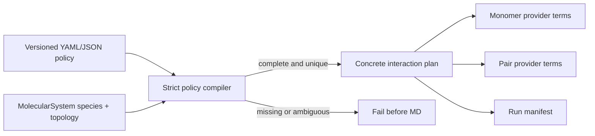

# Species-aware ML/MM interaction policies

Status: schema and strict compiler implemented; **separate-file input** via
`interaction_policy: ./policy.yaml` (or `--interaction-policy`) is validated on
`md-system`. Arbitrary multi-provider / near–far energy lowering remains
fail-closed. Schema version: `1`.

The canonical MD runner must describe physics by molecular species and
providers, not by positional assumptions such as “molecule zero is peptide” or
“all remaining molecules are water”. A policy assigns exactly one provider to
every monomer and either one provider or a smooth near/far provider pair to
every unordered molecular pair.



### Separate policy file in md-system YAML

```yaml
# md_system.yaml
interaction_policy: ./interaction_policy.yaml
composition: "DCM:2"
# ... other md-system keys ...
```

Relative paths resolve against the **config file directory** (same rule as
`include:`), not only the process CWD. Absolute paths are unchanged.

Checked-in examples:

- [`interaction_policy_single_provider.yaml`](https://github.com/EricBoittier/mmml/blob/main/examples/interaction_policy_single_provider.yaml)
  — single MM provider (accepted / lowerable today)
- [`interaction_policy_tria_tip3_mech.yaml`](https://github.com/EricBoittier/mmml/blob/main/examples/interaction_policy_tria_tip3_mech.yaml)
  — mechanical embedding: TRIA→ML, TIP3→MM, all pairs MM (lowered to
  `ml_resnames` on `--jaxmd-unified`; see `examples/tria_md_system/`)
- [`interaction_policy_peptide_water.yaml`](https://github.com/EricBoittier/mmml/blob/main/examples/interaction_policy_peptide_water.yaml)
  — multi-provider + near/far (valid schema; **fails closed** until generalized
  lowering lands)

Exact species rules take precedence over one-wildcard rules, which take
precedence over `* + *`. Equal-specificity matches are errors. Missing species
labels, monomer assignments, pair rules, providers, or switch endpoints are
errors.

Near/far ownership uses one smooth switching interval. The intended energy is

`E_pair(r) = w(r) E_near + (1 - w(r)) E_far`,

with the same weight and molecular distance definition used for both terms.
This partition is a scientific invariant: independently cutting the two terms
can create gaps or double counting. MM-only salts are ordinary species rules,
not special-case code. Pure QM monomers are providers of kind `qm`; their pair
interactions may still use ML nearby and MM far away.

Temperature ramps now live in `mmml.md.temperature`, and restraint
specifications live in `mmml.md.restraints`. SMD and future enhanced-sampling
methods remain protocols and must not be folded into interaction ownership.

LJ / electrostatic toggles (`include_mm`, `learn_mm_lj_scales`,
`mm_charge_mode`, `lr_solver`, …) stay on the hybrid / md-system stack — the
policy answers **who owns** each monomer/pair, not how MM parameters are
trained.

Current command-line seams:

- `--interaction-policy PATH` or YAML `interaction_policy:` loads, schema-checks,
  and fail-closes multi-provider / near–far ownership before MD.
- Single-provider policies are accepted; path + schema + content hash are
  recorded in the run manifest.
- `--temperature-schedule '200->300:0.25,300:0.75'` uses the shared schedule.
- `mmml configure --workflow interaction-policy` interactively validates and
  previews a policy before writing it. It can also emit an `md-system` or
  `dimer-scan` companion configuration referencing the same policy.
- A valid policy that cannot yet be represented by the current energy terms
  raises `NotImplementedError`; it never falls back to the legacy
  peptide/water mask.

Required completion tests for generalized provider lowering are: energy
continuity through both switch endpoints, force agreement with finite
differences, pair permutation invariance, exact ownership accounting, MM-only
ion coverage, restart preservation of policy/schema/checkpoint hashes, and a
small NVE drift test with the switch active.
