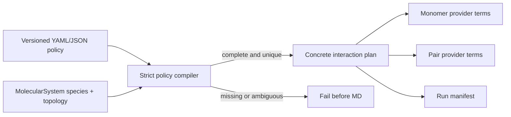

# Species-aware ML/MM interaction policies

Status: schema and strict compiler implemented; arbitrary multi-provider energy
lowering is intentionally fail-closed while the generalized pair terms are
completed. Schema version: `1`.

The canonical MD runner must describe physics by molecular species and
providers, not by positional assumptions such as “molecule zero is peptide” or
“all remaining molecules are water”. A policy assigns exactly one provider to
every monomer and either one provider or a smooth near/far provider pair to
every unordered molecular pair.

See the checked-in
[`interaction_policy_peptide_water.yaml`](https://github.com/EricBoittier/mmml/blob/main/examples/interaction_policy_peptide_water.yaml)
for a peptide/water/salt example. Exact species rules take precedence over
one-wildcard rules, which take precedence over `* + *`. Equal-specificity
matches are errors. Missing species labels, monomer assignments, pair rules,
providers, or switch endpoints are errors.

Near/far ownership uses one smooth switching interval. The intended energy is

`E_pair(r) = w(r) E_near + (1 - w(r)) E_far`,

with the same weight and molecular distance definition used for both terms.
This partition is a scientific invariant: independently cutting the two terms
can create gaps or double counting. MM-only salts are ordinary species rules,
not special-case code. Pure QM monomers are providers of kind `qm`; their pair
interactions may still use ML nearby and MM far away.

Temperature ramps now live in `mmml.md.temperature`, and restraint
specifications live in `mmml.md.restraints`. SMD and future enhanced-sampling
methods remain protocols and must not be folded into interaction ownership.

Current command-line seams:

- `--interaction-policy PATH` loads and compiles a versioned YAML/JSON policy.
- `--temperature-schedule '200->300:0.25,300:0.75'` uses the shared schedule.
- A valid policy that cannot yet be represented by the current JAX terms raises
  `NotImplementedError`; it never falls back to the legacy peptide/water mask.

Required completion tests for generalized provider lowering are: energy
continuity through both switch endpoints, force agreement with finite
differences, pair permutation invariance, exact ownership accounting, MM-only
ion coverage, restart preservation of policy/schema/checkpoint hashes, and a
small NVE drift test with the switch active.
