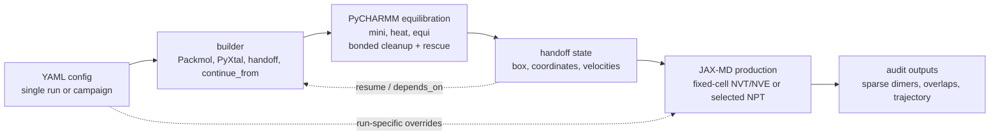
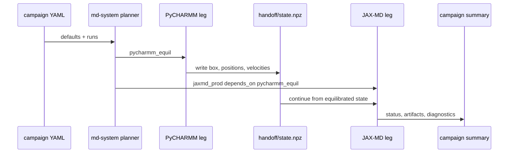
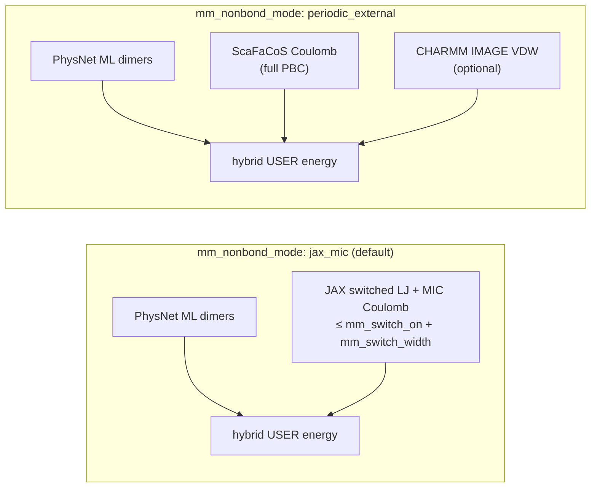
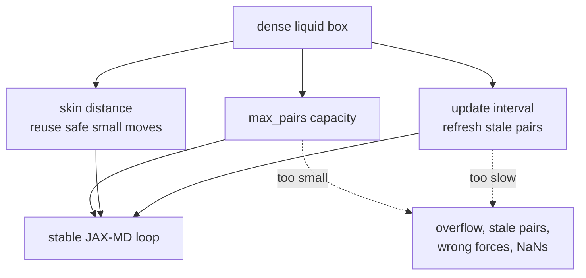

# `md-system` YAML configs

`mmml md-system` accepts YAML so that single simulations and multi-leg campaigns can be run from the same, reviewable config file.

Use the example as a starting point:

```bash
# Single flat config
mmml md-system --config mmml/cli/run/md_system.example.yaml

# Dense liquid box prep (resilient density mode)
mmml md-system --config mmml/cli/run/md_system.dense_liquid_prep.example.yaml

# DCM:103 from certified liquid-box (preset stack)
mmml md-system --config mmml/cli/run/md_system.dcm103_equil.example.yaml --job-id dcm103_equil

# Composable presets — see mmml/cli/run/presets/README.md
mmml md-system --config my_campaign.yaml --run-all
```

The main goal for these configs is condensed-phase setup: build a dense molecular box, relax overlaps, hand it between PyCHARMM and JAX-MD, then run production with neighbor-list settings that are large and fresh enough for the density.



## File shapes

A single-run config is a flat mapping. Keys are the Python form of CLI flags, so `--box-size` becomes `box_size`.

```yaml
setup: pbc_npt
backend: jaxmd
composition: "DCM:20"
checkpoint: /path/to/DESdimers_params.json
output_dir: results/jaxmd_single
box_size: 38.0
dt_fs: 0.25
temperature: 260.0
pressure: 10.0
ps: 20
seed: 123
```

A campaign config has `defaults`, `campaign_output`, and `runs`. Every run inherits `defaults`, then overrides only what changes for that leg.

```yaml
defaults:
  composition: "DCM:8"
  checkpoint: /path/to/checkpoint_dir_or_params.json
  box_size: 28.0
  dt_fs: 0.25
  temperature: 100.0
  pressure: 1.0
  seed: 42
  mm_switch_on: 6.0
  mm_switch_width: 4.0
  ml_switch_width: 0.5

campaign_output: artifacts/dcm_small

runs:
  pycharmm_equil:
    backend: pycharmm
    setup: pbc_npt
    md_stages: "mini,heat,equi"
    ps_heat: 2.0
    ps_equi: 2.0
    output_dir: results/dcm_small/pycharmm_equil

  jaxmd_prod:
    backend: jaxmd
    setup: pbc_nvt
    depends_on: pycharmm_equil
    ps: 5
    output_dir: results/dcm_small/jaxmd_prod
    handoff_write_res: true
    extra_args:
      - "--steps-per-recording"
      - "800"
      - "--jax-md-update-interval"
      - "1"
      - "--max-pairs"
      - "1563319"
```

Campaign-only keys are ignored when building the backend command:

- `description`: human-readable label in the campaign plan.
- `depends_on`: job id whose handoff state is used as input.
- `repeat`: replicate count. Repeats write to `rep00`, `rep01`, etc., and seeds are offset by replicate index.
- `optional`: continue the campaign if this job fails.
- `extra_args`: raw backend flags that `md-system` does not expose directly; put each token in its own list item.

Top-level CLI flags win over YAML only for selected campaign-wide runtime controls, including `ml_batch_size`, `ml_gpu_count`, `ml_max_active_dimers`, `skip_jit_warmup`, `handoff_pre_minimize`, and `ml_spatial_mpi`.

## YAML presets (`include`)

Campaign files can chain reusable fragments from `mmml/cli/run/presets/`:

```yaml
include:
  - presets/base-dt0.25.yaml
  - presets/liquid-prep-dense.yaml
  - presets/heat-dt0.25-conservative.yaml
  - presets/dynamics-flyoff-strict.yaml

defaults:
  composition: "DCM:103"
  from_psf: boxes/dcm103/model.psf
  from_crd: boxes/dcm103/model.crd
  box_size: 63.354
```

Later includes and your own `defaults` override earlier keys. See `mmml/cli/run/presets/README.md` for the full index (`heat-dt0.25-conservative`, `pre-sd-calculator`, etc.) and ready-made campaigns `md_system.dcm103_equil.example.yaml`, `md_system.dcm52_equil.example.yaml`.

## Recommended campaign structure

For condensed phase, keep the template staged and explicit:

1. Put shared physical settings in `defaults`: `composition`, `checkpoint`, `box_size` or density sizing, `dt_fs`, `temperature`, `pressure`, cutoffs, and seed.
2. Use a short PyCHARMM leg first: `md_stages: "mini,heat,equi"` with overlap rescue and bonded MM repair enabled. This catches bad contacts before long JAX-MD runs.
3. Use JAX-MD for fixed-cell production or NVE replicas after the PyCHARMM handoff. Keep neighbor-list capacity and refresh controls in the JAX-MD run block.
4. Return to PyCHARMM only when you need CHARMM restart output, CPT/NPT behavior, or MLpot-specific diagnostics.
5. Keep `output_dir` unique per run and `campaign_output` stable for campaign summaries. Use `--resume` (or YAML `defaults.resume: true`) to skip completed jobs and reuse output dirs.

Avoid duplicate keys in YAML. If a setting appears twice, YAML keeps only the last value, which can hide mistakes. In particular, keep `dynamics_overlap_action` and `bonded_mm_mini` in one place, usually `defaults`.



## Builders for condensed phase

`composition` uses `RES:N` entries such as `DCM:60` or `DCM:40,ACO:20`. A bare `RES` means one molecule. The builder determines the initial coordinates before minimization.

**Packmol cube is the default for `composition`.** It is the normal liquid-box builder. Use `box_size` as both the Packmol cube edge and the PBC cell side. You can also set `packmol_tolerance`, `packmol_center`, `reuse_packmol_cache`, `packmol_cache_dir`, and `rebuild_packmol`. This is the recommended starting point for disordered condensed-phase liquids.

**Packmol sphere is a legacy/cluster builder.** Use `packmol_placement: sphere` plus `packmol_radius` when you want a finite cluster or spherical initial packing. For PBC liquids, prefer cube packing so the initial geometry matches the periodic cell.

**PyXtal builds symmetry-aware molecular crystals.** Enable with `pyxtal: true` and install `mmml[chem]`. Useful knobs are `pyxtal_spg`, `pyxtal_factor`, `pyxtal_stoichiometry`, `pyxtal_supercell`, `pyxtal_attempts`, and `pyxtal_trim`. Use this when a crystal-like starting point is desired, not for amorphous liquid packing.

**Reference/handoff builders reuse prior states.** `depends_on` loads a campaign predecessor handoff. `continue_from` can start from a handoff NPZ or CHARMM restart. This is the safest route after equilibration because it preserves box, coordinates, and optionally velocities.

**Legacy grid placement is for debugging.** Use `packmol: false` only for simple tests. It is not a good dense-liquid builder because it creates artificial spacing and can leave bad condensed-phase contacts after compression.

## Box and density choices

Use explicit `box_size` when you already know the target density or are matching a benchmark. For automatic sizing, `box_auto: density` requires either `target_density_g_cm3` or `bulk_density_fraction`. Built-in density entries include `DCM`, `ACO`, `MEOH`, `ETOH`, `TIP3`, and `WAT`; use `target_density_g_cm3` for other residues.

Post-build MC density equalization is enabled by default for new PBC composition builds when density and molecular-weight metadata can be resolved. It adjusts the initial cubic box with whole-molecule MC volume moves after Packmol, PyXtal, or grid construction and before MLpot registration. When `box_size` is set, that value is used as the starting box side rather than as an immutable cell. The final side is still clamped to the geometry/cutoff minimum used for MIC-safe box sizing; `mc_density_min_scale` is only an additional relative lower bound. It skips handoffs and unknown residues without mass metadata. Disable it with `mc_density_equalize: false` or `--no-mc-density-equalize`.

For small liquid boxes, start looser than the final density, minimize and heat, then tighten with NPT or mini-box equilibration. Useful controls are:

- `mc_density_equalize`: default-on post-build MC box-density adjustment for eligible PBC composition builds.
- `mc_density_target_g_cm3`: explicit target for MC density equalization when not using built-in single-solvent density metadata.
- `mini_box_equil_ps`: PyCHARMM mini-stage box relaxation.
- `jaxmd_mini_box_equil_ps`: JAX-MD pre-production box relaxation.
- `bulk_density_fraction`: quick way to start below full liquid density, for example `0.8`.
- `dynamics_overlap_action: rescue`: repair close contacts during staged dynamics.
- `bonded_mm_mini: true`: run bonded-only MM cleanup after selected stages.

### Resilient density prep (`liquid_prep: true`)

Dense solvent boxes often stall in minimization when Packmol places molecules too close at the target liquid density. Use **`liquid_prep: true`** (CLI: **`--liquid-prep`**) as the one-flag setup for the full preventive stack plus the automatic post-mini rescue ladder when hybrid GRMS is still above `max_grms_before_dyn`.

Equivalent explicit form: `density_prep_mode: resilient`.

**Minimal liquid-prep config:**

```yaml
setup: pbc_npt
backend: pycharmm
composition: "DCM:206"
box_auto: density
target_density_g_cm3: 1.326
liquid_prep: true
md_stages: "mini,heat,equi"
checkpoint: /path/to/DESdimers_params.json
output_dir: results/dcm_liquid_prep
```

CLI:

```bash
mmml md-system \
  --liquid-prep \
  --composition DCM:206 \
  --box-auto density \
  --target-density-g-cm3 1.326 \
  --backend pycharmm \
  --setup pbc_npt \
  --md-stages mini,heat,equi \
  --checkpoint /path/to/DESdimers_params.json \
  --output-dir results/dcm_liquid_prep
```

**Preventive stack (before MLpot SD):**

1. **Looser Packmol** — if neither `box_size` nor an explicit density is set, defaults to `bulk_density_fraction: 0.75` so the initial cube is easier to relax.
2. **MC density equalization** — whole-molecule volume moves toward the resolved target ρ (same as default MC equalization).
3. **CHARMM MM SD + ABNR** — bumps `charmm_sd_steps` / `charmm_abnr_steps` to at least 1000 when lower.
4. **Lattice ABNR** — `mini_lattice_abnr_steps: 200` optimizes the cubic cell (and optionally coordinates) under PBC.
5. **Mini box equil** — `mini_box_equil_ps: 2.0` short CPT NPT before MLpot registration (`mini_box_equil_allow_fixed_box: true` when `box_size` is set).

### CHARMM MLpot compile limits (`max_Npr`)

PyCHARMM MLpot stores ML atom-pair lists in fixed Fortran buffers sized at **compile time** (`api_func.F90` → `max_Npr`). PBC MIC systems multiply pair count by periodic image copies (~6–8× for dense boxes).

| System | ML atoms | Box (Å) | Pairs (approx) | Tier | `max_Npr` |
|--------|----------|---------|----------------|------|-----------|
| DCM:90 | 450 | — | 0.2M | default | 4M |
| DCM:165 | 825 | — | 4M+ | large | 8M |
| **DCM:206** | **1030** | **35** | **8.3M** | **xlarge** | **12M** |
| ACO:266 @ L=32 | 2660 | 32 | 36M+ | xxlarge | 36M |

Before a large PBC run (or after changing composition/box), rebuild the matching tier **once per node/cache**:

```bash
cd /path/to/mmml
./scripts/ensure_charmm_mlpot_limits.sh --n-ml 1030 --pbc --box-size 35
export CHARMM_LIB_DIR="${CHARMM_LIB_DIR:-$HOME/.cache/mmml-charmm-build/tier_12000000_nodomdec/lib}"
```

Add `export CHARMM_LIB_DIR=...` to your job script or Slurm prolog. Staged workflows now **preflight** this check right after box sizing (before CHARMM MM pretreat) so you do not waste pretreat time on an undersized lib.

Pre-build all tiers on a login node (optional):

```bash
bash workflows/pbc_solvent_burst/scripts/prebuild_charmm_tiers.sh
```

**Post-mini rescue ladder** (runs when GRMS > `max_grms_before_dyn` after MLpot SD and the existing jiggle recovery):

| Step | Tool | Purpose |
|------|------|---------|
| Monomer repack | rigid-body COM redistribution | break bad Packmol contacts, even density |
| MC density | box resize toward target ρ | correct volume without breaking monomers |
| Lattice ABNR (box-only, then full) | CHARMM `MINI ABNR LATTice` | relax cell at fixed or coupled coords |
| Bonded MM recovery | CHARMM bonded terms only | remove internal strain without ML/nonbond |
| ASE BFGS + FIRE | hybrid MMML calculator | smooth inter-monomer clashes when GRMS is moderate |
| MLpot SD | second hybrid minimization pass | final GRMS gate before heat |

Control knobs:

- `liquid_prep`: **recommended** one-flag shorthand (default `false`).
- `density_prep_mode`: `off` (default) or `resilient` (explicit alias of `liquid_prep`).
- `density_prep_ladder`: override ladder on/off (`--no-density-prep-ladder` disables even with `liquid_prep`).
- `density_prep_ladder_max_rounds`: ladder iterations (default 3).
- `density_prep_lattice_abnr_steps`: lattice steps inside the ladder (0 = reuse `mini_lattice_abnr_steps`).

Copy-paste ready file:

```bash
mmml md-system --config mmml/cli/run/md_system.dense_liquid_prep.example.yaml
mmml md-system --config mmml/cli/run/md_system.dense_liquid_prep.example.yaml --run-all
```

### Config snippets

Each block below is a valid single-run YAML (flat keys) unless noted as a campaign. Replace `checkpoint` and `output_dir` paths. Campaign variants inherit the same keys under `defaults:`.

| Snippet | Use when |
|---------|----------|
| Minimal resilient | Default auto box; one flag turns on the stack |
| Minimal resilient smoke | Fast GRMS gate check (mini + short heat) |
| Full explicit resilient | Every density-prep knob documented |
| Fixed `box_size` + resilient | Known cube edge (benchmark / burst L) |
| Bulk fraction only | Target ρ from solvent table × fraction |
| Target ρ only | N and L from explicit g/cm³ |
| Very conservative (50% bulk) | Repeated minimization stalls |
| Rescue ladder only | Post-mini ladder without preventive bumps |
| Disable rescue ladder | Preventive resilient only |
| MC density tuning | Finer MC volume moves |
| Lattice + mini equil manual | Explicit preventive legs, no resilient mode |
| Lattice box-only (`nocoords`) | Cell optimize before coord+coupled pass |
| CHARMM MM pretreat | CGENFF heat before MLpot (dense heat stability) |
| ASE calculator pre-min | BFGS tuning before MLpot SD |
| Campaign PyCHARMM → JAX-MD | Full two-leg pipeline |
| JAX-MD handoff prep only | PBC FIRE after equilibrated PyCHARMM |
| Large dense box (burst-style) | N≥300, heavy overlap rescue |
| Mixed solvent | MC off; manual `box_size` |
| PyXtal crystal start | Symmetry-aware build + resilient mini |
| Continue from handoff | Production; skip rebuild / ladder |

#### Minimal resilient (auto box, defaults do the rest)

Turn on `liquid_prep: true` only; preventive bumps and the rescue ladder apply automatically.

```yaml
setup: pbc_nvt
backend: pycharmm
composition: "DCM:60"
box_auto: density
bulk_density_fraction: 0.75
target_density_g_cm3: 1.326
liquid_prep: true
md_stages: "mini,heat,equi"
checkpoint: /path/to/DESdimers_params.json
output_dir: results/dcm60_resilient_minimal
```

#### Minimal resilient smoke (mini + short heat)

Fast cluster check that GRMS passes the dynamics gate:

```yaml
setup: pbc_nvt
backend: pycharmm
composition: "DCM:10"
box_size: 28.0
density_prep_mode: resilient
md_stages: "mini,heat"
mini_nstep: 100
ps_heat: 2.0
heat_ihtfrq: 100
dyn_nprint: 500
skip_energy_show: true
checkpoint: /path/to/DESdimers_params.json
output_dir: results/dcm10_resilient_smoke
seed: 123
```

#### Full explicit resilient (every density-prep knob)

Use when the defaults are not enough; documents all related keys in one place.

```yaml
setup: pbc_npt
backend: pycharmm
composition: "DCM:206"
checkpoint: /path/to/DESdimers_params.json
output_dir: results/dcm206_resilient_full
seed: 123
dt_fs: 0.25
temperature: 300.0
pressure: 1.0
spacing: 4.0
packmol_tolerance: 1.5

# Box build + target density
box_auto: density
bulk_density_fraction: 0.75
target_density_g_cm3: 1.326
mc_density_equalize: true
mc_density_target_g_cm3: 1.326
mc_density_steps: 80
mc_density_step_scale: 0.04
mc_density_temperature: 0.02
mc_density_min_scale: 0.35
mc_density_max_scale: 1.5

# Resilient prep
density_prep_mode: resilient
density_prep_ladder: true
density_prep_ladder_max_rounds: 3
density_prep_lattice_abnr_steps: 200

# Preventive mini (before MLpot)
charmm_pre_minimize: true
charmm_sd_steps: 1000
charmm_abnr_steps: 1000
mini_lattice_abnr_steps: 200
mini_lattice_abnr_allow_fixed_box: true
mini_box_equil_ps: 2.0
mini_box_equil_allow_fixed_box: true

# MLpot mini + GRMS gate
md_stages: "mini,heat,equi"
mini_nstep: 500
bonded_mm_mini: true
bonded_mm_mini_after: mini,heat
bonded_mm_mini_steps: 500
calculator_pre_minimize: true
pre_min_steps: 200
pre_min_fmax: 0.05
max_grms_before_dyn: 50.0

# Staged dynamics
ps_heat: 5.0
ps_equi: 10.0
n_heat_segments: 3
heat_thermostat: hoover
no_echeck_heat: true
dynamics_overlap_action: rescue
dynamics_overlap_min_distance: 1.5
dynamics_intra_min_distance: 0.5
dynamics_overlap_check_interval: 250
```

#### Fixed `box_size` + resilient (Packmol cube = PBC cell)

When the box edge is known (benchmark, burst matrix). Allow lattice ABNR and mini NPT even with fixed L:

```yaml
setup: pbc_npt
backend: pycharmm
composition: "DCM:206"
box_size: 28.0
target_density_g_cm3: 1.326
density_prep_mode: resilient
mini_lattice_abnr_allow_fixed_box: true
mini_box_equil_allow_fixed_box: true
mc_density_equalize: true
md_stages: "mini,heat,equi"
checkpoint: /path/to/DESdimers_params.json
output_dir: results/dcm206_l28_fixed_box
```

#### Bulk fraction only (no explicit ρ; uses solvent table)

Single-species composition; target ρ = `bulk_density_fraction × ρ_bulk(DCM)`:

```yaml
setup: pbc_nvt
backend: pycharmm
composition: "DCM:154"
box_auto: density
bulk_density_fraction: 0.75
density_prep_mode: resilient
md_stages: "mini,heat,equi"
checkpoint: /path/to/DESdimers_params.json
output_dir: results/dcm75pct_bulk
```

Built-in bulk entries: `DCM`, `ACO`, `MEOH`, `ETOH`, `TIP3`, `WAT`.

#### Target ρ only (N from density, no bulk fraction)

Packmol N and box side come from `target_density_g_cm3` and composition:

```yaml
setup: pbc_nvt
backend: pycharmm
composition: "ACO:178"
box_auto: density
target_density_g_cm3: 0.784
density_prep_mode: resilient
md_stages: "mini,heat,equi"
checkpoint: /path/to/DESdimers_params.json
output_dir: results/aco_liquid_rho
```

#### Very conservative Packmol (50% bulk, MC compresses to target)

For boxes that repeatedly stall in minimization:

```yaml
setup: pbc_npt
backend: pycharmm
composition: "DCM:103"
box_auto: density
bulk_density_fraction: 0.5
target_density_g_cm3: 1.326
mc_density_equalize: true
mc_density_steps: 120
density_prep_mode: resilient
density_prep_ladder_max_rounds: 5
mini_nstep: 800
charmm_sd_steps: 1500
charmm_abnr_steps: 1500
md_stages: "mini,heat,equi"
ps_heat: 10.0
ps_equi: 20.0
checkpoint: /path/to/DESdimers_params.json
output_dir: results/dcm50pct_conservative
```

#### Rescue ladder only (no resilient preventive bumps)

Enable the post-mini ladder explicitly without changing CHARMM step floors:

```yaml
setup: pbc_nvt
backend: pycharmm
composition: "DCM:60"
box_size: 32.0
density_prep_mode: off
density_prep_ladder: true
density_prep_ladder_max_rounds: 3
mini_nstep: 500
max_grms_before_dyn: 50.0
md_stages: "mini,heat"
checkpoint: /path/to/DESdimers_params.json
output_dir: results/dcm60_ladder_only
```

#### Disable rescue ladder (preventive resilient only)

```yaml
setup: pbc_nvt
backend: pycharmm
composition: "DCM:60"
box_auto: density
bulk_density_fraction: 0.75
target_density_g_cm3: 1.326
density_prep_mode: resilient
density_prep_ladder: false
md_stages: "mini,heat,equi"
checkpoint: /path/to/DESdimers_params.json
output_dir: results/dcm60_no_ladder
```

#### MC density tuning (tight or loose compression)

```yaml
setup: pbc_nvt
backend: pycharmm
composition: "DCM:206"
box_auto: density
bulk_density_fraction: 0.8
target_density_g_cm3: 1.326
mc_density_equalize: true
mc_density_target_g_cm3: 1.326
mc_density_steps: 128
mc_density_step_scale: 0.02
mc_density_temperature: 0.01
mc_density_min_scale: 0.5
mc_density_max_scale: 1.25
mc_density_seed: 42
density_prep_mode: resilient
md_stages: "mini,heat,equi"
checkpoint: /path/to/DESdimers_params.json
output_dir: results/dcm_mc_tuned
```

#### Lattice ABNR + mini box equil (manual, no resilient mode)

Same preventive legs as resilient, but set explicitly:

```yaml
setup: pbc_npt
backend: pycharmm
composition: "DCM:100"
box_size: 32.0
target_density_g_cm3: 1.326
mc_density_equalize: true
charmm_sd_steps: 1000
charmm_abnr_steps: 1000
mini_lattice_abnr_steps: 300
mini_lattice_abnr_allow_fixed_box: true
mini_box_equil_ps: 5.0
mini_box_equil_allow_fixed_box: true
mini_nstep: 500
md_stages: "mini,heat,equi"
checkpoint: /path/to/DESdimers_params.json
output_dir: results/dcm_lattice_equil_manual
```

#### Lattice box-only then coords (`mini_lattice_abnr_nocoords`)

First pass optimizes cell only; second pass (inside resilient ladder) runs full lattice ABNR:

```yaml
setup: pbc_npt
backend: pycharmm
composition: "DCM:206"
box_auto: density
bulk_density_fraction: 0.75
target_density_g_cm3: 1.326
density_prep_mode: resilient
mini_lattice_abnr_steps: 200
mini_lattice_abnr_nocoords: true
mini_lattice_abnr_allow_fixed_box: true
md_stages: "mini,heat,equi"
checkpoint: /path/to/DESdimers_params.json
output_dir: results/dcm_lattice_nocoords
```

#### CHARMM MM pretreat before MLpot (dense-box heat stability)

CGENFF heat/equi/prod in the same CHARMM session before MLpot registration:

```yaml
setup: pbc_npt
backend: pycharmm
composition: "DCM:206"
box_size: 32.0
target_density_g_cm3: 1.326
density_prep_mode: resilient
charmm_mm_pretreat: true
charmm_mm_pretreat_dt_fs: 1.0
charmm_mm_pretreat_ps_heat: 3.0
charmm_mm_pretreat_ps_equi: 5.0
charmm_mm_pretreat_ps_prod: 2.0
heat_thermostat: hoover
md_stages: "mini,heat,equi"
ps_heat: 5.0
ps_equi: 10.0
checkpoint: /path/to/DESdimers_params.json
output_dir: results/dcm_pretreat_resilient
```

#### ASE calculator pre-min (BFGS before MLpot SD)

Already on by default in resilient mode; explicit tuning:

```yaml
setup: pbc_nvt
backend: pycharmm
composition: "DCM:60"
box_auto: density
bulk_density_fraction: 0.75
target_density_g_cm3: 1.326
density_prep_mode: resilient
calculator_pre_minimize: true
pre_min_steps: 400
pre_min_fmax: 0.03
bfgs_maxstep: 0.05
quiet_bfgs: false
mini_nstep: 500
md_stages: "mini,heat"
checkpoint: /path/to/DESdimers_params.json
output_dir: results/dcm_calculator_premin
```

#### Campaign: PyCHARMM resilient equil → JAX-MD production

```yaml
defaults:
  checkpoint: /path/to/DESdimers_params.json
  seed: 123
  dt_fs: 0.25
  temperature: 300.0
  mm_switch_on: 6.0
  mm_switch_width: 4.0
  ml_switch_width: 1.0
  box_auto: density
  bulk_density_fraction: 0.75
  target_density_g_cm3: 1.326
  density_prep_mode: resilient
  mc_density_equalize: true
  mini_nstep: 500
  max_grms_before_dyn: 50.0
  dynamics_overlap_action: rescue
  no_echeck_heat: true
  heat_thermostat: hoover

campaign_output: artifacts/dcm_liquid_campaign

runs:
  pycharmm_equil:
    backend: pycharmm
    setup: pbc_npt
    composition: "DCM:206"
    md_stages: "mini,heat,equi"
    ps_heat: 5.0
    ps_equi: 10.0
    output_dir: results/dcm_campaign/pycharmm_equil

  jaxmd_prod:
    backend: jaxmd
    setup: pbc_nvt
    depends_on: pycharmm_equil
    ps: 100
    output_dir: results/dcm_campaign/jaxmd_prod
    handoff_write_res: true
    handoff_quality_gate: true
    handoff_quality_fmax_eVA: 1.0
    jaxmd_minimize_steps: 500
    jaxmd_pbc_minimize_steps: 500
    jaxmd_mini_box_equil_ps: 2.0
    extra_args:
      - "--steps-per-recording"
      - "800"
      - "--jax-md-update-interval"
      - "1"
      - "--max-pairs"
      - "500000"
```

#### JAX-MD handoff prep only (after equilibrated PyCHARMM)

Use when PyCHARMM equil already converged; JAX leg needs PBC FIRE + short NPT:

```yaml
setup: pbc_nvt
backend: jaxmd
depends_on: pycharmm_equil
ps: 50
temperature: 300.0
handoff_write_res: true
handoff_quality_gate: true
handoff_quality_fmax_eVA: 1.0
handoff_quality_action: minimize
jaxmd_minimize_steps: 500
jaxmd_pbc_minimize_steps: 1000
jaxmd_mini_box_equil_ps: 5.0
output_dir: results/dcm_jaxmd_handoff_prep
extra_args:
  - "--jax-md-update-interval"
  - "1"
  - "--max-pairs"
  - "500000"
```

#### Large dense box (burst-style, overlap rescue heavy)

Aligned with `workflows/pbc_solvent_burst` cleanup defaults:

```yaml
setup: pbc_npt
backend: pycharmm
composition: "DCM:308"
box_size: 32.0
target_density_g_cm3: 1.326
density_prep_mode: resilient
density_prep_ladder_max_rounds: 5
spacing: 4.0
packmol_tolerance: 1.0
charmm_sd_steps: 1000
charmm_abnr_steps: 1000
mini_nstep: 500
bonded_mm_mini: true
bonded_mm_mini_after: mini,heat,equi
bonded_mm_mini_steps: 1000
dynamics_overlap_action: rescue
dynamics_overlap_min_distance: 1.5
dynamics_intra_min_distance: 0.35
dynamics_overlap_check_interval: 500
dynamics_overlap_charmm_sd_steps: 400
dynamics_overlap_charmm_abnr_steps: 800
no_echeck_heat: true
heat_thermostat: hoover
n_heat_segments: 4
md_stages: "mini,heat,equi"
ps_heat: 3.0
ps_equi: 10.0
checkpoint: /path/to/DESdimers_params.json
output_dir: results/dcm308_dense_burst
```

#### Mixed solvent (MC density skipped; set box manually)

MC equalization requires known mass metadata per species; mixed boxes need explicit sizing:

```yaml
setup: pbc_npt
backend: pycharmm
composition: "DCM:40,ACO:20"
box_size: 36.0
mc_density_equalize: false
density_prep_mode: resilient
density_prep_ladder: true
mini_lattice_abnr_allow_fixed_box: true
mini_box_equil_allow_fixed_box: true
md_stages: "mini,heat,equi"
checkpoint: /path/to/DESdimers_params.json
output_dir: results/dcm_aco_mixed
```

#### PyXtal crystal start (not liquid Packmol; resilient mini still helps)

```yaml
setup: pbc_nvt
backend: pycharmm
composition: "DCM:8"
pyxtal: true
pyxtal_spg: 14
pyxtal_factor: 1.0
box_auto: geometry
density_prep_mode: resilient
density_prep_ladder: true
md_stages: "mini,heat"
checkpoint: /path/to/DESdimers_params.json
output_dir: results/dcm_pyxtal_resilient
```

Install: `uv sync --extra chem`.

#### Continue from equilibrated handoff (skip rebuild; no MC/ladder on build)

Safest production path once a liquid box is equilibrated:

```yaml
setup: pbc_nvt
backend: pycharmm
depends_on: pycharmm_equil
md_stages: "prod"
ps: 20
density_prep_mode: off
density_prep_ladder: false
output_dir: results/dcm_prod_from_handoff
```

JAX-MD legs can add `handoff_quality_gate: true`, `jaxmd_pbc_minimize_steps`, and `jaxmd_mini_box_equil_ps` for the same philosophy after PyCHARMM handoff.

## Cutoffs, MM toggles, and long-range electrostatics

Hybrid ML/MM potentials use three COM-distance knobs (Å) plus optional long-range backends. Put cutoffs in campaign `defaults` so PyCHARMM and JAX-MD legs stay aligned.

| Key | Meaning | Default |
|-----|---------|---------|
| `mm_switch_on` | COM distance where ML→0 and MM→1 (handoff center) | 8.0 |
| `mm_switch_width` | MM outer tail width past `mm_switch_on` (JAX pair list extends to `mm_switch_on + mm_switch_width`) | 5.0 |
| `ml_switch_width` | Width of ML taper below `mm_switch_on` | 1.5 |
| `mlpot_mm_internal_scale` | Scale CGENFF BOND/ANGL/DIHE on ML atoms during MLpot BLOCK (0=off) | 0.0 |
| `mm_nonbond_mode` | `jax_mic` (JAX real-space MM) or `periodic_external` (ScaFaCoS + CHARMM) | `jax_mic` |
| `include_mm` | JAX switched MM pairs (LJ + MIC Coulomb) in hybrid calculator | `true` |
| `lr_solver` | Long-range Coulomb when `periodic_external`: `auto`, `mic`, `scafacos`, `jax_pme` | env / `auto` |
| `periodic_charmm_vdw` | With `periodic_external`: keep CHARMM IMAGE LJ (default true) | true |

Legacy YAML aliases still work: `ml_cutoff` → `ml_switch_width`, `mm_cutoff` → `mm_switch_width`.



### How to turn off MM in the calculator

There are several “MM off” levels — pick the one that matches your goal:

| Goal | Config approach |
|------|-----------------|
| **ML only — no MM LJ or Coulomb pairs** | `include_mm: false` — PhysNet monomer/dimer terms only (`doMM=False`); no JAX switched LJ, no MIC Coulomb, no MM pair list |
| **No JAX real-space LJ/Coulomb, but add long-range Coulomb** | `mm_nonbond_mode: periodic_external` + `lr_solver: scafacos` — replaces JAX MM with ScaFaCoS (+ optional CHARMM VDW) |
| **ML + ScaFaCoS Coulomb only** (no LJ anywhere) | `periodic_external` + `periodic_charmm_vdw: false` |
| **No scaled CGENFF internals on ML atoms** | `mlpot_mm_internal_scale: 0.0` (default) |
| **Skip ML dimers, keep MM** | `extra_args: ["--skip-ml-dimers"]` |

**ML-only (`include_mm: false`)** is what you want when the hybrid potential should be **just the ML model** — no inter-monomer Lennard-Jones and no truncated electrostatics from the MM force field. Cutoff keys (`mm_switch_on`, etc.) still configure the ML handoff taper but do not build MM pair lists.

PyCHARMM dynamics with MLpot USER already blocks CHARMM ELEC/VDW on ML atoms; with `include_mm: false` the Python callback also skips the JAX MM tail, so the USER energy is **ML-only**.

#### ML-only (no MM pairs, ML potential on)

```yaml
setup: pbc_nvt
backend: pycharmm
composition: "DCM:20"
box_size: 38.0
include_mm: false
md_stages: "mini,heat,equi"
checkpoint: /path/to/DESdimers_params.json
output_dir: results/dcm20_ml_only
```

Campaign defaults:

```yaml
defaults:
  include_mm: false
  checkpoint: /path/to/DESdimers_params.json

runs:
  pycharmm_equil:
    backend: pycharmm
    setup: pbc_nvt
    composition: "DCM:60"
    box_size: 32.0
    density_prep_mode: resilient
    md_stages: "mini,heat,equi"
    output_dir: results/dcm60_ml_only/pycharmm_equil

  jaxmd_prod:
    backend: jaxmd
    setup: pbc_nvt
    depends_on: pycharmm_equil
    ps: 20
    include_mm: false
    output_dir: results/dcm60_ml_only/jaxmd_prod
```

JAX-MD / ASE with the same flag (no `max_pairs` needed for MM when ML-only):

```yaml
setup: pbc_nvt
backend: jaxmd
depends_on: pycharmm_equil
ps: 10
include_mm: false
output_dir: results/jaxmd_ml_only
```

CLI equivalent: `--no-include-mm`.

**Not the same as** `periodic_external` — that turns off JAX MM pairs but **adds** ScaFaCoS/CHARMM nonbond physics instead of leaving pure ML.

### Cutoff and long-range config snippets

#### Default extended handoff (repo default 8 / 5 / 1.5)

```yaml
mm_switch_on: 8.0
mm_switch_width: 5.0
ml_switch_width: 1.5
mlpot_mm_internal_scale: 0.0
mm_nonbond_mode: jax_mic
```

#### Tighter handoff (more ML, shorter MM tail) — small clusters / debugging

```yaml
mm_switch_on: 6.0
mm_switch_width: 4.0
ml_switch_width: 1.0
mm_nonbond_mode: jax_mic
```

#### Medium PBC liquid (campaign defaults)

```yaml
defaults:
  mm_switch_on: 6.0
  mm_switch_width: 4.0
  ml_switch_width: 1.0
  mlpot_mm_internal_scale: 0.0
  mm_nonbond_mode: jax_mic
```

#### Resilient density prep + explicit cutoffs

```yaml
setup: pbc_npt
backend: pycharmm
composition: "DCM:206"
box_auto: density
bulk_density_fraction: 0.75
target_density_g_cm3: 1.326
density_prep_mode: resilient
md_stages: "mini,heat,equi"
mm_switch_on: 8.0
mm_switch_width: 5.0
ml_switch_width: 1.5
checkpoint: /path/to/DESdimers_params.json
output_dir: results/dcm_resilient_cutoffs
```

#### Disable JAX MM: periodic external + ScaFaCoS (full PBC Coulomb)

Requires `SCAFACOS_LIB`, PBC setup, and cubic box. JAX real-space MM pairs are **off** (`doMM=False`).

```yaml
setup: pbc_nvt
backend: pycharmm
composition: "DCM:60"
box_size: 45.0
mm_nonbond_mode: periodic_external
lr_solver: scafacos
scafacos_method: p2nfft
periodic_charmm_vdw: true
mm_switch_on: 8.0
mm_switch_width: 5.0
ml_switch_width: 1.5
md_stages: "mini,heat,equi"
checkpoint: /path/to/DESdimers_params.json
output_dir: results/dcm_periodic_external
```

Environment:

```bash
export SCAFACOS_LIB=/path/to/libfcs.so
# optional: export MMML_LR_SOLVER=scafacos
```

#### ML + ScaFaCoS Coulomb only (no CHARMM VDW, no JAX MM)

```yaml
setup: pbc_nvt
backend: pycharmm
composition: "DCM:60"
box_size: 45.0
mm_nonbond_mode: periodic_external
lr_solver: scafacos
periodic_charmm_vdw: false
md_stages: "mini,heat,equi"
checkpoint: /path/to/DESdimers_params.json
output_dir: results/dcm_ml_scafacos_only
```

Nonbond physics: **PhysNet ML + long-range Coulomb**. No separate LJ unless the ML model provides it.

#### Legacy MM switching (no complementary handoff)

MM starts at `mm_switch_on` instead of filling the ML taper; inner MM cutoff defaults to `0.9 × mm_switch_on`. Pass via `extra_args` until exposed as a top-level YAML key:

```yaml
setup: pbc_nvt
backend: pycharmm
composition: "DCM:20"
box_size: 38.0
mm_switch_on: 8.0
mm_switch_width: 5.0
ml_switch_width: 1.5
extra_args:
  - "--no-complementary-handoff"
checkpoint: /path/to/DESdimers_params.json
output_dir: results/dcm_legacy_handoff
```

#### Explicit MM inner cutoff (`mm_r_min`)

Exclude JAX MM pairs when dimer COM separation is below this value (Å). Default with complementary handoff: `0.9 × (mm_switch_on - ml_switch_width)`.

```yaml
setup: pbc_nvt
backend: pycharmm
composition: "DCM:60"
box_size: 32.0
mm_switch_on: 8.0
mm_switch_width: 5.0
ml_switch_width: 1.5
extra_args:
  - "--mm-r-min"
  - "6.5"
checkpoint: /path/to/DESdimers_params.json
output_dir: results/dcm_mm_r_min
```

#### Allow scaled CGENFF bonded terms on ML atoms during MLpot

Useful for stiff internal strain; ELEC/VDW stay off in `jax_mic` mode.

```yaml
setup: pbc_nvt
backend: pycharmm
composition: "DCM:20"
box_size: 38.0
mlpot_mm_internal_scale: 0.1
mm_switch_on: 8.0
mm_switch_width: 5.0
ml_switch_width: 1.5
md_stages: "mini,heat"
checkpoint: /path/to/DESdimers_params.json
output_dir: results/dcm_scaled_internals
```

#### Campaign: matched cutoffs across PyCHARMM equil and JAX-MD prod

```yaml
defaults:
  checkpoint: /path/to/DESdimers_params.json
  mm_switch_on: 6.0
  mm_switch_width: 4.0
  ml_switch_width: 1.0
  mlpot_mm_internal_scale: 0.0
  mm_nonbond_mode: jax_mic

campaign_output: artifacts/dcm_cutoff_matched

runs:
  pycharmm_equil:
    backend: pycharmm
    setup: pbc_npt
    composition: "DCM:60"
    box_size: 32.0
    density_prep_mode: resilient
    md_stages: "mini,heat,equi"
    output_dir: results/dcm_cutoff_matched/pycharmm_equil

  jaxmd_prod:
    backend: jaxmd
    setup: pbc_nvt
    depends_on: pycharmm_equil
    ps: 50
    handoff_quality_gate: true
    output_dir: results/dcm_cutoff_matched/jaxmd_prod
    extra_args:
      - "--jax-md-update-interval"
      - "1"
      - "--max-pairs"
      - "500000"
```

#### JAX-MD: MIC-only long range (default `lr_solver: mic`)

Truncated real-space Coulomb inside the JAX pair loop; no ScaFaCoS. Same cutoff keys as PyCHARMM.

```yaml
setup: pbc_nvt
backend: jaxmd
depends_on: pycharmm_equil
ps: 20
mm_switch_on: 8.0
mm_switch_width: 5.0
ml_switch_width: 1.5
jax_md_update_interval: 1
jax_md_skin_distance: 0.25
handoff_quality_gate: true
output_dir: results/jaxmd_mic_lr
extra_args:
  - "--max-pairs"
  - "500000"
```

#### Dense liquid + periodic external + resilient prep

Combine density prep with full PBC electrostatics (large boxes only):

```yaml
setup: pbc_npt
backend: pycharmm
composition: "DCM:206"
box_auto: density
bulk_density_fraction: 0.75
target_density_g_cm3: 1.326
density_prep_mode: resilient
mm_nonbond_mode: periodic_external
lr_solver: scafacos
periodic_charmm_vdw: true
mm_switch_on: 8.0
mm_switch_width: 5.0
ml_switch_width: 1.5
md_stages: "mini,heat,equi"
checkpoint: /path/to/DESdimers_params.json
output_dir: results/dcm_resilient_periodic_ext
```

#### Cutoff grid search (offline)

Use the optimize-cutoffs workflow with a reference NPZ; not a dynamics config, but documents the grid keys:

```yaml
optimize_cutoffs: true
reference_npz: /path/to/reference_forces.npz
ml_switch_width_grid: "1.5,2.0,2.5,3.0"
mm_switch_on_grid: "4.0,5.0,6.0,7.0,8.0"
mm_switch_width_grid: "0.5,1.0,1.5,2.0,5.0"
optimize_output: results/cutoff_scan
```

See [Long-range electrostatics](mlpot-long-range-electrostatics.md) and [NONBOND_LISTS.md](https://github.com/EricBoittier/mmml/blob/main/mmml/interfaces/pycharmmInterface/mlpot/NONBOND_LISTS.md) for backend details.

## Neighbor-list requirements

Condensed phase fails quickly if the neighbor list is too small or refreshed too slowly. Treat neighbor-list sizing as part of the physical setup, not only a performance knob.



For JAX-MD:

- `max_pairs` must cover the maximum MM pair count in the dense box. The backend default is `20000`, which is too small for many condensed-phase systems. Large DCM boxes often need values in the hundreds of thousands or millions.
- `jax_md_update_interval: 1` is the conservative choice. NPT and changing boxes need frequent refreshes; stale pairs can produce wrong forces and NaNs.
- `jax_md_skin_distance` defaults to a safe Verlet skin. Use `0` only for debugging because it rebuilds every step.
- `steps_per_recording` controls NPT recording blocks and, in the JAX-MD runner, the outer neighbor-list refresh cadence. Smaller values are safer for NPT; larger values can be faster for stable NVT/NVE.
- `jax_md_capacity_multiplier`, `jax_md_capacity_growth_factor`, and `jax_md_max_overflow_retries` let JAX-MD reallocate when capacity overflows. Persistent overflow means the geometry/capacity needs attention.

For PyCHARMM MLpot:

- `ml_max_active_dimers` caps active ML dimers. Medium PBC jobs should validate that the cap is not saturated before production.
- `mm_switch_on`, `mm_switch_width`, and `ml_switch_width` must stay consistent across PyCHARMM and JAX-MD legs; put them in `defaults`.
- `ml_batch_size` and `ml_gpu_count` control PhysNet batching and GPU use. See [Medium PBC](mlpot-medium-pbc.md) for 500-2000 monomer guidance.

Before long production, audit the equilibrated geometry:

```bash
python scripts/audit_mlpot_cluster.py --output-dir results/dcm_small/pycharmm_equil
```

or validate an equilibrated CRD directly:

```bash
python scripts/validate_mlpot_sparse_dimers.py \
  --crd results/dcm_small/pycharmm_equil/mini_full_mlpot_TAG.crd \
  --n-monomers 1000 \
  --atoms-per-monomer 10 \
  --box-size 40
```

Exit code `0` means the sparse dimer cap covers the near dimers. Exit code `1` means the cap is saturated; raise `ml_max_active_dimers`, enlarge the box, or reduce the system.

## Template improvements

Use this structure when turning ad hoc configs into reusable campaign templates:

- Keep one `defaults` block for physics and one run block per stage. Do not repeat defaults inside every run unless the run intentionally changes them.
- Name runs by role and order: `pycharmm_equil`, `jaxmd_prod`, `jaxmd_nve`, `pycharmm_prod`.
- Put backend-specific safety knobs near the run that needs them: JAX-MD neighbor-list flags in JAX-MD runs, PyCHARMM overlap rescue in PyCHARMM runs.
- Prefer `box_size` and `packmol_placement: cube` for PBC liquids; reserve `packmol_radius` for spherical cluster templates.
- Include short smoke values in versioned examples (`ps: 0.1-1`) and override for production in a local config.
- Keep machine-specific paths, checkpoint directories, and very large `max_pairs` values in a local copy or site-specific template.
- Add comments for pass/fail criteria, such as "handoff writes `handoff/state.npz`" or "sparse dimer audit exits 0".

## YAML key aliases

These aliases are accepted in config files:

```yaml
output: output_dir
checkpoint_path: checkpoint
job: job_id
job-id: job_id
run-all: run_all
resume-campaign: resume_campaign
continue-from: continue_from
continue-from-frame: continue_from_frame
handoff-write-res: handoff_write_res
handoff-template-res: handoff_template_res
no-stage-summary: no_stage_summary
campaign_output: campaign_output_dir
campaign-output: campaign_output_dir
```

Hyphenated keys are also normalized to underscores, so `box-size` and `box_size` both map to `box_size`.

## Default variables

This snapshot is generated from `mmml.cli.run.md_system.build_parser()`. Values shown as `null` are unset until you pass them or set them in YAML.

```yaml
setup: pbc_nve
backend: auto
checkpoint: null
output_dir: null
job_name: null
jobs_dir: artifacts/md_system/jobs
template_pdb: null
n_molecules: 10
composition: null
spacing: 5.0
box_size: null
ps: 1.0
dt_fs: 0.25
traj_chunk_frames: 0
traj_export_molecular_wrap: false
temperature: 300.0
nvt_integrator: auto
pressure: 1.0
seed: 123
min_intermonomer_atom_distance: 0.1
packmol: null
packmol_placement: null
packmol_sphere: null
packmol_radius: null
packmol_center: null
packmol_tolerance: 2.0
reuse_packmol_cache: true
rebuild_packmol: false
packmol_cache_dir: null
pyxtal: null
pyxtal_spg: 14
pyxtal_dim: 3
pyxtal_factor: 1.0
pyxtal_stoichiometry: null
pyxtal_supercell: null
pyxtal_attempts: 20
pyxtal_trim: true
optimize_pyxtal: false
optimize_pyxtal_emt: false
box_auto: null
target_density_g_cm3: null
bulk_density_fraction: null
density_prep_mode: off
liquid_prep: false
density_prep_ladder: null
density_prep_ladder_max_rounds: 3
density_prep_lattice_abnr_steps: 0
mc_density_equalize: true
mc_density_target_g_cm3: null
mc_density_steps: 64
mc_density_step_scale: 0.04
mc_density_temperature: 0.02
mc_density_seed: null
mc_density_min_scale: 0.35
mc_density_max_scale: 1.5
mini_box_equil_ps: 0.0
mini_box_equil_allow_fixed_box: false
jaxmd_mini_box_equil_ps: 0.0
mini_lattice_abnr_steps: 0
mini_lattice_abnr_nocoords: false
mini_lattice_abnr_allow_fixed_box: false
save_run_state: false
run_state_dir: null
overlap_run_state_dir: null
overlap_run_state_every_chunks: 0
flat_bottom_radius: null
flat_bottom_k: 1.0
flat_bottom_selection: all
flat_bottom_mode: system
min_com_restraint_distance: null
min_com_restraint_k: 1.0
extra_args: []
fix_resids: ''
constrain_resids: ''
no_fix: false
mini_nstep: 20
no_pre_minimize: false
echeck: 100.0
no_echeck: false
no_echeck_heat: false
allow_incomplete_dynamics: false
nprint: 50
dyn_nprint: 500
dyn_iprfrq: 2000
heat_ihtfrq: 0
heat_thermostat: scale
heat_firstt: null
heat_finalt: null
heat_hoover_tmass: null
nve_boltzmann_temp: null
heat_comp_damp: false
heat_comp_hydrogen_only: true
heat_comp_force_min: null
heat_comp_force_scale: null
skip_energy_show: false
show_energy: null
quiet: false
verbose: false
dcd_nsavc: 1
dcd_interval_ps: null
dcd_max_frames: 25
save_forces_npz: false
forces_npz_interval: 1
no_scale_mini_nstep: false
no_scale_echeck: false
allow_high_grms: false
max_grms_before_dyn: 50.0
test_first: false
test_first_tol: 0.005
test_first_step: 0.0001
test_first_resids: ''
test_first_charmm: false
test_first_update_nbonds: false
ml_batch_size: null
ml_gpu_count: null
max_pairs: null
ml_spatial_mpi: false
ml_compute_dtype: null
ml_max_active_dimers: null
md_stages: null
md_stage: null
tag: null
ps_heat: 10.0
charmm_mm_pretreat: false
charmm_mm_pretreat_on_handoff: false
charmm_mm_pretreat_ps_heat: null
charmm_mm_pretreat_heat_nstep: 2000
charmm_mm_pretreat_ps_equi: 0.0
charmm_mm_pretreat_ps_prod: 0.0
charmm_mm_pretreat_mini_sd: null
charmm_mm_pretreat_mini_abnr: null
ps_nve: null
ps_equi: 50.0
ps_prod: null
npt_thermostat: hoover
npt_pressure: 1.0
npt_pgamma: 5.0
n_heat_segments: 1
n_equi_segments: 1
n_prod_segments: 1
bonded_mm_mini: true
bonded_mm_mini_after: mini,heat
bonded_mm_mini_steps: 50
bonded_mm_mini_always: false
bonded_mm_internal_margin: 0.0
bonded_mm_grms_margin: null
bonded_mm_internal_energy_margin: 0.0
bonded_mm_angl_margin: 0.0
bonded_mm_max_angl_kcal: null
bonded_mm_max_internal_kcal: null
allow_high_bonded_strain: false
dynamics_overlap_action: rescue
dynamics_overlap_charmm_sd_steps: 200
dynamics_overlap_charmm_abnr_steps: 400
dynamics_overlap_min_distance: 1.5
dynamics_intra_min_distance: 1.0
no_dynamics_intra_exclude_1_3: false
dynamics_intra_rescue_sd_steps: null
dynamics_overlap_check_interval: 500
heat_overlap_segment_boundary_only: false
dynamics_overlap_memory_handoff: false
no_dynamics_overlap_separate: false
dynamics_overlap_separate_margin: 0.2
dynamics_max_monomer_extent: 12.0
no_dynamics_max_monomer_extent: false
restart_from: null
from_psf: null
from_crd: null
skip_cluster_build: false
skip_if_crd_exists: false
no_save_vmd_topology: false
free_space: false
mlpot_pbc: false
dyn_inbfrq: null
dyn_imgfrq: null
pre_nve_charmm_update: null
lambda_md_mode: free_nve
couple_residues: '1'
lambda_windows:
- 0.0
- 0.1
- 0.2
- 0.3
- 0.4
- 0.5
- 0.6
- 0.7
- 0.8
- 0.9
- 1.0
pre_min_steps: 50
pre_min_fmax: 0.1
min_steps: null
min_fmax: null
bfgs_maxstep: 0.05
charmm_pre_minimize: true
calculator_pre_minimize: true
charmm_sd_steps: 25
charmm_abnr_steps: 100
charmm_tolenr: 0.001
charmm_tolgrd: 0.001
charmm_nbxmod: 5
rescue_minimize: true
max_fmax_after_min: 2.0
n_equil: 500
save_equil_traj: false
equil_traj_interval: null
n_prod: 2000
repeats_per_window: 1
interval: 20
min_com_start_distance: 2.0
no_fix_com: false
no_stationary: false
ml_cutoff: 1.0
ml_switch_width: 1.5
mm_switch_on: 8.0
mm_switch_width: 5.0
mlpot_mm_internal_scale: 0.0
include_mm: true
mm_nonbond_mode: jax_mic
scafacos_method: null
periodic_charmm_vdw: true
residue: MEOH
skip_jit_warmup: false
resume: false
config: null
job_id: null
run_all: false
resume_campaign: false
campaign_output_dir: null
continue_from: null
continue_from_frame: -1
continue_velocities: true
handoff_write_res: true
handoff_template_res: null
handoff_pre_minimize: false
handoff_quality_gate: false
handoff_quality_fmax_eVA: 1.0
handoff_quality_action: minimize
handoff_velocity_remove_drift: true
handoff_require_cell: false
jaxmd_minimize_steps: 200
jaxmd_pbc_minimize_steps: 200
jax_md_update_interval: 1
jax_md_skin_distance: 0.25
evaluate_npz: null
evaluate_output: null
evaluate_frame: 0
evaluate_forces_npz: null
evaluate_traj: null
no_evaluate_save_artifacts: false
evaluate_reference_npz: null
evaluate_reference_frame: null
evaluate_reference_energy_unit: null
evaluate_reference_force_unit: null
evaluate_compare_output: null
dyna_probe: false
dyna_probe_nstep: 1
dyna_probe_dt_fs: 0.5
dyna_probe_output: null
optimize_cutoffs: false
reference_npz: null
optimize_output: null
ml_switch_width_grid: 1.5,2.0,2.5,3.0
mm_switch_on_grid: 4.0,5.0,6.0,7.0
mm_switch_width_grid: 0.5,1.0,1.5,2.0
energy_weight: 1.0
force_weight: 1.0
max_frames: null
no_stage_summary: false
mlpot_profile: false
```
