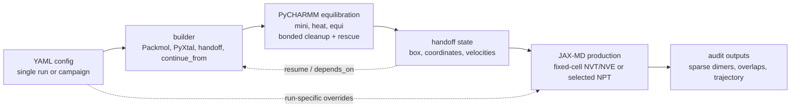
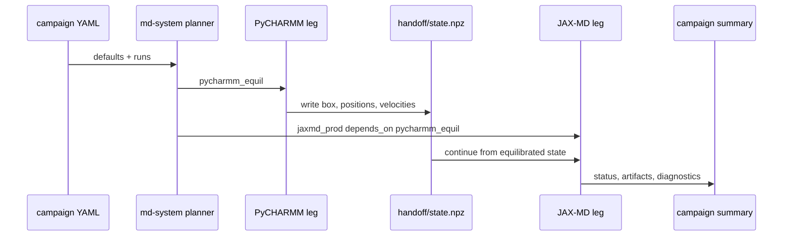
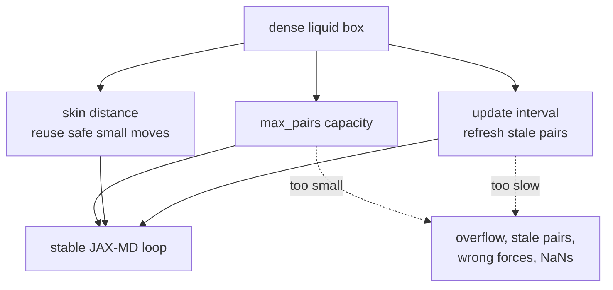

# `md-system` YAML configs

`mmml md-system` accepts YAML so that single simulations and multi-leg campaigns can be run from the same, reviewable config file.

Use the example as a starting point:

```bash
# Single flat config
mmml md-system --config mmml/cli/run/md_system.example.yaml

# Campaign with defaults plus named runs
mmml md-system --config mmml/cli/run/md_system.example.yaml --run-all
mmml md-system --config mmml/cli/run/md_system.example.yaml --job-id jaxmd_prod
```

The main goal for these configs is condensed-phase setup: build a dense molecular box, relax overlaps, hand it between PyCHARMM and JAX-MD, then run production with neighbor-list settings that are large and fresh enough for the density.



## File shapes

A single-run config is a flat mapping. Keys are the Python form of CLI flags, so `--box-size` becomes `box_size`.

```yaml
setup: pbc_npt
backend: jaxmd
composition: "DCM:20"
checkpoint: /path/to/DESdimers_params.json
output_dir: results/jaxmd_single
box_size: 38.0
dt_fs: 0.25
temperature: 260.0
pressure: 10.0
ps: 20
seed: 123
```

A campaign config has `defaults`, `campaign_output`, and `runs`. Every run inherits `defaults`, then overrides only what changes for that leg.

```yaml
defaults:
  composition: "DCM:8"
  checkpoint: /path/to/checkpoint_dir_or_params.json
  box_size: 28.0
  dt_fs: 0.25
  temperature: 100.0
  pressure: 1.0
  seed: 42
  mm_switch_on: 6.0
  mm_switch_width: 4.0
  ml_switch_width: 0.5

campaign_output: artifacts/dcm_small

runs:
  pycharmm_equil:
    backend: pycharmm
    setup: pbc_npt
    md_stages: "mini,heat,equi"
    ps_heat: 2.0
    ps_equi: 2.0
    output_dir: results/dcm_small/pycharmm_equil

  jaxmd_prod:
    backend: jaxmd
    setup: pbc_nvt
    depends_on: pycharmm_equil
    ps: 5
    output_dir: results/dcm_small/jaxmd_prod
    handoff_write_res: true
    extra_args:
      - "--steps-per-recording"
      - "800"
      - "--jax-md-update-interval"
      - "1"
      - "--max-pairs"
      - "1563319"
```

Campaign-only keys are ignored when building the backend command:

- `description`: human-readable label in the campaign plan.
- `depends_on`: job id whose handoff state is used as input.
- `repeat`: replicate count. Repeats write to `rep00`, `rep01`, etc., and seeds are offset by replicate index.
- `optional`: continue the campaign if this job fails.
- `extra_args`: raw backend flags that `md-system` does not expose directly; put each token in its own list item.

Top-level CLI flags win over YAML only for selected campaign-wide runtime controls, including `ml_batch_size`, `ml_gpu_count`, `ml_max_active_dimers`, `skip_jit_warmup`, `handoff_pre_minimize`, and `ml_spatial_mpi`.

## Recommended campaign structure

For condensed phase, keep the template staged and explicit:

1. Put shared physical settings in `defaults`: `composition`, `checkpoint`, `box_size` or density sizing, `dt_fs`, `temperature`, `pressure`, cutoffs, and seed.
2. Use a short PyCHARMM leg first: `md_stages: "mini,heat,equi"` with overlap rescue and bonded MM repair enabled. This catches bad contacts before long JAX-MD runs.
3. Use JAX-MD for fixed-cell production or NVE replicas after the PyCHARMM handoff. Keep neighbor-list capacity and refresh controls in the JAX-MD run block.
4. Return to PyCHARMM only when you need CHARMM restart output, CPT/NPT behavior, or MLpot-specific diagnostics.
5. Keep `output_dir` unique per run and `campaign_output` stable for campaign summaries. Use `--resume-campaign` to skip completed jobs.

Avoid duplicate keys in YAML. If a setting appears twice, YAML keeps only the last value, which can hide mistakes. In particular, keep `dynamics_overlap_action` and `bonded_mm_mini` in one place, usually `defaults`.



## Builders for condensed phase

`composition` uses `RES:N` entries such as `DCM:60` or `DCM:40,ACO:20`. A bare `RES` means one molecule. The builder determines the initial coordinates before minimization.

**Packmol cube is the default for `composition`.** It is the normal liquid-box builder. Use `box_size` as both the Packmol cube edge and the PBC cell side. You can also set `packmol_tolerance`, `packmol_center`, `reuse_packmol_cache`, `packmol_cache_dir`, and `rebuild_packmol`. This is the recommended starting point for disordered condensed-phase liquids.

**Packmol sphere is a legacy/cluster builder.** Use `packmol_placement: sphere` plus `packmol_radius` when you want a finite cluster or spherical initial packing. For PBC liquids, prefer cube packing so the initial geometry matches the periodic cell.

**PyXtal builds symmetry-aware molecular crystals.** Enable with `pyxtal: true` and install `mmml[chem]`. Useful knobs are `pyxtal_spg`, `pyxtal_factor`, `pyxtal_stoichiometry`, `pyxtal_supercell`, `pyxtal_attempts`, and `pyxtal_trim`. Use this when a crystal-like starting point is desired, not for amorphous liquid packing.

**Reference/handoff builders reuse prior states.** `depends_on` loads a campaign predecessor handoff. `continue_from` can start from a handoff NPZ or CHARMM restart. This is the safest route after equilibration because it preserves box, coordinates, and optionally velocities.

**Legacy grid placement is for debugging.** Use `packmol: false` only for simple tests. It is not a good dense-liquid builder because it creates artificial spacing and can leave bad condensed-phase contacts after compression.

## Box and density choices

Use explicit `box_size` when you already know the target density or are matching a benchmark. For automatic sizing, `box_auto: density` requires either `target_density_g_cm3` or `bulk_density_fraction`. Built-in density entries include `DCM`, `ACO`, `MEOH`, `ETOH`, `TIP3`, and `WAT`; use `target_density_g_cm3` for other residues.

Post-build MC density equalization is enabled by default for new PBC composition builds when density and molecular-weight metadata can be resolved. It adjusts the initial cubic box with whole-molecule MC volume moves after Packmol, PyXtal, or grid construction and before MLpot registration. When `box_size` is set, that value is used as the starting box side rather than as an immutable cell. The final side is still clamped to the geometry/cutoff minimum used for MIC-safe box sizing; `mc_density_min_scale` is only an additional relative lower bound. It skips handoffs and unknown residues without mass metadata. Disable it with `mc_density_equalize: false` or `--no-mc-density-equalize`.

For small liquid boxes, start looser than the final density, minimize and heat, then tighten with NPT or mini-box equilibration. Useful controls are:

- `mc_density_equalize`: default-on post-build MC box-density adjustment for eligible PBC composition builds.
- `mc_density_target_g_cm3`: explicit target for MC density equalization when not using built-in single-solvent density metadata.
- `mini_box_equil_ps`: PyCHARMM mini-stage box relaxation.
- `jaxmd_mini_box_equil_ps`: JAX-MD pre-production box relaxation.
- `bulk_density_fraction`: quick way to start below full liquid density, for example `0.8`.
- `dynamics_overlap_action: rescue`: repair close contacts during staged dynamics.
- `bonded_mm_mini: true`: run bonded-only MM cleanup after selected stages.

## Neighbor-list requirements

Condensed phase fails quickly if the neighbor list is too small or refreshed too slowly. Treat neighbor-list sizing as part of the physical setup, not only a performance knob.



For JAX-MD:

- `max_pairs` must cover the maximum MM pair count in the dense box. The backend default is `20000`, which is too small for many condensed-phase systems. Large DCM boxes often need values in the hundreds of thousands or millions.
- `jax_md_update_interval: 1` is the conservative choice. NPT and changing boxes need frequent refreshes; stale pairs can produce wrong forces and NaNs.
- `jax_md_skin_distance` defaults to a safe Verlet skin. Use `0` only for debugging because it rebuilds every step.
- `steps_per_recording` controls NPT recording blocks and, in the JAX-MD runner, the outer neighbor-list refresh cadence. Smaller values are safer for NPT; larger values can be faster for stable NVT/NVE.
- `jax_md_capacity_multiplier`, `jax_md_capacity_growth_factor`, and `jax_md_max_overflow_retries` let JAX-MD reallocate when capacity overflows. Persistent overflow means the geometry/capacity needs attention.

For PyCHARMM MLpot:

- `ml_max_active_dimers` caps active ML dimers. Medium PBC jobs should validate that the cap is not saturated before production.
- `mm_switch_on`, `mm_switch_width`, and `ml_switch_width` must stay consistent across PyCHARMM and JAX-MD legs; put them in `defaults`.
- `ml_batch_size` and `ml_gpu_count` control PhysNet batching and GPU use. See [Medium PBC](mlpot-medium-pbc.md) for 500-2000 monomer guidance.

Before long production, audit the equilibrated geometry:

```bash
python scripts/audit_mlpot_cluster.py --output-dir results/dcm_small/pycharmm_equil
```

or validate an equilibrated CRD directly:

```bash
python scripts/validate_mlpot_sparse_dimers.py \
  --crd results/dcm_small/pycharmm_equil/mini_full_mlpot_TAG.crd \
  --n-monomers 1000 \
  --atoms-per-monomer 10 \
  --box-size 40
```

Exit code `0` means the sparse dimer cap covers the near dimers. Exit code `1` means the cap is saturated; raise `ml_max_active_dimers`, enlarge the box, or reduce the system.

## Template improvements

Use this structure when turning ad hoc configs into reusable campaign templates:

- Keep one `defaults` block for physics and one run block per stage. Do not repeat defaults inside every run unless the run intentionally changes them.
- Name runs by role and order: `pycharmm_equil`, `jaxmd_prod`, `jaxmd_nve`, `pycharmm_prod`.
- Put backend-specific safety knobs near the run that needs them: JAX-MD neighbor-list flags in JAX-MD runs, PyCHARMM overlap rescue in PyCHARMM runs.
- Prefer `box_size` and `packmol_placement: cube` for PBC liquids; reserve `packmol_radius` for spherical cluster templates.
- Include short smoke values in versioned examples (`ps: 0.1-1`) and override for production in a local config.
- Keep machine-specific paths, checkpoint directories, and very large `max_pairs` values in a local copy or site-specific template.
- Add comments for pass/fail criteria, such as "handoff writes `handoff/state.npz`" or "sparse dimer audit exits 0".

## YAML key aliases

These aliases are accepted in config files:

```yaml
output: output_dir
checkpoint_path: checkpoint
job: job_id
job-id: job_id
run-all: run_all
resume-campaign: resume_campaign
continue-from: continue_from
continue-from-frame: continue_from_frame
handoff-write-res: handoff_write_res
handoff-template-res: handoff_template_res
no-stage-summary: no_stage_summary
campaign_output: campaign_output_dir
campaign-output: campaign_output_dir
```

Hyphenated keys are also normalized to underscores, so `box-size` and `box_size` both map to `box_size`.

## Default variables

This snapshot is generated from `mmml.cli.run.md_system.build_parser()`. Values shown as `null` are unset until you pass them or set them in YAML.

```yaml
setup: pbc_nve
backend: auto
checkpoint: null
output_dir: null
job_name: null
jobs_dir: artifacts/md_system/jobs
template_pdb: null
n_molecules: 10
composition: null
spacing: 5.0
box_size: null
ps: 1.0
dt_fs: 0.25
traj_chunk_frames: 0
traj_export_molecular_wrap: false
temperature: 300.0
nvt_integrator: auto
pressure: 1.0
seed: 123
min_intermonomer_atom_distance: 0.1
packmol: null
packmol_placement: null
packmol_sphere: null
packmol_radius: null
packmol_center: null
packmol_tolerance: 2.0
reuse_packmol_cache: true
rebuild_packmol: false
packmol_cache_dir: null
pyxtal: null
pyxtal_spg: 14
pyxtal_dim: 3
pyxtal_factor: 1.0
pyxtal_stoichiometry: null
pyxtal_supercell: null
pyxtal_attempts: 20
pyxtal_trim: true
optimize_pyxtal: false
optimize_pyxtal_emt: false
box_auto: null
target_density_g_cm3: null
bulk_density_fraction: null
mc_density_equalize: true
mc_density_target_g_cm3: null
mc_density_steps: 64
mc_density_step_scale: 0.04
mc_density_temperature: 0.02
mc_density_seed: null
mc_density_min_scale: 0.35
mc_density_max_scale: 1.5
mini_box_equil_ps: 0.0
mini_box_equil_allow_fixed_box: false
jaxmd_mini_box_equil_ps: 0.0
mini_lattice_abnr_steps: 0
mini_lattice_abnr_nocoords: false
mini_lattice_abnr_allow_fixed_box: false
save_run_state: false
run_state_dir: null
overlap_run_state_dir: null
overlap_run_state_every_chunks: 0
flat_bottom_radius: null
flat_bottom_k: 1.0
flat_bottom_selection: all
flat_bottom_mode: system
min_com_restraint_distance: null
min_com_restraint_k: 1.0
fix_resids: ""
constrain_resids: ""
no_fix: false
mini_nstep: 20
no_pre_minimize: false
echeck: 100.0
no_echeck: false
no_echeck_heat: false
allow_incomplete_dynamics: false
nprint: 50
dyn_nprint: 500
dyn_iprfrq: 2000
heat_ihtfrq: 0
heat_thermostat: scale
heat_firstt: null
heat_finalt: null
heat_hoover_tmass: null
nve_boltzmann_temp: null
heat_comp_damp: false
heat_comp_hydrogen_only: true
heat_comp_force_min: null
heat_comp_force_scale: null
skip_energy_show: false
show_energy: null
quiet: false
verbose: false
dcd_nsavc: 1
dcd_interval_ps: null
dcd_max_frames: 25
save_forces_npz: false
forces_npz_interval: 1
no_scale_mini_nstep: false
no_scale_echeck: false
allow_high_grms: false
max_grms_before_dyn: 50.0
test_first: false
test_first_tol: 0.005
test_first_step: 0.0001
test_first_resids: ""
test_first_charmm: false
test_first_update_nbonds: false
ml_batch_size: null
ml_gpu_count: null
max_pairs: null
ml_spatial_mpi: false
ml_compute_dtype: null
ml_max_active_dimers: null
md_stages: null
md_stage: null
tag: null
ps_heat: 10.0
charmm_mm_pretreat: false
charmm_mm_pretreat_on_handoff: false
charmm_mm_pretreat_ps_heat: null
charmm_mm_pretreat_heat_nstep: 2000
charmm_mm_pretreat_ps_equi: 0.0
charmm_mm_pretreat_ps_prod: 0.0
charmm_mm_pretreat_mini_sd: null
charmm_mm_pretreat_mini_abnr: null
ps_nve: null
ps_equi: 50.0
ps_prod: null
npt_thermostat: hoover
npt_pressure: 1.0
npt_pgamma: 5.0
n_heat_segments: 1
n_equi_segments: 1
n_prod_segments: 1
bonded_mm_mini: true
bonded_mm_mini_after: mini,heat
bonded_mm_mini_steps: 50
bonded_mm_mini_always: false
bonded_mm_internal_margin: 0.0
bonded_mm_grms_margin: null
bonded_mm_internal_energy_margin: 0.0
bonded_mm_angl_margin: 0.0
bonded_mm_max_angl_kcal: null
bonded_mm_max_internal_kcal: null
allow_high_bonded_strain: false
dynamics_overlap_action: rescue
dynamics_overlap_charmm_sd_steps: 200
dynamics_overlap_charmm_abnr_steps: 400
dynamics_overlap_min_distance: 1.5
dynamics_intra_min_distance: 1.0
no_dynamics_intra_exclude_1_3: false
dynamics_intra_rescue_sd_steps: null
dynamics_overlap_check_interval: 500
heat_overlap_segment_boundary_only: false
dynamics_overlap_memory_handoff: false
no_dynamics_overlap_separate: false
dynamics_overlap_separate_margin: 0.2
dynamics_max_monomer_extent: 12.0
no_dynamics_max_monomer_extent: false
restart_from: null
from_psf: null
from_crd: null
skip_cluster_build: false
skip_if_crd_exists: false
no_save_vmd_topology: false
free_space: false
mlpot_pbc: false
dyn_inbfrq: null
dyn_imgfrq: null
pre_nve_charmm_update: null
lambda_md_mode: free_nve
couple_residues: 1
lambda_windows: [0.0, 0.1, 0.2, 0.3, 0.4, 0.5, 0.6, 0.7, 0.8, 0.9, 1.0]
pre_min_steps: 50
pre_min_fmax: 0.1
min_steps: null
min_fmax: null
bfgs_maxstep: 0.05
charmm_pre_minimize: true
calculator_pre_minimize: true
charmm_sd_steps: 25
charmm_abnr_steps: 100
charmm_tolenr: 0.001
charmm_tolgrd: 0.001
charmm_nbxmod: 5
rescue_minimize: true
max_fmax_after_min: 2.0
n_equil: 500
save_equil_traj: false
equil_traj_interval: null
n_prod: 2000
repeats_per_window: 1
interval: 20
min_com_start_distance: 2.0
no_fix_com: false
no_stationary: false
ml_cutoff: 1.0
ml_switch_width: 1.5
mm_switch_on: 8.0
mm_switch_width: 5.0
mlpot_mm_internal_scale: 0.0
residue: MEOH
skip_jit_warmup: false
resume: false
config: null
job_id: null
run_all: false
resume_campaign: false
campaign_output_dir: null
continue_from: null
continue_from_frame: -1
continue_velocities: true
handoff_write_res: true
handoff_template_res: null
handoff_pre_minimize: false
handoff_quality_gate: false
handoff_quality_fmax_eVA: 1.0
handoff_quality_action: minimize
handoff_velocity_remove_drift: true
handoff_require_cell: false
jaxmd_minimize_steps: 200
jaxmd_pbc_minimize_steps: 200
evaluate_npz: null
evaluate_output: null
evaluate_frame: 0
evaluate_forces_npz: null
evaluate_traj: null
no_evaluate_save_artifacts: false
evaluate_reference_npz: null
evaluate_reference_frame: null
evaluate_reference_energy_unit: null
evaluate_reference_force_unit: null
evaluate_compare_output: null
dyna_probe: false
dyna_probe_nstep: 1
dyna_probe_dt_fs: 0.5
dyna_probe_output: null
optimize_cutoffs: false
reference_npz: null
optimize_output: null
ml_switch_width_grid: 1.5,2.0,2.5,3.0
mm_switch_on_grid: 4.0,5.0,6.0,7.0
mm_switch_width_grid: 0.5,1.0,1.5,2.0
energy_weight: 1.0
force_weight: 1.0
max_frames: null
no_stage_summary: false
mlpot_profile: false
```
