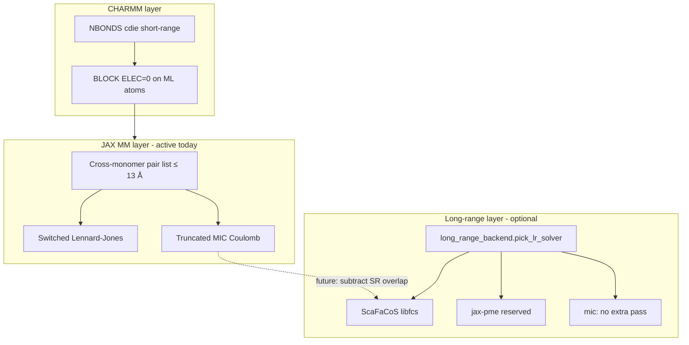

# Long-range electrostatics in MLpot

Technical reference for how **short-range** and **long-range** Coulomb interactions are handled in the hybrid ML/MM potential, and how optional backends (**ScaFaCoS**, **jax-pme**) plug in.

Related: [NONBOND_LISTS.md](NONBOND_LISTS.md) (neighbor lists), [ScaFaCoS README](../../scafacosInterface/README.md) (installation), [`long_range_backend.py`](../long_range_backend.py) (Python selector).

---

## Problem

MLpot runs a **dual-stack** nonbond model:

| Stack | Electrostatics today | Cutoff |
|-------|---------------------|--------|
| CHARMM Fortran | `cdie` + switched VDW/ELEC on non-ML atoms; **BLOCK zeros ELEC on ML atoms** | `cutnb` ≈ 18 Å (vacuum preset) |
| JAX MM (`mm_energy_forces.py`) | MIC \(q_i q_j / r\) on cross-monomer pairs | `mm_switch_on + mm_switch_width` ≈ **13 Å** default |

Neither path applies a **k-space Ewald/PME correction** beyond the JAX pair cutoff. For large periodic clusters or boxes where 13 Å real-space Coulomb is insufficient, forces and energies can drift from a fully converged PME reference.

ScaFaCoS and jax-pme are optional backends to close that gap without moving all electrostatics back into CHARMM Ewald (which is disabled in current MMML `nbonds_config` presets).

---

## Architecture



### Design goals

1. **Keep MLpot callback structure** — Python still returns USER energy/forces; no change to CHARMM integrator ownership.
2. **Optional dependencies** — default install works without ScaFaCoS binaries; `have_scafacos()` probes at runtime.
3. **Mirror `nl_backend.py`** — env `MMML_LR_SOLVER`, `auto` fallback chain, explicit `mic` for regression tests.
4. **CHARMM unit consistency** — \(k = 332.063711\) kcal·Å/e² throughout.

---

## Backend selection

Implementation: [`long_range_backend.py`](../long_range_backend.py).

| Name | When chosen | Status |
|------|-------------|--------|
| `auto` | Default | `scafacos` → `jax_pme` → `mic` |
| `mic` | Explicit or fallback | **Production default** — all Coulomb in pair loop |
| `scafacos` | `MMML_LR_SOLVER=scafacos` and `libfcs` loads | **Interface ready** — session + one-shot API |
| `jax_pme` | Auto when ScaFaCoS absent and `jax-pme` importable | Reserved (dependency pinned, wiring pending) |

Log probe:

```bash
python -c "from mmml.interfaces.pycharmmInterface.long_range_backend import describe_lr_solver; print(describe_lr_solver())"
```

---

## ScaFaCoS interface contract

Python module: [`scafacos_session.py`](../../scafacosInterface/scafacos_session.py).

### Lifecycle

```
fcs_init(method, MPI_Comm)
  → fcs_set_common(box, periodicity, n_atoms)
  → fcs_set_parameter(...)   # optional tuning
  → fcs_run(positions, charges) → fields, potentials
  → fcs_destroy
```

Wrapped by `ScaFaCoSSession` (context manager) and `compute_scafacos_coulomb()` (single call).

### Data passed each evaluation

| Field | Shape / type | Units |
|-------|--------------|-------|
| `positions_A` | `(N, 3)` float64 | Å, Cartesian |
| `charges_e` | `(N,)` float64 | elementary charge |
| `box_length_A` | scalar | cubic edge length Å |

### MPI

ScaFaCoS expects an MPI communicator. MMML passes `MPI.COMM_WORLD.py2f()` when `mpi4py` is available, else `0` (serial). For domain-decomposed CHARMM runs, the communicator must match the MD code’s partition — future work.

### Short-range / long-range splitting

ScaFaCoS supports a `short_range_flag` in `fcs_set_common` so the library can compute only the k-space part while a local pair list supplies the real-space term. MMML’s planned wiring:

1. JAX pair loop keeps **switched LJ + short-range Coulomb** inside `mm_switch_on + mm_switch_width`.
2. ScaFaCoS evaluates **total** or **k-space-only** Coulomb for the same atom subset.
3. If total: subtract the JAX pair sum to avoid double counting.
4. ML atoms: charges may be zero in CHARMM BLOCK path; include only atoms that carry MM partial charges in the ScaFaCoS charge array.

This split is **not yet applied inside `build_mm_energy_forces_fn`** — the interface and docs land first so HPC sites can validate `libfcs` standalone.

---

## jax-pme (reserved)

`jax-pme` is a core MMML dependency (git pin in `pyproject.toml`) for a **pure-JAX** PME path without Fortran/MPI binaries. It will share the same `LongRangeCoulombSolver` protocol once implemented, giving laptops and CI a long-range option when ScaFaCoS is unavailable.

---

## CHARMM Ewald (not used by MMML workflows)

Vendored CHARMM sources include PME (`pme.F90`), helPME (`helpme_wrapper.F90`), and FMM (`grape.F90`). MMML production presets use `vacuum_nbond_kwargs()` / PBC variants with **`cdie` only** — no `ewald` / `pmewald` keywords from Python.

A CHARMM-native ScaFaCoS hook (Fortran `iso_c_binding` wrapper, analogous to helPME) remains a secondary integration path if residual MM atoms need reciprocal-space treatment inside Fortran rather than in the MLpot callback.

---

## Periodic external MM (`--mm-nonbond-mode periodic_external`)

Requires **full PBC** (`--setup pbc_nve|pbc_nvt|pbc_npt`), **ML MIC** (default for `pbc_*`), and a built **ScaFaCoS** library.

| Term | Backend | Notes |
|------|---------|-------|
| Coulomb | ScaFaCoS (`--lr-solver scafacos`) | Full periodic; JAX real-space Coulomb **off** |
| Lennard-Jones | CHARMM IMAGE VDW | Switched VDW at `cutnb` (scaled to box); **not** ScaFaCoS |
| JAX MM pairs | disabled | No truncated MIC LJ/Coulomb in callback |

```bash
export SCAFACOS_LIB=/path/to/libfcs.so
mmml md-system --setup pbc_nvt --backend pycharmm \
  --composition DCM:20 --box-size 45 \
  --mm-nonbond-mode periodic_external --lr-solver scafacos
```

### Box size

The cubic edge must satisfy:

1. `L/2 > cutnb` (CHARMM IMAGE cutoff; auto-scaled via `pbc_nbond_cutoffs`)
2. `L >= cluster_extent + 5 Å` (margin before images wrap the cluster)
3. Minimum **20 Å** when extent is unknown at CLI parse time

`staged_workflow` validates these after Packmol/MC density using actual coordinates.

### Limitations

- **Orthorhombic cubic** boxes only (ScaFaCoS + current CHARMM presets).
- **No COM switching** on external MM terms — ML dimer handoff still applies to PhysNet; CHARMM VDW and ScaFaCoS Coulomb are unswitched. Avoid overlap at short COM distances or increase box spacing.
- **jax_pme** is not wired for `periodic_external` yet (ScaFaCoS only).
- **NpT**: ScaFaCoS box is refreshed each callback from the synced MIC cell side.

---

## Configuration surface (planned CLI/YAML)

| Flag / key | Maps to |
|------------|---------|
| `MMML_LR_SOLVER` | `pick_lr_solver()` |
| `SCAFACOS_METHOD` | `fcs_init` method string |
| `SCAFACOS_LIB` | `load_scafacos_library()` |
| `--lr-solver` (future) | staged-workflow / `md-system` |
| `lr_solver: scafacos` (future) | `docs/md-system-configs.md` YAML |

---

## Validation ladder (manual)

When ScaFaCoS is installed on a cluster node:

1. **Library probe** — `have_scafacos()` true.
2. **Neutral cluster** — two-opposite-charge dimer in cubic box; compare `compute_scafacos_coulomb` energy to analytical limits at large separation.
3. **vs MIC** — same geometry, compare ScaFaCoS total to JAX pair Coulomb at small `L` (should agree within tolerance when all pairs are inside cutoff).
4. **MLpot callback** (future) — NVE drift with `MMML_LR_SOLVER=scafacos` on a 13+ Å box where MIC-only shows energy drift.

Scripts belong under `tests/functionality/long_range/` (to be added when callback wiring lands).

---

## Open questions

| # | Topic | Notes |
|---|-------|-------|
| 1 | Charge subset | All atoms vs MM-only vs excluding ML monomer cores |
| 2 | Differentiable path | ScaFaCoS is NumPy/MPI; JAX MM forces need `stop_gradient` or custom VJP for hybrid autodiff |
| 3 | NpT box sync | ScaFaCoS box must track `sync_mlpot_pbc_cell_from_charmm` barostat updates each callback |
| 4 | `idxu/idxv` embedding | CHARMM-derived ML–MM pair lists ([NONBOND_LISTS.md](NONBOND_LISTS.md)) may share ScaFaCoS short-range tables |

---

## See also

- [ScaFaCoS README](../../scafacosInterface/README.md) — install, API examples, license  
- [NONBOND_LISTS.md](NONBOND_LISTS.md) — CHARMM vs JAX list cutoffs  
- [CHARMM_SETTINGS.md](CHARMM_SETTINGS.md) — `cutnb`, `inbfrq`, PBC dynamics  
