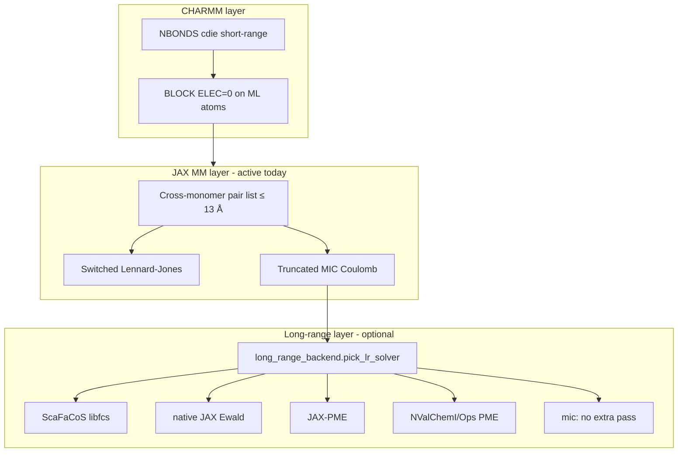

# Long-range electrostatics in MLpot

Technical reference for how **short-range** and **long-range** Coulomb
interactions are handled in the hybrid ML/MM potential. The supported execution
faces are enforced by long-range and MM-nonbonded tests.
`[evidence: long_range_solver_surface]`

Related: [NONBOND_LISTS.md](https://github.com/EricBoittier/mmml/blob/main/mmml/interfaces/pycharmmInterface/mlpot/NONBOND_LISTS.md) (neighbor lists), [ScaFaCoS README](https://github.com/EricBoittier/mmml/blob/main/mmml/interfaces/scafacosInterface/README.md) (installation), [`long_range_backend.py`](https://github.com/EricBoittier/mmml/blob/main/mmml/interfaces/pycharmmInterface/long_range_backend.py) (Python selector).

---

## Problem

MLpot runs a **dual-stack** nonbond model:

| Stack | Electrostatics today | Cutoff |
|-------|---------------------|--------|
| CHARMM Fortran | `cdie` + switched VDW/ELEC on non-ML atoms; **BLOCK zeros ELEC on ML atoms** | `cutnb` ≈ 18 Å (vacuum preset) |
| JAX MM (`mm_energy_forces.py`) | MIC, native Ewald, or a host-orchestrated periodic solver, depending on execution face | Explicit cutoff configuration |

Plain `mic` applies no reciprocal correction. Native Ewald supplies a JIT-safe
real/reciprocal/self decomposition; JAX-PME, NValChemI/Ops PME, and ScaFaCoS
are host-orchestrated full-box alternatives.

---

## Architecture


```mermaid
flowchart TB
  subgraph charmm [CHARMM layer]
    NB[NBONDS cdie short-range]
    BLOCK[BLOCK ELEC=0 on ML atoms]
    NB --> BLOCK
  end

  subgraph jax [JAX MM layer - active today]
    PAIRS[Cross-monomer pair list ≤ 13 Å]
    LJ[Switched Lennard-Jones]
    MIC[Truncated MIC Coulomb]
    PAIRS --> LJ
    PAIRS --> MIC
  end

  subgraph lr [Long-range layer - optional]
    SEL[long_range_backend.pick_lr_solver]
    SCF[ScaFaCoS libfcs]
    EWL[native JAX Ewald]
    PME[JAX-PME]
    NVAL[NValChemI/Ops PME]
    MICONLY[mic: no extra pass]
    SEL --> SCF
    SEL --> EWL
    SEL --> PME
    SEL --> NVAL
    SEL --> MICONLY
  end

  BLOCK --> jax
  MIC --> SEL
```

### Design goals

1. **Keep MLpot callback structure** — Python still returns USER energy/forces; no change to CHARMM integrator ownership.
2. **Optional dependencies** — default install works without ScaFaCoS binaries; `have_scafacos()` probes at runtime.
3. **Mirror `nl_backend.py`** — env `MMML_LR_SOLVER`, default `mic`, explicit opt-in for k-space backends.
4. **CHARMM unit consistency** — \(k = 332.063711\) kcal·Å/e² throughout.

---

## Backend selection

Implementation: [`long_range_backend.py`](https://github.com/EricBoittier/mmml/blob/main/mmml/interfaces/pycharmmInterface/long_range_backend.py).

| Name | When chosen | Status |
|------|-------------|--------|
| `mic` | Default (unset env/YAML) or explicit | **Production default** — truncated MIC in pair loop |
| `auto` | Legacy alias | Same as `mic` |
| `ewald` | Explicit opt-in | Native JAX Ewald; available to the JIT MM term and periodic-external path |
| `jax_pme` | `lr_solver: jax_pme` or `MMML_LR_SOLVER=jax_pme` | Opt-in — jax-pme Ewald/PME/P3M + switched MM |
| `scafacos` | `MMML_LR_SOLVER=scafacos` and `libfcs` loads | Opt-in — full-box Coulomb via ScaFaCoS |
| `nvalchemiops_pme` | Explicit opt-in | Opt-in — full-box PME via nvalchemiops |

Log probe:

```bash
python -c "from mmml.interfaces.pycharmmInterface.long_range_backend import describe_lr_solver; print(describe_lr_solver())"
```

---

## ScaFaCoS interface contract

Python module: [`scafacos_session.py`](https://github.com/EricBoittier/mmml/blob/main/mmml/interfaces/scafacosInterface/scafacos_session.py).

### Lifecycle

```
fcs_init(method, MPI_Comm)
  → fcs_set_common(box, periodicity, n_atoms)
  → fcs_set_parameter(...)   # optional tuning
  → fcs_run(positions, charges) → fields, potentials
  → fcs_destroy
```

Wrapped by `ScaFaCoSSession` (context manager) and `compute_scafacos_coulomb()` (single call).

### Data passed each evaluation

| Field | Shape / type | Units |
|-------|--------------|-------|
| `positions_A` | `(N, 3)` float64 | Å, Cartesian |
| `charges_e` | `(N,)` float64 | elementary charge |
| `box_length_A` | scalar | cubic edge length Å |

### MPI

ScaFaCoS expects an MPI communicator. MMML passes `MPI.COMM_WORLD.py2f()` when `mpi4py` is available, else `0` (serial). For domain-decomposed CHARMM runs, the communicator must match the MD code’s partition — future work.

### Short-range / long-range splitting

ScaFaCoS supports a `short_range_flag` in `fcs_set_common`. MMML's maintained
`periodic_external` integration uses the selected full-box solver as the
Coulomb owner and keeps Lennard-Jones ownership separate. A future
k-space-only ScaFaCoS optimization would require explicit overlap subtraction;
it is not implied by the current full-box path.

---

## JAX-PME and NValChemI/Ops PME

Both are implemented through `long_range_backend.py` and the periodic-external
MM adapter. They are host-orchestrated and therefore available through the ASE
or callback face, not inside every `jax.jit` propagation graph. The unified
JAX MM term rejects those host-only solvers instead of silently falling back to
MIC; native `ewald` is the JIT-compatible reciprocal-space choice.

---

## Native Ewald and CHARMM ownership

Vendored CHARMM sources include PME (`pme.F90`), helPME
(`helpme_wrapper.F90`), and FMM (`grape.F90`). MMML's `--lr-solver ewald`
path is the native JAX Ewald implementation in `ewald_native.py`; it is not a
claim that CHARMM's internal PME owns the same charge interactions.

A CHARMM-native ScaFaCoS hook (Fortran `iso_c_binding` wrapper, analogous to helPME) remains a secondary integration path if residual MM atoms need reciprocal-space treatment inside Fortran rather than in the MLpot callback.

---

## Periodic external MM (`--mm-nonbond-mode periodic_external`)

Requires **full PBC** (`--setup pbc_nve|pbc_nvt|pbc_npt`) and one supported
full-box solver. Optional packages/libraries are checked during preflight.

| Term | Backend | Notes |
|------|---------|-------|
| Coulomb | `ewald`, `jax_pme`, `nvalchemiops_pme`, or `scafacos` | Full periodic; JAX MIC Coulomb **off** |
| Lennard-Jones | CHARMM IMAGE VDW | Switched VDW at `cutnb` (scaled to box); **not** ScaFaCoS |
| JAX MM pairs | disabled | No truncated MIC LJ/Coulomb in callback |

```bash
export SCAFACOS_LIB=/path/to/libfcs.so
mmml md-system --setup pbc_nvt --backend pycharmm \
  --composition DCM:20 --box-size 45 \
  --mm-nonbond-mode periodic_external --lr-solver scafacos
```

### Coulomb only (no CHARMM IMAGE VDW)

ScaFaCoS Coulomb with CHARMM VDW and JAX real-space MM both off:

```bash
mmml md-system --setup pbc_nvt --backend pycharmm \
  --composition DCM:20 --box-size 45 \
  --mm-nonbond-mode periodic_external --lr-solver scafacos \
  --no-periodic-charmm-vdw
```

Nonbond interactions are then **ScaFaCoS Coulomb + ML (PhysNet)** only. There is no separate LJ term unless the ML model includes it.

### Box size

The cubic edge must satisfy:

1. `L/2 > cutnb` (CHARMM IMAGE cutoff; auto-scaled via `pbc_nbond_cutoffs`)
2. `L >= cluster_extent + 5 Å` (margin before images wrap the cluster)
3. Minimum **20 Å** when extent is unknown at CLI parse time

`staged_workflow` validates these after Packmol/MC density using actual coordinates.

### Limitations

- **Orthorhombic cubic** boxes only (ScaFaCoS + current CHARMM presets).
- **No COM switching** on external MM terms — ML dimer handoff still applies to PhysNet; CHARMM VDW and ScaFaCoS Coulomb are unswitched. Avoid overlap at short COM distances or increase box spacing.
- **jax_pme** is not wired for `periodic_external` yet (ScaFaCoS only).
- **NpT**: ScaFaCoS box is refreshed each callback from the synced MIC cell side.

---

## Configuration surface (planned CLI/YAML)

| Flag / key | Maps to |
|------------|---------|
| `MMML_LR_SOLVER` | `pick_lr_solver()` |
| `SCAFACOS_METHOD` | `fcs_init` method string |
| `SCAFACOS_LIB` | `load_scafacos_library()` |
| `--lr-solver` (future) | staged-workflow / `md-system` |
| `lr_solver: scafacos` (future) | `docs/md-system-configs.md` YAML |

---

## Validation ladder (manual)

When ScaFaCoS is installed on a cluster node:

1. **Library probe** — `have_scafacos()` true.
2. **Neutral cluster** — two-opposite-charge dimer in cubic box; compare `compute_scafacos_coulomb` energy to analytical limits at large separation.
3. **vs MIC** — same geometry, compare ScaFaCoS total to JAX pair Coulomb at small `L` (should agree within tolerance when all pairs are inside cutoff).
4. **MLpot callback** (future) — NVE drift with `MMML_LR_SOLVER=scafacos` on a 13+ Å box where MIC-only shows energy drift.

Scripts belong under `tests/functionality/long_range/` (to be added when callback wiring lands).

---

## Open questions

| # | Topic | Notes |
|---|-------|-------|
| 1 | Charge subset | All atoms vs MM-only vs excluding ML monomer cores |
| 2 | Differentiable path | ScaFaCoS is NumPy/MPI; JAX MM forces need `stop_gradient` or custom VJP for hybrid autodiff |
| 3 | NpT box sync | ScaFaCoS box must track `sync_mlpot_pbc_cell_from_charmm` barostat updates each callback |
| 4 | `idxu/idxv` embedding | CHARMM-derived ML–MM pair lists ([NONBOND_LISTS.md](https://github.com/EricBoittier/mmml/blob/main/mmml/interfaces/pycharmmInterface/mlpot/NONBOND_LISTS.md)) may share ScaFaCoS short-range tables |

---

## See also

- [ScaFaCoS README](https://github.com/EricBoittier/mmml/blob/main/mmml/interfaces/scafacosInterface/README.md) — install, API examples, license  
- [NONBOND_LISTS.md](https://github.com/EricBoittier/mmml/blob/main/mmml/interfaces/pycharmmInterface/mlpot/NONBOND_LISTS.md) — CHARMM vs JAX list cutoffs  
- [CHARMM_SETTINGS.md](https://github.com/EricBoittier/mmml/blob/main/mmml/interfaces/pycharmmInterface/mlpot/CHARMM_SETTINGS.md) — `cutnb`, `inbfrq`, PBC dynamics  
