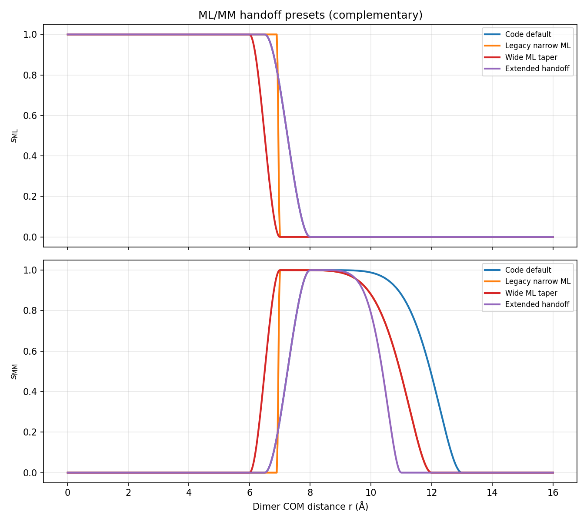
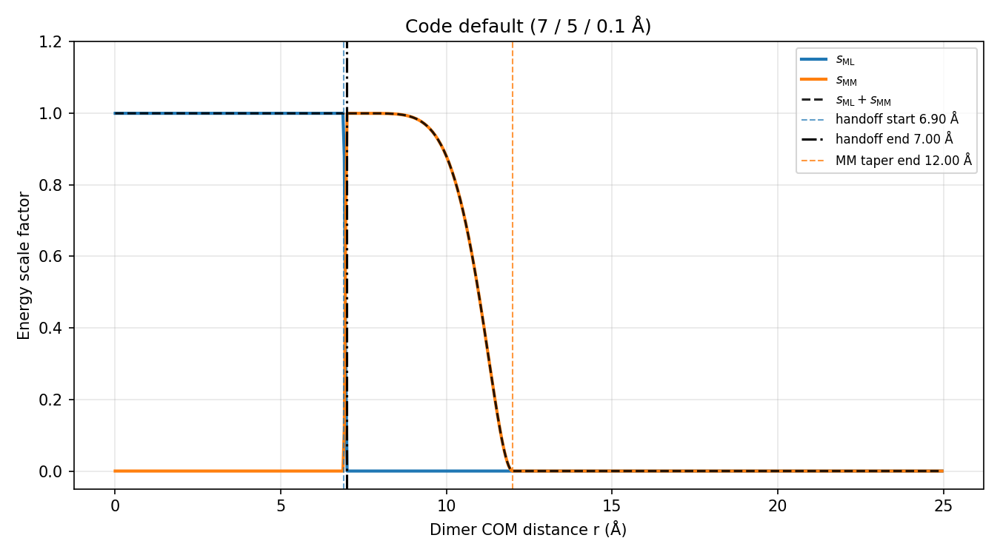
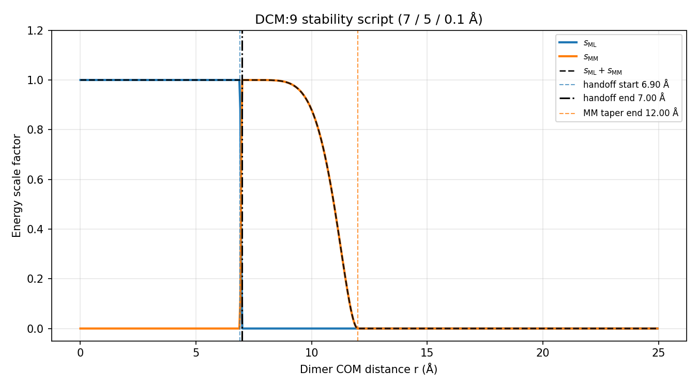
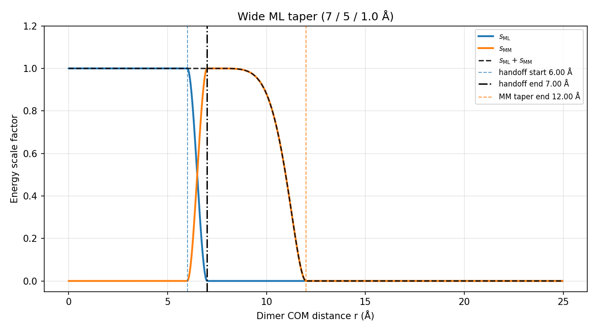
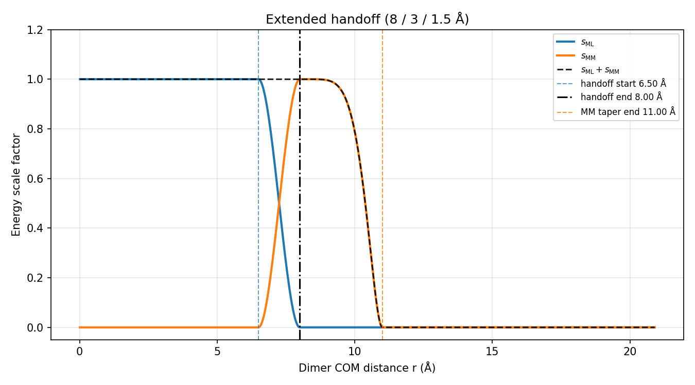
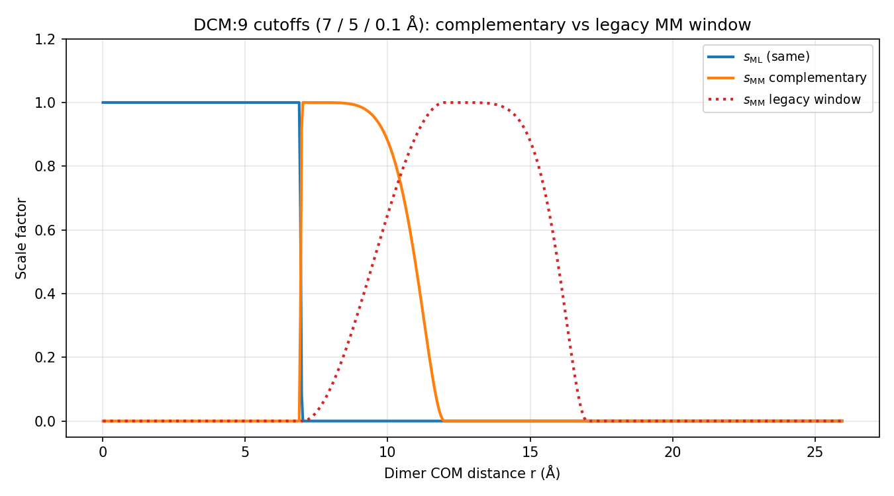
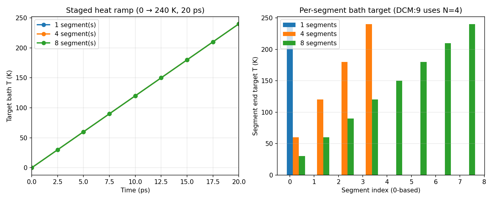

# MLpot switching reference

Visual reference for ML/MM handoff switches and staged heating. Figures are generated locally by:

```bash
uv run python scripts/plot_mlpot_settings.py
```

Output directory: `docs/images/mlpot-settings/`.

CLI flags: [`mmml/interfaces/pycharmmInterface/cutoffs.py`](https://github.com/EricBoittier/mmml/blob/main/mmml/interfaces/pycharmmInterface/cutoffs.py) (`--mm-switch-on`, `--mm-switch-width`, `--ml-switch-width`). Dynamics: [`CHARMM_SETTINGS.md`](https://github.com/EricBoittier/mmml/blob/main/mmml/interfaces/pycharmmInterface/mlpot/CHARMM_SETTINGS.md).

## What The Three Numbers Mean

The switches use **monomer COM-COM distance** `r`, not atom-atom distance. The default tuple is:

```text
mm_switch_on / mm_switch_width / ml_switch_width = 8.0 / 5.0 / 1.5 Å
```

| Region | COM distance `r` | ML scale `s_ML` | MM scale `s_MM` |
|--------|-------------------|-----------------|-----------------|
| Pure ML | `r <= mm_switch_on - ml_switch_width` | 1 | 0 |
| Handoff | `mm_switch_on - ml_switch_width < r < mm_switch_on` | smoothly 1→0 | smoothly 0→1 |
| MM tail | `mm_switch_on <= r < mm_switch_on + mm_switch_width` | 0 | smoothly 1→0 |
| Off | `r >= mm_switch_on + mm_switch_width` | 0 | 0 |

For the default `8 / 5 / 1.5 Å`, this means:

- `r <= 6.5 Å`: ML two-body term is fully on; switched MM is off.
- `6.5 < r < 8.0 Å`: ML hands off to MM; `s_ML + s_MM = 1`.
- `8.0 <= r < 13.0 Å`: ML is off; MM decays to zero.
- `r >= 13.0 Å`: both switched two-body terms are off.

The switching functions are scale factors on the **pair interaction energy**, so a plotted “potential” will only look smooth if you plot `s_ML(r) * E_ML(r) + s_MM(r) * E_MM(r)`. Plotting the raw scales alone only shows the handoff weights.

## Preventing Collapsed COM Contacts

The handoff switches do not stop monomers from entering unphysical short-COM geometries. If the ML dimer surface has a deep collapsed/reactive basin, add a pairwise inter-monomer COM lower wall:

```text
V_COM(r) = 0.5 * k * (r_min - r)^2   if r < r_min
         = 0                         otherwise
```

Use:

```bash
--min-com-restraint-distance 6.0 \
--min-com-restraint-k 1.0
```

Start with `r_min = 5.5–6.5 Å` for DCM testing, then tune from scan plots. This restraint is independent of `--flat-bottom-radius`: the flat-bottom sphere keeps the cluster/droplet contained, while the COM lower wall prevents two monomers from collapsing into each other.

The COM wall is evaluated in the **JAX/MMML callback** (`calculator_utils.apply_com_lower_wall`), not as a CHARMM bonded/MMFP term. It applies to pairwise monomer COM distances (MIC-aware under PBC).

## Current Equations

Default runs use complementary handoff:

```text
handoff_start = mm_switch_on - ml_switch_width
handoff_end   = mm_switch_on
mm_tail_end   = mm_switch_on + mm_switch_width
```

```text
s_ML(r) = 1 - sharpstep(r, handoff_start, handoff_end, gamma=GAMMA_ON)
s_MM(r) = (1 - s_ML(r)) *
          (1 - sharpstep(r, handoff_end, mm_tail_end, gamma=GAMMA_OFF))
```

With current constants, `GAMMA_ON = 1.0` and `GAMMA_OFF = 3.0`. `sharpstep` clips to `[0, 1]`, raises to `gamma`, then applies smoothstep `s²(3 - 2s)`.

`--ml-cutoff`, `--ml-cutoff-distance`, and `--mm-cutoff` are legacy aliases. In this code path:

- `--ml-cutoff` means **ML switch width**, not an absolute ML cutoff radius.
- `--mm-cutoff` means **MM switch width**, not the final MM cutoff radius.
- The final switched-MM outer radius is `mm_switch_on + mm_switch_width`.

## ML/MM Presets

| Preset | `--mm-switch-on` | `--mm-switch-width` | `--ml-switch-width` | Used by |
|--------|------------------|---------------------|---------------------|---------|
| **Code default (`extended_mm5`)** | **8.0** | **5.0** | **1.5** | `md-system` / PyCHARMM MLpot / `run_dcm9_stability.sh` |
| Legacy narrow ML | 7.0 | 5.0 | 0.1 | Conservative fallback (pre–round-4 sweep) |
| Wide ML taper | 7.0 | 5.0 | 1.0 | Example: softer ML→MM at fixed 7 / 5 |
| Extended handoff (narrow MM) | 8.0 | 3.0 | 1.5 | Example; unstable on some DCM:3 geoms |

**Production default (June 2026):** `extended_mm5` (**8 / 5 / 1.5 Å**) from the DCM:3 NVE cutoff sweep (`workflows/dcm3_nve_cutoff_sweep`, 5 ps validation). Lowest sane mean smoothness across all four trimer COM geometries. Legacy **7 / 5 / 0.1** remains a safe fallback if needed.

### Overlay comparison



### Per-preset schematics

**Code default (8 / 5 / 1.5 Å)** — `extended_mm5`



**Legacy narrow ML (7 / 5 / 0.1 Å)** — previous default



Sparse ML dimer evaluation uses COM distance &lt; `mm_switch_on` (8 Å with current default). The switched MM neighbor-list reach is `mm_switch_on + mm_switch_width` (13 Å with current defaults).

**Wide ML taper (7 / 5 / 1.0 Å)**



**Extended handoff (8 / 3 / 1.5 Å)**



### Complementary vs legacy MM window

Default runs use complementary handoff. Legacy (`--no-complementary-handoff`) uses a separate MM window:

```text
s_MM_legacy(r) =
  sharpstep(r, mm_switch_on, mm_switch_on + mm_switch_width, GAMMA_ON) *
  (1 - sharpstep(r, mm_switch_on + mm_switch_width,
                    mm_switch_on + 2 * mm_switch_width, GAMMA_OFF))
```

Legacy mode is not recommended for new workflows because MM is still zero throughout the ML taper interval. That creates a handoff gap unless another term covers that region.



## Staged heating

`--n-heat-segments N` splits `--ps-heat` into short chained restarts with overlap rescue between segments. DCM:9 script default: **N=4** (20 ps → 5 ps per segment, 0→240 K ramp).



| Segments | ps per segment | Segment end targets (K) |
|----------|----------------|------------------------|
| 1 | 20.0 | 240 |
| 4 | 5.0 | 60, 120, 180, 240 |
| 8 | 2.5 | 30, 60, …, 240 |

Example:

```bash
./scripts/run_dcm9_stability.sh
# or
mmml md-system ... --n-heat-segments 4 --ps-heat 20 \
  --heat-firstt 0 --heat-finalt 240
# cutoffs default to --mm-switch-on 8 --mm-switch-width 5 --ml-switch-width 1.5
```

## ML compute dtype (float32 vs float64)

PhysNet checkpoints are stored in **float32**. The hybrid calculator evaluates ML/MM interior math in a single JAX dtype (default **float32**). CHARMM I/O and returned total energies/forces stay **float64**.

Precedence: `--ml-compute-dtype` → `MMML_ML_DTYPE` → `JAX_ENABLE_X64=1` → float32.

To run ML interior in float64 (experimental; model not re-validated in f64):

```bash
export JAX_ENABLE_X64=1
mmml md-system ... --ml-compute-dtype float64
# or: export MMML_ML_DTYPE=float64  (with JAX_ENABLE_X64=1)
```

`JAX_ENABLE_X64` must be set **before** Python starts (e.g. in the shell or `scripts/mmml-charmm-mpirun.sh`). f32 checkpoints are promoted to f64 on load when f64 is requested.

If you saw smoother heating with “XLA” enabled, that was likely **`JAX_ENABLE_X64=1`**, not `XLA_FLAGS` compiler options alone — explicit `dtype=jnp.float32` in the ML path previously blocked x64 until this centralization.

## Medium PBC dense liquids (500–2000 monomers)

Before long production runs on equilibrated periodic boxes, validate the sparse dimer cap:

```bash
python scripts/validate_mlpot_sparse_dimers.py \
  --crd path/to/mini_full_mlpot_TAG.crd \
  --n-monomers 1000 --atoms-per-monomer 10 --box-size 40
```

See [Medium PBC workflow](mlpot-medium-pbc.md) for caps, `ml_batch_size` defaults, and JAX-MD handoff.
