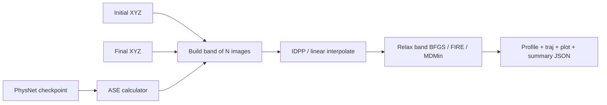

# Nudged elastic band (`mmml neb`)

Find a minimum-energy path between two fixed endpoints on a PhysNet (or other
MMML checkpoint) potential using ASE’s nudged elastic band (NEB). The band is a
chain of images; springs keep them spaced along the path while projected forces
relax perpendicular to the path.

CLI flag reference: `[mmml neb](cli/commands/neb.md)`.  
NH₃–CH₃Cl example: `[examples/m](https://github.com/EricBoittier/mmml/blob/main/examples/m/README.md)`
(`kl.json`, endpoints under `examples/m/neb/`).

## When to use it


| Goal                                                           | Tool                                                   |
| -------------------------------------------------------------- | ------------------------------------------------------ |
| Vacuum MEP / barrier estimate between two optimized geometries | `mmml neb`                                             |
| Classical MD on the same potential                             | `[mmml physnet-md](cli/commands/physnet-md.md)`        |
| Rigid 1D interaction scan (no bond rearrangements)             | `[mmml dimer-scan](cli/commands/dimer-scan.md)`        |
| Adaptive umbrella / free-energy along Cl⋯C / C⋯N (CHARMM)      | ADUMB in `[examples/m](examples/nh3-ch3cl-results.md)` |
| Pure-ML distance umbrella PMF (NVT + MBAR)                     | `[mmml umbrella-sample](umbrella.md)`                  |


NEB is a **local path** method: endpoints must already be local minima (or
near-minima) on the ML surface, with matching atom order and count. It does not
sample free energy or solvent entropy; pair it with ADUMB / MBAR when you need
that.

## What the command does




1. Load `--initial` and `--final` with ASE (same Z and atom ordering).
2. Build `--n-images` frames (including endpoints); attach a PhysNet ASE
  calculator from `--checkpoint` (shared by default).
3. Interpolate interiors (`idpp` by default, else linear).
4. Relax the band until f_{\max} (eV/Å) or `--max-steps`.
5. Write path artifacts and a relative energy profile in kcal/mol.

Energies are shifted so image 0 is zero:


\Delta E_i = \bigl(E_i - E_0\bigr)\times\mathrm{EVTOKCALMOL}


The default reaction coordinate is the **cumulative Cartesian path length**
between consecutive images (Å). Optional `--pair I,J` columns add interatomic
distances (defaults for the NH₃–CH₃Cl example: N–C and Cl–C).

## Quick start (NH₃–CH₃Cl)

Endpoint geometries are the optimized reactant / product XYZs used in the
Asparagus-style NEB script (9 atoms: `Cl, N, C, H…`). Checkpoint:
`examples/m/kl.json`.

```bash
source examples/m/_env.sh

# Smoke band (11 images)
bash examples/m/13_neb.sh

# Same via YAML
uv run mmml neb --config examples/m/yaml/neb.yaml --overwrite

# Dense band (~Asparagus 99-image setup)
N_IMAGES=99 bash examples/m/13_neb.sh
```

Equivalent explicit flags:

```bash
uv run mmml neb \
  --checkpoint examples/m/kl.json \
  --initial examples/m/neb/reag_0_opt.xyz \
  --final examples/m/neb/prod_0_opt.xyz \
  --output-dir artifacts/nh3_ch3cl/neb \
  --n-images 11 \
  --fmax 0.05 \
  --pair 1,2 \
  --pair 0,2 \
  --overwrite
```


### Pass / fail

- Exit code 0; `neb_summary.json` has finite `barrier_kcal_mol`.
- `neb_profile.dat` has one row per image; ΔE at the first image is ~0.
- For a converged band, f_{\max} reported by the optimizer is ≤ `--fmax`
(unless you hit `--max-steps` first).


## Outputs

Written under `--output-dir`:


| File               | Contents                                           |
| ------------------ | -------------------------------------------------- |
| `neb.traj`         | ASE optimizer trajectory of the band               |
| `neb.xyz`          | Final image geometries (multi-frame XYZ)           |
| `neb_profile.dat`  | RC (Å), ΔE (kcal/mol), optional pair distances     |
| `neb_plot.png`     | Energy vs reaction coordinate (unless `--no-plot`) |
| `neb_summary.json` | Barrier, ΔE(product), paths, echoed config         |


`barrier_kcal_mol` is \max_i \Delta E_i on the final band (not necessarily a
true saddle if the band is under-resolved or not climbing).

## Tunables


| Flag / field                    | Role                                                                                        |
| ------------------------------- | ------------------------------------------------------------------------------------------- |
| `--n-images`                    | Total images **including** endpoints (≥ 3). More images → smoother path, more force calls.  |
| `--fmax`                        | Force convergence in eV/Å (default `0.05`).                                                 |
| `--climb` / `--no-climb`        | Climbing-image NEB drives the highest image toward the saddle.                              |
| `--interpolate {idpp,linear}`   | IDPP is usually better for bond rearrangements than straight Cartesian.                     |
| `--optimizer {BFGS,FIRE,MDMin}` | Band optimizer (default BFGS).                                                              |
| `--neb-method`                  | ASE force projection (`improvedtangent` default; avoids the ASE 3.27+ deprecation warning). |
| `--spring-k`                    | Spring constant (eV/Ų scale in ASE).                                                       |
| `--shared-calculator`           | One calculator instance for all images (default on; cheaper for PhysNet).                   |
| `--max-steps`                   | Cap optimizer iterations (useful for smokes).                                               |
| `--pair I,J`                    | Extra distance column(s); repeatable.                                                       |


### Practical tips

- **Optimize endpoints on the same potential** before NEB. Large endpoint forces
waste early band steps and can distort the path.
- Start with ~7–15 images and `fmax≈0.05`. Increase density (e.g. 50–99) once
the path looks chemically reasonable.
- Turn on `--climb` after a normal NEB has a clear highest image, or run CI-NEB
from the start for a tighter barrier.
- Atom order must match between initial and final. Remap with ASE / your
geometry tools if needed; NEB will refuse mismatched Z.
- Vacuum ML only: this CLI attaches
`create_calculator_from_checkpoint` / PhysNet ASE calcs, not hybrid CHARMM
MLpot. For solvated paths use ADUMB or a hybrid workflow.


## YAML config

`examples/m/yaml/neb.yaml` (paths relative to the YAML file):

```yaml
checkpoint: ../kl.json
initial: ../neb/reag_0_opt.xyz
final: ../neb/prod_0_opt.xyz
output_dir: ../../artifacts/nh3_ch3cl/neb
n_images: 11
fmax: 0.05
climb: false
interpolate: idpp
optimizer: BFGS
neb_method: improvedtangent
pair_indices:
  - [1, 2]   # N–C
  - [0, 2]   # Cl–C
```

CLI flags override file values. Relative paths in the file are resolved against
the config directory.

## Python API

```python
from pathlib import Path
from mmml.neb import NebConfig, run_neb

result = run_neb(
    NebConfig(
        checkpoint=Path("examples/m/kl.json"),
        initial=Path("examples/m/neb/reag_0_opt.xyz"),
        final=Path("examples/m/neb/prod_0_opt.xyz"),
        output_dir=Path("artifacts/nh3_ch3cl/neb"),
        n_images=11,
        fmax=0.05,
        overwrite=True,
    )
)
print(result.barrier_kcal_mol, result.paths["profile"])
```

Inject a custom ASE calculator factory (unit tests / other potentials):

```python
run_neb(config, calculator_factory=lambda: MyCalculator())
```


## Relation to ADUMB on the same system

For NH₃–CH₃Cl, NEB gives a **vacuum ML barrier** along a Cartesian band.
ADUMB (`09_adumb_nc_distance.sh`, `10_adumb_clc_cn_2d.sh`) samples
r_{\mathrm{ClC}}-r_{\mathrm{CN}} (or 2D Cl⋯C / C⋯N) with CHARMM restraints
and can include solvent. Use NEB to inspect the ML MEP and ADUMB for
free-energy profiles — they answer different questions.

## See also

- `mmml neb` [CLI options](cli/commands/neb.md)
- `[examples/m/README.md](https://github.com/EricBoittier/mmml/blob/main/examples/m/README.md)` — smoke script `13_neb.sh`
- [NH₃–CH₃Cl results](examples/nh3-ch3cl-results.md) — ADUMB notes for the same chemistry
- ASE NEB docs: [ase.mep](https://wiki.fysik.dtu.dk/ase/ase/mep/neb.html)

