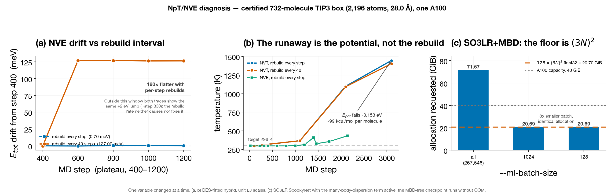

# NpT density campaign — status and diagnosis, 2026-08-02

**No density, ΔH_vap or ΔG number exists.** The campaign is blocked, and the
blocker is the potential energy surface, not the MD machinery. Everything below
is measured on the certified 732-molecule TIP3 box (2,196 atoms, 28.0 Å cube) on
one A100, changing one variable at a time.



## The blocker

In bulk water the DES-fitted hybrid potential releases

| | step 100 | step 3100 |
|---|---|---|
| E_pot | −8750.81 eV | −11903.94 eV |
| T | 297.61 K | 1446.19 K |

**−3153 eV = 4.31 eV = 99.3 kcal/mol per water molecule**, which appears as heat.
That is bond-breaking scale. The model was fitted to dimers; in the condensed
phase it is extrapolating into a deep well that is not physical.

Ruled out as causes, each by a controlled comparison:

- **Not the neighbour list.** Per-step rebuilds give T = 1446 K, 40-step rebuilds
  give 1403 K at step 3100. No effect on the runaway.
- **Not the thermostat.** NVE shows the same descent with E_tot conserved.
- **Not the integrator or forces.** NVE conserves E_tot to **0.70 meV** across
  steps 400–1200. The forces are the gradient of the energy.
- **Not the ensemble.** Present in NVE, NVT and NpT alike.
- **Not the LJ scales.** The unit-scale control fails identically to the trained
  one.

## Defects found and fixed

All verified numerically, not by inspection.

| # | Defect | Evidence |
|---|---|---|
| 1 | `jaxmd.build_parser()` registered `--hybrid-hamiltonian` and `--shared-cutoff` twice, so it raised before returning — `md-system --backend jaxmd` could not run at all | `argparse.ArgumentError: conflicting option string`; no test had ever called it |
| 2 | Monoatomic residues unbuildable at three layers (zero extent treated as degenerate) | blocked AR1/KR1/XE1 and the ions CLA/POT/SOD/LIT |
| 3 | Noble-gas RTF/PRM aborted CHARMM — a bare `*` mid-comment ends a title block | parameters unchanged, verified record-for-record against the `.str` |
| 4 | The campaign never loaded its boxes: without `--from-psf/--from-crd/--skip-cluster-build`, `RESI:1` is an absolute count, so every run was a **one-molecule** system | log showed `residues TIP3x1` |
| 5 | NpT position cotangent missing the boxᵀ factor | ratio fd/analytic **28.09** on a 28.0 Å cell → **1.0071** after |
| 6 | NpT virial cotangent was `None`, so pressure collapsed to the kinetic term | P_meas 4059.58 atm vs 4059.63 predicted for 2KE/3V alone (0.001%) → 0.06–0.2% after |
| 7 | `find_worst_intermonomer_overlap` was an O(n²) Python loop re-inverting a constant cell 8.3M times | 42% of a 1,054 s job → **16.2× faster**, bit-identical result |

Fix 6 was wrong on the first attempt: `−(1/3p)·Σ Fᵢ·rᵢ` is the *atomic* virial,
valid only without minimum-image wrapping. Under PBC the energy depends on the
perturbation through both the positions and the box, so the correct object is the
pair virial, which the backward pass cannot see. The in-situ self-check caught it
(+397 eV against a true −33 eV) and it was replaced with a central difference of
the real energy.

`MMML_NPT_VIRIAL_SELFCHECK=1` checks both cotangents and the absolute energy
against the real system at NpT initialisation. It is diagnostic only.

## Worth adopting independently

**Per-step neighbour-list rebuilds.** NVE drift across steps 400–1200:
0.70 meV per-step vs 127 meV every-40 — **180× flatter**. This does not fix any
of the failures above, but it is nearly free and the difference is large.

## The SO3LR control — unresolved

Running a pretrained SO3LR model on the same box would show whether the deep well
is specific to our fit. It has not produced a result.

- The MBD checkpoint cannot run: it needs **128 × (3N)² float32 = 20.70 GiB** for
  3N = 6,588, matching the observed 20.69 GiB to 0.02%. Independent of
  `--ml-batch-size` (identical at 1024 and 128); many-body dispersion is O(N²) in
  memory and is not viable for a 2,196-atom box on a 40 GB A100.
- The MBD-free checkpoints run without OOM, but start at max|F| = 8.0 eV/Å on
  this box (the DES hybrid starts at 3.94) and the NVE start gate refuses them:
  `post-FIRE max|F|=8.1001 > gate 7.0292`. The obstacle there is the minimiser,
  not memory.

## What would actually unblock a density

1. Decompose E_pot into ML / MM / dimer terms across the descent on a short NVE
   and identify which term supplies the −99 kcal/mol.
2. Get the SO3LR control to run — smaller box, or an MBD-free checkpoint with a
   real minimisation budget — to establish whether the well is ours or general.
3. Only then re-run the campaign. Re-queuing before (1) burns GPU hours on a
   potential that does not hold water together at 298 K.

## Reproducing

```
scripts/slurm/npt_bisect.sbatch          # ensemble x prep x rebuild-interval matrix
scripts/slurm/profile_ase_premin.sbatch  # the cProfile behind the 16x fix
scripts/gen_docs_npt_diagnosis_figures.py
scripts/validate_virial_vs_charmm.py     # written, unit tested, NOT yet run on the cluster
```

Overrides on the bisect script: `NLINT` (rebuild interval), `SKIN`, `MINSTEPS`,
`ML_BATCH`, `CKPT_PATH`, `USE_SCALES`, `TAGSUFFIX`, `PS`, `REC`.
