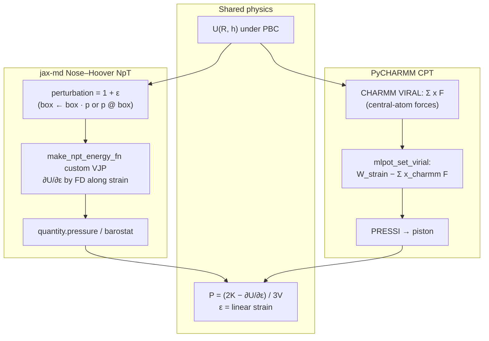

# NpT: jax-md ↔ PyCHARMM CPT (apples to apples)

Both backends must drive the barostat with the **same thermodynamic pressure**:
kinetic plus the **strain virial** of the potential under periodic boundaries.
This page states that common quantity, how each engine implements it, the
defects that broke the identity, and the checks that lock it in.

Related:

- [PyCHARMM C API (box and pressure)](pycharmm-c-api-pbc-box-pressure.md) — get/set APIs
- [NpT density campaign status (2026-08-02)](npt-campaign-status-2026-08-02.md) — earlier diagnosis
- Argon MM-only density/pressure by backend: [`docs/images/npt_argon_water/`](images/npt_argon_water/README.md)

---

## Summary

| Check | Engine | Result |
|-------|--------|--------|
| \(P\) vs independent \(-\mathrm{d}E/\mathrm{d}V\) (fixed fractional coords) | jax-md | pass |
| Same trajectory / NHC invariant as native jax-md LJ | jax-md | pass (positions to \(10^{-6}\)) |
| Barostat \(P_\mathrm{vir}\) / true virial along a short NpT run | jax-md | ratio \(= 1\) to \(10^{-6}\) |
| Legacy volume-factor energy → \(P_\mathrm{vir}/3\) | jax-md | flagged by self-check |
| Live CPT DYNA finishes, finite energy (`pmass > 0`) | PyCHARMM | pass (needs `mlpot_set_virial`) |
| Strain-virial correction tensor / dimer shift \(\partial/\partial h\) | MLpot → CHARMM | unit-tested |
| CPT sub-chunk step accounting (all sub-chunks run) | PyCHARMM | unit-tested (#267) |
| Argon LJ smoke: density + pressure time series | jax-md + pure CPT | [figure](images/npt_argon_water/ar1_90k_backend_density_pressure.png) |

**Not** claimed here: equilibrated liquid density or \(\langle P\rangle\) parity on a
shared MM/ML liquid box. That needs a certified campaign trajectory (see argon
smoke caveats). This page is about the **pressure definition and VJP/VIRAL
wiring**, not a production equation-of-state.

### Argon LJ backend smoke (real traces)


Primary smoke is matched `AR1:500` @ 90 K / \(P_\mathrm{sat}\) for **200 ps**
(MM-only literature LJ; matched `mm-switch` 7+3.39 Å). jax-md holds
\(\langle\rho\rangle\approx 1.33\) / \(\langle P\rangle\approx 1.7\) bar; continuous
CHARMM CPT only mildly expands (\(\rho\approx 1.28\)). The older `AR1:108` box
still gas-collapses under CHARMM. ASE has no `pbc_npt`. Details:
[`docs/images/npt_argon_water/README.md`](images/npt_argon_water/README.md).

---

## The shared quantity

For isotropic volume fluctuations, both engines target

\[
P = \frac{2K - \partial U/\partial\varepsilon}{3V}
\qquad\text{with}\qquad
\partial U/\partial\varepsilon = 3V\,\partial U/\partial V
\]

where \(\varepsilon\) is a **linear strain**: lengths scale as \(1+\varepsilon\),
so \(V \to V(1+\varepsilon)^3\). Under PBC the potential depends on the cell
explicitly (MIC / lattice images), so \(\partial U/\partial\varepsilon\) is **not**
always equal to \(-\sum_i \mathbf{F}_i\cdot\mathbf{r}_i\) from central-atom forces
alone.

| Piece | Meaning |
|-------|---------|
| \(2K/3V\) | kinetic / ideal-gas |
| \(-\partial U/\partial\varepsilon\,/\,3V\) | virial (strain) |
| Apples-to-apples | same \(U(\mathbf{R},h)\), same strain convention, same \(P\) formula |

---

## Side-by-side: how each backend gets there



| | **jax-md** (`jaxmd_runner` / `JaxmdDriver`) | **PyCHARMM CPT** |
|--|---------------------------------------------|------------------|
| Ensemble | `simulate.npt_nose_hoover` | `DYNA CPT` (`pmass > 0`) |
| Coordinates | fractional; real = `space.transform(box, frac)` | Cartesian in CHARMM |
| Strain probe | `perturbation` arg to energy (linear) | implicit via lattice + VIRAL |
| Virial of MM | autodiff / FD of MIC energy vs cell | CHARMM `VIRAL` of MM forces |
| Virial of MLpot | same energy VJP (cell in energy) | `VIRAL` of callback forces **+** strain correction (`mlpot_set_virial`) |
| Forces on atoms | real-space \(\mathbf{F}=-\nabla_{\mathrm{real}}U\) (jax-md `transform` JVP) | callback writes forces on central atoms |
| Target \(P\) | YAML `pressure` (bar → internal) | `npt_pressure` / `PREF` (atm) |
| Anisotropic \(P\) | scalar barostat only | `npt_pressure_tensor` supported |

---

## Defects that broke the identity (and the fixes)

### jax-md: volume factor instead of linear strain (#249)

jax-md calls the energy with `perturbation = 1 + ε` (**linear** strain). The
runner used to apply `perturbation**(1/3)` to the box (a **volume** factor), so
\(\partial U/\partial\varepsilon\) was \(3\times\) too small and the barostat saw

\[
P_\mathrm{kin} + P_\mathrm{vir}/3.
\]

A self-check that FD’d the *same* mis-scaled forward reported 0 % error. The
fix compares barostat virial pressure to an **independent**
\(-\mathrm{d}E/\mathrm{d}V\) at fixed fractional coordinates; the legacy path
gives ratio \(1/3\).

Also required for parity with native jax-md: the position cotangent of the
custom VJP must be the **real-space** force (not \(-\mathbf{F}@h\)), matching
`space.transform`’s custom JVP.

### PyCHARMM + MLpot: `Σ x F` ≠ strain virial (#263)

CHARMM’s `VIRAL` sums \(\sum_i x_i F_i\) over forces the MLpot callback writes.
Those forces come from **minimum-image** distances, so interactions across the
cell boundary miss the lattice term of \(-\mathrm{d}E/\mathrm{d}(\mathrm{strain})\).
With CHARMM nonbonded skipped, CPT followed that wrong pressure (ACO/DCM
students @ 32 Å: ~0.7–1.7 katm high from the ML term alone).

Fix:

1. Dimer lattice shift written as \(-\mathrm{stop\_gradient}(n)\,@\,h\) (same
   image, zero position gradient, **differentiable in the cell**).
2. Callback stages
   \(W_\mathrm{strain}-\sum x_\mathrm{charmm}F\) via `mlpot_set_virial`.
3. `ENERGY` adds it after `VIRAL` (needs a rebuilt `libcharmm.so`).

Without `mlpot_set_virial`, CPT with a live barostat **fails closed**.

### CPT sub-chunks (#263 / #267)

Long NpT stages are split into ~250-step CPT sub-chunks. Fresh `DYNA` /
in-memory handoff resets CHARMM’s step counter; treating a chunk-local count of
\(n\) as “incomplete” stopped stages after the second sub-chunk (0 DCD frames).
Chunk-local completion is now accepted when the sub-chunk started fresh or
rewrote its restart.

---

## What “pass” means in tests

### jax-md (no CHARMM)

```bash
uv run pytest \
  tests/unit/test_npt_virial_strain.py \
  tests/unit/test_npt_virial_cotangent.py \
  tests/unit/test_md_jaxmd_driver.py -k npt -q
```

| Test | Criterion |
|------|-----------|
| `test_jaxmd_pressure_matches_independent_finite_difference` | `quantity.pressure` = \(2K/3V - \mathrm{d}E/\mathrm{d}V\) |
| `test_legacy_volume_factor_convention_gives_one_third_virial` | old code → ratio \(1/3\) |
| `test_pressure_matches_jax_md_native_lennard_jones` | runner energy vs native LJ |
| `test_npt_trajectory_matches_native_jax_md_and_conserves_invariant` | same positions; NHC drift \(\lt 5\times10^{-3}\) |
| `test_short_npt_run_barostat_pressure_matches_recomputed_true_pressure` | \(P_\mathrm{baro}-P_\mathrm{kin}\) / \(P_\mathrm{vir}^\mathrm{true}\) \(= 1\) |
| `test_npt_forces_are_real_space_and_conserve_energy` | soft barostat ≈ NVE energy conservation |

Optional in-situ: `MMML_NPT_VIRIAL_SELFCHECK=1` on a jax-md NpT start.

### PyCHARMM CPT (needs rebuilt lib)

```bash
export CHARMM_HOME="$PWD/setup/charmm"
export CHARMM_LIB_DIR="$CHARMM_HOME/lib"   # serial rebuild: --no-mpi
export MMML_NO_CHARMM_MPI=1 MMML_NO_MPI_RERUN=1

# Hook present?
uv run python -c "from mmml.interfaces.pycharmmInterface.mlpot.strain_virial import require_charmm_virial_hook; require_charmm_virial_hook(); print('ok')"

uv run pytest tests/functionality/charmm/test_charmm_ff_thermostat_barostat.py -v
uv run pytest tests/unit/test_mlpot_strain_virial.py tests/unit/test_npt_cpt_chunking.py -q
```

| Test | Criterion |
|------|-----------|
| `test_tip3_cpt_npt_barostat_keywords_accepted` | 2-step CPT completes; finite energy |
| `test_tip3_hoover_cpt_nvt_short_dynamics_completes` | `pmass=0` heat path still works |
| `test_*strain_virial*` | lattice shift gradients; correction tensor; scope only when `pmass > 0` |
| `test_cpt_subchunk_chunk_local_counter*` | #267 completion logic |

Rebuild (CMake ≥ 4 needs the policy flag already in the script):

```bash
./scripts/rebuild_charmm_mlpot.sh --no-mpi --skip-packmol   # local pytest
# or MPI build without --no-mpi for cluster / mpirun
```

---

## Apples to apples vs not comparable

| Comparable | Not the same check |
|------------|--------------------|
| Strain convention and \(P=(2K-\partial U/\partial\varepsilon)/3V\) | Full \(\langle\rho\rangle\), \(\langle P\rangle\) on liquids (need long EQ) |
| Virial of a shared analytic \(U\) (MIC LJ) | jax-md scalar \(P\) vs CHARMM full pressure **tensor** |
| MLpot strain correction vs FD \(\mathrm{d}E/\mathrm{d}h\) (unit / FD notes in #263) | MM-only CHARMM `VIRAL` vs jax-md when the Hamiltonians differ |
| CPT finishes with live piston + finite \(E\) | Hybrid production density campaigns |

For MM bonded energy parity (different question), see
[jax-mm-spoof vs native CHARMM](jax-mm-spoof-charmm-parity.md).

---

## Units cheat sheet

| | jax-md path | CHARMM path |
|--|-------------|-------------|
| Length | Å | Å |
| Energy (runner tests) | eV | kcal/mol (`VIRAL` / `mlpot_set_virial`) |
| Pressure CLI / YAML | bar (`--pressure`) | atm (`--npt-pressure`) |
| Conversion | \(1\,\mathrm{atm}=1.01325\,\mathrm{bar}\) | |

---

## Changelog (machinery)

| PR / commit | Change |
|-------------|--------|
| #249 | Linear-strain perturbation; real-space force cotangent |
| #263 | MLpot strain virial → `mlpot_set_virial`; CPT step accounting; MM extent margin |
| #267 | In-memory CPT sub-chunks: chunk-local step counter |
| #248 | NVT→NPT CPT cold start (coords vs leap-frog displacement) |
