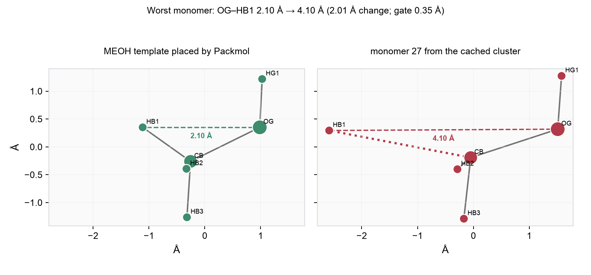
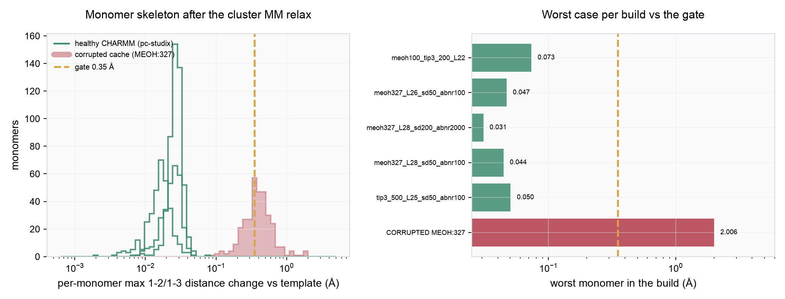

# Packmol cluster geometry gate

The Packmol cluster stage CHARMM-minimizes a freshly packed box and then **caches**
the result (`.packmol_cache/<key>/cluster.npz`). Until this gate existed, nothing
inspected those coordinates: a CHARMM build that returned garbage produced a cache
entry that every later run happily reused.

This page documents the check, the threshold, and how the threshold was measured.

Related: [Packmol placement](packmol-placement.md), [Liquid box workflow](liquid-box-workflow.md).

---

## The failure it catches

A local `mmml liquid-box` build of `MEOH:327` in `L = 28 Å`:

| Stage | Artifact | Monomer skeleton vs template |
|-------|----------|------------------------------|
| Packmol placement | `packmol_cluster/init-packmol-sphere.pdb` | max **0.002 Å** — all 327 monomers correct |
| after CHARMM SD/ABNR | `.packmol_cache/<key>/cluster.npz` | max **2.006 Å** — 63 % of monomers distorted |

In the cached file, monomer 145's `OG` was bit-identical to monomer 216's `HG1`,
producing a spurious 0.000 Å inter-monomer MIC contact. The run then burned the
(expensive) Packmol repack stage in the pre-MLpot geometry gate trying to fix a
"clash" that was really a coordinate corruption, and later died with SIGSEGV in
`setup_charmm_environment`.



`HB1` has been torn off `CB`; the `OG–HB1` distance goes from 2.10 Å in the placed
template to 4.10 Å in the cached cluster. No minimization does that.

The corruption is environmental (a broken local CHARMM/pycharmm build), not an
mmml logic bug. The bug in mmml was that **nothing noticed**.

---

## What the gate checks

`mmml/utils/monomer_internal_geometry.py`

Packmol places *rigid copies* of a CHARMM-minimized monomer template, so before
the cluster relax every monomer has exactly the template's internal geometry.
After the relax, each monomer's **1-2 and 1-3 distances** are compared against
that template:

- distances, not coordinates → invariant to the rigid rotation/translation Packmol applied;
- only 1-2/1-3 → governed by the stiff bond and angle terms, so a genuine
  minimization barely moves them. A single legitimate torsion rotation moves
  **1-4+** distances by more than an Å, which is why they are excluded;
- the covalent skeleton is derived from the template itself (covalent-radii bond
  graph), so no PSF bond list is needed.

The scan is O(monomers × skeleton pairs) — 3924 distances for `MEOH:327`,
microseconds.

Wired in at `mmml/cli/run/md_pbc_suite/cluster.py`:

- **after** the cluster `minimize_charmm_mm_only`, **before** `save_packmol_cluster_cache` —
  a distorted build raises `RuntimeError` and **no cache entry is written**;
- **on cache hit**, so entries written before this gate existed (or by a broken
  build on another machine) fail loudly instead of feeding the box.

```
RuntimeError: Packmol cluster post-MM geometry: 205/327 monomer(s) have a distorted
covalent skeleton after minimization (max 1-2/1-3 distance change 2.006 Å > 0.350 Å).
Worst: monomer 27 (MEOH) atoms 2/4, 2.096 Å in the placed template → 4.102 Å.
Minimization does not break bonds — this usually means the CHARMM/pycharmm build
returned garbage coordinates. Compare the pre-minimize Packmol PDB against the
minimized coordinates to confirm, then rebuild CHARMM ...
```

(That message is the real one, produced by running the gate against the corrupted
cache entry from the failing run.)

### Escape hatch

`MMML_MAX_MONOMER_INTERNAL_DEVIATION_A` overrides the threshold; `0` disables the
gate (it still measures and prints).

---

## Choosing the threshold

`DEFAULT_MAX_MONOMER_INTERNAL_DEVIATION_A = 0.35 Å`.

Measured with `scripts/validate_packmol_monomer_geometry.py` on **pc-studix**
(real Packmol + real CHARMM, cache bypassed), worst monomer per build:

| Build | Density | SD / ABNR | worst monomer |
|-------|---------|-----------|---------------|
| `MEOH:327`, L = 28 Å | 0.79 g/cm³ | 50 / 100 | 0.044 Å |
| `MEOH:327`, L = 28 Å | 0.79 g/cm³ | 200 / 2000 | 0.031 Å |
| `MEOH:327`, L = 26 Å | 0.99 g/cm³ | 50 / 100 | 0.047 Å |
| `TIP3:500`, L = 25 Å | 0.96 g/cm³ | 50 / 100 | 0.050 Å |
| `MEOH:100 TIP3:200`, L = 22 Å | dense mixed | 50 / 100 | 0.073 Å |
| **corrupted cache** (`MEOH:327`, L = 28 Å) | — | 50 / 100 | **2.006 Å** |

A genuine relax moves the skeleton by ≲0.08 Å across two residues, two densities
and a 20× range of minimization length — and *more* minimization moves it *less*,
since ABNR converges toward the force-field minimum rather than wandering. The
median monomer moves 0.016–0.027 Å.

0.35 Å sits almost exactly at the geometric midpoint of the two populations
(√(0.073 × 2.006) = 0.38): 4.8× above the worst healthy build, 5.7× below the
observed corruption. In the corrupted cache 63 % of monomers exceed it, so the
gate does not depend on catching one unlucky outlier.



Reproduce:

```bash
python scripts/validate_packmol_monomer_geometry.py \
  --composition MEOH:327 --cube-side 28 --sd 50 --abnr 100 \
  --json results/meoh327.json
```

```bash
python scripts/plot_packmol_monomer_geometry_validation.py --json results/*.json --cache-entry local_validation/meoh_fix/.packmol_cache/KEY --out docs/images/packmol-monomer-geometry-gate/deviation_distribution.png --out-structure docs/images/packmol-monomer-geometry-gate/worst_monomer.png
```

Run these on a cluster node — they execute CHARMM.

---

## Why GRMS = 0.0000 is only a warning

The failing run logged `CHARMM MM minimize start: GRMS=0.0000` *and*
`end: GRMS=0.0000`, which looks like proof that CHARMM never evaluated anything.
It is not sufficient evidence: on pc-studix, a **healthy** KEY_LIBRARY build reads
`energy.get_grms() == 0.0` before and after a minimization that demonstrably moves
atoms (0.86 Å RMS displacement, skeleton deviations growing from 0.001 Å to
0.03 Å), with plain `ENER` and with `ENER FORCE` alike.

So `CharmmMmMinimizeReport.start_grms_is_exactly_zero` is reported as a **warning**
and never fails a build. The geometry check is the gate.

---

## Scope

Only the Packmol cluster path is gated. `build_pyxtal_composition_cluster` places
monomers from crystal symmetry and minimizes them the same way; it has no
equivalent check yet.
