# Plot style gallery

Renders of the same example figure under each registered style
(`mmml.utils.plotting.styles`), so a look can be picked by eye instead of
from a description. Regenerate with `python scripts/render_plot_style_gallery.py`.

Every example also demonstrates the **legend-outside-the-plot** rule (see
`docs/plotting-style-guide.md` "Legends live outside the plot") via
`legend_outside(ax)` — never overlapping the data, and free to grow long
(reads like a small table of series → color/marker) without crowding
anything.

**Current pick: `"icml"`** — clean sans-serif, muted "seaborn deep"-style
categorical colors, moderate (not oversized) type; the closest preset to a
modern ML-conference figure. This is what `workflows/*/scripts/plot_results.py`
and `plot_structure.py` use by default now.

## Defaults at a glance

Before picking a style by scrolling through full example figures below, here
is every preset's default categorical color cycle, plus the three house
colormap defaults (which are shared across *all* styles — colormaps are
chosen by what the data *is*, sequential/diverging/cyclic, not by which font
preset is active). Regenerate with `python scripts/render_style_defaults_gallery.py`.

### Categorical color cycle per style

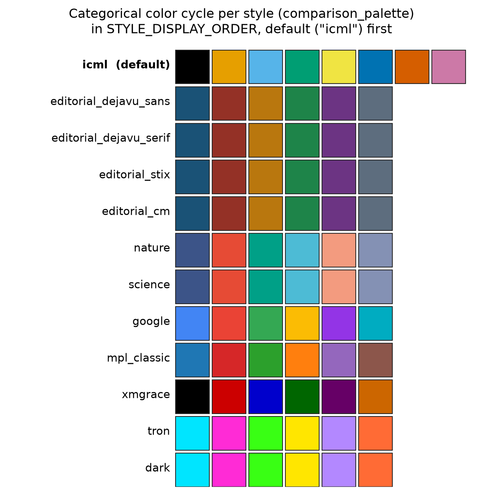

`icml_okabe_ito` is the same layout/type as `icml` but swaps in the
[Okabe–Ito](https://jfly.uni-koeln.de/color/) eight-color palette — designed
by Masataka Okabe and Kei Ito specifically to stay distinguishable under
protanopia, deuteranopia, and tritanopia. Use it whenever a figure's
categorical series identity (not a sequential/diverging heatmap) needs to
stay legible for colorblind readers.

### Default colormaps (`default_cmap(kind)`)

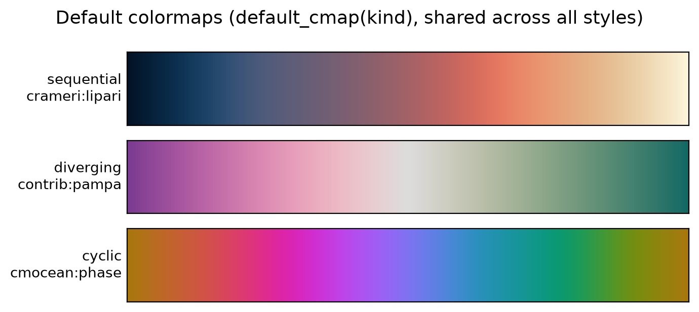

## `icml`

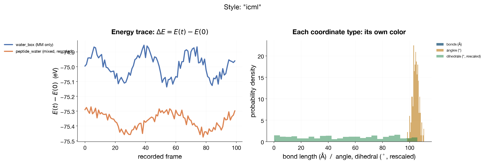

## The `editorial_*` family (large-type/thick-line/no-spine variants)

These four share the **same axes/spacing treatment** — large type, thick
lines, no top/right spine, faint grid — only the font differs. Kept in the
gallery as an alternative "read from across the room" look for a different
kind of figure (e.g. a talk slide) than `"icml"`'s conference-paper density.

**Note on naming**: these were previously grouped under one preset literally
called `"tufte"`. That was a category error — Tufte described *principles*
(data-ink ratio, redundant encoding, small multiples), not a single font or
palette, so no one preset should claim his name. The axis/spacing choices
below (no chart junk, minimal spines) draw on those principles; the presets
are named `editorial_*` instead. `"tufte"` still resolves as a backward-compat
alias to `editorial_stix`, but new code should name the variant directly.

Each example also demonstrates the "semantic color, not palette index"
principle from [`docs/plotting-style-guide.md`](plotting-style-guide.md):
the two energy traces are colored by *system* (not palette order), and the
right-hand panel gives bonds/angles/dihedrals **three different colors**
because they're three different physical quantities — not the same blue
reused three times (the bug this pass fixed in
`scripts/plot_trajectory_structure.py::plot_internal`).

## `editorial_dejavu_sans`

Matplotlib's bundled sans-serif (DejaVu Sans) — renders identically on every
machine, no font-substitution risk.

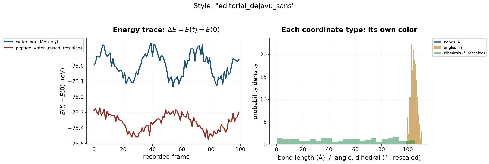

## `editorial_dejavu_serif`

Matplotlib's bundled serif (DejaVu Serif) — same reliability guarantee as
above, traditional serif feel.

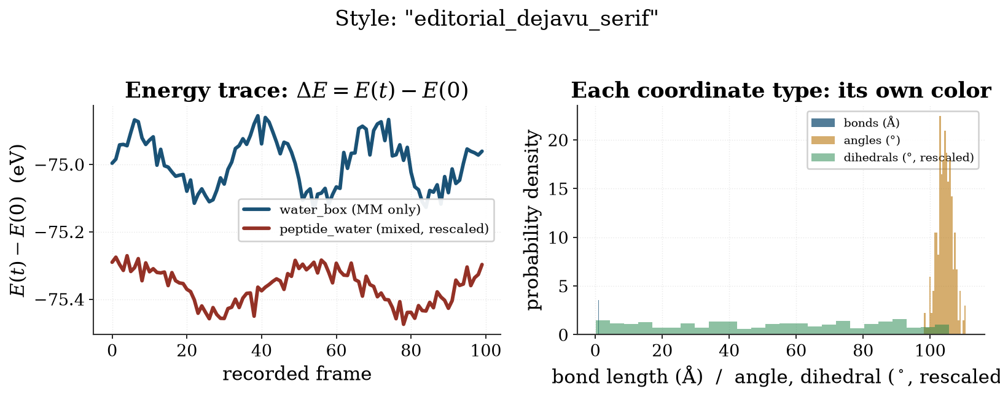

## `editorial_stix`

STIX serif — a journal-typeset look (closest to what most physics/chemistry
papers use). This was the previous `"tufte"` preset.

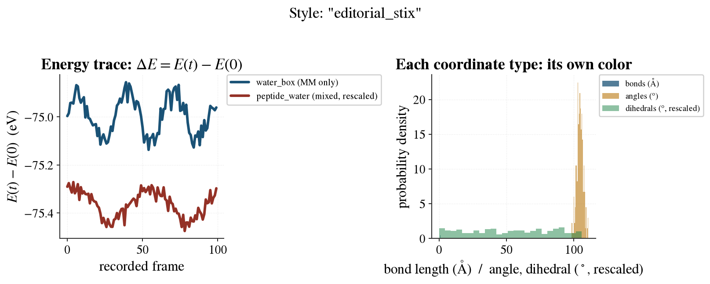

## `editorial_cm`

DejaVu Serif body text with Computer-Modern-style math
(`mathtext.fontset="cm"`) — the classic LaTeX-paper look for equations
specifically, while regular text stays DejaVu.

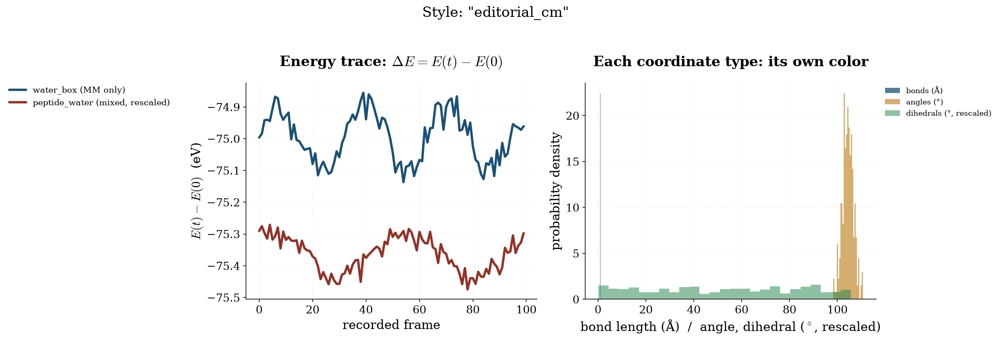

## Chart types (not just fonts)

Same style (`"icml"`), different chart *forms* — regenerate with
`python scripts/render_chart_type_gallery.py`. Each one names the specific
Tufte principle it demonstrates, since "in line with Tufte's teachings" is
about more than axis minimalism — several of his central ideas (small
multiples, the range-frame, data-ink ratio, redundant encoding) are concrete,
nameable techniques, not just "make it clean." Use these to judge whether a
*form*, not just a font, fits before committing to it for a real figure.

### Radial (polar)

A circular histogram of a periodic quantity (dihedral angle). Use the
geometry the data actually has — an angle wraps around; forcing it onto a
linear 0-360° axis hides the wraparound at the boundary.

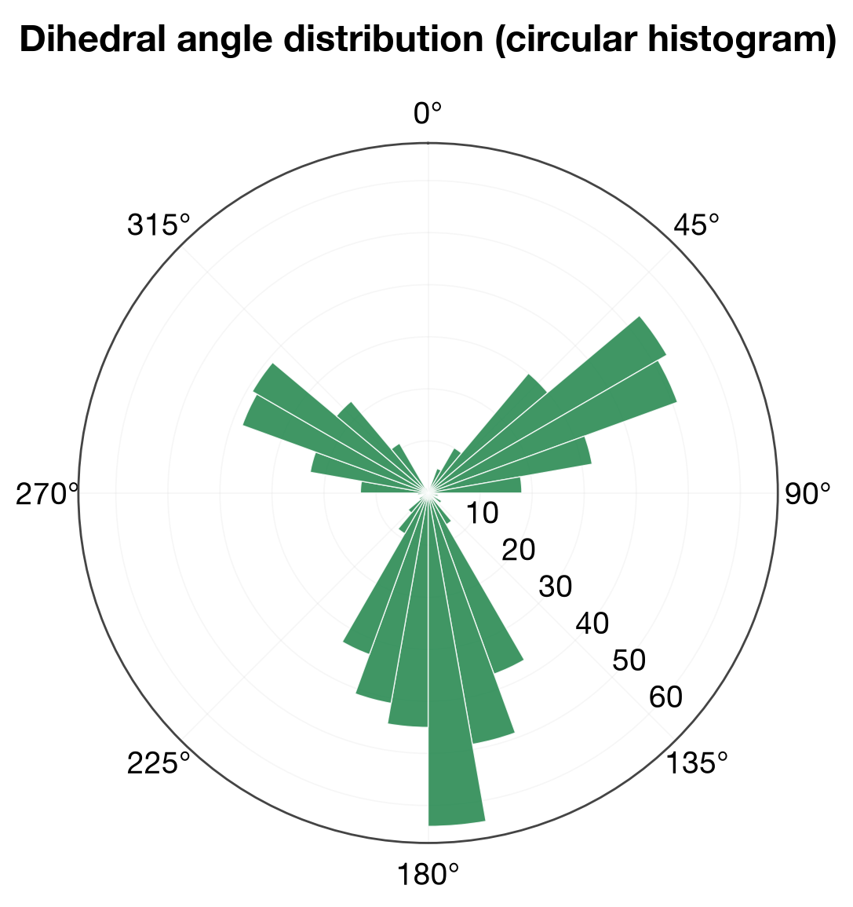

### 3D surface

A dimer PES as an explicit 3D surface. Included because it was asked for,
but flagged honestly: 3D is data-ink-*expensive* (occlusion, projection
distortion, no way to read exact values) — Tufte generally preferred 2D +
color/contour for exactly this reason. The `matshow` and `range_frame`
panels below are the better-Tufte alternative for two-variable-vs-response
data of this kind.

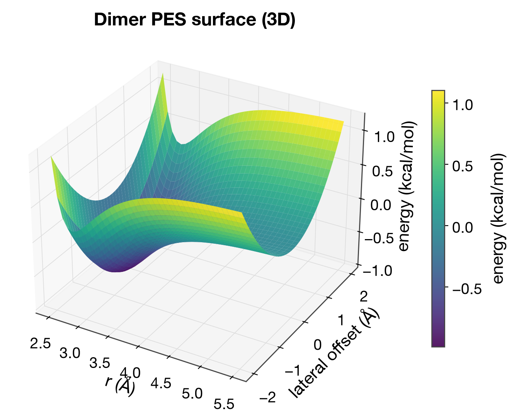

### XY scatter with confidence interval

A fitted trend with a shaded 95% CI band, raw points still visible
underneath. The band carries the uncertainty; no per-point error bars
cluttering every marker.

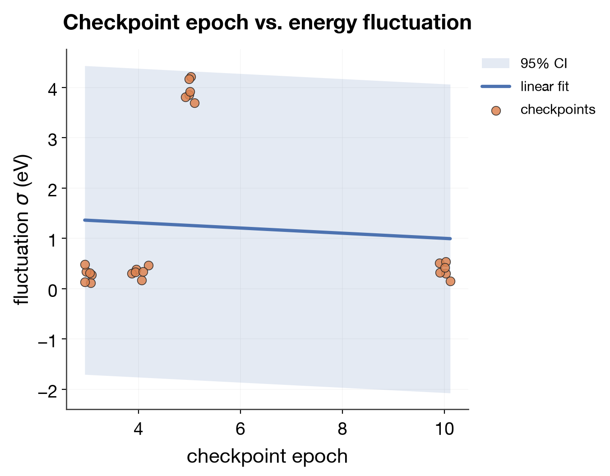

### Time series with distributions above and below

Not seaborn's `jointplot` (marginals top+right, sharing the plot's
*x*-axis) — here the two extra panels sit above and below the middle one
and share its **y-axis** instead, showing how the value distribution itself
shifts between the first and second half of a run. Two related
distributions placed for direct visual comparison, Tufte's small-multiples
idea applied to margins instead of a legend/caption.

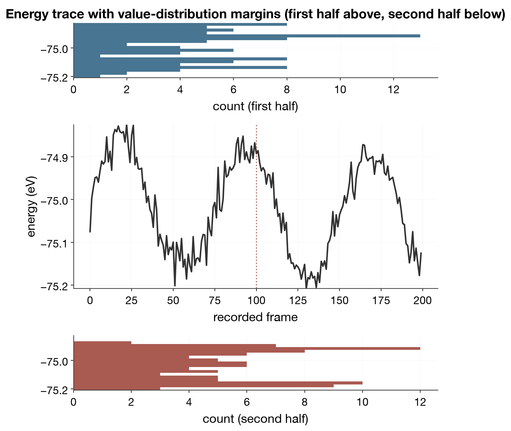

### Lollipop chart

A thin stem + a dot instead of a filled bar — the most literal data-ink-ratio
win in this gallery: nearly all of a bar's ink minus the fill, for the same
information (position along the stem = value). See `docs/plotting-style-guide.md`
"Overlaid semi-transparent bars, not more panels" for the sibling rule about
when *not* to add another panel instead.

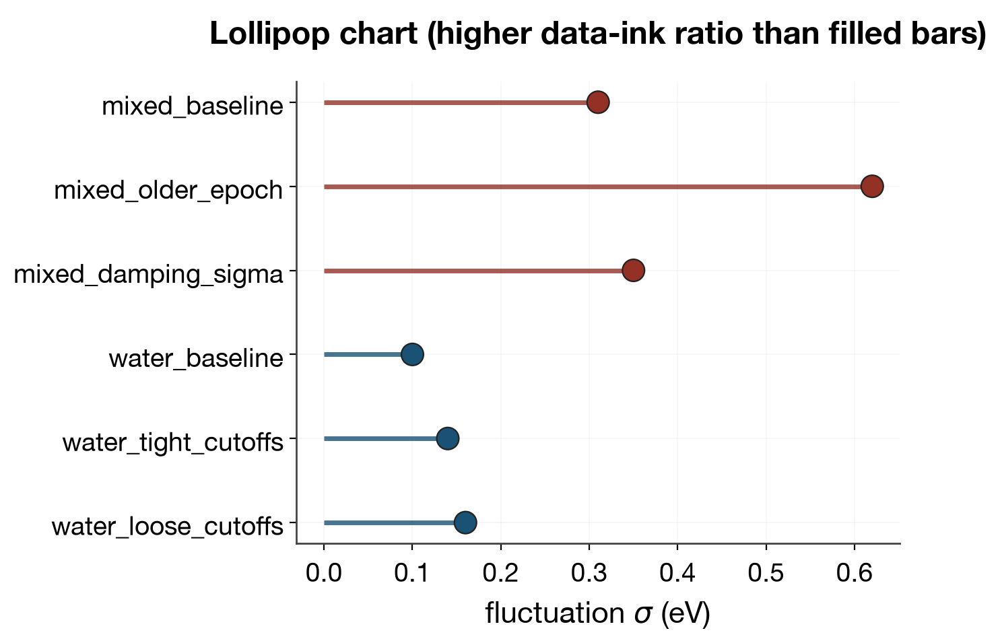

### Matrix heatmap (`matshow`)

A pairwise atom-distance matrix. Color encodes magnitude directly on the
(i, j) grid the data already has — no need to invent x/y positions for it
the way a scatter would.

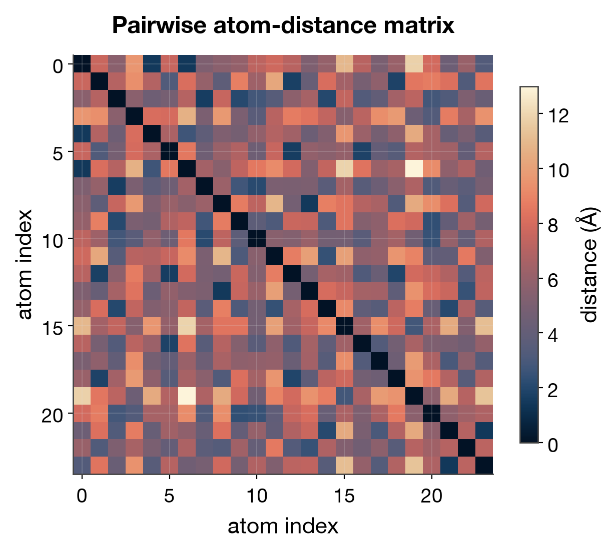

### Small multiples

Tufte's signature form, by name: many small, identically-scaled panels, with
almost all chart furniture (ticks, boxes, axis labels) stripped since the
*shape* is the point, not reading an exact value off any one panel. Compare
directly to the “everything overlaid in one legend-heavy panel” approach
used in `workflows/*/scripts/plot_results.py` — small multiples is the
alternative worth considering when a sweep has few enough series to lay out
as a grid.

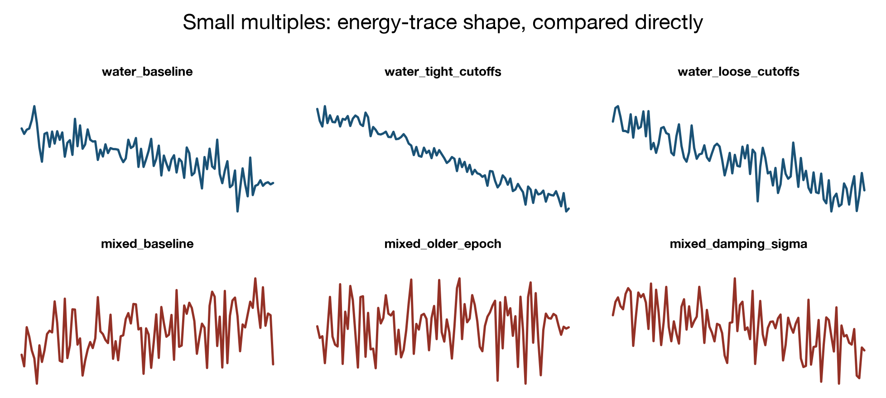

### Range-frame

Tufte's own named contribution (*The Visual Display of Quantitative
Information*): axis lines span only the data's actual range, not an
arbitrary origin-anchored box, with ticks only at min/median/max. Worth
calling out explicitly since it's a specific technique, not a generic
"minimalist" choice.

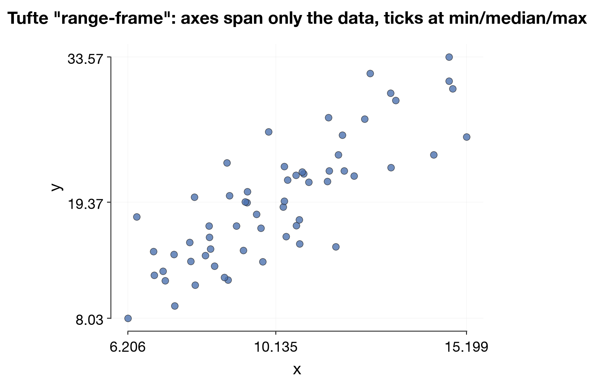

### Schematic diagram

Not a data plot — boxes + thin connecting lines for composition/flow (here:
how `HybridEnergy` sums its terms). Same principle applies to diagrams as to
charts: no drop shadows/gradients/3D bevels, labels placed directly on the
elements they describe rather than pulled out into a legend.

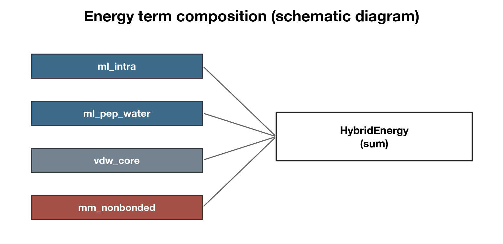

### ASE Atoms as an overlay on a data plot

Not a separate figure next to the data — an `ax.inset_axes()` holding
[`scripts/plot_utils.py::render_dimer_atoms`](https://github.com/EricBoittier/mmml/blob/main/scripts/plot_utils.py)'s
ball-and-stick render, placed directly over the point on the curve it
corresponds to. Tufte principle: put the explanation where the eye already
is, not somewhere the reader has to cross-reference by hand. This is the
"good ASE Atoms plot" precedent (jmol element colors, depth-cued alpha,
within-fragment-only bonds) applied as an overlay rather than its own panel
— see `docs/plotting-style-guide.md` "Rendering ASE Atoms".

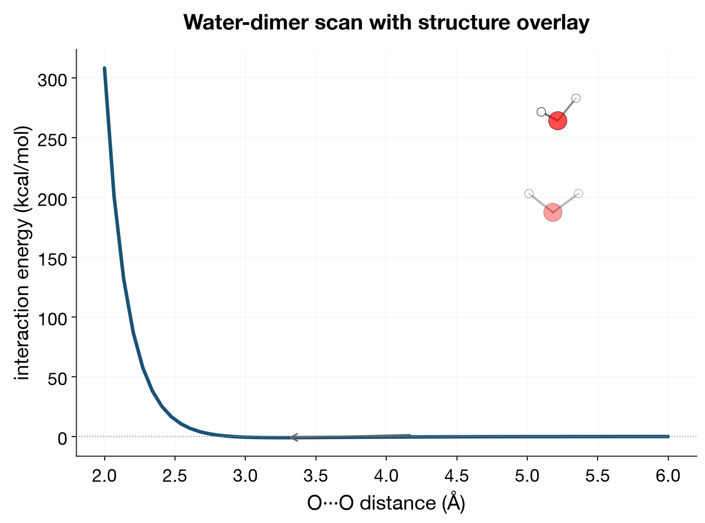

### Colormaps (via the `cmap` library)

The same 2D field under six colormaps — `viridis` (matplotlib's own
perceptually-uniform default) alongside picks from
[`cmap`](https://cmap-docs.readthedocs.io) (`pip`/`uv` package, added to the
`plotting` extra in `pyproject.toml`), which bundles cmocean, Fabio Crameri's
scientific colormaps, ColorBrewer, and more — over 1500 registered names.
`crameri:batlow`/`crameri:vik` and `cmocean:haline`/`cmocean:balance` are
specifically designed to be perceptually uniform and colorblind-safe;
`colorbrewer:RdYlBu` renders as visibly discrete bands here because
ColorBrewer's diverging maps are categorical by design, not a bug — a good
illustration of continuous vs. binned color encoding being genuinely
different choices, not just taste.

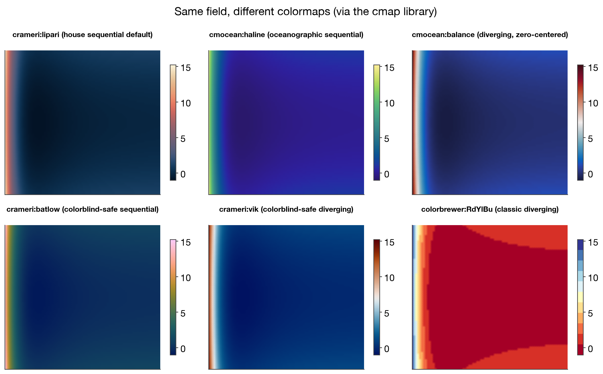

```python
import cmap
cmap.Colormap("cmocean:haline").to_mpl()  # -> a normal matplotlib Colormap
```

### 2D histogram

Binned density instead of an overlapping scatter of 20,000 points — past a
few hundred points a scatter is just a saturated blob; the histogram is the
honest representation of where the mass actually is.

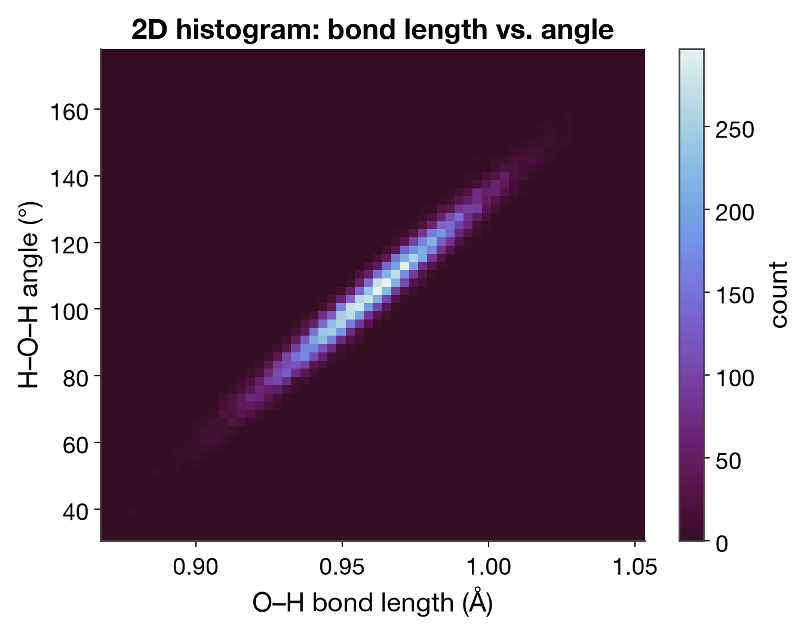

### Histogram time series ("kymograph")

Small multiples taken to their limit: instead of N separate histograms (one
per time window) shown side by side, each becomes one column of a single
image (x = time, y = value bin, color = local density). A drift in the
*distribution* — not just the mean — becomes one continuous shape instead of
something you'd have to notice by comparing many separate panels.

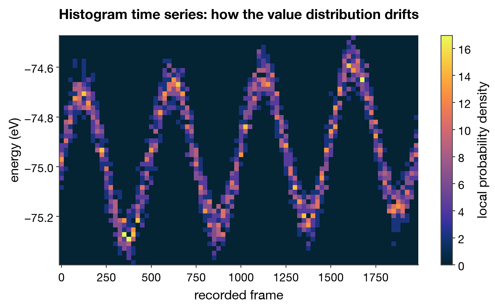

### Jitter / strip plot

Every individual observation as one point, x position randomly jittered
within its category so overlapping points stay visible instead of stacking
into a solid blob. Data-ink principle: nothing here is a derived summary
statistic drawn on top of the data — only a short median bar per group — so
shape that a mean+errorbar would hide (skew, a bimodal group) stays visible.

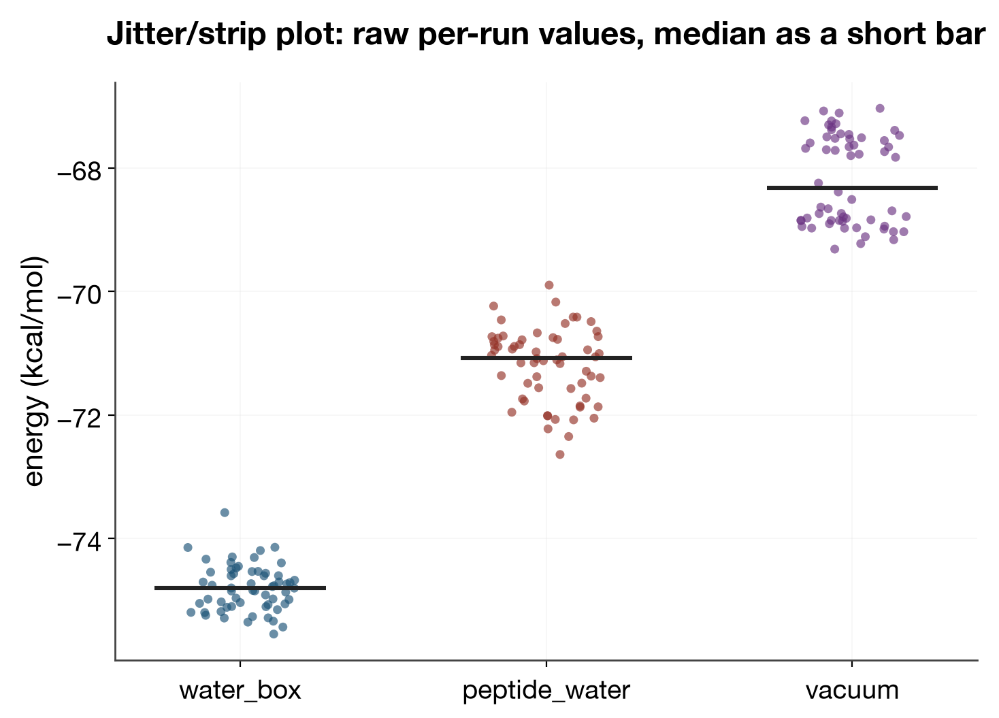

### Violin plot

The same three groups, but the estimated full distribution shape instead of
individual points — complementary to jitter/strip: better once N is large
enough that individual points would overplot. The bimodal `vacuum` group,
invisible in a bar+errorbar chart, reads immediately as a violin with two
lobes.

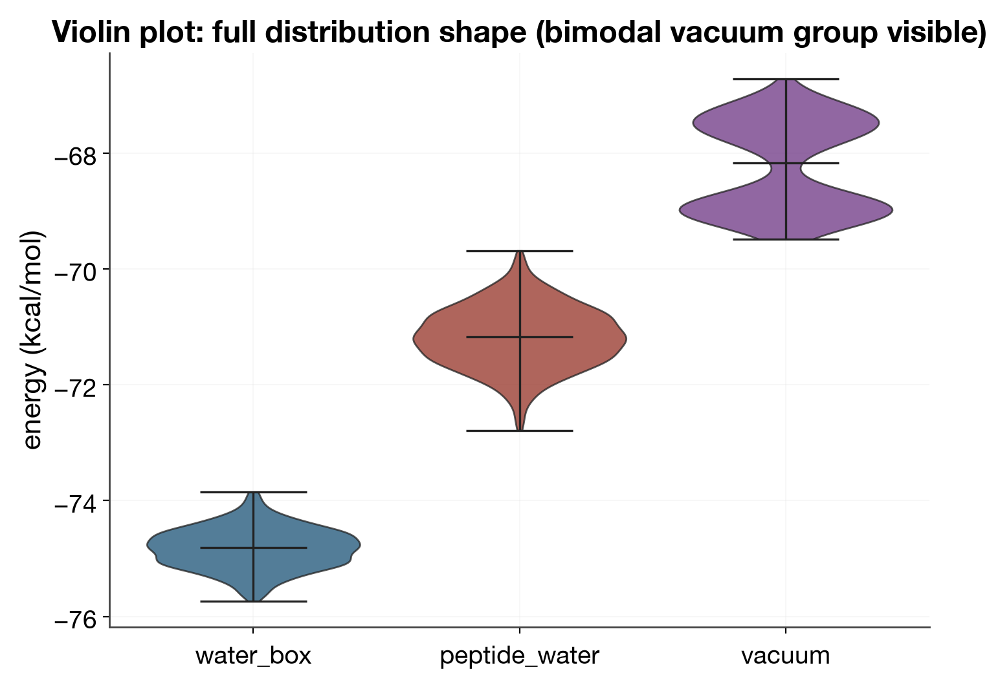

## Colormap picks: choosing defaults

A shortlist of `cmap`-library colormaps, each rendered on synthetic data
suited to its own category (category read from `cmap.Colormap(name).category`,
not guessed) — regenerate with `python scripts/render_colormap_picks.py`.
The goal is to pick one **default sequential**, one **default diverging**,
and one **default cyclic** map for the house style, the same way `"icml"`
became the default font/axis preset.

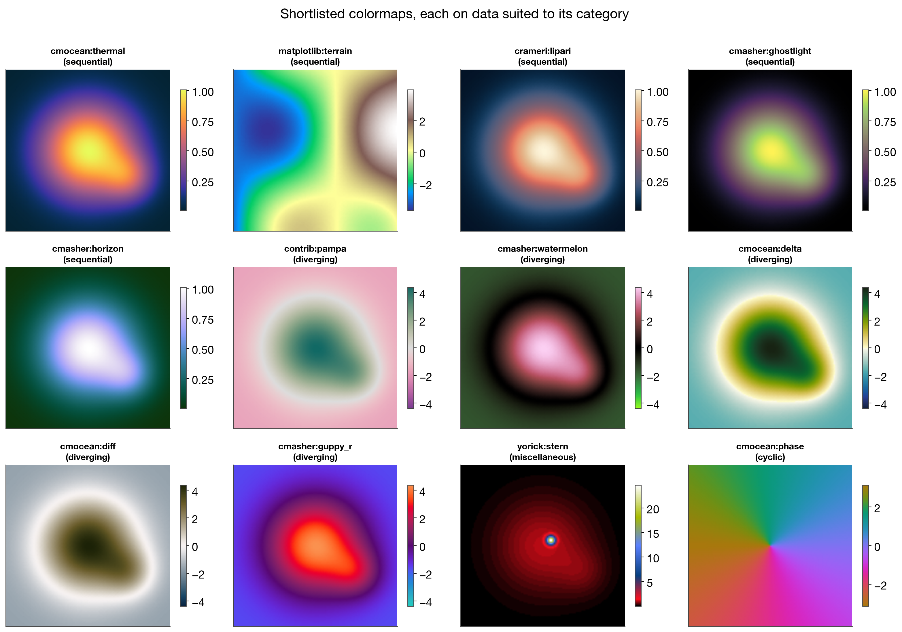

**Sequential** candidates, same field, side by side — smooth density-like
data (strictly positive, no natural zero):

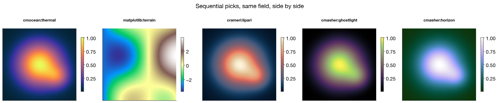

**Diverging** candidates, same zero-centered residual field, side by side:

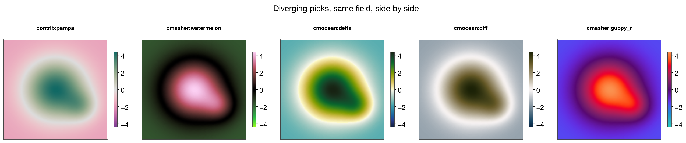

`cmocean:phase` (cyclic) is shown separately in the overview above, on a
wrapped phase/angle field — the natural fit for periodic quantities like the
dihedral-angle radial histogram earlier in this gallery.

| Candidate | Category | Best suited to |
|---|---|---|
| `cmocean:thermal` | sequential | General-purpose warm sequential; reads well at a glance |
| `matplotlib:terrain` | sequential | Data with a literal "sea level" / physical elevation meaning — misleading otherwise (its blue-green-brown bands imply water/land, not just low/high) |
| `crameri:lipari` | sequential | Perceptually-uniform, colorblind-safe — the safest general default |
| `cmasher:ghostlight` | sequential | High contrast on a black background — good for a dark-mode variant, less so alongside white-background figures |
| `cmasher:horizon` | sequential | Similar dark-background contrast profile to `ghostlight` |
| `contrib:pampa` | diverging | Muted, low-saturation — won't fight with data ink, good default candidate |
| `cmasher:watermelon` | diverging | High-saturation pink/green — strong visual pop, worse for colorblind readers than the perceptually-uniform options |
| `cmocean:delta` | diverging | Built for velocity/flux fields; teal/gold poles read clearly |
| `cmocean:diff` | diverging | Muted olive/gray — closest in spirit to a "quiet," Tufte-style diverging map |
| `cmasher:guppy_r` | diverging | Vivid blue/orange — good contrast, less perceptually uniform than `crameri:vik` |
| `yorick:stern` | misc (HDR) | Only for genuinely high-dynamic-range data (one sharp feature over a broad faint background) — not a general sequential substitute |
| `cmocean:phase` | cyclic | The house default for any periodic quantity (angles, phases) |

**Decided.** House defaults, wired into
[`mmml.utils.plotting.styles.default_cmap(kind)`](https://github.com/EricBoittier/mmml/blob/main/mmml/utils/plotting/styles.py):

- **Sequential**: `crameri:lipari`
- **Diverging**: `contrib:pampa`
- **Cyclic**: `cmocean:phase`

```python
from mmml.utils.plotting.styles import default_cmap

ax.pcolormesh(xx, yy, zz, cmap=default_cmap("sequential"))
```

`default_cmap` raises a clear `ImportError` (not a silent fallback to an
unrelated matplotlib colormap) if the optional `cmap` library isn't
installed — `uv sync --extra plotting` or `pip install cmap`.

## Merging notebook examples with the house style

A working notebook (phi/psi Ramachandran energy-landscape exploration) had
several genuinely nice plot ideas — reworked here under the house style
(`"icml"`, `legend_outside`, big fonts) and `default_cmap`, using the real
64×64 phi/psi scan (`artifacts/trialanine_phi_psi_mm_then_ml_64x64/phi_psi_pes.csv`)
rather than synthetic data. Regenerate with
`python scripts/render_ramachandran_gallery.py`.

**This is also the concrete version of "choosing a colormap category from
the data" from the section above** — each plot below picks sequential vs.
diverging by asking what the data *is*, not by taste:

### Ramachandran scatter (sequential: energy is strictly positive)

MM energy relative to its own minimum has no natural zero to diverge around
— `default_cmap("sequential")`.

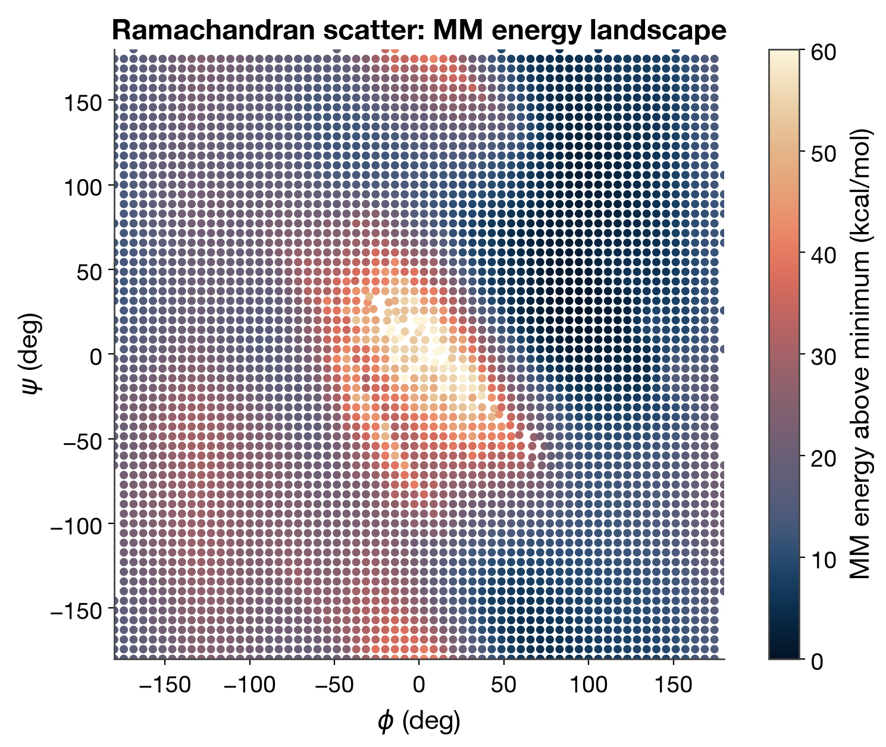

### Ramachandran contour + raw samples (sequential)

The same data as a smoothed filled contour with the actual sample points
overlaid faintly on top — reads both the interpolated landscape and exactly
where it was (and wasn't) sampled.

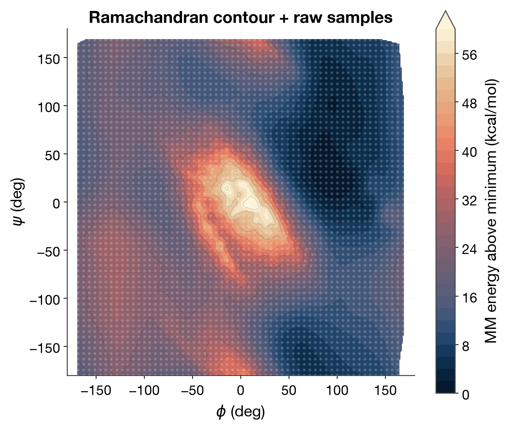

### MM vs. ML disagreement (diverging: has a real zero)

`ML energy - MM energy` is a genuine residual — zero means perfect
agreement, positive/negative means ML over/under-estimates relative to MM.
This *is* diverging data, unlike the two panels above — `default_cmap("diverging")`.

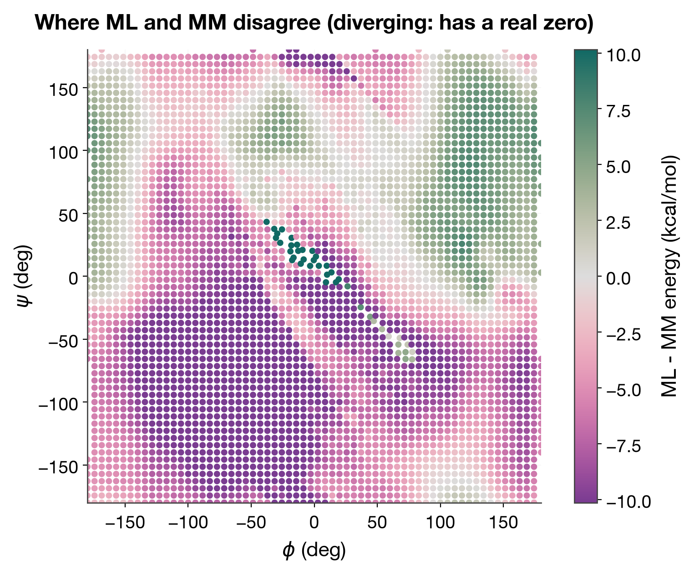

### Periodic landscape on a torus (sequential, correct topology)

Phi and psi are periodic — φ=−180° and φ=+180° are the *same* geometry, not
adjacent-but-distinct values. A flat Ramachandran plot hides this at its
edges; wrapping the same data onto an actual torus removes the artificial
seam entirely. Energy is still the encoded quantity (not an angle), so this
stays sequential, not cyclic — `cmocean:phase` (cyclic) would be for coloring
by *angle itself*, e.g. the radial dihedral histogram earlier in this
gallery.

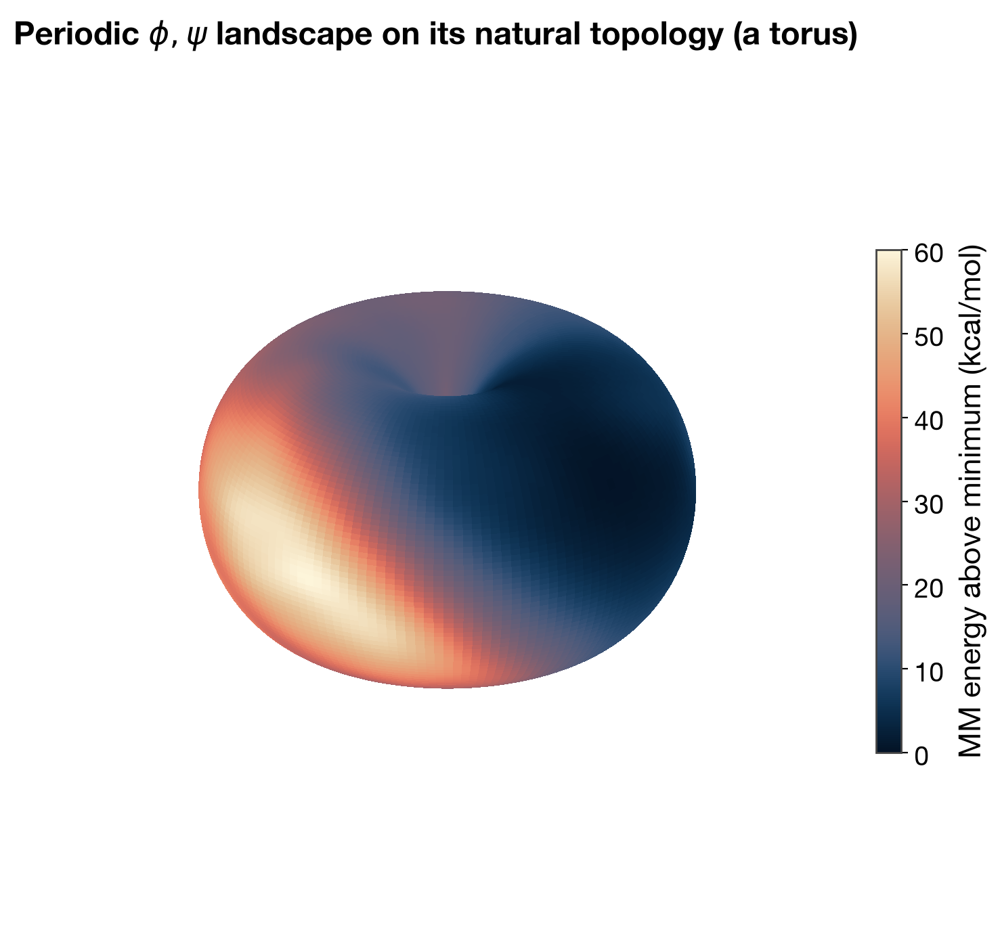

### MM vs. ML, small multiples

The two landscapes side by side on the *same* colormap and the *same* color
scale — direct visual comparison, the same principle as the font/chart-type
small-multiples above applied to a real MM-vs-ML question.

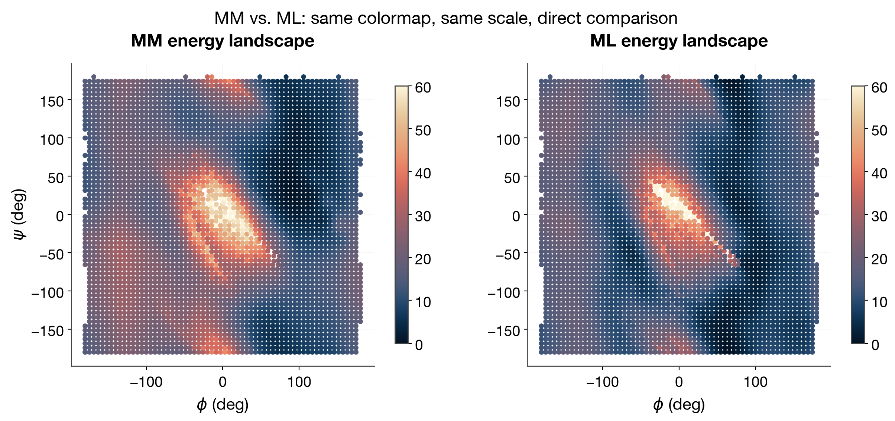

## Multipole visualization: a standardized complex figure

Multipole coefficients (charge, dipole, quadrupole, octupole — spherical
harmonics indexed by degree `l` and order `m`) as one colored, numbered box
per (l, m), in a Pascal's-triangle layout (row `l` has `2l+1` boxes,
centered) — regenerate with `python scripts/render_multipole_gallery.py`.
No real saved multipole-coefficient array exists in this checkout (real
values come from `mmml.models.multipoles` at runtime); these use
physically-plausible synthetic values matching that module's documented
units and packed-irrep convention (see the script's docstring).

### Multipole triangle: colormap candidates

Multipole coefficients are signed — diverging data — but the house general
diverging default (`contrib:pampa`) is muted pink/teal, not the classic
red-positive/blue-negative convention that reads fastest for this
particular, very common plot. A dedicated red/blue shortlist:

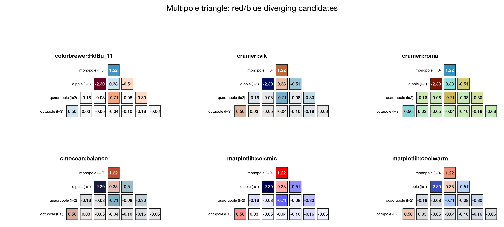

`crameri:roma` (top right) turned out not to actually be red/blue despite
being on the original shortlist — more brown/teal — a good reminder to
*look at the render*, not just the name, before picking.

**Decided default: `crameri:vik`** — the classic red-positive/blue-negative
read with a controlled, perceptually-uniform ramp (unlike matplotlib's
built-in `seismic`/`coolwarm`, which are not perceptually uniform). This is
`complex_figure()`'s default `cmap_name` in
`scripts/render_multipole_gallery.py`.

Each box in the triangle is now drawn with a visible inset gap
(`plot_multipole_triangle(..., gap=0.08)`) rather than edge-to-edge — plain
adjacent boxes with only a thin border read as one solid mosaic; the gap
lets each (l, m) value read as its own cell.

### Standardized complex figure

Multipole triangle + per-atom partial-charge bars + a **real LaTeX-typeset**
`booktabs` summary table, combined under the "Complex figure layout" rules
from [`docs/plotting-style-guide.md`](plotting-style-guide.md): **one**
shared colorbar for both the triangle and the bars (same colormap, same
scale, `constrained_layout=True` so it doesn't overlap either panel), and
`latex_table_image()` for the summary — compiled with `pdflatex` and
rasterized at 400 DPI, so it has real kerning and decimal-point alignment
instead of matplotlib's `Axes.table` approximation:

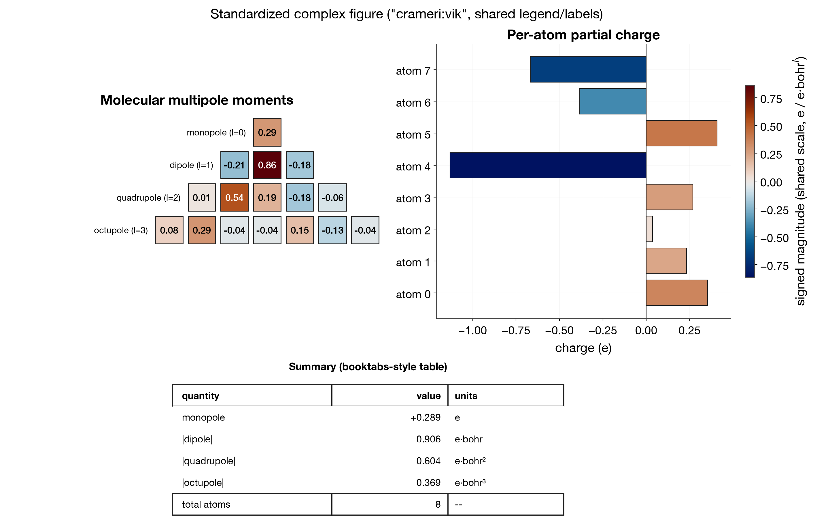

```python
from mmml.utils.plotting.styles import latex_table_image, latex_available, shared_axis_labels

if latex_available():
    latex_table_image(ax_table, cell_text, col_labels=col_labels)
else:
    booktabs_table(ax_table, cell_text, col_labels=col_labels)  # matplotlib fallback
```

See [`docs/plotting-style-guide.md`](plotting-style-guide.md) "Tables:
LaTeX-typeset `booktabs`" for why, and when to fall back to
`booktabs_table()`.

### Colormaps for a figure with several panels

A figure with more than one sequential (or diverging) panel — one per
physical quantity — should not reuse a single colormap for all of them; that
erases the fact that the panels encode different things. Pick a distinct map
per panel, in a fixed order, from `MULTI_CMAP_SHORTLIST`:

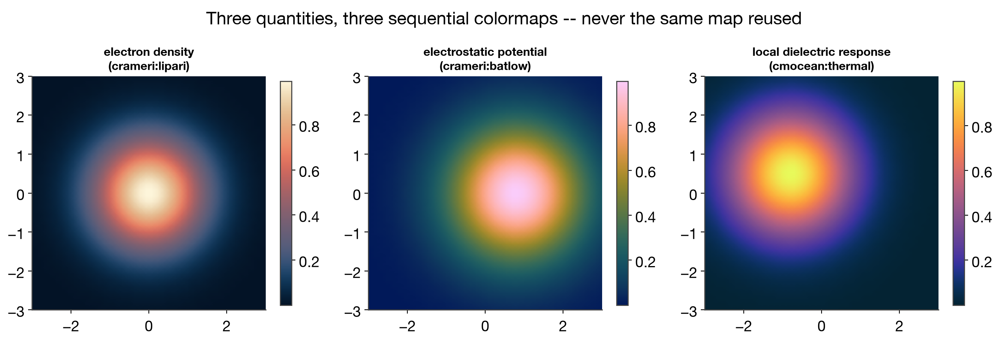

```python
from mmml.utils.plotting.styles import MULTI_CMAP_SHORTLIST

names = MULTI_CMAP_SHORTLIST["sequential"][:3]  # or ["diverging"] / ["cyclic"]
```

`MULTI_CMAP_SHORTLIST[kind][0]` is always the same as the corresponding
`default_cmap(kind)` — reserve it for the figure's "primary" quantity, and
use the later entries for secondary panels, so a repeated panel (e.g. "MM
energy" across many workflow figures) keeps the same colormap project-wide.

## Line styles, markers, and symbols

Color is not the only axis available — line style (dash pattern) and marker
shape are a second, independent categorical encoding, useful when: a figure
already spends color on one distinction (e.g. force field) and needs a
second one (e.g. replicate) on top of it; the figure must survive grayscale
printing; or color-alone identity would fail a colorblind reader even with a
safe palette (redundant coding). See `LINE_STYLE_CYCLE` / `MARKER_CYCLE` in
`mmml.utils.plotting.styles` and
[`docs/plotting-style-guide.md`](plotting-style-guide.md) "Line styles,
markers, and symbols" for the full writeup.

### Line style = one axis, color = another

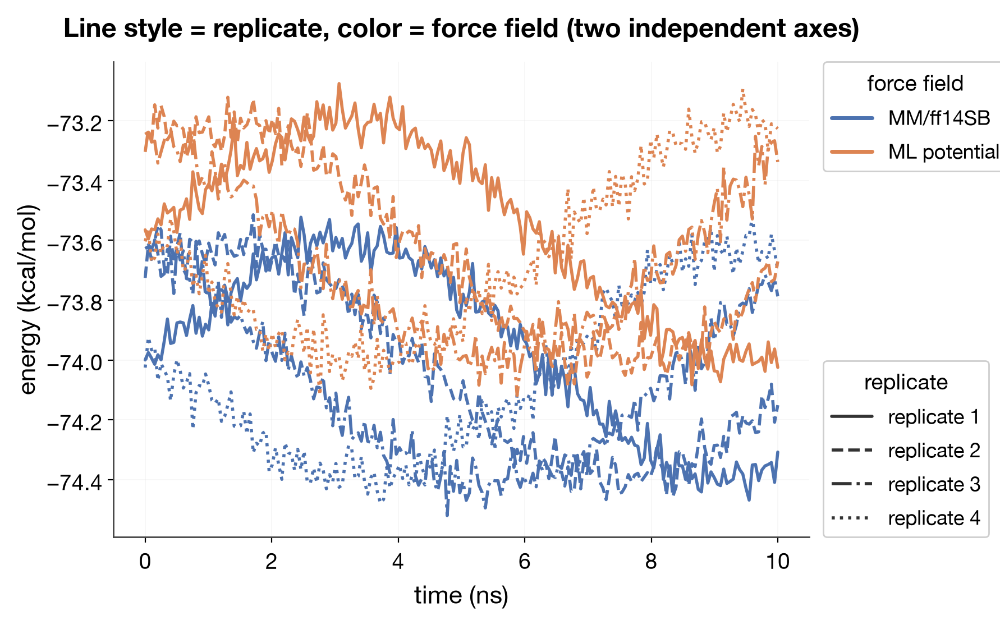

### Marker shape = one axis, color = another

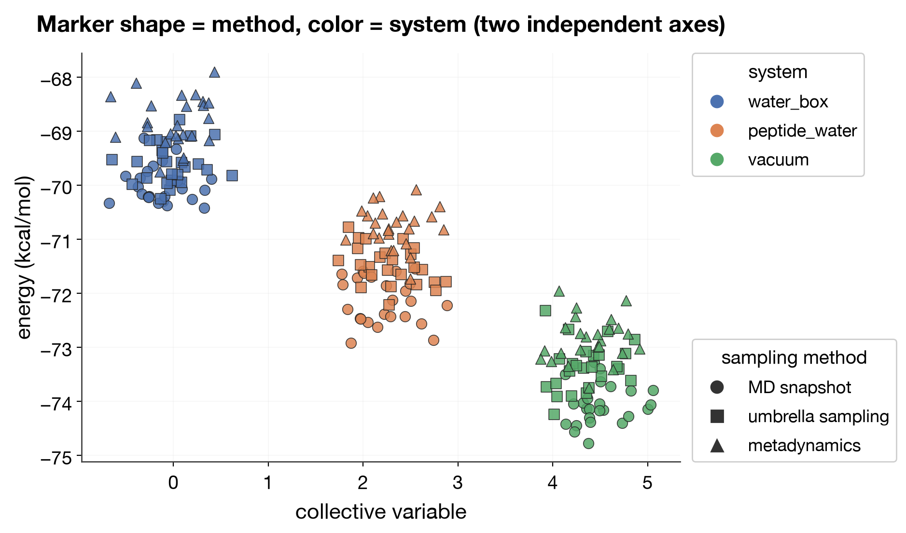

### Linewidth/alpha as a visual hierarchy (not categorical at all)

A non-categorical use of the same idea: bold + opaque for the "headline"
series, thin + faint for supporting context, so the eye finds the point
without reading the legend first.

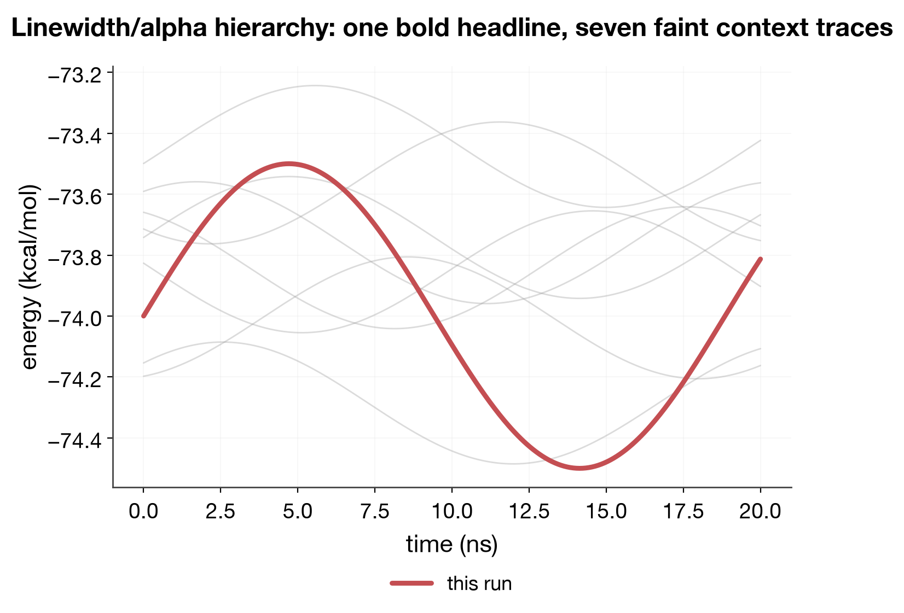

## Finite-difference validation: analytic vs. numerical forces

A finite-difference (FD) check compares an analytic force (autodiff, or a
hand-derived gradient) against a central-difference numerical derivative of
the energy — the standard way to catch a sign error, a missing term, or a
broken chain rule in a force implementation. Regenerate with
`python scripts/render_fd_test_gallery.py`. Two real checks, deliberately
shown side by side rather than cherry-picking the passing one:

- **SMD bias restraint** (`mmml.md.energy.terms.SMDBiasTerm`, the same check
  as `tests/unit/test_md_energy_terms.py::test_ase_forces_match_finite_difference`)
  — PASSES, `atol=1e-4`.
- **CHARMM/mlpot ML-only calculator**
  (`mmml/interfaces/pycharmmInterface/mlpot/derivative_test.py`, saved
  result at `artifacts/pycharmm_mlpot/mlpot_force_fd.json`) — currently
  FAILS all 60 checked force components against `tol=0.005 kcal/mol/Å`, with
  a max discrepancy of 1.52 kcal/mol/Å and rms 0.75. This is real, current
  state, not historical — worth fixing before trusting forces from that
  integration path.

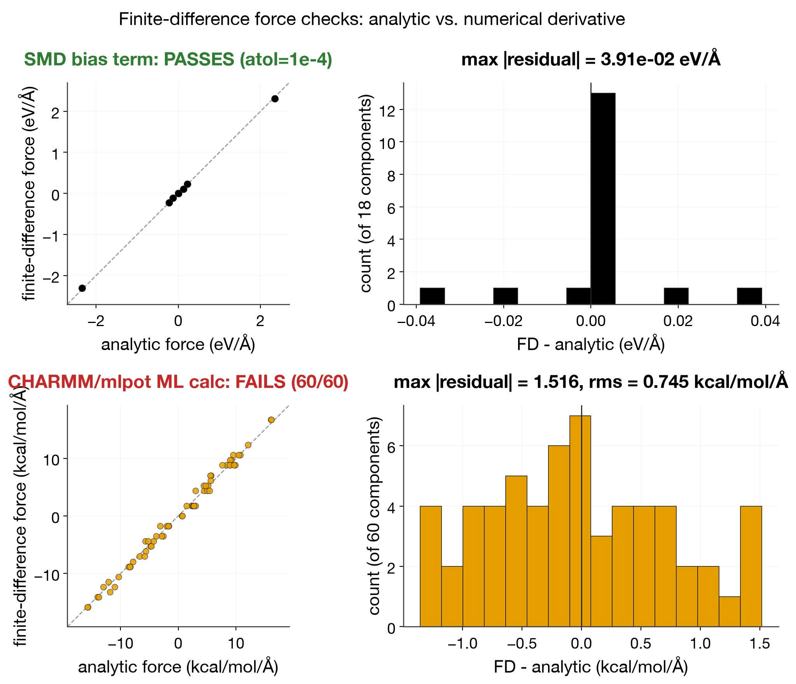

The per-atom breakdown of the failing check shows the discrepancy spread
roughly evenly across all 20 atoms rather than concentrated on a few — that
pattern is more consistent with a systematic force-term issue (a missing or
mis-signed contribution present at every atom) than a boundary/indexing bug
that would only hit a handful of atoms:

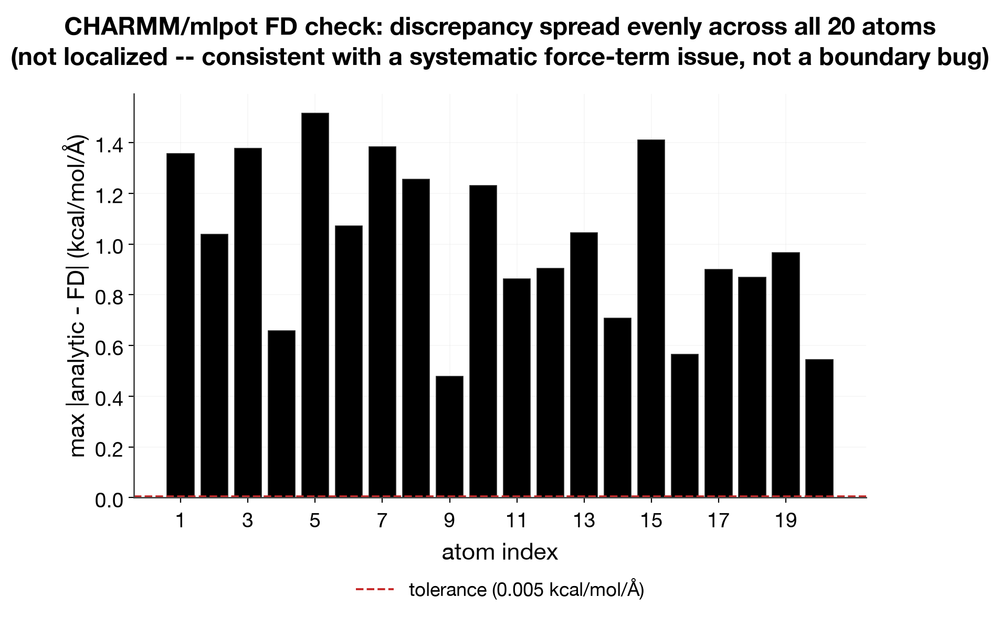

## How to pick

```python
from mmml.utils.plotting.styles import apply_plot_style

apply_plot_style("icml")  # or editorial_dejavu_serif / _dejavu_sans / _stix / _cm
```

`_STYLE_NAME` in `workflows/*/scripts/plot_results.py` and `plot_structure.py`
is currently `"icml"` — see [`docs/plotting-style-guide.md`](plotting-style-guide.md)
for the rest of the convention (semantic color, DPI, uncertainty shading,
legends outside).

(There was a 5th candidate, `editorial_stixsans`, dropped from the gallery:
matplotlib has no real "STIX Sans" font bundled, so it silently fell back to
the same rendering as `editorial_dejavu_sans` — not a meaningfully distinct
option.)
