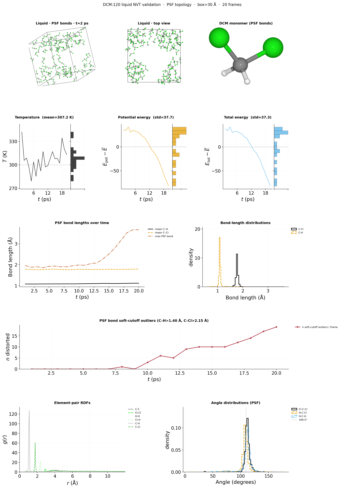
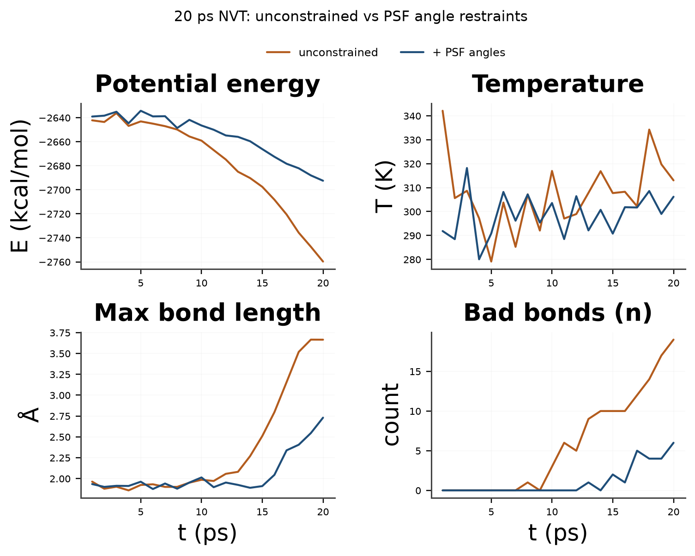
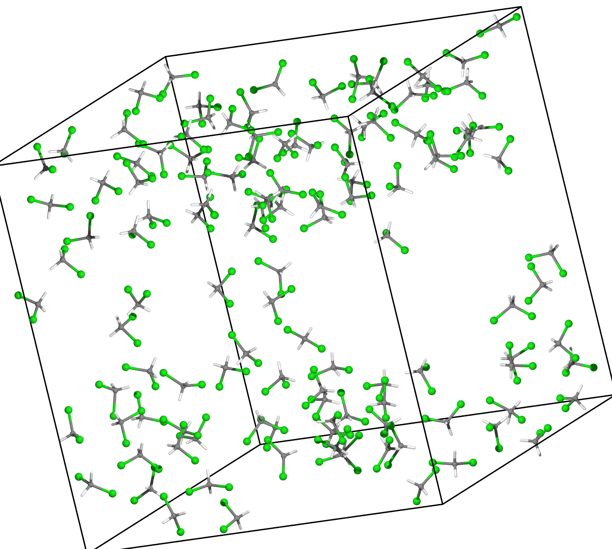
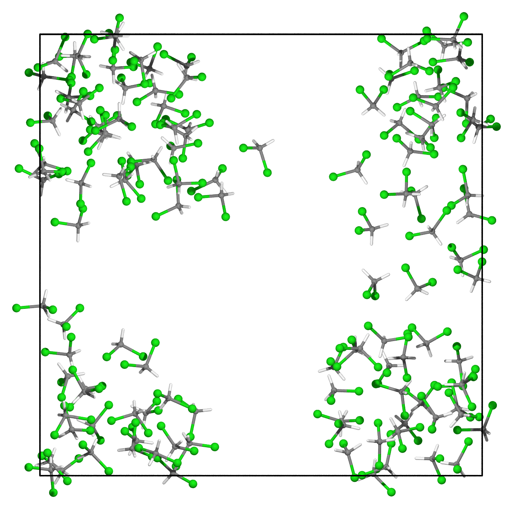
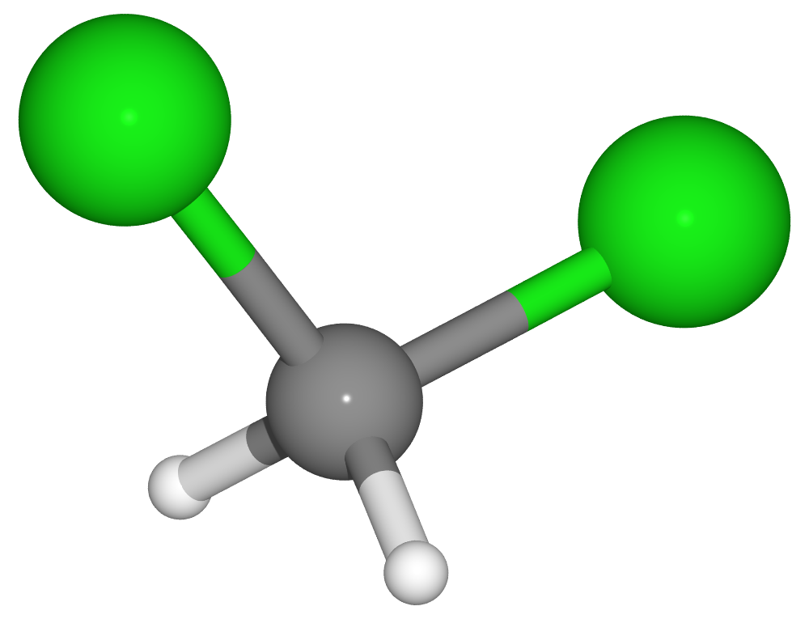
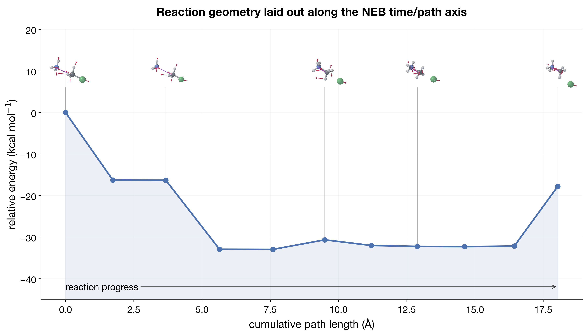
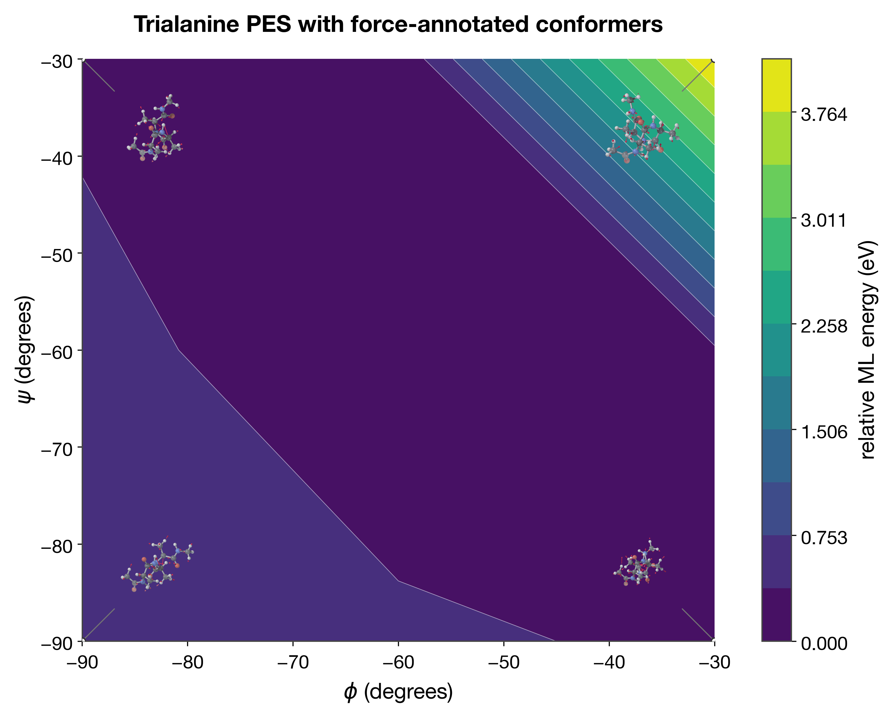
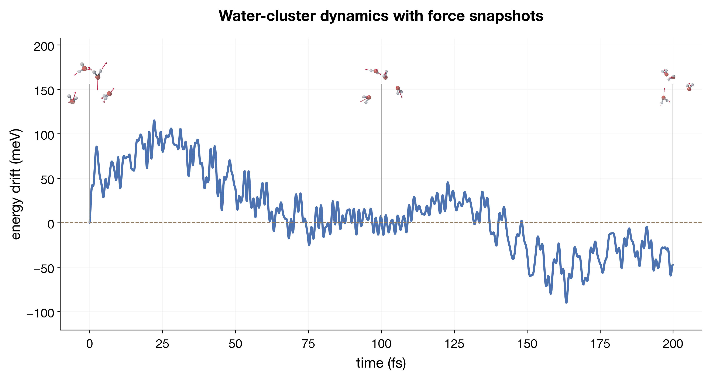
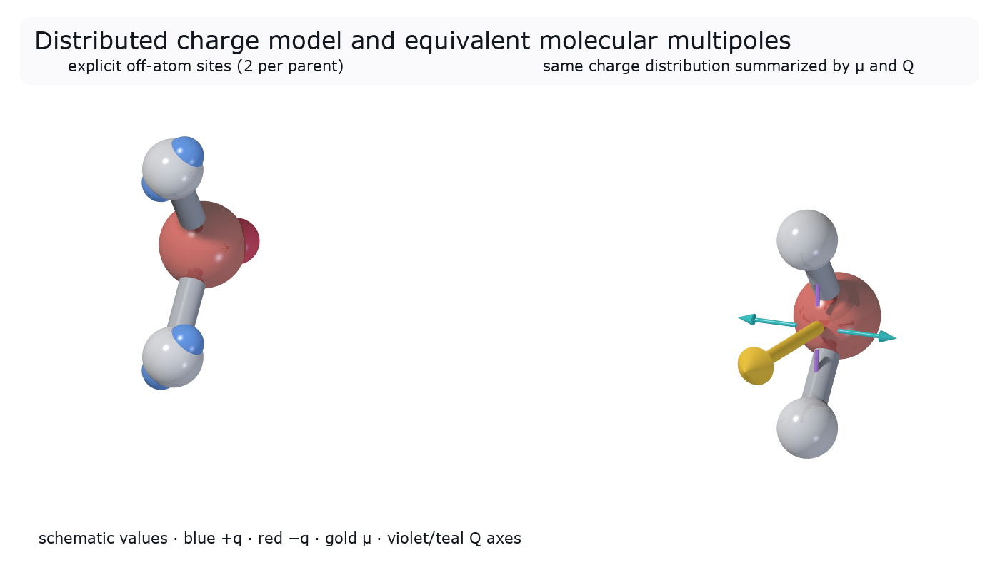

# Plotting style guide

**There is already a house style module — use it instead of ad-hoc hex lists.**
This doc exists because a recent pass (`workflows/*/scripts/plot_results.py`)
initially invented its own colors/fonts instead of using it; this is the
correction, so it doesn't happen again.

## The one module to import

[`mmml/utils/plotting/styles.py`](https://github.com/EricBoittier/mmml/blob/main/mmml/utils/plotting/styles.py) defines the
house `PlotStyle` presets and is the single source of truth for fonts, colors,
and line weights. Use it at the top of any new plotting script:

```python
from mmml.utils.plotting.styles import apply_plot_style, comparison_colors

style = apply_plot_style("nature")     # sets matplotlib rcParams
colors = comparison_colors(style, n=len(settings))  # fixed categorical order
```

- `apply_plot_style(name)` calls `plt.rcParams.update(...)` for the named
  preset and returns the resolved `PlotStyle`. Call it once per script, before
  creating any figure.
- `comparison_colors(style, n)` returns `n` colors from the style's
  `comparison_palette`, cycling only if you genuinely need more series than
  the palette has (rare — reconsider the chart if you do). **Assign each
  series a color once, from this call, and keep it across every panel/rerun**
  — never re-derive colors ad hoc per plot, or the same setting ends up a
  different color in two figures.

### Which preset

| Preset | When |
|---|---|
| `"icml"` | **Default for sweep/analysis figures** (energy traces, RDFs, bond/angle histograms, anything going in a writeup) — clean sans-serif, moderate type (`axes.labelsize=13`), no top/right spine, no legend border (`legend.frameon=False`). Categorical color cycle is the [Okabe–Ito](https://jfly.uni-koeln.de/color/) eight-color colorblind-safe palette (`OKABE_ITO_PALETTE`) — the house default, not an opt-in variant. The closest preset to a modern ML-conference (ICML/NeurIPS) figure — less soft/rounded than `"google"`, less serif/journal than the `editorial_*` family. Pairs with `legend_outside()` (see below). Used by `workflows/*/scripts/plot_results.py` and `plot_structure.py`. `"icml_okabe_ito"` still resolves (alias → `"icml"`) for anything written before the palettes merged. |
| `"editorial_dejavu_sans"` / `"editorial_dejavu_serif"` / `"editorial_stix"` / `"editorial_cm"` | An alternative "read from across the room" family (e.g. a talk slide) — large type (`axes.labelsize=15`, `axes.titlesize=17` bold), thick lines (`lines.linewidth=2.8`), LaTeX-style math via `mathtext.fontset`, no top/right spine, faint dotted grid. The four variants share this axis/spacing treatment and differ only in typeface — see [`docs/plot-style-gallery.md`](plot-style-gallery.md) for a rendered comparison. |
| `"nature"` (alias `"pub"`/`"publication"`) | Compact journal-figure alternative when `"icml"`'s or the editorial family's type doesn't fit a dense multi-panel grid — sans-serif, `axes.labelsize=9`. |
| `"google"` (module default) | Training-curve dashboards (loss/lr curves) — this is what most existing training-plot scripts assume implicitly. |
| `"mpl_classic"` | Quick throwaway diagnostics where house branding doesn't matter. |
| `"xmgrace"` / `"tron"` | Not for new work — legacy/novelty presets. |

Every preset now sets `legend.frameon = False` — legends are never boxed with
a visible border; rely on `legend_outside()` placing them clear of the data
instead of a frame to separate them from it.

Run `mmml.utils.plotting.styles.list_plot_styles()` to see all registered
names/aliases (alphabetical — a stable lookup order, not a recommendation
order). For a "show these to a human, default first" ordering (e.g. a
gallery), use `STYLE_DISPLAY_ORDER` instead — it leads with `"icml"`, then
its closest siblings, then the rest roughly by how likely they are to be
reached for.

### Documentation assets

Every script that creates a Matplotlib image committed under `docs/images/`
must call `apply_plot_style("icml")` before it creates a figure. This includes
the static figure generator (`scripts/generate_docs_figures.py`), trajectory
analysis (`scripts/plot_trajectory_structure.py`), and the aaa.ama /
md-embedding documentation publishers. Structure drawings may additionally
use `mmml.utils.ase_structure_plot` for bonds, element colours, and projection;
that helper complements the shared Matplotlib baseline rather than replacing
it. Re-run the relevant publisher after changing a preset.

**On the name**: these are *not* "the Tufte style" — Tufte described a set of
principles (data-ink ratio, redundant encoding instead of decoration, small
multiples), not one font or palette, so no single preset should claim his
name. `"tufte"` still resolves as a backward-compat alias (→
`editorial_stix`) since an earlier pass mistakenly registered it that way,
but new code should name the `editorial_*` variant directly.

## Semantic color, not palette index

**A color should mean the same thing every time it appears, not just be "the
next one in the cycle."** `comparison_colors(style, n)` is fine for truly
interchangeable series (e.g. random seeds of the same setting), but once
your series fall into meaningful groups, assign color by group membership —
fixed and hand-picked, not generated:

```python
# Good: color means something and is stable across every figure.
_SYSTEM_COLORS = {"water_box": "#1A5276", "peptide_water": "#943126"}
color = _SYSTEM_COLORS[row["system"]]

# Bad: the 3rd setting in whatever order happened to sort this run.
color = comparison_colors(style, n)[i]
```

Concrete house examples (both from `workflows/*/scripts/plot_results.py`):

- **`mixed_calculator_sweep`**: color = system (`water_box` = deep blue "MM
  only", `peptide_water` = brick red "mixed ML/MM"); a distinct **marker
  shape** per individual setting shares that color rather than getting its
  own hue, so identity is still readable (redundant color+shape coding)
  without diluting what the color itself means.
- **`unified_backend_sweep`**: color = *kind of physics* the backend
  represents — `jaxmd_min` (deterministic minimization) neutral gray,
  `jaxmd_nve` (energy-conserving reference) deep blue, `jaxmd_nvt`
  (thermostatted — deliberately exchanges heat) forest green, `jaxmd_npt`
  (documented deterministic failure on this cluster) brick red, `rigid_mc`
  (stochastic sampler) muted purple.
- **Element coloring** (`scripts/plot_trajectory_structure.py`'s `plot_rdfs`)
  already does this correctly via `ase.data.colors.jmol_colors` — an O atom
  is the same red everywhere because "oxygen" is the semantic category, not
  because oxygen happened to be plotted first.
- **Coordinate-type coloring** (`plot_internal` in the same file): bonds,
  angles, and dihedrals are three different physical quantities (different
  stiffness, different units) and each gets its own fixed color
  (`_COORDINATE_TYPE_COLORS`) — they should never all render as the same
  default blue just because no one assigned them a color explicitly.

When in doubt: if you can name *why* a series has the color it has (its
system, its physics, its pass/fail status) in one short phrase, it's
semantic. If the only answer is "it's next in the list," fix it.

## Legends live outside the plot

**A legend never overlaps the data.** Use
[`mmml.utils.plotting.styles.legend_outside(target, side="auto", **kwargs)`](https://github.com/EricBoittier/mmml/blob/main/mmml/utils/plotting/styles.py)
instead of `axis.legend(loc="best", ...)`.

**Which side is decided by measurement, not a guess from the figure's
aspect ratio:**

- **`side="auto"`** (default) actually places the legend at **both**
  candidate sides ("right" and "bottom"), reads back each candidate's real
  rendered size (`get_window_extent()`), computes what the *total figure
  bounding box* would be for each —
  `(fig_w + legend_w) * max(fig_h, legend_h)` for a side legend,
  `max(fig_w, legend_w) * (fig_h + legend_h)` for a bottom legend — and
  keeps whichever candidate gives the smaller area. This is a real
  measurement of the two options, not an inference from the plotted data's
  aspect ratio: a small legend (few short entries) costs almost nothing
  added to a bottom placement regardless of whether the figure itself is
  wide or tall, while a large legend (many long labels) wrapping into
  several columns at the bottom can cost *more* added height than it would
  cost added width on the side — again regardless of the figure's own
  proportions. Guessing from `fig.get_size_inches()` alone gets both of
  these cases wrong for exactly the figures where it matters (a big legend
  on a wide figure, a tiny legend on a tall one).
- **Single-column, multi-row (stacked) figures** — e.g. 2-3 subplots stacked
  vertically — put the legend **below the whole figure**, not to the side,
  by passing the `Figure` (not an `Axes`) so one combined legend covers
  every panel instead of stacking several smaller ones:
  ```python
  legend_outside(fig, handles=all_handles, labels=all_labels, side="bottom", fontsize=12)
  ```
  A bottom legend wraps into a small grid (`ncol` auto-picked, ≤4) rather
  than one long row, so it stays roughly as wide as the figure itself. This
  is a structural choice ("one legend for N stacked panels reads better
  below all of them") independent of the min-area comparison above — set
  `side` explicitly here rather than leaving it to `"auto"`.
- **Multi-column figures** — e.g. two panels side by side — **each column
  gets its own legend on its own outer edge**: the left panel's legend
  attaches further left, the right panel's further right. Never stack both
  panels' legends on one side.
  ```python
  legend_outside(ax_left, side="left", fontsize=10)
  legend_outside(ax_right, side="right", fontsize=10)
  ```
  `"left"` is deliberately excluded from `"auto"`'s own candidate search —
  it's for this explicit multi-column case, not something the automatic
  comparison should reach for on its own.

Because a legend is outside, **it's free to grow long** — a 12-setting
sweep's legend reads like a small table (marker/color/seed-symbol → setting
name) rather than needing to be trimmed to fit inside the plot. Don't
economize on legend entries to make them fit inside the axes; if the legend
needs to be big, let it be big outside instead.

**Verify there's no overlap by actually looking at the rendered PNG** — a
bottom legend can still collide with rotated x-tick labels, and a
side-by-side figure's two titles can run into each other if the panels are
too narrow for the font size. `bbox_inches="tight"` (house convention on
every `savefig`) prevents *clipping*, but not two artists rendering on top of
each other; widen the figure (`figsize`) or add `fig.subplots_adjust(wspace=...)`
if titles or labels are cramped, then re-render and look again.

## Symbols over small text

When a repeated label would otherwise shrink to fit (e.g. "(seed 3)" tacked
onto a dozen x-tick labels), replace it with a symbol instead of making the
text smaller. House convention:
[`mmml.utils.plotting.styles.seed_symbol(seed)`](https://github.com/EricBoittier/mmml/blob/main/mmml/utils/plotting/styles.py)
returns a filled-dot count — `seed_symbol(1) == "●"`, `seed_symbol(3) ==
"●●●"` — instead of the text `"(seed 3)"`. (Unicode die faces U+2680-2685
were tried first and rejected: they render as generic missing-glyph boxes on
common sans-serif fonts, including the ones this cluster and this house
style actually use — verify any "clever" glyph choice actually renders
before committing to it, don't assume Unicode support.) Reuse `seed_symbol`
rather than inventing another per-script seed convention.

More generally: a marker *shape* (see "Redundant coding" below) or a fixed
color is preferable to a text tag wherever one is already semantically
assigned — only fall back to text for identifiers that don't have a natural
symbol (most setting names).

## Overlaid semi-transparent bars, not more panels

When two bar-chart metrics share units and scale (e.g. energy fluctuation
$\sigma$ and trend $|dE/dn|$, both eV-scale) don't give them two separate
stacked panels — overlay them as semi-transparent bars in **one** panel
instead, distinguished by fill style (solid vs. `hatch="///"`) at different
alpha:

```python
ax.bar(x, fluctuation, alpha=0.9, width=0.6, label="fluctuation")
ax.bar(x, trend, alpha=0.45, hatch="///", width=0.6, label="tendency")
```

This reads their relative size directly (one glance, not a vertical scan
between two panels) and keeps a multi-panel sweep figure shorter — which
also means less pressure on the "legend below" rule above, since fewer
stacked rows makes the figure less tall relative to its width. Reserve a
separate panel for a metric with genuinely different units/scale (e.g.
wall-clock seconds) that wouldn't overlay meaningfully.

## Figure conventions (from real precedent, not invented)

- **DPI**: `150` for a quick per-run diagnostic plot regenerated often;
  `200` for `editorial_*`-styled sweep figures (`workflows/*/scripts/plot_results.py`);
  `300` for anything meant to be read very closely or reused in a writeup
  (RDFs, bond/angle/dihedral histograms — see
  `scripts/plot_trajectory_structure.py`'s `plot_rdfs`/`plot_internal`, both
  `dpi=300`).
- **Uncertainty as shading, not just error bars**: `ax.fill_between(x, trend
  - sigma, trend + sigma, alpha=0.1-0.15)` behind a line reads faster than a
  legend annotation — see `plot_energy_traces` in
  `workflows/mixed_calculator_sweep/scripts/plot_results.py`.
- **Redundant coding for multi-category series**: color for the group, a
  distinct marker shape (`o`, `s`, `^`, `D`, `v`, ...) for the individual
  series within it — never rely on color alone to carry both. See "Semantic
  color, not palette index" below.
- **Always**: `fig.savefig(path, dpi=..., bbox_inches="tight")` then
  `plt.close(fig)` — every plotting function in this repo returns the output
  `Path` and closes its own figure; never leave figures open across calls.
- **Element/atom coloring**: use `ase.data.colors.jmol_colors` +
  `ase.data.atomic_numbers`, not an invented per-element palette — see
  `plot_rdfs` in `scripts/plot_trajectory_structure.py`.
- **Multi-panel structural plots**: one row of 3 panels (bonds / angles /
  dihedrals) at `figsize=(15, 4.5)` is the established layout
  (`plot_internal` in `scripts/plot_trajectory_structure.py`) — reuse it
  rather than inventing a new grid.
- **Grid**: `alpha=0.18-0.3` on gridlines (recessive, never full-strength) —
  consistent across every plotting script surveyed.
- **Legends**: only when there are ≥2 series; `fontsize=7-9`; a single-series
  panel needs no legend box (the axis title/label already names it) — this
  matches the dataviz skill's non-negotiables and is not repo-specific.
- **One y-axis per panel.** Never a dual-axis (twinx) chart — split into two
  stacked panels (`plt.subplots(2, 1, ...)`) instead, as
  `workflows/*/scripts/plot_results.py` do for energy vs. elapsed time.
- **Title padding**: every house preset sets `axes.titlepad` explicitly
  (14-20pt depending on the preset's title size) rather than leaving
  matplotlib's default (`6.0pt`) — a bold, larger-than-body-text title sits
  close enough to the axes box at the default pad that it visually collides
  with the topmost y-tick label in the corner. If a one-off script overrides
  `axes.titlesize`/`axes.titleweight` after `apply_plot_style()`, bump
  `axes.titlepad` (or the specific `ax.set_title(..., pad=...)`) to match —
  don't leave it at the smaller preset default with a manually-enlarged
  title. Don't take this on faith either — run `find_overlapping_text(fig)`
  (below) on the finished figure.

## Energy drift: fluctuation + tendency, not a bare endpoint delta

`energy_drift_ev = E[last frame] - E[first frame]` (the original metric in
both sweep workflows) is misleading: it can be large purely from single-frame
noise in an otherwise-flat trace, or small while the trace trends steadily in
one direction between two coincidentally-close endpoints. Use
[`mmml.md.results.energy_drift_metrics`](https://github.com/EricBoittier/mmml/blob/main/mmml/md/results.py) instead, which
reports:

- `energy_fluctuation_std_ev` — std over the *whole* trace (the noise floor).
- `energy_trend_ev_per_frame` — slope of a linear least-squares fit vs. frame
  index (the systematic tendency).
- `energy_trend_total_ev` — the trend line's implied total change over the
  run (`slope * (n_frames - 1)`), comparable in scale to the old endpoint
  delta but reflecting the fit rather than one noisy pair of samples.

Both `workflows/unified_backend_sweep/scripts/run_setting.py` and
`workflows/mixed_calculator_sweep/scripts/run_setting.py` compute all three
alongside the original fields (kept for backward compatibility with existing
`summary.csv` consumers); `scripts/plot_results.py` in each workflow plots the
fitted trend line over the raw trace rather than just annotating two
endpoints.

## Structural analysis (bonds/angles/dihedrals/RDF)

Don't re-derive these — [`mmml/utils/plotting/trajectory_structure.py`](https://github.com/EricBoittier/mmml/blob/main/mmml/utils/plotting/trajectory_structure.py)
already has them, operating on `Sequence[ase.Atoms]`:

- `element_pair_rdfs(frames, r_max=8.0, bins=160)` — periodic RDF per element
  pair (minimum-image, orthorhombic cells only).
- `internal_coordinate_distributions(frames, indices)` — bonds/angles/proper
  dihedrals (inferred from covalent radii) as an `InternalCoordinates`
  dataclass of per-labeled-coordinate arrays.
- `infer_bonds`, `water_tetrahedrality`, `hydrogen_bond_analysis`,
  `radius_of_gyration_and_diffusion` — see the module docstring for the rest.

These take ASE `Atoms`, not raw position arrays — `JaxmdDriver` and
`RigidBodySampler` now save `Z` (and `box`, for fixed-box runs; `boxes` for
NPT) alongside `positions`/`energies` in `trajectory.npz` specifically so a
downstream script can reconstruct `Atoms` per frame without re-running the
simulation:

```python
import numpy as np
from ase import Atoms

data = np.load("trajectory.npz")
frames = [
    Atoms(numbers=data["Z"], positions=pos, cell=data["box"], pbc=True)
    for pos in data["positions"]
]
```

`scripts/plot_trajectory_structure.py` is the reference CLI wrapper —
`plot_rdfs`, `plot_internal`, `plot_hydrogen_bond_timeseries`, etc. — reuse
its plotting functions directly rather than re-plotting the same arrays with
different styling.

## Rendering ASE `Atoms` (molecule structure drawings)

For drawing actual molecular geometry (not a data curve) — e.g. a dimer
snapshot alongside an energy-scan plot — reuse
[`scripts/plot_utils.py::render_dimer_atoms`](https://github.com/EricBoittier/mmml/blob/main/scripts/plot_utils.py),
the good precedent already in the repo (used by the SpookyNet dimer-scan
figures in `scripts/plot_1d_slices_by_offset.py` and `scripts/plot_2d_pes.py`):

- Atom size from `ase.data.covalent_radii` (scaled by `radii_scale`), color
  from `ase.data.colors.jmol_colors` — the same "semantic color" principle
  as the RDF element coloring above, applied to the atoms themselves.
- Camera angle as an `ase.io.utils.rotate`-style string (e.g.
  `"15x,-20y,0z"`), projected to 2D — not a fixed top-down view.
- Bonds drawn as lines only within a fragment (same-monomer atom pairs
  closer than `bond_cutoff_scale * (sum of covalent radii)`), so
  intermolecular contacts in a dimer aren't mistaken for bonds.
- Atoms drawn back-to-front (sorted by projected depth) with per-atom alpha
  as a depth cue, so overlapping monomers stay legible instead of a flat
  jumble.
- Optional force-arrow overlay via `ax.quiver`, projected through the same
  rotation matrix as the atoms.

`plot_2d_pes.py`'s `_plot_atoms_filmstrip` (a strip of geometry snapshots
along a scan coordinate) and `plot_1d_slices_by_offset.py`'s per-slice
minimum-energy-geometry inset are the reference patterns for combining a
structure drawing with an energy curve in one figure — reuse those, don't
re-derive the atom-rendering logic for a new script.

**As an overlay, not just a neighboring panel**: `render_dimer_atoms` takes
an `ax` directly, so it can be drawn into an `ax.inset_axes(...)` placed
right over the point on a curve it corresponds to (e.g. the minimum of a
dimer scan), rather than in a separate side-by-side figure the reader has
to cross-reference by hand — see
[`scripts/render_chart_type_gallery.py::ase_atoms_overlay`](https://github.com/EricBoittier/mmml/blob/main/scripts/render_chart_type_gallery.py)
and the rendered example in
[`docs/plot-style-gallery.md`](plot-style-gallery.md) "ASE Atoms as an
overlay on a data plot".

## POV-Ray liquid snapshots (PSF bonds)

For **periodic liquid / crystal boxes** where covalent-radius bond inference
will invent intermolecular sticks (or miss CHARMM topology), render with
**ASE → POV-Ray** and pass **PSF `!NBOND` pairs only** as `bondatoms`. Do not
infer bonds from distances for these figures.

Reference pipeline:
[`scripts/plot_liquid_structure_validation.py`](https://github.com/EricBoittier/mmml/blob/main/scripts/plot_liquid_structure_validation.py)
(analysis + ICML summary figure) and the campaign renderer under
`artifacts/lj_scales/structure_analysis/make_structure_plots.py` (POV-Ray
call). Example assets live in
`docs/images/structures/` (`dcm120_*_psf_bonds*.png`,
`validation_summary.png`).

Hard rules for liquid POV-Ray panels:

- **Bonds = topology.** Read pairs from the PSF (`read_psf_atoms_and_bonds` /
  `!NBOND`). Pass them to ASE as
  `povray_settings={"bondatoms": [(i, j, (0, 0, 0)), ...]}`. Never use
  distance-based `infer_bonds` for the render.
- **Molecular MIC wrap before render.** Atom-wrap alone can split a molecule
  across a face so a topological bond looks broken. Rebuild each residue so
  intramolecular bonds are contiguous (MIC relative to a seed atom / COM),
  then translate the molecule's centroid back into the cell. The same idea
  as `unwrap_molecules` in `mmml.analysis.lattice_energy`, but prefer the
  PSF residue graph when you have one.
- **jmol colors + scaled covalent radii** for atom spheres
  (`ase.data.colors.jmol_colors`, `radii_scale * covalent_radii`) — same
  semantic element coloring as `plot_rdfs`.
- **Orthographic camera**, modest `canvas_width` (≈1200–1400 for a box;
  smaller for a monomer inset). Show the unit cell (`show_unit_cell=1`) on
  the liquid panel; omit it on a monomer close-up.
- **conda `povray` include path.** The jaxphyscharmm build often fails to
  find `colors.inc` unless you pass `+L$CONDA_PREFIX/share/povray-3.7/include`.
  Wrap the binary (see `artifacts/lj_scales/structure_analysis/povray_wrap.sh`)
  and point ASE at that wrapper via `pov.render(povray_executable=...)`.

When validating an MD approach, **don't leave the POV-Ray stills as orphan
PNGs** — combine them with the quantities that actually validate the run
(thermo time series + marginals, PSF bond-health over time, RDFs, bond/angle
distributions) into one summary figure. Prefer
`apply_plot_style("icml")`, `timeseries_with_distribution` for each thermo
trace, `legend_outside(...)` (never `loc="best"`), shared axis labels on
RDF grids, and `assert_no_text_overlap(fig)` before `savefig`. The house
example is [`docs/images/structures/validation_summary.png`](images/structures/validation_summary.png)
from `scripts/plot_liquid_structure_validation.py` (DCM:120 liquid NVT with
`--psf-angle-restraints` to keep monomers tetrahedral):





**Figure.** Same 20 ps NVT protocol with and without CGenFF angle + Urey
restraints from the PSF. Angle restraints keep tetrahedral geometry and
sharply cut late-run bond outliers; residual max-bond growth after ~12 ps
still points to missing hard bond constraints / underdense packing.

Standalone POV panels (PSF bonds only; molecular MIC wrap):

| Liquid (t≈2 ps) | Top view | Monomer |
| --- | --- | --- |
|  |  |  |

### Transparent POV-Ray structures on quantitative plots

For a scan, trajectory, or reaction path, prefer placing a small number of
transparent structure renders **on the quantitative axes** over presenting an
unlinked strip of molecular pictures. The plot remains the evidence; the
structures explain which geometry produced selected marks.

- Render glossy RGBA atoms on a transparent background, retaining a soft
  partially transparent contact shadow. A uniform translucent background is
  not transparency: normalize the shadow-catcher's baseline alpha to zero.
- Use force arrows only when forces belong to the exact plotted frame. Keep a
  fixed arrow normalization within a panel and state when arrows are rescaled.
- A sequence's geometry should reinforce its axis. Place NEB/scan snapshots in
  increasing path order at their actual x coordinates and connect each one to
  the corresponding curve point. A single directional annotation may clarify
  progress; do not add a second decorative timeline. Label an NEB coordinate
  as path/reaction progress, not physical time: image order is time-like, but
  NEB images do not carry dynamical timestamps.
- On a 2D PES, anchor each conformer to its actual coordinates. Offset inward
  with a thin connector when an overlay would collide with a title, axis label,
  or colorbar. Never obscure the minimum or a scientifically important saddle.
- Use three to five snapshots. More turns a plot into a molecular filmstrip and
  hides the data. Transparent pixels still occupy annotation bounds, so inspect
  the final export rather than trusting layout calculations alone.
- Apply the normal plot preset before creating the figure and export the final
  composite at 300 dpi with `bbox_inches="tight"` and `transparent=True`.

Reference implementation:
[`scripts/render_povray_data_overlays.py`](https://github.com/EricBoittier/mmml/blob/main/scripts/render_povray_data_overlays.py).







For distributed-charge-model (DCM) diagrams, keep the hierarchy explicit:
atoms and bonds define the parent molecule; small signed off-atom sites and
thin site-to-parent guides show the explicit DCM representation; the equivalent
molecular dipole is the dominant vector; equivalent quadrupole axes use thinner,
shorter glyphs. State whether values are predictions or schematic. Use the
conventional red-negative/blue-positive mapping redundantly with a legend, and
show the explicit-site and equivalent-moment views at the same molecular scale.



## Colormaps

Prefer the [`cmap`](https://cmap-docs.readthedocs.io) library (`uv add
--optional plotting cmap`, already in `pyproject.toml`'s `plotting` extra)
over hand-picking a matplotlib colormap by name — it bundles 1500+ registered
colormaps including cmocean, Fabio Crameri's scientific colormaps, and
ColorBrewer, several of which (`crameri:batlow`, `crameri:vik`,
`cmocean:haline`, `cmocean:balance`) are specifically designed to be
perceptually uniform and colorblind-safe, unlike matplotlib's legacy maps
(`jet`, `rainbow` — never use these, they imply false discontinuities in
continuous data).

**House defaults** (chosen from a rendered shortlist — see
[`docs/plot-style-gallery.md`](plot-style-gallery.md) "Colormap picks"),
wired into `mmml.utils.plotting.styles.default_cmap(kind)`:

```python
from mmml.utils.plotting.styles import default_cmap

ax.pcolormesh(xx, yy, zz, cmap=default_cmap("sequential"))  # -> crameri:lipari
ax.pcolormesh(xx, yy, zz, cmap=default_cmap("diverging"))   # -> contrib:pampa
ax.pcolormesh(xx, yy, zz, cmap=default_cmap("cyclic"))      # -> cmocean:phase
```

Use `default_cmap(kind)` rather than hand-picking a name, so a future change
to the house default only needs updating in one place:

- **Sequential** (magnitude only, e.g. a distance or density — strictly
  positive, no natural zero): `default_cmap("sequential")` →
  `crameri:lipari`, perceptually-uniform and colorblind-safe.
- **Diverging** (a meaningful zero/center, e.g. energy relative to a
  reference): `default_cmap("diverging")` → `contrib:pampa`, muted rather
  than high-saturation, so it doesn't compete with the data. Never use a
  diverging map on strictly-positive data (it implies a sign change that
  isn't there) — a real bug fixed in
  `scripts/render_chart_type_gallery.py::matshow_heatmap`, which originally
  used a diverging map on a positive-only distance matrix.
- **Cyclic** (a periodic quantity, e.g. a dihedral angle or phase):
  `default_cmap("cyclic")` → `cmocean:phase` — the value at 0° and 360°
  must render as the *same* color, which only a cyclic map guarantees.
- **Discrete/categorical** bins: ColorBrewer's `colorbrewer:*` maps render as
  visibly stepped bands rather than a smooth ramp — that's correct for truly
  binned data, not a bug; don't reach for one when the underlying quantity
  is actually continuous.

`default_cmap` requires the optional `cmap` library (`uv sync --extra
plotting` / `pip install cmap`) and raises a clear `ImportError` if it's
missing, rather than silently substituting an unrelated matplotlib colormap.

See [`docs/plot-style-gallery.md`](plot-style-gallery.md) "Colormap picks:
choosing defaults" for the rendered comparison these defaults were chosen
from.

## Multipole visualization: the (l, m) triangle

Represent a set of spherical-harmonic multipole coefficients (monopole,
dipole, quadrupole, octupole, ...) as one colored, numbered box per (l, m),
laid out like Pascal's triangle — row `l` has `2l+1` boxes (m = −l..l),
centered under the row above:

```python
from scripts.render_multipole_gallery import plot_multipole_triangle
# coeffs_by_l = {0: array([q00]), 1: array([q1,-1, q10, q1,+1]), 2: [...], ...}
plot_multipole_triangle(ax, coeffs_by_l, mpl_cmap, vmax)
```

- **Colormap**: multipole coefficients are signed (positive/negative), so
  this is diverging data — but not the house general-purpose diverging
  default (`contrib:pampa`, muted pink/teal). A classic red = positive,
  blue = negative convention reads faster for this specific, very common
  plot, so pick from the **red/blue shortlist** instead:
  `colorbrewer:RdBu`, `crameri:vik`, `cmocean:balance`,
  `matplotlib:seismic`, `matplotlib:coolwarm` (`crameri:roma` was in the
  same shortlist but isn't actually red/blue — more brown/teal — dropped).
  See [`docs/plot-style-gallery.md`](plot-style-gallery.md) "Multipole
  triangle: colormap candidates" for the rendered comparison. **Decided
  default: `crameri:vik`** (`complex_figure()`'s `cmap_name` default).
- **Cell spacing**: `plot_multipole_triangle(..., gap=0.08)` shrinks each box
  inward on all sides by `gap` (in cell units) instead of drawing them
  edge-to-edge — plain adjacent boxes with only a thin border read as one
  solid mosaic rather than a grid of individually-legible values.
- **Text color**: computed per-cell from the fill color's luminance
  (`0.299r + 0.587g + 0.114b`), not hardcoded — a dark cell needs white
  text, a light one needs black, and which cells are dark vs. light depends
  on the colormap and the value's sign/magnitude, so this can't be a fixed
  choice.
- **Row labels** (`monopole (l=0)`, `dipole (l=1)`, ...) sit to the left of
  each row rather than in a legend — see "Semantic color, not palette
  index": label the thing directly where it is.

## Complex figure layout: shared labels, shared legends, booktabs tables

A figure combining several panels (e.g. a multipole triangle + a per-atom
bar chart + a summary table) should read as *one* figure, not N independent
plots glued together. Two house helpers:

- **`shared_axis_labels(fig, xlabel=..., ylabel=...)`**: one label for the
  whole figure (`fig.supxlabel`/`fig.supylabel`) instead of repeating the
  same axis label on every panel that happens to share it.
- **One shared colorbar/legend** for panels using the same scale — a single
  `fig.colorbar(mappable, ax=[ax1, ax2], ...)` (or `legend_outside(fig, ...)`
  for a categorical legend) rather than one per panel. **Use
  `constrained_layout=True` on the figure, not a manual `fig.tight_layout()`
  call, whenever a colorbar spans multiple axes from a `GridSpec`** —
  `tight_layout` doesn't know how to reserve room for it and will silently
  overlap the colorbar with the second axes (a real bug hit and fixed while
  building `scripts/render_multipole_gallery.py::complex_figure`).
- **Tables — prefer real LaTeX** (see "Tables: LaTeX-typeset `booktabs`"
  below) via `latex_table_image(ax, cell_text, col_labels=...)`, falling back
  to `booktabs_table(ax, cell_text, col_labels=...)` only when no LaTeX
  toolchain is on PATH.

See [`docs/plot-style-gallery.md`](plot-style-gallery.md) "Multipole
visualization: a standardized complex figure" for the full rendered
example combining all three.

## Tables: LaTeX-typeset `booktabs`

matplotlib's own `Axes.table` (what `booktabs_table()` uses) can only
approximate a typeset table — no real kerning, no proper decimal-point
alignment, no LaTeX math in cells, and cramped default cell padding that
reads as "a grid dumped onto a figure" no matter how much it's tuned. When a
real LaTeX toolchain is on the machine, prefer typesetting the table for
real:

```python
from mmml.utils.plotting.styles import latex_available, latex_table_image, booktabs_table

if latex_available():
    latex_table_image(ax, cell_text, col_labels=["quantity", "value", "units"])
else:
    booktabs_table(ax, cell_text, col_labels=["quantity", "value", "units"])  # matplotlib fallback
```

- **`render_latex_table(cell_text, col_labels=..., row_labels=..., fontsize_pt=11)`**
  writes a minimal `standalone`-class LaTeX document (`booktabs`, Helvetica
  via `helvet` to match the house sans-serif figures), compiles it with
  `pdflatex`, rasterizes the result to a transparent PNG with `pdftocairo`
  at 400 DPI, and returns the PNG path. Output is content-hashed and cached
  under `.cache/latex_tables/` (gitignored) so re-running a script that
  builds the same table doesn't re-invoke LaTeX every time.
- **`latex_table_image(ax, cell_text, ...)`** calls `render_latex_table` and
  draws the PNG into `ax` via `imshow` — give it its own subplot, exactly
  like `booktabs_table`.
- **`latex_available()`** checks whether `pdflatex` and `pdftocairo` are on
  PATH; both scripts and callers should branch on this rather than letting
  `render_latex_table` raise partway through a batch render.
- Plain-text cells are auto-escaped (`_`, `%`, `&`, `#`, `|`) so labels like
  `atom_id` or `50%` don't break compilation. A cell that already contains
  `$` or `\` is assumed to be real LaTeX (e.g. `r"$|\mathbf{q}|$"`) and is
  passed through untouched — don't mix escaped and raw LaTeX in the same
  cell.
- `booktabs_table()` (the matplotlib-only fallback, no LaTeX dependency)
  still exists for environments without a LaTeX install — CI runners,
  Docker images without `texlive`, etc. It has `row_height` (default `2.0`,
  via `Table.scale`) for breathing room between rows, and left/right
  auto-alignment (`numeric_cols`) for text vs. numbers.

## Colormaps for a figure with several sequential/diverging panels

`default_cmap(kind)` gives ONE house default per category — right for a
figure with a single sequential/diverging quantity, wrong for a figure with
*several distinct* ones (e.g. three physical fields shown as small
multiples): reusing one colormap for all of them erases the fact that the
panels encode different quantities. Use `MULTI_CMAP_SHORTLIST` instead,
which gives a short, fixed-order list per category:

```python
from mmml.utils.plotting.styles import MULTI_CMAP_SHORTLIST

names = MULTI_CMAP_SHORTLIST["sequential"][:3]  # e.g. for 3 side-by-side panels
```

`MULTI_CMAP_SHORTLIST[kind][0]` is always identical to `default_cmap(kind)`
— reserve it for the figure's "primary"/most-important quantity, and assign
later entries to secondary panels in order, so the same quantity (e.g. "MM
energy") gets the same colormap every time it appears across a project,
rather than a fresh pick per script. See
[`docs/plot-style-gallery.md`](plot-style-gallery.md) "Colormaps for a
figure with several panels" for the rendered example.

## Line styles, markers, and symbols

Color is not the only categorical encoding available. Two house cycles:

- **`LINE_STYLE_CYCLE = ("-", "--", "-.", ":")`** — for line plots.
- **`MARKER_CYCLE = ("o", "s", "^", "D", "v", "P", "X", "*")`** — for
  scatter plots.

Use these as a **second, independent** categorical axis on top of color
(never as a substitute for it, and never assigned by raw index alone — pick
by the role a series plays):

- A figure that already spends color on one distinction (e.g. force field)
  and needs a second one on top (e.g. replicate run) — color = force field,
  line style/marker = replicate, with **two separate legends** (one per
  axis) rather than one combined legend enumerating every combination.
- Redundant coding for accessibility — even with the house's colorblind-safe
  default palette (Okabe-Ito), a second non-color cue means identity
  survives grayscale printing or a viewer who can't rely on color at all.

```python
from mmml.utils.plotting.styles import LINE_STYLE_CYCLE, MARKER_CYCLE, comparison_colors

colors = comparison_colors(style, n=len(force_fields))
for ff, color in zip(force_fields, colors):
    for rep, ls in enumerate(LINE_STYLE_CYCLE):
        ax.plot(t, trace, color=color, linestyle=ls)
```

A **non-categorical** third technique: use linewidth/alpha as a visual
hierarchy instead of a legend lookup — draw the "headline" series bold and
opaque, supporting/context traces thin and faint (`linewidth=1.0,
alpha=0.35`), so the eye finds the point of the figure immediately.

See [`docs/plot-style-gallery.md`](plot-style-gallery.md) "Line styles,
markers, and symbols" for all three rendered.

## Semantic status colors: a reserved palette for state, not identity

`comparison_colors`/`OKABE_ITO_PALETTE` answer "which series is this" —
**identity**. A separate question, "is this thing okay", needs its own
palette so the two never collide (a run colored orange because it's the 2nd
series in a plot must never be confused with a value colored orange because
it failed a check). `STATUS_COLORS` is that reserved palette:

```python
from mmml.utils.plotting.styles import STATUS_COLORS, STATUS_HATCHES, status_color, status_hatch

STATUS_COLORS   # {"good": "#2E7D32", "warning": "#F9A825", "serious": "#E65100",
                 #  "critical": "#C62828", "neutral": "#616161"}
status_color("success")  # -> "#2E7D32" (alias for "good")
status_color("fail")     # -> "#C62828" (alias for "critical")
```

- **Four severity levels, not a green/red binary.** Most real diagnostics
  have a middle ground — a check that's borderline, not a clean pass or a
  hard failure — and collapsing that to pass/fail hides it. Use `"warning"`/
  `"serious"` for that middle ground; reach for the `"good"`/`"critical"`
  (or `"success"`/`"fail"`) aliases only for a genuinely binary check.
- **Paired hatch textures** (`STATUS_HATCHES`, matched 1:1 by key) give
  color-independent redundancy on filled areas (bars, matshow cells, shaded
  regions) — the same print-safe/colorblind-safe principle as line
  styles/markers for categorical identity, applied to state instead:
  ```python
  ax.bar(labels, values, color=[status_color(s) for s in states],
         hatch=[status_hatch(s) for s in states], edgecolor="#222222")
  ```
  `"good"` gets no hatch (`""`) — a clean pass shouldn't visually compete for
  attention; severity increases with hatch density.
- **Never reuse a status color for a categorical series**, even if it
  happens to look right for a specific plot (e.g. don't use `STATUS_COLORS
  ["good"]` as "the green line" in an unrelated multi-series plot) — a
  reader who has learned "green means passed" elsewhere in the same
  document will misread it.

See [`docs/plot-style-gallery.md`](plot-style-gallery.md) "Semantic status
palette" for the rendered bar-chart and matshow-cell examples, and
`scripts/render_fd_test_gallery.py`'s "PASSES"/"FAILS" titles for a
pre-existing example this palette should be adopted into going forward.

## Checking for overlapping text automatically

Eyeballing every rendered PNG for a colliding title/label catches most
overlaps but not all of them, especially across a batch of many figures.
`find_overlapping_text(fig)` does the check programmatically: it draws the
figure, reads every visible `Text` artist's actual laid-out bounding box
(`get_window_extent()`), and pairwise-checks for overlap.

```python
from mmml.utils.plotting.styles import assert_no_text_overlap, find_overlapping_text

fig, ax = plt.subplots()
# ... build the figure ...
overlaps = find_overlapping_text(fig)   # [] if clean, else [(text_a, text_b), ...]
assert_no_text_overlap(fig)             # raises AssertionError with the pairs, if any
```

- Call this **after** the figure is fully built (titles, labels, legend,
  annotations all added) — it draws the canvas itself, so it reflects the
  actual final layout, not a stale one.
- It's a heuristic on axis-aligned bounding boxes, not a proof: rotated
  text's true glyph outline is tighter than its bbox, so a very close
  near-miss on rotated labels (e.g. `rotation=60` x-tick labels) can
  false-positive. Look at the actual PNG for those before concluding it's a
  real bug.
- Empty-text artists and matplotlib's hidden tick-label template objects
  (which report a degenerate `(0, 0, 1, 1)` bbox and would otherwise
  trivially "overlap" everything) are already filtered out.
- Good places to call it: at the end of a `render_*` function right before
  `savefig` (so a broken layout fails loudly instead of shipping a bad PNG),
  or in a unit test alongside `PLOT_STYLES`/palette assertions.
