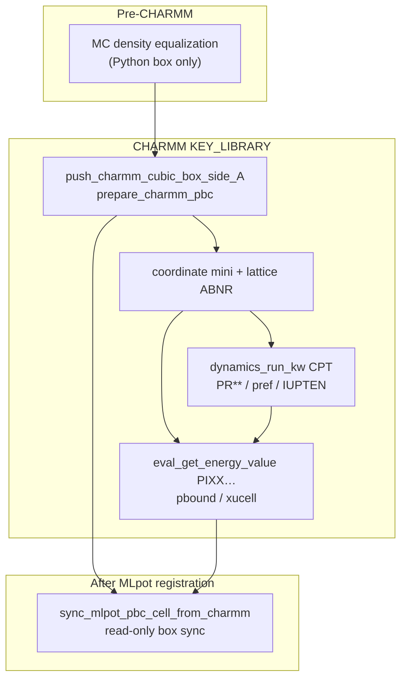

# PyCHARMM C API: periodic box and pressure tensor

MMML’s default `libcharmm.so` is a **KEY_LIBRARY** build: many CHARMM **script commands are not linked** (`open`, `nbonds`, `crystal`, `mini`, `dynamics`, `pressure`, …). Failures often appear as truncated warnings (`Unrecognized command: crys`, `mini`, `pres`, …).

For periodic workflows, MMML routes box setup, minimization, dynamics, and pressure handling through the **C API** (`pycharmm.*` → `libcharmm` Fortran exports). This page summarizes what you can **get** and **set**, where MMML uses it, and what still requires a `libcharmm` rebuild after API patches.

Related:

- [PyCHARMM MPI](pycharmm-mpi.md) — launcher, MPI-linked builds
- [md-system YAML configs](md-system-configs.md) — `box_size`, NPT, liquid prep
- Rebuild script: [`scripts/rebuild_charmm_mlpot.sh`](https://github.com/EricBoittier/mmml/blob/main/scripts/rebuild_charmm_mlpot.sh)

---

## KEY_LIBRARY rule of thumb

| Operation | Prefer | Avoid on KEY_LIBRARY |
|-----------|--------|----------------------|
| Cubic PBC setup | `crystal_define_cubic` + `crystal_build` | `crystal define cubic` script |
| Clear PBC | `crystal_free` C API | `crystal free` script |
| Nonbond lists | `pycharmm.nbonds.*` setters | `nbonds` script |
| Minimize | `pycharmm.minimize.run_abnr` | `mini abnr` script |
| Dynamics | `dynamics_run_kw` + keyword tail | bare `dynamics` script |
| Instantaneous pressure | `eval_get_energy_value('PIXX')` … | `pressure instantaneous` script |

After changing `setup/api/*.F90`, sync and rebuild:

```bash
cd ~/mmml && bash scripts/rebuild_charmm_mlpot.sh
python -c "import pycharmm.lib as l; c=l.charmm; print('crystal_free', hasattr(c,'crystal_free')); print('dynamics_run_kw', hasattr(c,'dynamics_run_kw'))"
```

---

## Periodic box (cubic side L, Å)

### Set

| Layer | API | Notes |
|-------|-----|-------|
| Low-level | `pycharmm.crystal.define_cubic(L)` + `build(cutoff)` | Sets `XUCELL`; rebuilds IMAGE transforms |
| Full PBC | `prepare_charmm_pbc(L)` in `mlpot.pbc_env` | Also runs `pbcset` tokens, IMAGE byres, nbonds |
| Workflow push | `push_charmm_cubic_box_side_A(L)` | Skips if live box already matches; safe **before MLpot registration** |

```python
from mmml.interfaces.pycharmmInterface.mlpot.pbc_env import (
    push_charmm_cubic_box_side_A,
    prepare_charmm_pbc,
)

side, source = push_charmm_cubic_box_side_A(32.0, quiet=True)
```

**When MMML sets the box**

- Initial PBC registration (`setup_charmm_environment`)
- Post-build MC density equalization → final side passed into `setup_charmm_environment` (MC runs **before** CHARMM PBC install)
- Density-prep ladder / monomer repack (`_sync_pbc_after_box_change` → `push_charmm_cubic_box_side_A`)
- Lattice ABNR changes the box **inside CHARMM** (`minimize.run_abnr(lattice=True)`); workflow reads the new side back

**Do not** call `prepare_charmm_pbc` / `push_charmm` after MLpot is registered — crystal/IMAGE rebuild with MLpot active can segfault in `libcharmm`. After registration, only **read** CHARMM’s box and sync the JAX MIC cell (`sync_mlpot_pbc_cell_from_charmm`).

### Get

Resolution order in `resolve_charmm_cubic_box_side_A`:

1. `pbound_get_size` — live periodic box (best during/after CPT)
2. `image_get_ucell` — `XUCELL` edge lengths (often valid when pbound reads zero, e.g. after lattice ABNR)
3. `!CRYSTAL PARAMETERS` in a CHARMM `.res` restart
4. Workflow fallback (`box_size`, last known MIC side)

```python
from mmml.interfaces.pycharmmInterface.mlpot.pbc_env import (
    get_charmm_cubic_box_side_A,
    resolve_charmm_cubic_box_side_A,
)

side, source = resolve_charmm_cubic_box_side_A(fallback_side_A=32.0)
```

| Source label | Meaning |
|--------------|---------|
| `pbound` | `pbound_get_size` (cubic a=b=c) |
| `xucell` | `pycharmm.image.get_ucell()` |
| `restart` | Parsed from `.res` crystal block |
| `fallback` | CLI / workflow estimate |

`sync_workflow_pbc_box_side_after_mm_pretreat` aligns workflow `box_size` with the live CHARMM cell after NPT pretreat, lattice ABNR, or mini box equil.

---

## Pressure tensor

Two different tensors matter:

1. **Reference (target)** — what the CPT barostat couples to (`PREF`, `PRXX` …)
2. **Instantaneous (measured)** — virial-based pressure from the current coordinates and forces (`PIXX` …, `PRSI`, …)

### Set — CPT reference (barostat target)

There is **no** standalone `crystal_set_pressure` API. Reference pressure is parsed when **CPT dynamics starts**, via the `dynamics_run_kw` keyword tail (same tokens as after `DYNAMics CPT` in a script).

MMML helpers live in `mmml.interfaces.pycharmmInterface.mlpot.pressure_tensor`:

| YAML / CLI | Dynamics keywords |
|------------|-------------------|
| `npt_pressure: 1.0` | `pint pconst pref 1.0` (isotropic, atm) |
| `npt_pressure_tensor: "2,1,1,0,0,0"` | `PRXX`, `PRYY`, `PRZZ`, `PRXY`, `PRXZ`, `PRYZ` |
| `npt_pgamma: 5.0` | barostat Langevin collision frequency (1/ps) |
| `npt_pressure_log_interval: 100` | `IUPTEN` + `IPTFRQ` — piston tensor time series |

```yaml
npt_pressure: 1.0
npt_pressure_tensor: "2,1,1,0,0,0"   # xx,yy,zz,xy,xz,yz in atm; omit for isotropic
npt_pressure_log_interval: 100       # writes equi/prod *_pressure_tensor.dat
```

```bash
mmml md-system ... \
  --npt-pressure 1.0 \
  --npt-pressure-tensor 2,1,1,0,0,0 \
  --npt-pressure-log-interval 100
```

To change reference pressure mid-campaign, start a **new dynamics segment** (restart + fresh CPT line). `REFP` in Fortran is not exposed as a mid-run Python setter.

### Get — instantaneous tensor (after energy eval)

After `energy` / MLpot refresh, CHARMM fills the `epress` array. The C API reads components through **`eval_get_energy_value`** (`pycharmm.lingo.get_energy_value`):

| Names | Meaning |
|-------|---------|
| `PIXX` … `PIZZ`, `PIXY`, `PIXZ`, `PIYZ` | Internal pressure tensor (atm) |
| `PEXX` … `PEZZ` | External pressure tensor |
| `VIXX` … `VIZZ` | Internal virial |
| `VEXX` … `VEZZ` | External virial |
| `PRSI`, `PRSE` | Scalar internal / external pressure |
| `VIRI`, `VIRE` | Scalar virials |

```python
import pycharmm.lingo as lingo
import pycharmm.energy as energy

energy.show()  # or MLpot refresh first
p_xx = lingo.get_energy_value("PIXX")
p_yy = lingo.get_energy_value("PIYY")
p_zz = lingo.get_energy_value("PIZZ")
```

MMML’s `report_instantaneous_pressure_tensor` (before equi/prod) currently calls the **`pressure instantaneous` script**, which may be unavailable on KEY_LIBRARY. Prefer the `eval_get_energy_value` path above for programmatic reads.

### Get — time series during NPT

During equi/prod CPT with `npt_pressure_log_interval > 0`, CHARMM writes the **piston pressure tensor** each `IPTFRQ` steps to `*_pressure_tensor.dat` (unit `IUPTEN`, default 29). No `pressure` script is required for logging.

Use `--skip-npt-pressure-report` to skip the one-off instantaneous report before equi/prod.

---

## JAX-MD backend

| Quantity | PyCHARMM CPT | JAX-MD |
|----------|--------------|--------|
| Box side | `crystal` C API + CPT dynamics | `space` box / NPT barostat (scalar volume) |
| Target pressure | `npt_pressure` / `PR**` via `dynamics_run_kw` | `pressure:` in YAML (atm → internal units) |
| Anisotropic tensor | `npt_pressure_tensor` | **Not supported** — scalar barostat only |

---

## Workflow map



| Stage | Box | Pressure |
|-------|-----|----------|
| Packmol / MC | Python `box_side` | — |
| `setup_charmm_environment` | **Set** via crystal C API | — |
| Lattice ABNR | **Get** (CHARMM optimizes cell) | — |
| Mini box equil / pretreat NPT | **Get** + sync workflow | CPT **set** via `npt_pressure*` |
| Equi / prod | **Get** from pbound/restart | **Set** reference; **log** via IUPTEN |
| After MLpot SD | **Get** only → JAX MIC | Instantaneous **get** via `PIXX`… |

---

## Python modules (quick reference)

| Module | Role |
|--------|------|
| `mmml...mlpot.pbc_env` | Box get/set, `prepare_charmm_pbc`, `push_charmm_cubic_box_side_A`, pretreat sync |
| `mmml...mlpot.pressure_tensor` | `NptPressureTensor`, CPT reference kwargs, IUPTEN logging |
| `mmml...mlpot.dynamics` | `build_cpt_*_dynamics`, `dynamics_run_kw` integration |
| `pycharmm.crystal` | `define_cubic`, `build`, `free_crystal`, `get_cubic_side` |
| `pycharmm.image` | `get_ucell` |
| `pycharmm.lingo` | `get_energy_value` for `PIXX` / `PRSI` / … |

---

## Tests

Fast unit tests (no CHARMM runtime):

```bash
uv run pytest tests/unit/test_pbc_pretreat_box_sync.py \
             tests/unit/test_pressure_tensor.py \
             tests/unit/test_pbc_env_key_library.py \
             tests/unit/test_dynamics_key_library.py -q
```
