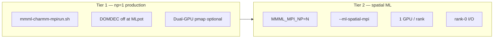

# PyCHARMM MPI — design (Phases 0–2)

How MMML uses OpenMPI-linked `libcharmm.so`, what the [pyCHARMM Workshop MPI examples](https://github.com/BrooksResearchGroup-UM/pyCHARMM-Workshop) teach, and the roadmap through **Tier 2 spatial ML**.

Related:

- [`docs/mlpot-spatial-mpi.md`](mlpot-spatial-mpi.md) — spatial ML decomposition design
- [`tests/functionality/mlpot/SPATIAL_MPI_DOMDEC.md`](../tests/functionality/mlpot/SPATIAL_MPI_DOMDEC.md) — Tier 3 DOMDEC spike (out of scope here)
- [`mmml/interfaces/pycharmmInterface/charmm_mpi.py`](../mmml/interfaces/pycharmmInterface/charmm_mpi.py) — runtime bootstrap

---

## Problem statement

GPU-cluster `libcharmm.so` builds are **MPI-linked**. Serial `python -m mmml md-system` can segfault in Fortran `upinb` or MLpot `send_coord_to_recip` unless:

1. The process launches under the **same OpenMPI** as `libcharmm.so`
2. JAX GPU warmup is **deferred** until after MLpot SD on MPI builds
3. DOMDEC is **off** during MLpot (stability stopgap)
4. `OMP_NUM_THREADS=1` during CHARMM neighbor-list updates

The workshop [3SimpleMPIExample](https://github.com/BrooksResearchGroup-UM/pyCHARMM-Workshop/tree/main/3SimpleMPIExample) shows a **different** pattern: embarrassingly parallel φ/ψ minimizations with `mpi4py` — no coupled MLpot callbacks. MMML needs both:

| Pattern | Workshop | MMML tier |
|---------|----------|-----------|
| Independent CHARMM jobs sharded by rank | 3SimpleMPI | Phase 0 smoke |
| One hybrid system, `np=1`, stable MLpot | — | **Tier 1** (Phase 1) |
| One hybrid system, ML sharded across ranks | — | **Tier 2** (Phase 2) |
| DOMDEC + MLpot | 5Aladipeptide (disabled upstream) | Tier 3 (future) |

---

## Architecture tiers



---

## Phase 0 — Foundation

**Goal:** Validate OpenMPI ↔ CHARMM ↔ mpi4py before long MLpot jobs.

### Deliverables

| Item | Path | Status |
|------|------|--------|
| MPI environment check CLI | `mmml mpi-check` | Implemented |
| Workshop φ/ψ smoke script | `tests/functionality/charmm/mpi_alad_phi_psi.py` | Implemented |
| Launcher script | `scripts/mmml-charmm-mpirun.sh` | Existing |
| This design doc | `docs/pycharmm-mpi.md` | This file |

### `mmml mpi-check`

```bash
mmml mpi-check              # human summary, exit 0 if launcher OK
mmml mpi-check --json         # machine-readable report
mmml mpi-check --strict       # exit 1 on warnings (e.g. mpi4py missing)
mmml mpi-check --tier2        # also validate Tier 2 spatial MPI + GPU env
mmml mpi-check --tier3        # survey Tier 3 DOMDEC blockers (informational)
```

Reports: `CHARMM_LIB_DIR`, MPI-linked detection, `mpirun` path, rank/size under launch, mpi4py, JAX device, recommended launch line. With `--tier2`, adds MLpot spatial-MPI GPU footgun checks via `spatial_mpi_validate.py`. With `--tier3`, reports DOMDEC API blockers via `tier3_domdec_validate.py`.

### CHARMM MPI test suite (CI)

```bash
# Fast (build job): mocked bootstrap, rank-0 I/O, Tier 3 survey
pytest tests/charmm_mpi/ -m "charmm_mpi and not pycharmm" -q

# Live (charmm job, under mpirun): energy + mpi-check smoke
./scripts/ci/run_pycharmm_smoke_pytest.sh -q tests/charmm_mpi/test_mpi_live_energy.py
```

See [`tests/charmm_mpi/README.md`](../tests/charmm_mpi/README.md).

### Workshop smoke (user-run on CHARMM node)

```bash
MMML_MPI_NP=4 ./scripts/mmml-charmm-mpirun.sh python \
  tests/functionality/charmm/mpi_alad_phi_psi.py --n-phi 12 --n-psi 12
```

**Pass:** rank 0 writes `phi_psi_energies.json`; energies match serial run within `1e-4` kcal/mol per grid point.

---

## Phase 1 — Tier 1 hardening

**Goal:** All PyCHARMM entry points use the same MPI bootstrap as `md-system`.

### Deliverables

| Item | Description | Status |
|------|-------------|--------|
| Generalized mpirun re-exec | `maybe_rerun_mmml_under_mpirun(subcommand, argv)` | Implemented |
| `liquid-box` MPI bootstrap | Re-exec under `mpirun -np 1` when needed | Implemented |
| Slurm example | `docs/examples/slurm_mlpot_mpi.sh` | Implemented |
| Auto-rerun for `md-system` | Existing | Existing |

### Blessed Tier 1 launch

```bash
export CHARMM_LIB_DIR=/path/to/tier/lib
MMML_MPI_NP=1 ./scripts/mmml-charmm-mpirun.sh md-system \
  --composition DCM:90 --box-size 32 \
  --backend pycharmm --md-stages mini,heat \
  --checkpoint /path/to/params.json \
  --output-dir artifacts/dcm90
```

### Environment variables (reference)

| Variable | Default | Purpose |
|----------|---------|---------|
| `MMML_MPI_NP` | `1` | `mpirun -np` count |
| `MMML_NO_MPI_RERUN` | off | Disable auto re-exec under mpirun |
| `MMML_MPIRUN` | auto | Override `mpirun` path |
| `MMML_CHARMM_OMP_THREADS` | `1` | Pin OpenMP in `upinb` |
| `MMML_DEFER_JAX_WARMUP_UNTIL_AFTER_SD` | on (MPI) | JAX after MLpot SD |
| `MMML_MLPOT_RANK0_BRIDGE` | `1` | Rank 0 runs MLpot when `np>1` |

### CHARMM rebuild notes

```bash
./scripts/rebuild_charmm_mlpot.sh              # DOMDEC on (default)
./scripts/rebuild_charmm_mlpot.sh --no-domdec  # if SD segfaults in send_coord_to_recip
```

---

## Phase 2 — Tier 2 spatial ML

**Goal:** Scale **MLpot** across MPI ranks on one periodic box (`np>1`, DOMDEC still off).

### Deliverables

| Item | Path | Status |
|------|------|--------|
| Spatial MPI design | `docs/mlpot-spatial-mpi.md` | Existing |
| Tier 2 env validation | `spatial_mpi_validate.py`, `mmml mpi-check --tier2` | Implemented |
| Integration tests (mocked JAX) | `test_mlpot_spatial_mpi_integration.py` | Implemented |
| Tier 2 smoke script | `tests/functionality/mlpot/06_spatial_mpi_tier2_smoke.py` | Implemented (user-run) |
| Rank-0 I/O helpers | `mpi_rank_io.py` | Implemented (stub + hooks) |
| `--ml-spatial-mpi` CLI | `md_system.py` | Existing |
| `mpi_spatial/` package | domain, force_exchange, … | Existing (partial) |
| Rank-0 artifact writes | `recovery_progress`, `liquid_box_build` | Wired |

### Tier 2 launch

```bash
export MMML_MLPOT_SPATIAL_MPI=1
export MMML_MPI_PIN_GPU_PER_RANK=1   # set by launcher when spatial MPI on
MMML_MPI_NP=4 ./scripts/mmml-charmm-mpirun.sh md-system \
  --composition DCM:200 --box-size 35 \
  --ml-spatial-mpi --ml-gpu-count 1 --ml-batch-size 128 \
  --md-stages mini \
  --checkpoint /path/to/params.json \
  --output-dir artifacts/dcm200_spatial
```

### Rank ownership model

Each rank:

1. Owns monomers by COM slab in the periodic box (`mpi_spatial/domain.py`)
2. Builds halo ghost monomers within `R_halo ≈ mm_switch_on + r_physnet`
3. Evaluates PhysNet on owned + canonical halo dimers only
4. **Allreduces** forces and energy (`force_exchange.py`)

CHARMM integration still runs on all ranks (DOMDEC off); only ML is decomposed.

### I/O policy (Phase 2)

| Action | Rank |
|--------|------|
| DCD / CRD / `box.json` / `prep_ladder/` | 0 only |
| `print()` progress lines | 0 only (unless `--quiet`) |
| MLpot JAX compile | per-rank (spatial) or 0 only (bridge) |
| `mpi-check` / diagnostics | all ranks print; JSON on 0 |

Use `mmml.interfaces.pycharmmInterface.mpi_rank_io` helpers.

### Testing matrix — what is and is not covered

| Layer | CI (unit / mocked) | User-run (CHARMM + GPU node) |
|-------|--------------------|------------------------------|
| Domain slab + halo ownership | `tests/unit/test_mpi_spatial.py` | — |
| Spatial batch indices | `tests/unit/test_mlpot_spatial_batch.py` | — |
| Rank-0 bridge vs allreduce policy | `tests/unit/test_mlpot_mpi_bridge.py`, `test_mlpot_spatial_mpi_integration.py` | — |
| Tier 2 env footguns | `tests/unit/test_spatial_mpi_tier2_validate.py` | `mmml mpi-check --tier2` |
| Tier 2 validate module | `spatial_mpi_validate.py` | `validate_tier2_spatial_mpi_env()` |
| Hybrid callback under `mpirun` (mocked JAX) | `tests/functionality/mlpot/06_spatial_mpi_tier2_smoke.py` | same script on cluster |
| CHARMM `energy.show()` with MLpot registered | — | `06_spatial_mpi_tier2_smoke.py --charmm-ener` |
| Full `md-system --ml-spatial-mpi` mini | `07_md_system_spatial_mpi_mini.py --dry-run` (CI) | `07_...py --run` on GPU node |
| Live PhysNet GPU forward + allreduce | — | **not yet in CI** |

**Honest status:** Phase 2 spatial decomposition logic is unit-tested and the MLpot callback path is integration-tested with **mocked JAX** and **mocked or env-based MPI**. We have **not** run end-to-end `md-system --ml-spatial-mpi` with live JAX GPU + MPI-linked CHARMM in this sandbox. Treat Tier 2 as **code-complete, cluster-validated by you**.

Pre-flight on a GPU node:

```bash
mmml mpi-check --tier2 --strict
python tests/functionality/mlpot/07_md_system_spatial_mpi_mini.py --dry-run

MMML_MPI_NP=2 MMML_MLPOT_SPATIAL_MPI=1 ./scripts/mmml-charmm-mpirun.sh md-system \
  --config mmml/cli/run/md_system.spatial_mpi.example.yaml \
  --checkpoint /path/to/DESdimers_params.json

# or callback-only smoke first:
MMML_MPI_NP=2 MMML_MLPOT_SPATIAL_MPI=1 ./scripts/mmml-charmm-mpirun.sh python \
  tests/functionality/mlpot/06_spatial_mpi_tier2_smoke.py
```

### Pass criteria (user-run)

1. `06_spatial_mpi_tier2_smoke.py` exits 0 under `MMML_MPI_NP>=2` (allreduced energy matches sum of per-rank contributions)
2. `MMML_MPI_NP=2` mini on DCM:20 completes without segfault
3. Total energy matches `np=1` within `0.01` kcal/mol after mini
4. Wall time for MLpot SD decreases vs rank-0 bridge (informational)

### GPU / MPI footguns (Tier 2)

| Issue | Symptom | Mitigation |
|-------|---------|------------|
| Serial `python` with MPI-linked `libcharmm.so` | Segfault in `upinb` / `send_coord_to_recip` | `./scripts/mmml-charmm-mpirun.sh` or `maybe_rerun_mmml_under_mpirun` |
| JAX GPU warmup before MLpot SD | MPI pool corruption / hang | `defer_jax_warmup` (default on MPI builds via launcher) |
| `OMP_NUM_THREADS > 1` with MPI CHARMM | NL races / crashes | `MMML_CHARMM_OMP_THREADS=1` (launcher pins) |
| `np>1` + `--ml-gpu-count > 1` | GPU oversubscription / OOM | `--ml-gpu-count 1` + `MMML_MPI_PIN_GPU_PER_RANK=1` |
| `np>1` without `--ml-spatial-mpi` | Correct but no ML speedup (rank-0 bridge) | Set `MMML_MLPOT_SPATIAL_MPI=1` and pass `--ml-spatial-mpi` |
| `MMML_MLPOT_RANK0_BRIDGE=0` without spatial MPI | Every rank runs full MLpot incorrectly | Keep default `1`; only disable with spatial MPI for debug |
| DOMDEC on + MLpot + JAX | Segfault | DOMDEC forced off during MLpot (`disable_charmm_domdec`) |
| Mismatched OpenMPI vs `libcharmm.so` | `mpirun` launch failures | `mmml mpi-check`, set `MMML_MPIRUN` |
| `mpi_size >` visible JAX GPUs | Ranks share one GPU | SLURM `CUDA_VISIBLE_DEVICES` per task or lower `MMML_MPI_NP` |

Run `mmml mpi-check --tier2` before long jobs; it encodes most of the above.

### DLPack loose coupling — where it applies

DLPack (`__dlpack__` / `from_dlpack`) gives **zero-copy GPU array interchange** between JAX and CuPy. It is implemented in [`nl_gpu.py`](../mmml/interfaces/pycharmmInterface/nl_gpu.py) for the **MM neighbor-list rebuild** path, not for CHARMM↔MLpot force handoff.

| Path | DLPack? | Benefit |
|------|---------|---------|
| `jaxmd_runner` PBC + `MMML_MM_NL_DEVICE=gpu` | Yes — positions stay on JAX GPU → CuPy Vesin → JAX `pair_idx` | Avoids D2H/H2D for NL rebuild each block |
| PyCHARMM MLpot callback (`hybrid_mlpot.py`) | **No** — coords arrive on **host** from Fortran | Must copy H2D for JAX forward; DLPack cannot skip this |
| Spatial MPI force merge (`force_exchange.py`) | **No** — numpy host arrays + MPI allreduce | Correctness path; not a GPU tensor pipeline |
| `mm_energy_forces.py` when positions already device-resident | Yes (same as NL GPU path) | Faster MM energy when simulation state lives on GPU |

**When to invest in DLPack:** JAX-MD or other runners that keep positions on device across steps. **When not to:** PyCHARMM hybrid MD until Fortran exposes GPU coordinates (Tier 3+ / upstream). See [`NONBOND_LISTS.md`](../mmml/interfaces/pycharmmInterface/mlpot/NONBOND_LISTS.md) GPU section and `tests/functionality/neighbor_lists/11_gpu_nl_sync_profile.py` for timing validation.

### Known limitations (Phase 2)

- DOMDEC remains **off** during MLpot
- `np>1` without `--ml-spatial-mpi` uses rank-0 bridge (correct but slow)
- PyCHARMM does not expose Fortran DOMDEC atom maps (blocks Tier 3)
- Live Tier 2 MLpot not exercised in CI (cluster smoke required)

---

## Implementation checklist

### Phase 0

- [x] `docs/pycharmm-mpi.md`
- [x] `mmml mpi-check`
- [x] `tests/functionality/charmm/mpi_alad_phi_psi.py`
- [x] Update `tests/functionality/charmm/README.md`

### Phase 1

- [x] `maybe_rerun_mmml_under_mpirun()` generalization
- [x] `liquid-box` MPI bootstrap
- [x] `run-pycharmm` MPI bootstrap
- [x] `docs/examples/slurm_mlpot_mpi.sh`

### Phase 2

- [x] `mpi_rank_io.py` helpers
- [x] Rank-0 gating in `recovery_progress` / `liquid_box_build` writes
- [x] Rank-0 DCD gating in `staged_workflow` (`gate_charmm_trajectory_io`, `rank0_trajectory_path`)
- [x] `spatial_mpi_validate.py` + `mmml mpi-check --tier2`
- [x] Mocked MLpot callback integration tests (`test_mlpot_spatial_mpi_integration.py`)
- [x] Tier 2 smoke script (`06_spatial_mpi_tier2_smoke.py`)
- [x] CHARMM MPI test suite (`tests/charmm_mpi/`) in CI
- [x] Example YAML `md_system.spatial_mpi.example.yaml` + dry-run smoke `07_md_system_spatial_mpi_mini.py`
- [ ] Full `md-system --ml-spatial-mpi` mini on cluster (user `--run` validation)

### Phase 3 (blocked)

- [x] DOMDEC API survey (`domdec_info.py`, `tier3_domdec_validate.py`)
- [x] `mmml mpi-check --tier3` (informational; production blocked)
- [ ] PyCHARMM per-rank local/ghost atom API (upstream blocker)
- [ ] DOMDEC + MLpot coexistence spike (`tests/functionality/mlpot/SPATIAL_MPI_DOMDEC.md`)

---

## References

- [3SimpleMPIExample](https://github.com/BrooksResearchGroup-UM/pyCHARMM-Workshop/tree/main/3SimpleMPIExample) — mpi4py task parallel CHARMM
- [5Aladipeptide_HFBString_MPI](https://github.com/BrooksResearchGroup-UM/pyCHARMM-Workshop/tree/main/5Aladipeptide_HFBString_MPI) — temporarily disabled upstream
- [`scripts/mmml-charmm-mpirun.sh`](../scripts/mmml-charmm-mpirun.sh)
