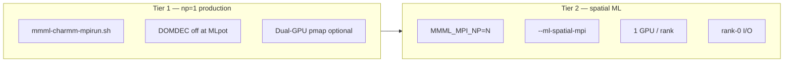

# PyCHARMM MPI — design (Phases 0–2)

How MMML uses OpenMPI-linked `libcharmm.so`, what the [pyCHARMM Workshop MPI examples](https://github.com/BrooksResearchGroup-UM/pyCHARMM-Workshop) teach, and the roadmap through **Tier 2 spatial ML**.

Related:

- [`docs/mlpot-spatial-mpi.md`](mlpot-spatial-mpi.md) — spatial ML decomposition design
- [`tests/functionality/mlpot/SPATIAL_MPI_DOMDEC.md`](../tests/functionality/mlpot/SPATIAL_MPI_DOMDEC.md) — Tier 3 DOMDEC spike (out of scope here)
- [`mmml/interfaces/pycharmmInterface/charmm_mpi.py`](../mmml/interfaces/pycharmmInterface/charmm_mpi.py) — runtime bootstrap

---

## Problem statement

GPU-cluster `libcharmm.so` builds are **MPI-linked**. Serial `python -m mmml md-system` can segfault in Fortran `upinb` or MLpot `send_coord_to_recip` unless:

1. The process launches under the **same OpenMPI** as `libcharmm.so`
2. JAX GPU warmup is **deferred** until after MLpot SD on MPI builds
3. DOMDEC is **off** during MLpot (stability stopgap)
4. `OMP_NUM_THREADS=1` during CHARMM neighbor-list updates

The workshop [3SimpleMPIExample](https://github.com/BrooksResearchGroup-UM/pyCHARMM-Workshop/tree/main/3SimpleMPIExample) shows a **different** pattern: embarrassingly parallel φ/ψ minimizations with `mpi4py` — no coupled MLpot callbacks. MMML needs both:

| Pattern | Workshop | MMML tier |
|---------|----------|-----------|
| Independent CHARMM jobs sharded by rank | 3SimpleMPI | Phase 0 smoke |
| One hybrid system, `np=1`, stable MLpot | — | **Tier 1** (Phase 1) |
| One hybrid system, ML sharded across ranks | — | **Tier 2** (Phase 2) |
| DOMDEC + MLpot | 5Aladipeptide (disabled upstream) | Tier 3 (future) |

---

## Architecture tiers



---

## Phase 0 — Foundation

**Goal:** Validate OpenMPI ↔ CHARMM ↔ mpi4py before long MLpot jobs.

### Deliverables

| Item | Path | Status |
|------|------|--------|
| MPI environment check CLI | `mmml mpi-check` | Implemented |
| Workshop φ/ψ smoke script | `tests/functionality/charmm/mpi_alad_phi_psi.py` | Implemented |
| Launcher script | `scripts/mmml-charmm-mpirun.sh` | Existing |
| This design doc | `docs/pycharmm-mpi.md` | This file |

### `mmml mpi-check`

```bash
mmml mpi-check              # human summary, exit 0 if launcher OK
mmml mpi-check --json         # machine-readable report
mmml mpi-check --strict       # exit 1 on warnings (e.g. mpi4py missing)
```

Reports: `CHARMM_LIB_DIR`, MPI-linked detection, `mpirun` path, rank/size under launch, mpi4py, JAX device, recommended launch line.

### Workshop smoke (user-run on CHARMM node)

```bash
MMML_MPI_NP=4 ./scripts/mmml-charmm-mpirun.sh python \
  tests/functionality/charmm/mpi_alad_phi_psi.py --n-phi 12 --n-psi 12
```

**Pass:** rank 0 writes `phi_psi_energies.json`; energies match serial run within `1e-4` kcal/mol per grid point.

---

## Phase 1 — Tier 1 hardening

**Goal:** All PyCHARMM entry points use the same MPI bootstrap as `md-system`.

### Deliverables

| Item | Description | Status |
|------|-------------|--------|
| Generalized mpirun re-exec | `maybe_rerun_mmml_under_mpirun(subcommand, argv)` | Implemented |
| `liquid-box` MPI bootstrap | Re-exec under `mpirun -np 1` when needed | Implemented |
| Slurm example | `docs/examples/slurm_mlpot_mpi.sh` | Implemented |
| Auto-rerun for `md-system` | Existing | Existing |

### Blessed Tier 1 launch

```bash
export CHARMM_LIB_DIR=/path/to/tier/lib
MMML_MPI_NP=1 ./scripts/mmml-charmm-mpirun.sh md-system \
  --composition DCM:90 --box-size 32 \
  --backend pycharmm --md-stages mini,heat \
  --checkpoint /path/to/params.json \
  --output-dir artifacts/dcm90
```

### Environment variables (reference)

| Variable | Default | Purpose |
|----------|---------|---------|
| `MMML_MPI_NP` | `1` | `mpirun -np` count |
| `MMML_NO_MPI_RERUN` | off | Disable auto re-exec under mpirun |
| `MMML_MPIRUN` | auto | Override `mpirun` path |
| `MMML_CHARMM_OMP_THREADS` | `1` | Pin OpenMP in `upinb` |
| `MMML_DEFER_JAX_WARMUP_UNTIL_AFTER_SD` | on (MPI) | JAX after MLpot SD |
| `MMML_MLPOT_RANK0_BRIDGE` | `1` | Rank 0 runs MLpot when `np>1` |

### CHARMM rebuild notes

```bash
./scripts/rebuild_charmm_mlpot.sh              # DOMDEC on (default)
./scripts/rebuild_charmm_mlpot.sh --no-domdec  # if SD segfaults in send_coord_to_recip
```

---

## Phase 2 — Tier 2 spatial ML

**Goal:** Scale **MLpot** across MPI ranks on one periodic box (`np>1`, DOMDEC still off).

### Deliverables

| Item | Path | Status |
|------|------|--------|
| Spatial MPI design | `docs/mlpot-spatial-mpi.md` | Existing |
| Rank-0 I/O helpers | `mpi_rank_io.py` | Implemented (stub + hooks) |
| `--ml-spatial-mpi` CLI | `md_system.py` | Existing |
| `mpi_spatial/` package | domain, force_exchange, … | Existing (partial) |
| Rank-0 artifact writes | `recovery_progress`, `liquid_box_build` | Wired |

### Tier 2 launch

```bash
export MMML_MLPOT_SPATIAL_MPI=1
export MMML_MPI_PIN_GPU_PER_RANK=1   # set by launcher when spatial MPI on
MMML_MPI_NP=4 ./scripts/mmml-charmm-mpirun.sh md-system \
  --composition DCM:200 --box-size 35 \
  --ml-spatial-mpi --ml-gpu-count 1 --ml-batch-size 128 \
  --md-stages mini \
  --checkpoint /path/to/params.json \
  --output-dir artifacts/dcm200_spatial
```

### Rank ownership model

Each rank:

1. Owns monomers by COM slab in the periodic box (`mpi_spatial/domain.py`)
2. Builds halo ghost monomers within `R_halo ≈ mm_switch_on + r_physnet`
3. Evaluates PhysNet on owned + canonical halo dimers only
4. **Allreduces** forces and energy (`force_exchange.py`)

CHARMM integration still runs on all ranks (DOMDEC off); only ML is decomposed.

### I/O policy (Phase 2)

| Action | Rank |
|--------|------|
| DCD / CRD / `box.json` / `prep_ladder/` | 0 only |
| `print()` progress lines | 0 only (unless `--quiet`) |
| MLpot JAX compile | per-rank (spatial) or 0 only (bridge) |
| `mpi-check` / diagnostics | all ranks print; JSON on 0 |

Use `mmml.interfaces.pycharmmInterface.mpi_rank_io` helpers.

### Pass criteria (user-run)

1. `MMML_MPI_NP=2` mini on DCM:20 completes without segfault
2. Total energy matches `np=1` within `0.01` kcal/mol after mini
3. Wall time for MLpot SD decreases vs rank-0 bridge (informational)

### Known limitations (Phase 2)

- DOMDEC remains **off** during MLpot
- `np>1` without `--ml-spatial-mpi` uses rank-0 bridge (correct but slow)
- PyCHARMM does not expose Fortran DOMDEC atom maps (blocks Tier 3)

---

## Implementation checklist

### Phase 0

- [x] `docs/pycharmm-mpi.md`
- [x] `mmml mpi-check`
- [x] `tests/functionality/charmm/mpi_alad_phi_psi.py`
- [x] Update `tests/functionality/charmm/README.md`

### Phase 1

- [x] `maybe_rerun_mmml_under_mpirun()` generalization
- [x] `liquid-box` MPI bootstrap
- [x] `docs/examples/slurm_mlpot_mpi.sh`
- [ ] `run-pycharmm` MPI bootstrap (follow-up)

### Phase 2

- [x] `mpi_rank_io.py` helpers
- [x] Rank-0 gating in `recovery_progress` / `liquid_box_build` writes
- [ ] Rank-0 DCD writes in `staged_workflow` (follow-up)
- [ ] Spatial MPI enabled in example YAML campaigns (follow-up)

---

## References

- [3SimpleMPIExample](https://github.com/BrooksResearchGroup-UM/pyCHARMM-Workshop/tree/main/3SimpleMPIExample) — mpi4py task parallel CHARMM
- [5Aladipeptide_HFBString_MPI](https://github.com/BrooksResearchGroup-UM/pyCHARMM-Workshop/tree/main/5Aladipeptide_HFBString_MPI) — temporarily disabled upstream
- [`scripts/mmml-charmm-mpirun.sh`](../scripts/mmml-charmm-mpirun.sh)
